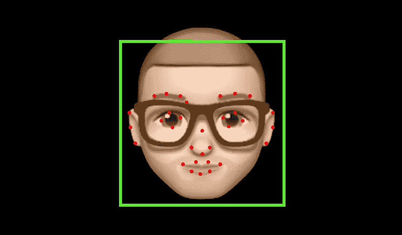
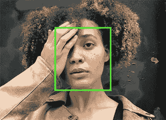
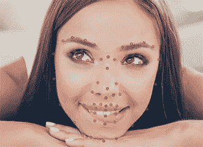
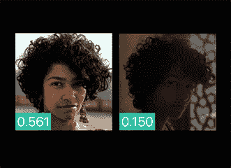
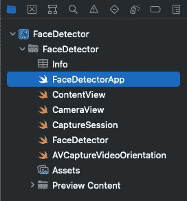
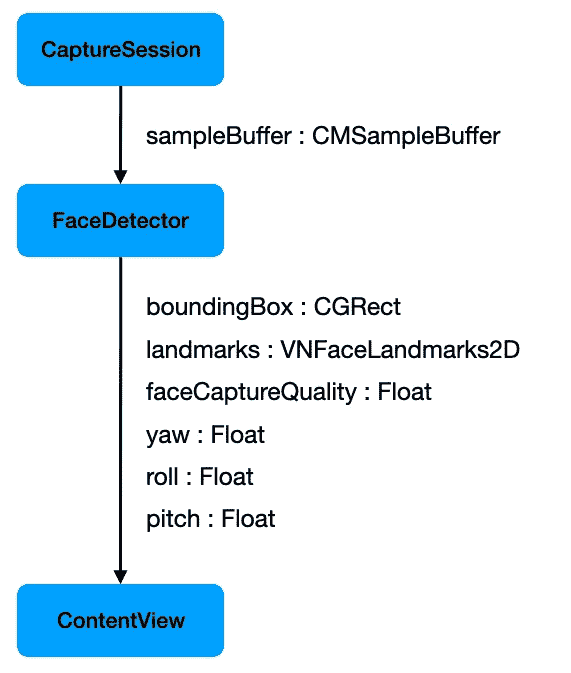

# 带 VisionKit 和 SwiftUI 的人脸检测器

> 原文：<https://itnext.io/face-detector-with-visionkit-and-swiftui-fc4fe18542e8?source=collection_archive---------1----------------------->

## 实时检测和跟踪人脸和人脸标志

欢迎阅读另一篇探讨苹果愿景和 VisionKit 框架的文章。我已经写了两篇使用这些框架的文章和代码示例。

我过去写过的第一个是“[swift ui](/barcode-scanner-in-swiftui-c6d5fc35cf60)中的条形码扫描仪”。

第二篇文章相当年轻，叫做“SwiftUI 中的[文档扫描仪”。](/document-scanner-in-swiftui-709753af367b)

现在，是时候做一些新的甚至更有趣的事情了。

## 介绍

探索现有的人脸检测和人脸标志检测的框架是我很久以前就想做的事情。

我发现令人着迷的是，一些聪明的算法甚至可以在戴着眼镜或面具的情况下检测和跟踪人脸。

多亏了苹果，我们可以在手机上拥有所有这些功能。不需要将任何东西发送到任何服务器进行处理。不管怎么说，那太慢了。

我们希望一切都在我们的设备上实时进行。

因此，我开始了这个项目，产生了这篇文章和一个完整的 iOS 应用程序。您可以下载附带的 Xcode 项目，并在自己的项目中自由使用源代码。

先说说 app 实际在做什么？

## 应用程序功能

标题已经说明了这篇文章是关于人脸检测和人脸标志检测的。这个应用程序做的更多。

苹果的 Vision 和 VisionKit 框架提供了所有现成的算法，我在示例应用程序中包含了以下功能:

1.  检测和可视化边界框
2.  检测和可视化面部标志
3.  确定图像捕获质量
4.  确定头部位置

**从这里** **可以下载完整的 Xcode 工作区以及功能齐全的 app**[**。**](https://www.buymeacoffee.com/twissmueller/e/57029)

这是应用程序运行时的样子:

该应用程序用 Xcode 13.2.1 Swift 语言版本 5 编写，并在装有 iOS 15.2.1 的 iPhone 11 Pro Max 上进行测试。

在下一部分，我将更详细地解释这些特性。

## 什么是边界框？

当我们想把一个人的脸作为一个整体来跟踪时，我们使用边界框。我们直接从检测算法中获得这些值，并可以用它们来可视化例如脸部周围的绿色正方形。

这正是示例应用程序所做的。你可以根据你的用例改变边界框的可视化。也许你需要另一种颜色或者你需要虚线而不是实线？使用 SwiftUI 和我将检测逻辑从可视化中分离出来的方法，这是一个简单的任务。

[https://developer.apple.com/machine-learning/api/](https://developer.apple.com/machine-learning/api/)

## 什么是人脸地标？

面部标志给我们提供了面部特定特征的更多细节，而不是将整个面部视为一个实体。我们从检测算法中得到的是一组描绘面部特征的坐标，比如嘴、鼻子、眼睛等等。

[https://developer.apple.com/machine-learning/api/](https://developer.apple.com/machine-learning/api/)

## 什么是捕获质量？

捕获质量指标提供了一个特定值，指示图像用于检测的质量。价值越高，质量越好。范围从 0.0 到 1.0。

当您拥有同一主题的一系列图像时，这一点尤其有用，例如，用于选择最佳镜头进行进一步处理。

[https://developer.apple.com/machine-learning/api/](https://developer.apple.com/machine-learning/api/)

## 有哪些不同的头部位置？

另一个有趣的指标是头部位置。实际上，我们有三个指标，一个是滚动，一个是偏航，一个是磁头的俯仰位置。下图描述了这些值的差异。

[https://developer.apple.com/videos/play/wwdc2021/10040/](https://developer.apple.com/videos/play/wwdc2021/10040/)

现在，我们知道了示例应用程序的功能，我们将学习如何组织 its 来实现这些功能。

## 应用架构和代码组织

在为这篇文章做研究时，我遇到了许多例子。几乎所有这些都有同一个问题，即“大规模视图控制器”反模式。

概括地说，示例应用程序有三个处理步骤:

*   捕捉图像序列
*   运行检测算法
*   想象结果

在“大规模视图控制器”风格的应用程序中，几乎所有这些步骤都是由一个巨大的类实现的。在经典 UIKit 应用中，这通常在`UIViewControllers`中完成，因此得名。去过那里，做过那个。

相反，我们想要的是“关注点分离”形式的良好代码设计，其中一个类服务于一个特定的目的。我们也可以看看鲍勃大叔(罗伯特·c·马丁)的坚实原理。我们想要的是“单一责任原则”。

因此，我这个项目的主要目标是通过将关注点捕获、检测和可视化分成不同的类，并通过管道机制将它们连接起来，从而拥有一个清晰简洁的代码结构。

Xcode 中项目结构如下:

*   这是我们的应用程序的入口点，它拥有应用程序委托。应用程序委托是我们实例化应用程序的不同功能组件并连接它们的地方。
*   `ContentView`:应用程序的最顶层视图。
*   `CameraView`:swift ui 还没有自带的摄像头视图。因此，我们需要这个助手类来包装 UIKit 固有的视频预览层。
*   `CaptureSession`:顾名思义，这个类负责捕获图像序列，也就是视频提要。
*   `FaceDetector`:这就是神奇发生的地方！所有的检测算法都是从这个类调用的。
*   `AVCaptureVideoOrientation`:将`UIDeviceOrientation`转换为`AVCaptureVideoOrientation`的辅助函数，这是正确可视化所需要的。

这些类本身并不真正有用。因此，他们需要连接。我更喜欢管道模式。我喜欢通过实现管道的元素来编写代码，然后以声明的方式将它们连接起来。这就是为什么我支持苹果引入联合收割机框架的原因。我在我的代码中经常使用它，但是只在它有意义并且不影响代码的清晰性和可理解性的地方使用。

下图显示了我们的管道元素及其输入和输出数据类型。所有输出变量通过联合收割机发布器(`@Published`)实现。然后，下一个管道元素将订阅该发布者。

这就是如何构建示例应用程序来实现我们所需的特性。

现在是总结的时候了。

## 结论

本教程应该让你深入了解实现人脸和人脸标志检测的必要条件。

在开始并解释了我们可以从苹果算法中收集什么样的信息之后，我详细地展示了我是如何构建示例应用程序的代码的。

我的主要目标是为您提供一个清晰的代码设计，将检测代码嵌入到一个简单易懂且可重用的管道中。

**完整的 Xcode 工作区和功能齐全的 app 可以从这里** [**下载。**](https://www.buymeacoffee.com/twissmueller/e/57029)

感谢您的阅读！

*   如果你喜欢这个，请[在 Medium](https://twissmueller.medium.com/) 上跟随我
*   给我买杯咖啡让我继续前进
*   支持我和其他媒体作者[在这里注册](https://twissmueller.medium.com/membership)

 [## 通过我的推荐链接加入媒体

### 作为一个媒体会员，你的会员费的一部分会给你阅读的作家，你可以完全接触到每一个故事…

twissmueller.medium.com](https://twissmueller.medium.com/membership) 

## 资源

*   [**用视觉检测人、脸、姿势**](https://developer.apple.com/videos/play/wwdc2021/10040/)