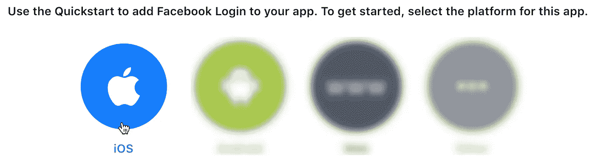
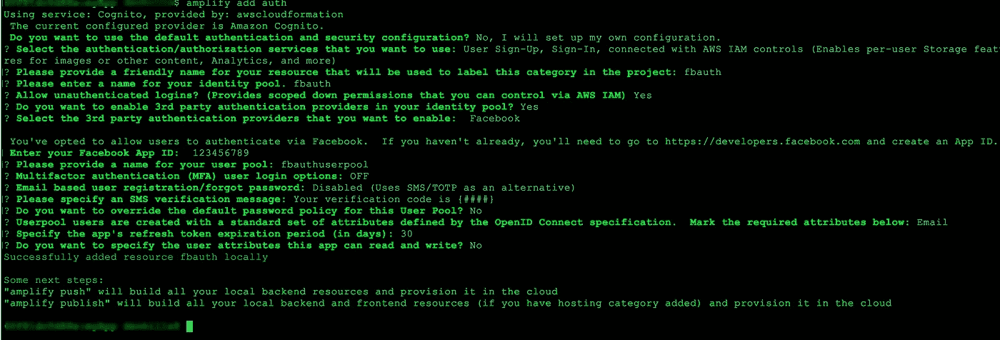
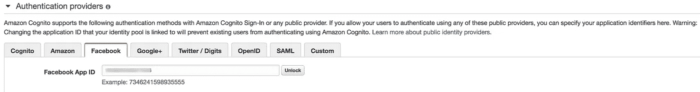
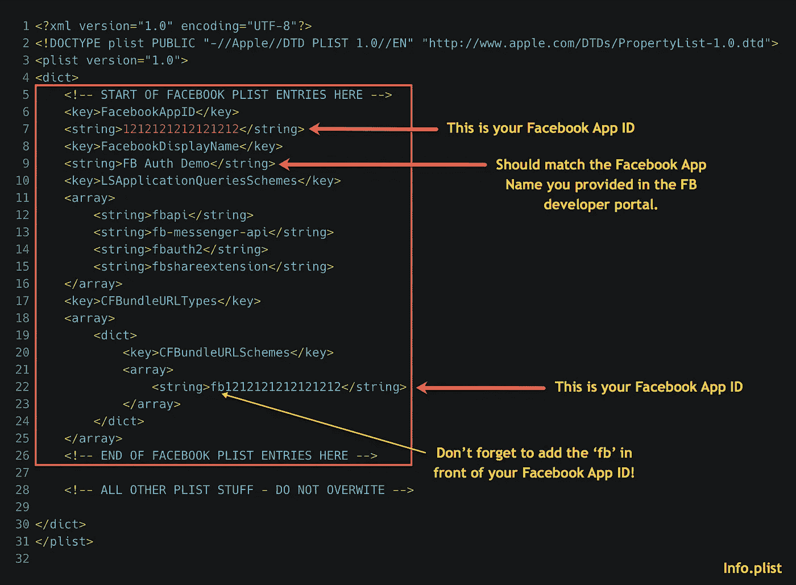
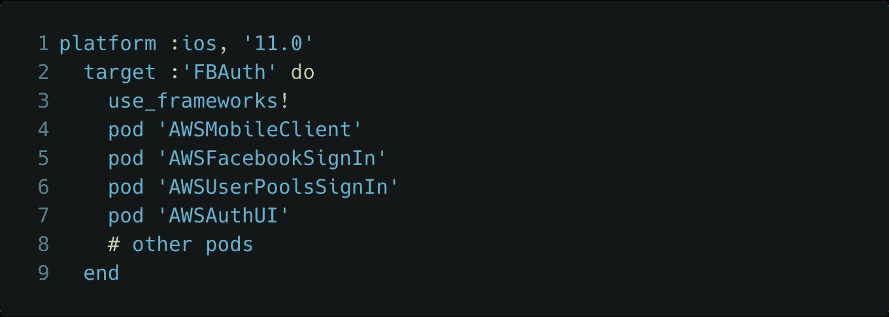
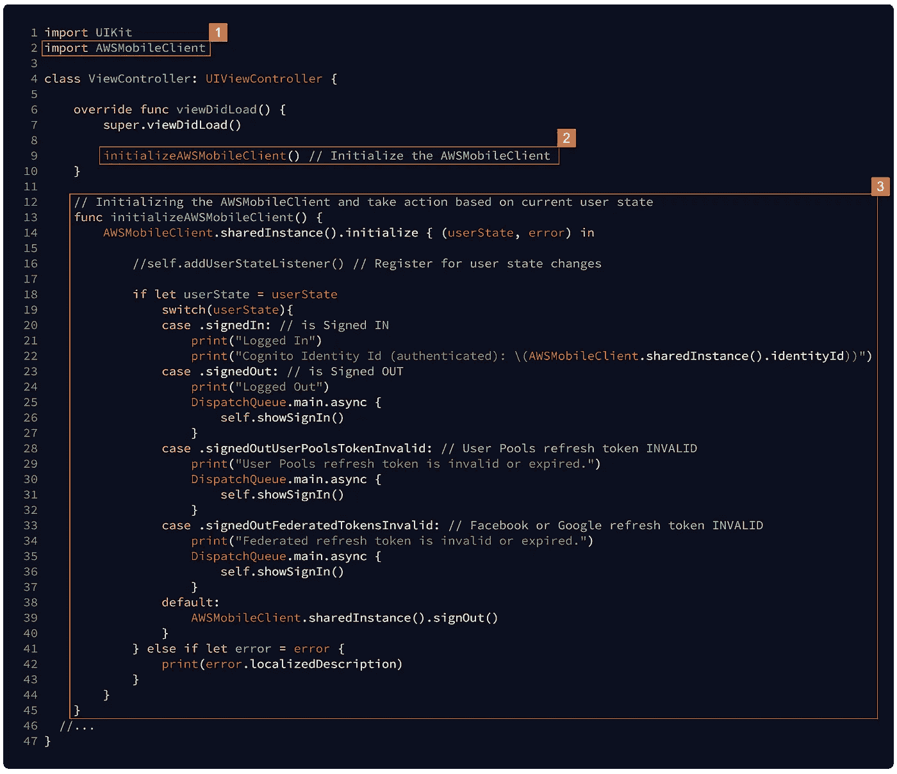
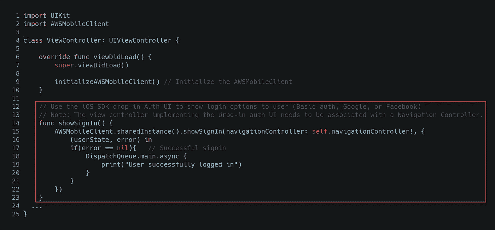
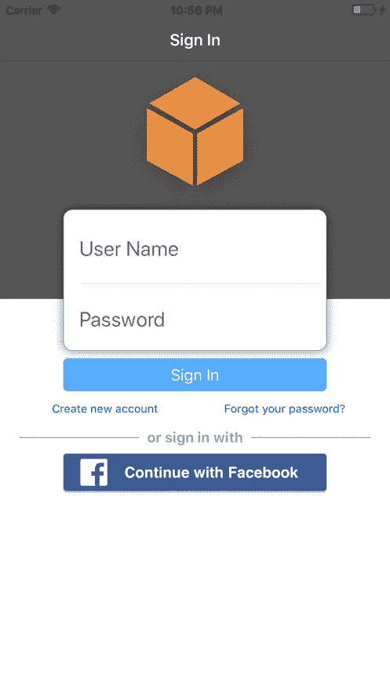

# 使用 AWS Amplify 和 Amazon Cognito 登录脸书

> 原文：<https://itnext.io/facebook-login-using-aws-amplify-and-amazon-cognito-4acf74875a04?source=collection_archive---------2----------------------->

*更新(2018 年 12 月 11 日):更新了客户端代码，以反映针对 iOS (2.7.0+)和 AWS Amplify 的 AWS SDK 的最新 auth 更改。*

我们将继续构建我们的移动认证机制，允许您的用户在支持 iOS 云的应用中进行认证。在本文中，我们将把 [**脸书登录**](https://developers.facebook.com/docs/facebook-login) 集成到我们的 iOS 应用中。在上一篇文章“使用 AWS Amplify 和 Amazon Cognito 的 iOS 基本认证”中，我们使用 Amazon Cognito 用户池来管理我们的应用程序用户目录，每个用户都创建了一个新帐户，并使用自己的用户名/密码进行认证，这是您的应用程序所独有的。

借助脸书登录集成，同一个用户无需通过 Cognito 用户池创建新账户，只需在您的应用中选择脸书登录按钮，并使用其脸书凭据通过脸书进行身份验证，同时保持在您的应用流程中。

## 提供脸书登录和用户名/密码选项？

对于大多数应用程序，开发者应该提供一个独特的用户名/密码认证选项，以及一个社交身份登录，如脸书、谷歌或 Twitter。为什么？首先，不是每个人都有脸书或社交媒体账户。其次，那些有账户的人可能不愿意把他们的脸书账户和你的应用关联起来。第三，大多数用户不想再创建一个他们不记得的密码。

## 开始

要将脸书登录集成到您的 iOS 应用中，我们需要您的脸书应用中的应用 ID。当我们通过 AWS Amplify CLI 配置第三方身份验证时，我们将使用脸书应用程序 ID。然后，我们将把 AWS Mobile SDK 与脸书嵌入式 SDK 集成在一起，以实现更好的开发者集成。

## 配置脸书应用程序并获取应用程序 ID

注意:创建脸书应用程序的创建和配置步骤是不断变化的，因此请始终参考脸书的官方设置说明。我将当前的流程总结为 4 个简单的步骤。

首先，登录[脸书开发者门户](https://developers.facebook.com/)。

第 1 步—添加新的脸书应用程序

> 如果您没有注册任何应用程序，请单击绿色的大友好按钮**添加新应用程序**。
> 
> 如果你已经注册了一个应用，点击**我的应用**菜单，然后**添加新应用**。

创建应用程序后，选择**脸书登录**设置卡。


第 2 步—选择 iOS 快速入门。



第 3 步—添加您的捆绑包标识符

快速入门包括 9 个步骤。**仅使用您的捆绑包标识符更新步骤#2，并跳过所有其他步骤**,因为 Amplify CLI 和 AWS Mobile SDK 将完成其余工作。

第 4 步—复制应用程序 ID

从脸书门户的当前应用中复制**应用 ID** 并保存以备后用。


**使用 Amplify CLI 从本地项目文件夹初始化云后端**

从您的本地环境中，创建或使用您选择的现有 Xcode iOS Swift 项目，然后在您的 iOS 项目文件夹的根目录中启动 Mac 终端。现在，我们将使用下面的 Amplify 命令初始化我们的 AWS 后端项目。

```
$ amplify init
```

将指导您完成设置项目的过程。**确保在适当的时候选择 iOS**。

接下来，让我们向移动项目添加经过身份验证的访问。我们将遵循 AWS 文档中的[电子邮件&密码](https://docs.aws.amazon.com/aws-mobile/latest/developerguide/add-aws-mobile-user-sign-in.html)选项选项卡中概述的相同流程。

```
$ amplify add auth
```

由于我们没有选择默认设置，这里是我在应用程序中使用的值。大多数是您通过输入的默认值，其他的，您有机会命名您的资源。

对于下面的配置，我将通过用户池添加基本身份验证和脸书登录，因为这更容易一步完成，而且为您的用户提供基本登录和社交登录选项也很好。



将本地配置更改推送到您的 AWS 帐户

```
$ amplify push
```

如果你想了解更多关于 *amplify init 和 amplify add auth* 的信息，请参阅我之前的博客[中的内容。](/basic-authentication-for-ios-using-aws-amplify-and-amazon-cognito-233b943222d4)

我们现在有了一个认知用户池、身份池、授权和未授权 IAM 角色，以及作为身份认证提供商的脸书。



# 在我们的 iOS 应用程序中设置脸书登录身份验证

我们现在要将脸书元数据和 URL 方案添加到我们 iOS 项目的 info.plist 中，添加 AWS Mobile SDK 依赖项，并为 auth 集成 *AWSMobileClient* ，然后实现 Mobile SDK 提供的 auth UI。

**将脸书元数据和 URL 方案添加到您的 Xcode 项目中 *info.plist:***



[https://gist . github . com/mobile quickie/0 c 31 f 3d 59 EB 93336289 b 212606 fbfb 79](https://gist.github.com/mobilequickie/0c31f3d59eb93336289b212606fbfb79)

**设置 AWS Mobile SDK 依赖项(Cocoapods)**

在这个例子中，我将使用 Cocoapods 进行依赖管理，因为这是目前推荐的将 AWS SDK 集成到 iOS 项目中的方法。关于[椰子](https://cocoapods.org/)的更多信息。如果你的应用中还没有 pod，你可以简单地运行一个 *$ pod init* ，它会为你创建一个新的 pod 文件。有了 Podfile 之后，向该文件添加以下依赖项。

```
$ pod init
```

在您的 *Podfile* 中，向该文件添加以下依赖项。这包括对 1 的依赖。Cognito 用户池(基本授权)和 2。脸书登录和 3。用于在一个界面中对用户池和脸书进行身份验证的嵌入式身份验证用户界面。



[https://gist . github . com/mobile quickie/7647 c 7959897 CB 39d 41 CB 1c 1 c 26 c 494809](https://gist.github.com/mobilequickie/7647c7959897cb39d41cb1c26c494809)

将 SDK 库引入您的项目:

```
$ pod install --repo-update
```

**将 awsconfiguration.json 文件集成到您的 iOS 项目中**

当使用 AWS Amplify CLI 提供后端资源时，它会在 iOS Xcode 项目的根目录中生成一个名为 *awsconfiguration.json* 的文件。该文件包含可通过应用程序访问的资源的描述，并在 Amplify 工具链添加、更新或删除资源时与项目同步。这种配置文件的自动更新是使用 Amplify CLI 从您的本地移动开发环境中提供 AWS 资源的巨大好处之一。

> 您只需要将 awsconfiguration.json 文件添加到 Xcode 项目中一次。您可以通过将它拖到 Xcode 项目管理器中的 Finder 来完成此操作。

如果要复制文件，系统会提示您。**取消勾选复制项目框**。当情况发生变化时，AWS Amplify CLI 会更新该文件。如果您选中目标框，那么您的项目在被复制时可能不会收到更新。如果取消选中该框，则每当您通过 Amplify CLI 修改项目资源时，该文件都会更新。

**在 ViewController 中初始化 AWSMobileClient**

在您希望用户注册或登录的根 UIViewController 或相关屏幕中，添加下图中引用的以下代码:

> 1.添加第 2 行的导入
> 
> 2.将**initializeAWSMobileClient()**调用添加到 viewDidLoad()的底部，如**第 9 行**所示
> 
> 3.将第 12–45 行的新函数**initializeAWSMobileClient()**添加到视图控制器中。

注意:showSignIn()函数尚不存在。我们将在下一步中添加它。



[https://gist . github . com/dennisAWS/8 FBA 1d 9 DC 738141452 ceeb 9 f 98992 f 40](https://gist.github.com/dennisAWS/8fba1d9dc738141452ceeb9f98992f40)

**将插件 Auth UI 添加到您的 ViewController**

将 showSignIn()函数添加到与上面相同的视图控制器中。这是允许您的用户注册、登录和重置密码的插件式身份验证用户界面。您可以自定义背景颜色和图像，以匹配您的品牌。当用户注销或用户的刷新令牌过期时，将调用此函数。注意:脸书的刷新令牌通常在 60 天内有效，没有任何活动，用户池刷新令牌是特定于开发人员的，从 1 天到 365 天。

> 将第 12–23 行的新函数 **showSignIn()** 添加到视图控制器中。



[https://gist . github . com/dennisAWS/30 e 43 e 3 ba 8 ab 7 df 79 a5 Fe 85973d 7543 e](https://gist.github.com/dennisAWS/30e43e3ba8ab7df79a5fe85973d7543e)

警告。需要 UINavigationController:auth UI 是 AWS Mobile SDK 的一部分，它要求您的应用程序具有 UINavigationController。

若要将 UINavigationController 添加到您的应用程序(如果不存在):

> 将 UINavigationController 添加到您的 iOS 应用程序:从您的 Xcode 项目中，选择 Storyboard 中的 ViewController，然后选择菜单选项:
> 
> *编辑*->-*嵌入*->-*导航控制器。*

**构建并运行您的应用**

您应该看到 AWS SDK 为您的应用程序预建的登录 UI，因为用户最初没有经过身份验证。iOS SDK 提供了一个标准的默认 UI，现在允许用户通过脸书登录**以及**注册(注册)**，触发**忘记密码**功能，当然还有内置的**登录**功能以及默认用户名/电子邮件和密码字段。**

点击**继续脸书**按钮。然后，用户被重定向，并被要求使用他们的脸书凭据登录。一旦通过验证，UI 对话框将会消失，您现在应该会看到您的视图控制器屏幕。



AWS Mobile SDK —用户池和脸书的授权用户界面

此时，应用程序用户通过脸书进行了身份验证，现在的用户**担任经过身份验证的 IAM 角色**，并被授予与该角色相关的权限，但是，该角色仍然有一个空访问策略。当用户通过 Cognito 用户池使用用户名/密码进行身份验证时，我们也经历了同样的过程。这一次，用户通过脸书认证为 Cognito 身份池的身份提供者。

**最后的想法**

Amazon Cognito 是所有连接到 AWS 资源的移动应用的认证和未认证流的默认选择。如果您不需要登录或使用任何其他身份提供者，如脸书，请使用 cogn ITO Federated Identities(**cogn ITO Identity Pool**)。

对于通过脸书进行身份验证的用户，mobile SDK 会将经过身份验证的用户令牌传递(并充当身份管理器)到您的 Cognito 身份池，以换取该用户调用您的 AWS 资源的临时 AWS 凭据。然后，用户访问由 **IAM 认证角色**定义。如果用户不进行身份验证，Cognito Identity Pool 仍然授予 AWS 凭证，并且用户的访问由 **IAM 未验证角色**定义。

是时候转向谷歌认证了！

## 资源

[AWS Amplify](https://aws-amplify.github.io/media/toolchain?utm_source=da&utm_medium=blog&utm_campaign=denhills&utm_term=ios_native) (使用 Amplify CLI 来支持我们的应用程序)

[亚马逊认知用户池](https://docs.aws.amazon.com/cognito/latest/developerguide/cognito-user-identity-pools.html)(用于基本认证)

[亚马逊认知身份池](https://docs.aws.amazon.com/cognito/latest/developerguide/cognito-identity.html)(用于联合基本认证和脸书登录)