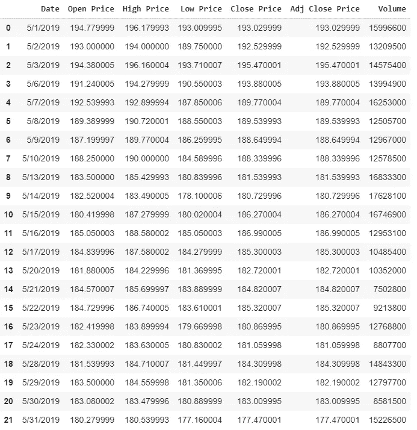
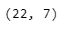
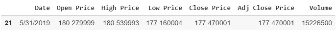
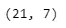
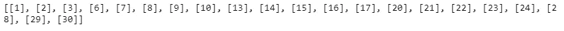
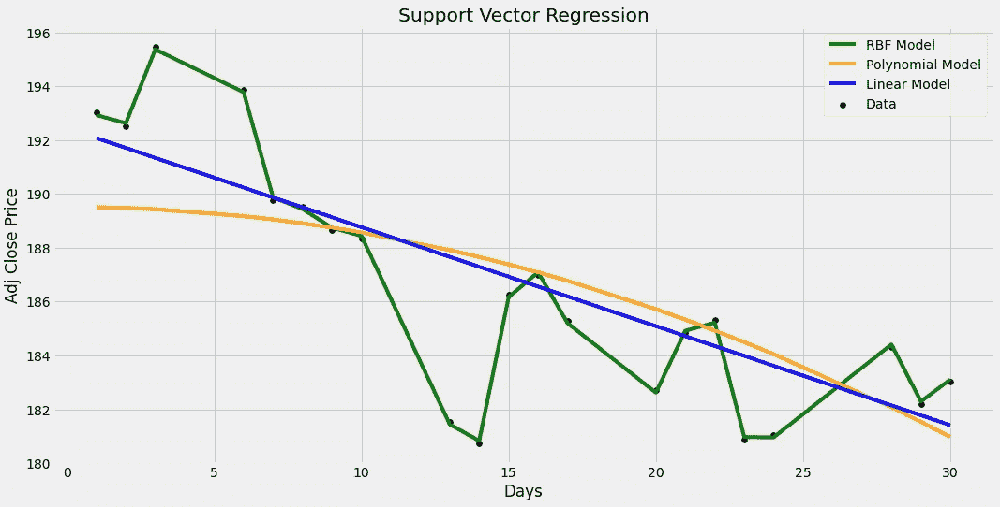
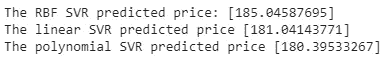

# 利用 Python 和机器学习进行脸书股票预测

> 原文：<https://itnext.io/facebook-stock-prediction-bcfc676bc611?source=collection_archive---------2----------------------->

支持向量回归


在本文中，我将向您展示如何使用称为支持向量回归(SVR)的机器学习算法创建自己的股票预测 Python 程序。该程序将读取脸书(FB)的股票数据，并根据当天的价格进行预测。

试图预测股票市场或股票价格的方向是极其困难的，但是在这篇文章中我会尝试一下。即使对统计学和概率有很好理解的人也很难做到这一点。

> ***免责声明*** *:本文材料纯属教育性质，不应作为专业投资建议。自行决定投资。*

**支持向量回归(SVR)** 是一种**支持向量机，**是一种监督学习算法，用于分析[回归](https://en.wikipedia.org/wiki/Regression_analysis)分析的数据。1996 年，这个版本的回归 SVM 是由 Christopher J. C. Burges，Vladimir N. Vapnik，Harris Drucker，Alexander J. Smola 和 Linda Kaufman 提出的。由 SVR 产生的模型仅依赖于训练数据的子集，因为用于建立模型的成本函数忽略了任何接近模型预测的训练数据。

# 支持向量机的优点:

1.  在高维空间是有效的。
2.  它工作得很好，有清晰的分离边界。
3.  这在维数大于样本数的情况下是有效的。

# 支持向量机回归缺点:

1.  当我们有大的数据集时，它表现不好。
2.  如果数据集有噪声(大量额外的无意义信息)，则性能较低。

# 内核类型:

1.  线性的
2.  多项式
3.  径向基函数
4.  乙状结肠的

如果你不想读这篇文章，想要一个视频演示，你可以看看下面的 [**YouTube 视频**](https://youtu.be/C64BIMx7Slw) 。它详细介绍了本文中的所有内容，即使您的计算机上没有安装编程语言 Python，也可以帮助您轻松地开始编写自己的机器学习模型。或者两者都可以作为学习机器学习的辅助材料！

# 开始编程:

在编写一行代码之前，我喜欢做的第一件事是在注释中描述代码的作用。这样我可以回顾我的代码，并确切地知道它做了什么。

```
*#Description: This program predicts the price of FB stock for a specific day*
*#             using the Machine Learning algorithm called* 
*#             Support Vector Regression (SVR) Model*
```

现在导入包以使编写程序更容易。

```
*#import the packages* **from** **sklearn.svm** **import** SVR
**import** **numpy** **as** **np
import** **pandas** **as** **pd**
**import** **matplotlib.pyplot** **as** **plt** plt.style.use('fivethirtyeight')
```

接下来，我将把从[finance.yahoo.com](https://finance.yahoo.com/quote/FB/history?p=FB)获得的脸书(FB)股票数据加载到一个名为“df”的变量中，df 是 data frame 的缩写。然后，我将打印前 7 行数据

**注:**这是雅虎过去 30 天的数据，2019 年 5 月 1 日至 2019 年 5 月 31 日。
记住市场只在工作日开放。

```
*#Load the data*
*#from google.colab import files # Use to load data on Google Colab*
*#uploaded = files.upload() # Use to load data on Google Colab*
df = pd.read_csv('FB_Stock.csv')
df
```



获取数据集中的行数和列数，以查看每一行的计数。有 22 行和 7 列数据。

```
*#Get the number of rows and columns in the data set* 
df.shape
```



数据集中的 22 行和 7 列

打印最后一行数据(这将是我们测试的数据)。请注意，日期是 2019 年 5 月 31 日，所以这一天是 31 日。这将是模型的输入，用于预测调整后的收盘价 177.470001 美元。

```
*#Print the last row of data (this will be the data that we test on)*
actual_price = df.tail(1)
actual_price
```



通过将变量设置为空列表，创建将用作独立和从属数据集的变量。

通过获取除最后一行之外的所有数据来重新创建数据框，我稍后将使用最后一行来测试模型，并将缺少最后一行的新数据存储回“df”中。然后打印新数据集的行数和列数。

```
*#Get all of the data except for the last row*
df = df.head(len(df)-1)
print(df)
print(df.shape)
```


新的数据集



少了一行的新数据。21 行 7 列

```
*#Create the lists / X and y data set*
days = list()
adj_close_prices = list()
```

从日期列获取所有行，将其存储到名为“df_days”的变量中，从调整收盘价格列获取所有行，并将数据存储到名为“df_adj_close_price”的变量中。

```
df_days = df.loc[:,'Date']
df_adj_close = df.loc[:,'Adj Close Price']
```

创建独立数据集“X ”,并将数据存储在变量“days”中。
创建相关数据集‘y’并将数据存储在变量‘adj _ close _ prices’中。两者都可以通过将数据附加到每个列表中来完成。

**注意:**对于独立的数据集，我们只需要日期中的某一天，所以我使用 split 函数来获取这一天，并将其转换为一个整数，同时将数据追加到列表中。

```
#Create the independent data set 'X' as days
for day in df_days:
   days.append( [int(day.split('/')[1]) ] )#Create the dependent data set 'y' as prices
for adj_close_price in df_adj_close:
   adj_close_prices.append(float(adj_close_price))
```

查看数据集中记录了哪些日期。

```
print(days)
```



数据集中记录的天数

接下来，我将使用三种不同的内核创建和训练三种不同的支持向量回归(SVR)模型，以查看哪一种性能最好。

```
#Create and train an SVR model using a linear kernel
lin_svr = SVR(kernel='linear', C=1000.0)
lin_svr.fit(days,adj_close_prices)#Create and train an SVR model using a polynomial kernel
poly_svr = SVR(kernel='poly', C=1000.0, degree=2)
poly_svr.fit(days, adj_close_prices)#Create and train an SVR model using a RBF kernel
rbf_svr = SVR(kernel='rbf', C=1000.0, gamma=0.15)
rbf_svr.fit(days, adj_close_prices)
```

最后但并非最不重要的是，我将在图上绘制模型，以查看哪个模型最适合，并返回当天的预测。

```
#Plot the models on a graph to see which has the best fit
plt.figure(figsize=(16,8))
plt.scatter(days, adj_close_prices, color = 'black', label='Data')
plt.plot(days, rbf_svr.predict(days), color = 'green', label='RBF Model')
plt.plot(days, poly_svr.predict(days), color = 'orange', label='Polynomial Model')
plt.plot(days, lin_svr.predict(days), color = 'blue', label='Linear Model')
plt.xlabel('Days')
plt.ylabel('Adj Close Price')
plt.title('Support Vector Regression')
plt.legend()
plt.show()
```

下图中最好的模型似乎是 **RBF** ，它是一种支持向量回归模型，使用一种称为径向基函数的核。然而，这个图表可能会产生误导。



现在我可以开始做我的 FB 价格预测了。回想原始数据集中遗漏的最后一行数据，日期是 05–31–2019，因此日期是 31。这将是预测调整后收盘价 **$177.470001** 的模型输入。

所以现在我将通过给模型赋值 31 来预测价格。

```
day = [[31]]
print('The RBF SVR predicted price:',rbf_svr.predict(day))
print('The linear SVR predicted price',lin_svr.predict(day))
print('The polynomial SVR predicted price',poly_svr.predict(day))
```



多项式 SVR 模型预测第 31 天的价格为 **$180.39533267** ，这与 **$177.470001** 的实际价格非常接近。在这种情况下，最佳模型似乎是多项式 SVR。就这样，你完成了创建 SVR 程序来预测 FB 股票！

如果你有兴趣阅读更多关于机器学习的内容，以便立即开始处理问题和示例，那么我强烈建议你查看 [**使用 Scikit-Learn 和 TensorFlow 进行机器学习实践:构建智能系统的概念、工具和技术**](https://www.amazon.com/gp/product/1491962291?ie=UTF8&tag=medium074-20&camp=1789&linkCode=xm2&creativeASIN=1491962291) 。这是一本帮助初学者学习如何编写机器学习程序和理解机器学习概念的好书。

[](https://www.amazon.com/gp/product/1491962291/ref=as_li_tl?ie=UTF8&tag=medium074-20&camp=1789&creative=9325&linkCode=as2&creativeASIN=1491962291&linkId=b7cc2001f37665b84139089c59ef8571)

[使用 Scikit-Learn 和 TensorFlow 进行机器实践学习:构建智能系统的概念、工具和技术](https://www.amazon.com/gp/product/1491962291?ie=UTF8&tag=medium074-20&camp=1789&linkCode=xm2&creativeASIN=1491962291)

感谢你阅读这篇文章，希望对你有所帮助！如果你喜欢这篇文章，并发现它很有帮助，请留下一些掌声，以示感谢。坚持学习，如果你喜欢机器学习、数学、计算机科学、编程或算法分析，请访问并订阅我的 [YouTube](https://www.youtube.com/channel/UCaV_0qp2NZd319K4_K8Z5SQ) 频道([randers 112358](https://www.youtube.com/channel/UCaV_0qp2NZd319K4_K8Z5SQ)&[compsci 112358](https://www.youtube.com/channel/UCbmb5IoBtHZTpYZCDBOC1CA))。

