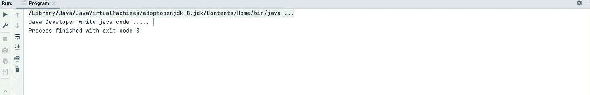
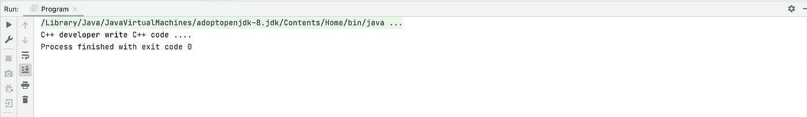
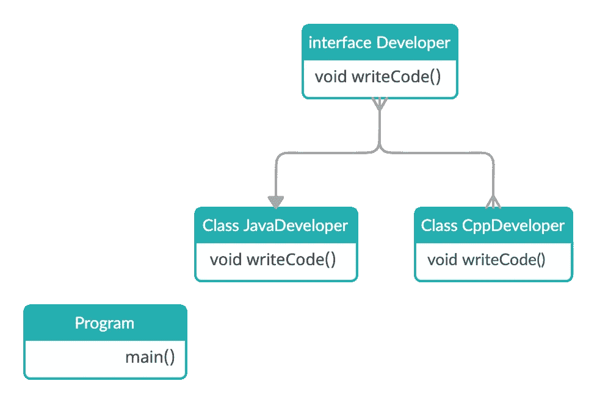
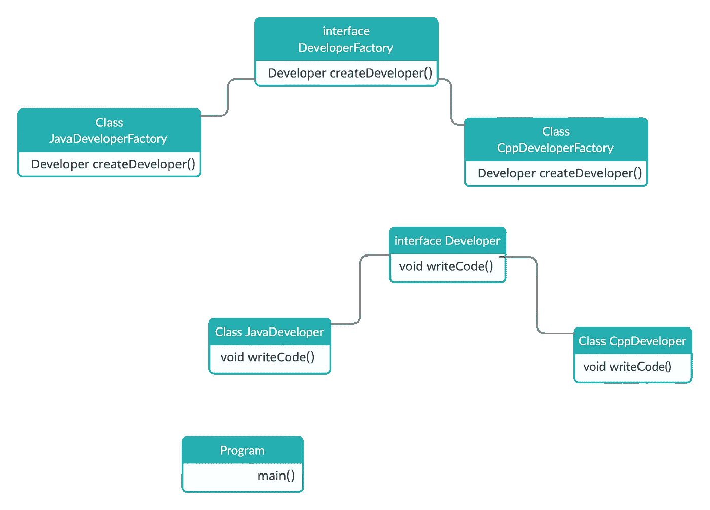

# 工厂方法设计模式

> 原文：<https://itnext.io/factory-method-design-pattern-5a2bbaea08dc?source=collection_archive---------3----------------------->


工厂方法是一种创造性的设计模式，它提供了在超类中创建对象的接口，但允许子类改变将要创建的对象的类型。

在软件工程中，创造性的设计模式是处理对象创建机制的设计模式，试图以适合情况的方式创建对象。对象创建的基本形式可能会导致设计问题或增加设计的复杂性。创造性设计模式通过某种方式控制对象的创建来解决这个问题。

*   [](https://sourcemaking.com/design_patterns/abstract_factory) **抽象工厂创建几个家族类的实例**
*   **[**构建器**](https://sourcemaking.com/design_patterns/builder)
    将对象构造与其表示分离**
*   **[**工厂方法**](https://sourcemaking.com/design_patterns/factory_method)
    创建几个派生类的实例**
*   **[**对象池**](https://sourcemaking.com/design_patterns/object_pool)
    通过回收不再使用的对象来避免昂贵的资源获取和释放**
*   **[**原型**](https://sourcemaking.com/design_patterns/prototype)
    被复制或克隆的完全初始化的实例**
*   **[**Singleton**](https://sourcemaking.com/design_patterns/singleton)
    只有一个实例存在的类**

**工厂设计模式要求定义一个接口(java 接口或抽象类),让子类决定实例化哪个对象。接口中的工厂方法让一个类将实例化推迟到一个或多个具体的子类。因为这些设计模式谈论的是对象的实例化，所以它属于创造性设计模式的范畴。如果我们注意到工厂方法这个名字，这意味着有一个方法是工厂，一般来说，工厂涉及到创造性的东西，在这里，一个对象被创建。这是创建对象的最佳方式之一，其中对象创建逻辑对客户端是隐藏的。现在让我们看看实现。**

**一实施:**

*   **在接口中定义工厂方法。**
*   **让子类实现上面的工厂方法，决定创建哪个对象。在 Java 中，构造函数不是多态的，但是通过允许一个子类创建一个对象，我们给实例化增加了多态行为。**

**我们举个例子。**

**我们有一个程序类**这是一个客户端类。****

```
**public class Program {
    public static void main(String[] args) {
        JavaDeveloper javaDeveloper = new JavaDeveloper();
        javaDeveloper.writeJavaCode();
    }
}**
```

****并用一个方法创建一个 JavaDeveloper 类:****

```
**public class JavaDeveloper {
    public void writeJavaCode() {
        System.*out*.printf("Java Developer write java code ..... ");
    }
}**
```

****运行程序后，我们将在控制台中看到执行过程:****

********

****例如，接下来，我们需要创建一个 CppDeveloper****

```
**public class Program {
    public static void main(String[] args) {
        CppDeveloper cppDeveloper = new CppDeveloper();
        cppDeveloper.writeCppCode();
    }
}**
```

****和****

```
**public class CppDeveloper {
    void writeCppCode() {
        System.*out*.printf("C++ developer write C++ code .... ");
    }
}**
```

****运行程序后，我们将在控制台中看到执行过程:****

********

****正如我们所看到的，我们的程序正在工作。但如果我们需要改变编程语言或添加一些方法，我们将不得不编写许多相同类型的代码。我们还必须对客户端类**程序**执行许多动作。这种做法不方便，也是错误的。****

****下面我们将采取不同的方法。创建开发人员界面。****

```
**public interface Developer {
    void writeCode();
}**
```

****另外，创建两个实现类 JavaDeveloper 和 CppDeveloper 类。****

```
**public class JavaDeveloper implements Developer {
    @Override
    public void writeCode() {
        System.*out*.printf("Java Developer writes Java code ....");
    }
}**
```

```
**public class CppDeveloper implements Developer {
    @Override
    public void writeCode() {
        System.*out*.printf("Cpp Developer writes Cpp code ....");
    }
}**
```

****以图表的形式，我们的类看起来像这样:****

********

****我们可以如下使用这个实现:****

```
**public class Program {
    public static void main(String[] args) {
        Developer developer = new JavaDeveloper();
        developer.writeCode();
    }
}**
```

****和****

```
**public class Program {
    public static void main(String[] args) {
        Developer developer = new CppDeveloper();
        developer.writeCode();
    }
}**
```

****这个实现比前一个实现方便得多。但是，我们仍然需要编写大量重复的代码，并创建一个 JavaDeveloper 或 CppDeveloper 的实例。这种方法不够灵活。为了改进这个实现，我们将创建开发者工厂接口。****

```
**public interface DeveloperFactory {
    Developer createDeveloper();
}**
```

****让我们创建开发人员工厂接口的两个实现:****

```
**public class JavaDeveloperFactory implements DeveloperFactory {
    @Override
    public Developer createDeveloper() {
        return new JavaDeveloper();
    }
}**
```

```
**public class CppDeveloperFactory implements DeveloperFactory {
    @Override
    public Developer createDeveloper() {
        return new CppDeveloper();
    }
}**
```

****以图表的形式，我们的类看起来像这样:****

********

****现在，在客户端类中，我们需要注册以下实现。****

```
**public class Program {
    public static void main(String[] args) {
        DeveloperFactory developerFactory = new JavaDeveloperFactory();
        Developer developer = developerFactory.createDeveloper();
        developer.writeCode();
    }
}Java Developer writes Java code ....**
```

****和****

```
**public class Program {
    public static void main(String[] args) {
        DeveloperFactory developerFactory = new CppDeveloperFactory();
        Developer developer = developerFactory.createDeveloper();
        developer.writeCode();
    }
}Cpp Developer writes Cpp code ....**
```

****但是我们仍然需要创建一个开发人员实例。为了避免这种情况，您需要创建一个更加灵活的实现。****

****让我们创建一个方法的实现，它的任务是根据编程语言返回特定的开发人员工厂。****

```
**static DeveloperFactory createDeveloperBySpecialty(final String specialty) {
    if ("java".equalsIgnoreCase(specialty)) {
        return new JavaDeveloperFactory();
    } else if ("c++".equalsIgnoreCase(specialty)) {
        return new CppDeveloperFactory();
    } else {
        throw new RuntimeException(specialty + "is unknow specialty");
    }
}**
```

****最终的实现是这样的。****

```
**public class Program {
    public static void main(String[] args) {
        DeveloperFactory developerFactory = *createDeveloperBySpecialty*("java");
        Developer developer = developerFactory.createDeveloper();
        developer.writeCode();
    }

    static DeveloperFactory createDeveloperBySpecialty(final String specialty) {
        if ("java".equalsIgnoreCase(specialty)) {
            return new JavaDeveloperFactory();
        } else if ("c++".equalsIgnoreCase(specialty)) {
            return new CppDeveloperFactory();
        } else {
            throw new RuntimeException(specialty + "is unknow specialty");
        }
    }
}Java Developer writes Java code ....**
```

****和****

```
**public class Program {
    public static void main(String[] args) {
        DeveloperFactory developerFactory = *createDeveloperBySpecialty*("c++");
        Developer developer = developerFactory.createDeveloper();
        developer.writeCode();
    }

    static DeveloperFactory createDeveloperBySpecialty(final String specialty) {
        if ("java".equalsIgnoreCase(specialty)) {
            return new JavaDeveloperFactory();
        } else if ("c++".equalsIgnoreCase(specialty)) {
            return new CppDeveloperFactory();
        } else {
            throw new RuntimeException(specialty + "is unknow specialty");
        }
    }
}Cpp Developer writes Cpp code ....**
```

****例如，我们需要为 PHP 开发人员创建一个实现。****

```
**public class PhpDeveloper implements Developer {
    @Override
    public void writeCode() {
        System.*out*.printf("Php Developer writes Php code....");
    }
}public class PhpDeveloperFactory implements DeveloperFactory {
    @Override
    public Developer createDeveloper() {
        return new PhpDeveloper();
    }
}public class Program {
    public static void main(String[] args) {
        DeveloperFactory developerFactory = *createDeveloperBySpecialty*("php");
        Developer developer = developerFactory.createDeveloper();
        developer.writeCode();
    }

    static DeveloperFactory createDeveloperBySpecialty(final String specialty) {
        if ("java".equalsIgnoreCase(specialty)) {
            return new JavaDeveloperFactory();
        } else if ("c++".equalsIgnoreCase(specialty)) {
            return new CppDeveloperFactory();
        } else if ("php".equalsIgnoreCase(specialty)) {
            return new PhpDeveloperFactory();
        } else {
            throw new RuntimeException(specialty + "is unknown specialty");
        }
    }
}Php Developer writes Php code....**
```

****如您所见，实现变得非常简单和灵活。****

****但是为了更灵活和高质量的实现，我们可以用 Map 替换 if-else 条件。****

```
**public class NameOfDeveloper {

    private static final ConcurrentHashMap<String, DeveloperFactory> *CODE_COUNTRY* = new ConcurrentHashMap<>();

    static {
        *CODE_COUNTRY*.put("java", new JavaDeveloperFactory());
        *CODE_COUNTRY*.put("cpp", new CppDeveloperFactory());
        *CODE_COUNTRY*.put("php", new PhpDeveloperFactory());
    }

    public static DeveloperFactory returnNameOfDeveloper(final String specialty) {
        return *CODE_COUNTRY*.get(specialty);
    }
}**
```

****更改后，我们的代码将如下所示:****

```
**public class Program {
    public static void main(String[] args) {
        DeveloperFactory developerFactory = NameOfDeveloper.*returnNameOfDeveloper*("java");
        Developer developer = developerFactory.createDeveloper();
        developer.writeCode();
    }
}Java Developer writes Java code ....**
```

# ****结论****

****工厂方法是一种广泛使用的、创造性的设计模式，可以用在许多存在多个具体接口实现的情况下。****

****该模式删除了难以维护的复杂逻辑代码，并用可重用和可扩展的设计取而代之。该模式避免修改现有代码来支持新的需求。****

********

****[https://test-engineer.site/](https://test-engineer.site/)****

## ****作者[安东·斯米尔诺夫](https://www.linkedin.com/in/vaskocuturilo/)****