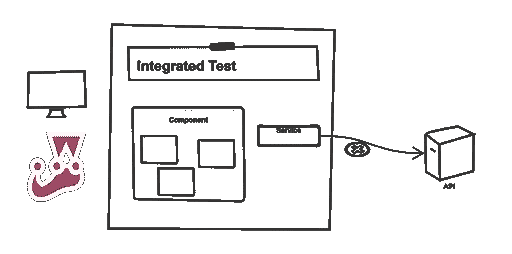

# 如果意外的网络请求发生，测试失败

> 原文：<https://itnext.io/fail-a-test-in-jest-if-an-unexpected-network-request-happens-210ca4c159fa?source=collection_archive---------2----------------------->

一个[单元测试](https://martinfowler.com/bliki/UnitTest.html)不应该触发网络请求，比如对 REST API 的调用。它打破了隔离，会使测试变得不可靠。

相反，我们应该嘲笑这些要求。 [React](https://reactjs.org/) 和 [Jest](https://jestjs.io/) 提供了一种方便的方法。但是，如果你忘记嘲笑一些请求，该怎么办呢？我们将设置 *Jest* 的方式，如果尝试网络请求，测试将自动失败。



我最近一直在使用 [react-testing-library](https://testing-library.com/) 来测试 *React* 应用程序。它的核心设计原理是这样描述的:

> 你的测试越像你的软件被使用的方式，它们就越能给你信心。

这是好事！根据我的经验，一旦你习惯了，你会写更强的测试。但是，如果您使用此库，您可能会多次看到此错误消息:

```
1: "Warning: An update to %s inside a test was not wrapped in act(...).· 
When testing, code that causes React state updates should be wrapped into act(...):·
 act(() => {
   /* fire events that update state */ 
});
```

这通常意味着当测试完成时，有挂起的异步请求。

# 我们捕捉错误的第一次尝试

如果您使用 [Create React App](https://create-react-app.dev/) ，我们会在`setupTests.js`中自动加载这个初始配置。这是相当标准的。

```
import '@testing-library/jest-dom/extend-expect'
import { cleanup } from '@testing-library/react' console.error = jest.fn() afterEach(() => {
   expect(console.error).not.toHaveBeenCalled() 
}) 
afterEach(cleanup)
```

在`console.error`上失败是非常有用的，因为这将显示有挂起的请求。然而，输出可能会相当混乱。我的项目中有一个测试失败了，因为我们向一个组件添加了一个新的部分。新部分从一个端点获取数据并不明显，所以我们实际上通过到处添加`await wait()`语句来“修复”它。

然而，这并没有解决根本问题。我不得不花相当多的时间去挖掘它，然后才弄明白发生了什么。我们想要更清晰的反馈。

# 更有针对性的方法

我们使用 [axios](https://github.com/axios/axios) 来构建我们的 API 请求。任何没有被嘲笑的请求的测试都应该失败。为服务测试之类的事情添加显式模拟仍然是可能的。我们还使用[契约](https://pact.io/)进行*契约测试*。这些测试是针对本地服务器的，运行时不应该激活任何模拟。我扩展了`setupTests.js`文件来模仿`axios`。

```
import axios from 'axios'const spies = {
  get: jest.spyOn(axios, 'get'),
  patch: jest.spyOn(axios, 'patch'),
  post: jest.spyOn(axios, 'post')
}beforeEach(() => {
  jest.resetAllMocks()
})afterEach(() => {
  expect(spies.get).not.toHaveBeenCalled()
  expect(spies.patch).not.toHaveBeenCalled()
  expect(spies.post).not.toHaveBeenCalled()
})
```

就是这样。这样，任何试图执行意外请求的行为都会触发一个明确的失败断言。我们仍然需要处理*预期的*请求。

# 嘲弄服务

此设置没有为请求定义任何退货。如果您正在为您的组件构建集成测试，您需要注意这一点。

我倾向于在服务级别处理这个问题。我的请求通常封装在一个文件中，由需要它们的组件导入。我用 Jest 的[手动模拟](https://jestjs.io/docs/en/manual-mocks)，它比`axios`高一级。一项服务可以像这样简单:

```
// src/recipe-list/recipeList.service.ts
import axios, { AxiosResponse } from 'axios'
import { Recipe } from 'components/recipe/types'export const recipeList = async (): Promise<AxiosResponse<Recipe[]>> => {
  return axios('/rest/recipes')
}
```

可以用这样的手动模拟来代替:

```
// src/recipe-list/__mocks__/recipeList.service.ts
import { AxiosResponse } from 'axios'
import { recipes } from '[@testing](http://twitter.com/testing)/__fixtures__'
import { Recipe } from 'components/recipe/types'export const recipeList = async (): Promise<AxiosResponse<Recipe[]>> => {
  return Promise.resolve({
    status: 200,
    statusText: 'OK',
    data: recipes(),
    headers: [],
    config: {}
  })
}
```

# 直接嘲讽 axios

另一种选择是直接模仿 *axios* 并添加您的行为，这将取代我们最初定义的模仿。

```
jest.mock('axios')describe('service, () => {
  beforeEach(() => {
    ;(axios.get as jest.Mock).mockResolvedValue(response)
  })
})
```

# 重置模拟

如果您需要`axios`正常工作，就像在契约测试的情况下，您可以恢复原来的行为。

```
beforeAll(() => {
  jest.restoreAllMocks()
})
```

# 总结:明确你的错误

这就是事情的全部。一个简单的、虽然有点粗糙的解决方案，确保错误尽可能快地暴露出来，而不会被隐藏起来。

*原载于 2019 年 12 月 8 日 https://hceris.com**T21*[。](https://hceris.com/jest-fail-test-if-unexpected-network-request-happens/)