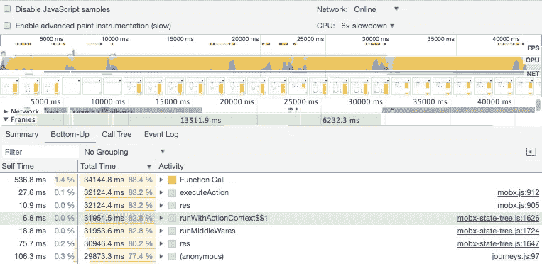
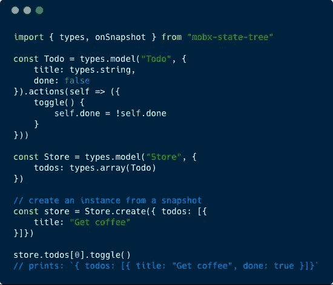
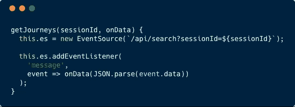
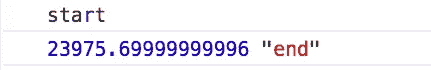
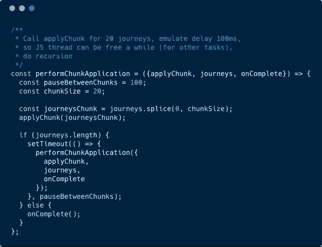
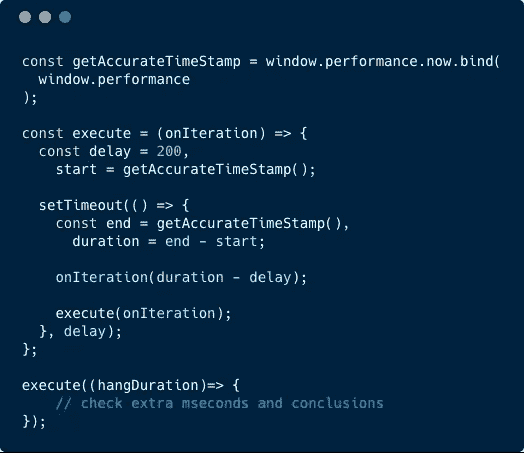
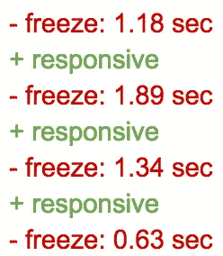
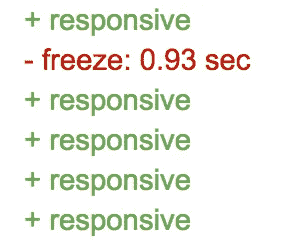

# 关于 web 应用程序性能的童话

> 原文：<https://itnext.io/fairytale-about-performance-in-web-application-ed2bf12627fc?source=collection_archive---------0----------------------->

很久很久以前，在一个非常遥远的地方，住着前端开发人员，他们非常幸运地一直在他们强大的笔记本电脑上开发 web UI，以至于他们完全不关心他们代码的性能影响。有一天，一个不知道名字的人试图在普通手机上运行这个应用程序。之后发生的事情真的令人震惊…我们所知道的是，那个国家的国王非常沮丧，几十年都无法入睡。**当你看到 JavaScript 执行阻塞浏览器渲染引擎达 30 秒时，你也会感到不安！**

## 这就是我的故事开始的地方。

这是一个普通的晴天，夏天刚刚开始，天气已经很热了。那一天是不同的，**我知道一件非常特别的事情即将发生...**

我的一个老朋友用下面的话联系了我:

“嘿，伙计，我们有这个网络应用程序，‘启动’和所有类似的东西。经过一年的积极开发，就在发布之前，它在移动设备上的表现有点糟糕。该应用程序是关于搜索旅行，基本上，当我们做搜索时，结果列表表现不佳。您可以看一下，并建议如何改进吗？”

结果列表在移动设备上表现不佳。名单有多大？嗯，我见过很多次，不流畅的动画，滚动有时没有预期的那么快，对不对？或者，也许你只是有太多的重新渲染和调整 *shouldComponentUpdate* 只是将解决所有的一次？是的，当然，我很乐意帮忙，听起来会很有趣😺

第二天，我拿到了源代码的所有证书和权限:`git clone` *，* `yarn & yarn start`，我准备好开始玩了！那么，这里有什么？我在新的 MacBook Pro 上运行了一次这个应用程序，嗯，在主 UI 元素和列表渲染之前有一些动画抖动，但没有什么突出的。好吧，让我通过 *Chrome* 开发工具降低 **6x 处理器速度**。好吧，有件事..环境资源管理（Environmental Resources Management 的缩写）..为什么现在有一半的可视化组件根本没有渲染？*再次命令+R.* 。稍等一下。我们开始吧..26 秒我和我已经完全渲染好用户界面，可以使用了。不好玩🙀

让我再强调一下:**网页冻结了 26 秒**，用户界面完全没有反应。基于 React 的 web 应用程序，在搜索结果中有大约 20 个条目。在 *Chrome* 里，甚至还没有 *IE8* 的日子。伙计们，你们都做了些什么？

## 第一天:深入兔子洞或寻找瓶颈。

我应该从哪里开始？好吧，让我们从`package.json`开始，这样我可以快速检查正在使用什么，主库和工具。好吧，我们在这里有什么:

*   `react`
*   `react-redux`
*   `reselect`、`redux-saga`、`router`

嗯，这些天来相当标准的堆栈，对不对？等等，还有什么？

*   `mobx`

等等，为什么你同时需要`redux`和`mobx`？好吧，也许这只是一个遗产，已经是不好的迹象了，但是，继续前进。

> 快速浏览一些文件夹，入口点文件。让我们在这里和那里放几个*断点*，几个`*console.logs*` *、*获得更多关于代码库和流程的知识。学习代码风格。了解主要功能和使用案例。数据从何而来？它是如何被解析并应用到用户界面的？什么是主要的 UI 组件？使用 React 开发工具并检查 HTML 元素，以了解布局是如何构建的。

15 分钟后..你知道代码库！

运行 *Chrome* profiler 来测量性能的时间。

脚本编写相当繁重。不过这并不奇怪。

我们能从中得到什么？嗯，如果你曾经为一个混乱的未知代码库运行过 *Chrome* profiler，它一开始会吓到你。当屏幕上有太多信息，你简直不知道从哪里开始时，这就是其中一种情况。首先，您可以看到时间线上的红色标记，这意味着存在真正的性能问题，即使没有您的分析，分析器也可以检测到它们。

> 我通常做的，作为快速的第一步，我在自下而上的列表中检查‘热函数’。因为如果有一个函数执行 *gazzilion* 迭代来计算彗差后 15 位的圆周率数字，你会发现它就在列表的顶部(哈，如果有这么简单的话)

总之，在 profiler 结果中，我注意到了`mobx`、`mobx-state-tree`和一个来自项目代码的文件— `journeys.js` (正如我提到的，项目是在旅游/旅行领域，所以你会看到一些相关的名称)。我的第一个想法是“*什么是* `mobx-state-tree`？”因为我以前没用过它。我做了一些谷歌搜索，检查了 *Github* 页面，检查了它是如何在代码中使用的——嗯，它的库为你提供了将数据打包成模型并将它们组合成一个大模型(树)的工具。然后，您只需使用存储对象调用模型方法来访问或改变其数据。

回购自述文件示例

那是第一声钟声响起的时刻。由于是与`*mobx*` 集成，并且基于`observables` 工作，我预感到在大批量的车型上可能会有问题。当时我**没有证据**，而且，我知道模特的数量不是很多，所以，就继续前进了。

如果你记得的话，剖析器中的下一个文件是`journeys.js` *。*嗯，我喜欢这样，我的意思是，当我真的可以“触摸”代码时，我有一种很好的信心，也就是说，在那里修改代码并看到即时的反馈，就像在你的指尖上有很多控制一样。我打开文件，找到了分析器指向的行——我看到的是:

服务器发送的事件？

它是如何工作的:当用户按下“搜索”会话(基于搜索参数等。)将被创建。然后，[服务器发送的事件](https://developer.mozilla.org/en-US/docs/Web/API/Server-sent_events/Using_server-sent_events)订阅将被创建，并将通过事件向您推送搜索结果。

> 如果你想一想，这是非常明智的做法。想象一下，当您的常规 REST 调用花费了相当多的时间来处理结果并将其发送回客户端时。用户和整个应用程序一样，只是等待响应，并被阻止做其他事情(因为数据还不在那里)。但是，如果您可以立即开始响应客户，而不是等待整个任务完成，会怎么样呢？是的，我们开始了，基于事件的通信解决了这个问题。

当从服务器接收到`message`事件时， *JSON* 数据将被解析成对象，并进一步传递给回调函数，回调函数是我们处理搜索结果的入口点。

好吧，现在我感到自信，我确切地知道数据是如何来的，我可以开始嘲笑它，玩弄它，做所有其他非法的花哨的东西👌

说到做到。我做了搜索，得到了巨大的回应，复制了 JSON，保存了它和服务器的通信。

> 当时我确实有静态数据，这是非常重要的第一步，因为我计划进行的所有测量都不会受到变化数据的影响或污染。

“这一定是关于数据量的问题”。我在搜索结果中嘲笑了 100 个项目(而不是之前的 400 个),你猜怎么着？地狱没有，它仍然吸，不是 26 秒，但仍然远远不能接受。多有趣啊？

那时候差不多是晚上了。我绝对不想带着半开的问题去睡觉，因为我的大脑不允许我睡觉，如果我不给它至少一些奖励的话。但是我一无所有。是的，我熟悉了代码库，模拟了数据和来自 profiler 的一些提示，但是，这还远远不能令人满意。于是，我开始到处玩，到处注释代码，一次又一次地测试，希望能速战速决。我试图本地化影响性能的部分应用程序。是的，我知道就在数据被接收到`journeys`服务之后(很明显)，但是跟踪就消失了…

*“不可能到处都是坏的，对吧，可能是某个地方的某个劣质组件把整个应用程序送进了地狱？”*

在某一点上，我只是删除了整个渲染，这意味着没有任何反应渲染，性能仍然是一样的，即可怕的。

再次:**我** **移除了整个渲染，没有看到任何改进**。这怎么可能。没错。瓶颈不在渲染，而在数据处理。就在从服务器接收数据和将数据传递给 UI 组件之间的中间点。哇，太令人兴奋了。我的意思是，谁会想到，二十一世纪的所有性能问题都是渲染相关的，而不是简单的 JavaScript

*“嗯，那就更好了，在 Vanilla JS 中修复会更简单吧？”* —脑海中天真的声音疑惑着。

## 第二天:做出选择的代价

新的一天。API 调用和可视化组件之间有什么？`mobx-state-tree`模特创作。在数据传递到模型树和模型创建之后，我立即放置开始-结束`window.performance.now`日志:

约 800 款车型 24 秒

我尝试了 3 倍数量的模型:

显然，它与模型的数量成线性关系..

让我来解释一下这些数字。我们在这里谈论的不是几十万。应用程序有下一个型号:

*   旅行
*   路线
*   片段
*   *…不影响大局的更少*

它们以树状方式组合在一起——“旅程”模型包含“路线”，“路线”模型包含“路段”，等等。比方说，它创造了 50 个旅程，100 条路线+ 75 个航段。所以大概是 **200 款**。创建它们需要 5 秒钟。

*“是时候更好地了解你了，我的小朋友”* —想想我自己，去结账*Git*—`mob-state-tree`的回购。

> 我从检查存储库的归档问题开始。在将一个模块作为应用程序代码的基础之前，这是一个很好的实践。嗯，**来不及了**这里。

我在 issues 中搜索了“perf”,[得到了几个](https://github.com/mobxjs/mobx-state-tree/issues/440)。快速通过。*“不光是我自己，其他人也在抱怨同样的事情”*。

但是，似乎维护人员会解决这个问题。事实上，**他们已经修复了这个问题，但它将在下一个主要版本**中发布🙌( *mst v3，在所述事件发生时尚未发布，但现在已经发布*)

但是(再次)我们显然不能只是等到它发布(并希望它有固定的性能)——人们也需要发布他们的应用程序。昨天。

但是(我知道)我还能做什么？(*考虑时间/工作/金钱问题*)

## 第三天:接受或者你还能做什么。

所以，你的代码库中有这个“不漂亮”的东西，你应该忍受它。你无法避免面对它。你不能逃避它——它太大了。你有这些战斗的想法，很明显你应该删掉那些代码，也许重写那些功能，也许，甚至让它没有错误地工作。也许，事件会及时发生…

> 欢迎来到软件工程的真实世界。艰难的选择。在用 jQuery 做第一个图像轮播之前，没有人告诉过你这一点，对吗？😹

总之。没时间重写了，看看别的选择吧。所以，再一次:

**问题:**模型创建阻塞了 JS 线程，用户在 25 秒内无法在屏幕上看到任何更新。

**第一个廉价的解决方案:**重复解除主线程的阻塞，这样 UI 更新的任务就可以由事件循环来完成(如果对你来说是新概念，请点击查看[视频)](https://www.youtube.com/watch?v=8aGhZQkoFbQ)

**如何:**大块大块。就这么简单。

分块方法是处理大量数据、UI 上的长列表等的经典方法。您肯定在您的应用程序中多次使用过它:延迟加载、分页——都是同样的想法。

> 如果你有很重的任务，你总是可以把它分成几部分(几块)，一块一块地做，如果需要的话，中间可以暂停一下。

在我们的情况下，我想在收到数据后立即将数据分成 20 个数据块，然后一个数据块一个数据块地发送，中间暂停一会儿，让 UI 更新。很简单。

简化的，只是为了得到大意。

到目前为止，我有一个问题，正如我提到的，树有下一个模型:*旅程，路线，部分。*通过 id 链接。从服务器上来说，它们是正常的，所以我需要手动连接它们，以确保 20 个旅程的数据完全足够工作，不多也不少。这里的技巧是，我需要尽可能高效地做这件事，因为我没有编写非性能代码的奢侈😹

**任务:**从标准化的模型数组中创建完整的数据结构，即通过 ID 在长长的对象列表中搜索，并将对象组合在一起。

**解决方案:**，当然，如果你涉及到数据结构和算法复杂性，有很多方法可以做到这一点。对于这里的搜索，最理想和最简单的方法是用 ID 作为关键字将`array`转换成`object`。您将在 5 分钟内获得 *O(1)* 搜索！

毕竟，我觉得它现在应该工作得更好。好多少？我需要一种方法来**测量**那个！

## 第 3 天半:衡量绩效的定制工具。

这里有一件事。你可能听过很多次，有人“感觉”应用程序很慢，甚至不知道你在分析数字，不管你的数字说什么，用户都不高兴。拥有不满意的用户是最不可能的事。问题是你如何*衡量*用户的感受。显然，这个任务也没那么难。

> 用户感觉工作比预期慢，因为，很明显，我们都有准确的实时感觉。如果你的应用程序的行为分散了用户的注意力，你猜怎么着，用户会注意到的。知道了这一点，现在我们知道如何衡量用户的感受——我们应该衡量我们的代码如何与实时相比较(我知道，对于一个理论来说，这很简单)。

愚蠢简单。

运行`setTimeout`(计算机时间)并测量它与实际时间的差异。如果差别很大，这意味着你的一些代码执行超过了允许的时间。你可以在这里找到[要点和完整代码](https://gist.github.com/Bogdan-Lyashenko/d43e2897ea1f0d8c2c75a81a9dcb817a)。

测试的时间到了:

嗯，绝对少于 26 秒..

所以，事情是这样的。该应用程序在页面顶部有一个带计时器(从 1-30 秒)的进度条，当用户进行搜索时会有进展。计时器应该每秒更新一次，这样用户就可以看到需要多少时间。

**之前:**用户按下*‘搜索’后，进度条挂在*‘1 秒’*状态 30 秒。*然后跳到结尾(当然，如果用户等待了 30 秒，屏幕一片空白，并且没有关闭标签……)

**之后:**进度条每秒更新一次(因此用户可以看到从 1 秒到 30 秒的所有数字)，这是一个显著的改进。但是，你可以在上面的测量中看到，它并不平滑，因为它为每个块创建了 20 个模型，每个块平均需要一秒钟来完成。

如果屏幕上有任何动画，很明显有点不对劲， **1.18 秒**， **1.89 秒**，延迟……显然还不够。当然，更好的用户体验，但是不，仍然不能接受。

*“我们可以做得更好。”—我在挑战自己。*

## 我们可以做得更好。

目前我们知道的是什么？模型创建是一项繁重的任务。即使对于较小的量，在块中，它仍然影响 UI 重新呈现。但是……我们真的一直都需要它们吗？这是一个很好的问题，引出了第二个解决方案。

**第二个解决方案:**推迟繁重的代码执行(这里也称为“模型创建”),直到不能再等下去。

就这样💡

> 屏幕上的列表中有 20 个旅程。在滚动时，我们也在步骤 20 中添加了更多内容，即用户向下滚动，获得更多旅程。这意味着，从冷启动开始，我们不需要超过 20 个模型。因此..为什么我们还要担心其他 700 型号？

还需要几分钟来创建缓存服务和滚动事件与模型初始化之间的通信桥梁。就是这样。现在，我没有直接从服务器向`mobx-state-tree,`传递数据，而是将数据缓存在普通的`JavaScript` `object`中，稍后，当 UI 需要时，用它来创建模型。

嗯，肯定少于 26 秒，比如 28 次…

**之前:**按下“搜索”按钮时，进度条每秒更新一次(感谢组块)。但是，为每个块创建 20 个模型平均需要一秒钟，所以进度条会在这段时间挂起，很难不注意到这一点。

**之后:**按下“搜索”按钮后，进度条暂停 1 秒，然后每秒更新一次**非常平滑**没有任何中断。在卷轴上，虽然，它将再次挂起 1 秒(因为这将是另一个模型块创建)，但是，这是一个我们需要接受的小邪恶。

我又想到了这个:

> 最初，用户需要等待 26 秒，屏幕一片空白，直到应用程序可用。之后，通过一些非常便宜的修复，该应用程序在不到 1 秒的时间内就可以使用了。

**就这样？**

好吧，房间里有只大象。它太大了，我没法扔掉它，但是我用很少的装饰让它不那么显眼。但是其他代码呢？

这在许多其他地方都有很大的改进空间:

*   还有`momentjs`又慢又大，可以换成`dayjs`，节省你几秒钟
*   跟踪逻辑太重，用于跟踪的数据不应在 *O(n2)* 中构成
*   显示值每次都是通过在列表中搜索来合成的，应该在之前计算一次并缓存在某个地方
*   还有更多…但这已经是另一个童话了

## 最后的想法

还记得你用`jQuery`做动画的时候，它在 *Chrome* 中拖得很慢，你仍然可以用`ActionScript 3.0` ( *Flash* )做同样的事情，而且速度更快更好。或者，当你需要一些大的可编辑表格在 *IE8* 中工作时，到处剪切，使用`createDocumentFragment`来减少回流，你最终能够防止浏览器崩溃吗？时光飞逝，仿佛就在昨天*微软*推出了 *Edge* 浏览器，再也没有人关心 *IE8* 了……阿门。是啊，真是松了一口气，终于放弃了对 10 年之久的浏览器的支持。

那么，有什么新东西*让前端开发者头疼*呢？手机。事实上，这并不新鲜，公平地说，这种转变发生得非常快，用户从桌面到移动的转移发生在 3 或 5 年前，对吗？移动浏览器现在是我们的目标受众，所以…请停止在你的新 MacBook Pro 上测试一切！

*性能*不是你可以简单地“*应用*的东西。最后，有时修复糟糕的代码、应用程序架构或选择的库的后果是不可能的或非常昂贵的。

花 199 美元买一部普通的安卓手机，在上面测试你的应用程序，你可能会有一个属于你自己的童话故事…

如果你喜欢这篇文章，并想了解我下一篇文章的更新，请在 twitter 上关注我。