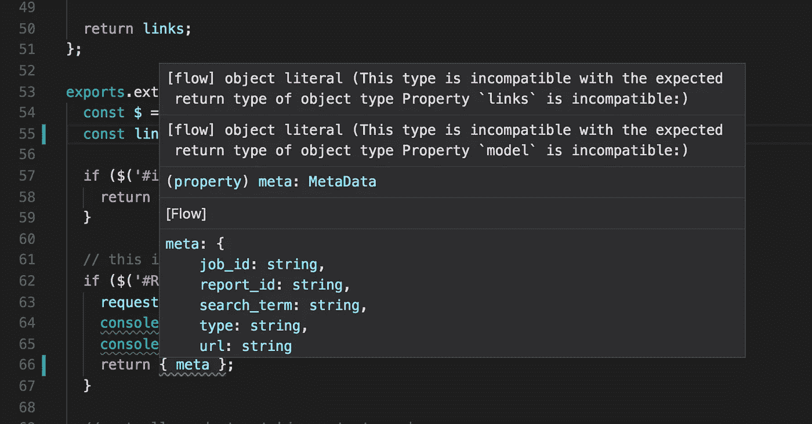

# 爱上心流

> 原文：<https://itnext.io/falling-in-love-with-flow-71eb47c2c138?source=collection_archive---------4----------------------->

[*点击这里在 LinkedIn* 上分享这篇文章](https://www.linkedin.com/cws/share?url=https%3A%2F%2Fitnext.io%2Ffalling-in-love-with-flow-71eb47c2c138)

几年前，我用 [Flow](https://flow.org/) (脸书开发的 Javascript 静态类型检查器)做过实验，虽然“嗯”我的代码编辑器会崩溃，我看不到明显的好处，这有点妨碍了进展，所以它被搁置了。

快进到上周，我决定在心流再做一次尝试。我已经习惯了使用一个新的编辑器(Visual Studio ),也许这个可以处理运行流。可以的！下面是一个 React 组件的例子，它将 React 组件用于道具和状态。

我喜欢这种设置，因为它使组件文件更短，并且您可以使用这些类型 annnnyywhere。例如，如果您有一个脚本，它使用您在前端使用的相同的 api 客户端，您可以对这两者使用相同的类型。

# 但是兄弟，打字稿

真兄弟，真的。Typescript 处理类型检查，它内置于名称中！我喜欢尽可能接近“原始”Javascript。所以我用 ES6 写，transpile 到 ES2015。此外，到处都有对 Javascript 的更多支持，因此更容易找到问题的解决方案；Typescript 的表面区域并不存在。所以，兄弟，祝你的 Typescript 玩得开心，它确实感觉更像 Java 而不是 ES6，但我会继续关注这一个。

# 真正的转折点

我开始玩 Flow yes，但是它没有*帮助*太多，除了漂亮的自动完成建议，我没有得到*主要的*好处。我没有怒目而视“嘿，白痴，这个接口是错误的”这是使用类型检查的承诺。直到我在调试另一个项目…

另一个项目有一堆文件，包含一个函数，你可以传递一些 html 给它，它会返回一个对象。这里有一个大概的轮廓。

现在，有些网站( [Alexa random laugh](https://www.theverge.com/circuitbreaker/2018/3/7/17092334/amazon-alexa-devices-strange-laughter) )不希望这很容易。有时候请求会失败，有时候会发生其他的事情…但是这篇文章不是关于这些，它是关于静态类型检查的！当我们在提取器中检测到一个故障时，可以通过这样做来延迟“重试”。

是的，是的，我应该只提取 url，而不传递整个对象，是的，这很懒，但是很有效！理想情况下，我们开发人员应该有时间让所有代码都完美，但是我们没有，我也不想假装我有时间。

其中一个提取器里有个窃听器。请求失败，但我们不会重试。嗯。让我们来看看这个失败的提取器的简单版本。

与此同时，这个缺陷是非常明显的。我退错东西了！`links`不是`meta`对象的属性！因此，检查返回对象上的链接什么也看不到，令人惊讶的是，一大堆事情都没有发生。在我最近重新探索心流之后，这触发了一个心流泡。如果我对这个文件使用了 Flow，这将变得简单而明显。那看起来像什么？

这是我在没有修复错误的情况下添加类型时得到的错误。

现在，如果我以懒惰的方式将`meta`作为`links`属性的数组中的唯一元素传递回去，那么在修复了错误之后，Flow 仍然会给出一个错误。因为我只在`Link`类型中指定了`url`，它会警告我，这很好。有一天，我会更新所有这些文件或改变界面，当这一切发生时，我会撤销所有的懒惰。

# 使用流量

这不仅仅是为了说唱歌手和液体，我们都可以使用它，在这次经历之后，我是一个大流量倡导者。它已经成为我们未来开始的任何 Javascript 项目和容器实验室的基本元素，我们正在将它添加到现有的项目中，因为我们也在做那些项目。去[检查一下](https://flow.org/)。