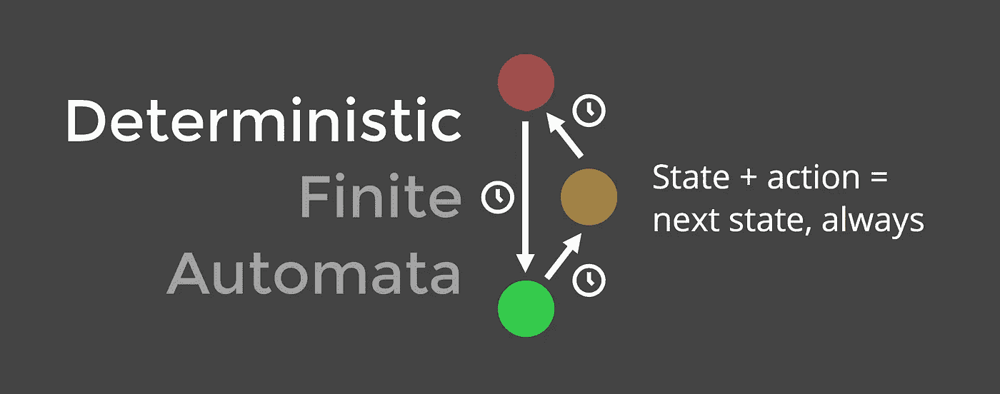
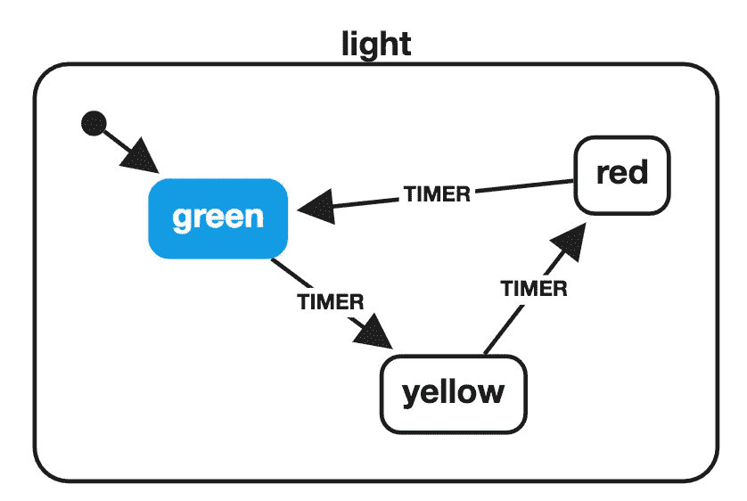
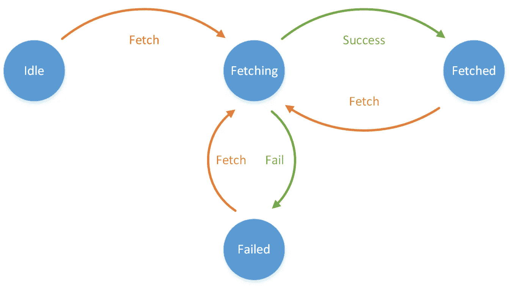
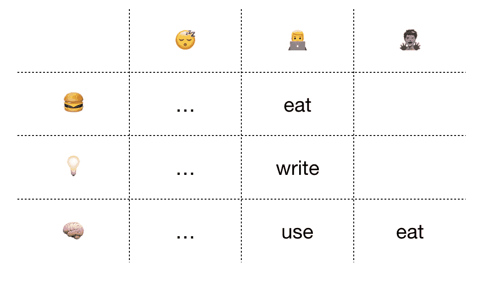
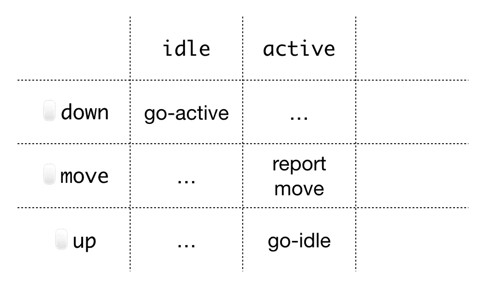
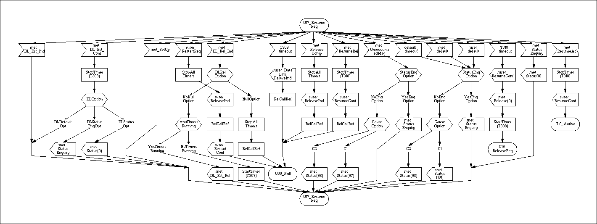

# 扣紧你的状态

> 原文：<https://itnext.io/fasten-your-state-9fb9f9b44f30?source=collection_archive---------5----------------------->

很久很久以前的一天，我去了大学。我很兴奋。我对计算机科学课程期望很高。像 C++，或 Java，宇宙飞船和 3D 游戏。但是我们没有给我们一些真正的 T4 的东西，而是开始学习“离散数学”。

> 嘿，*我在这里做什么，这不是我要找的那种“编程”！！！让我出去！！！！*

而第一件事，**我完全没有得到，**是有限状态机(FSM)，或者说[自动化](https://en.wikipedia.org/wiki/Automata_theory)。我不明白为什么一个人需要它，为什么我需要它。我不会让你重蹈我的覆辙。

这篇文章是关于**有限状态机**的状态。之所以你不得不`click`一个*禁用*一个`button`，或者不得不`open`一个*关闭*一个`door`。关于某个东西，叫 **CS-in-JS** (不是 css)，对前端采用经典编程。以及 XState 和 [Faste](https://github.com/theKashey/faste) —一个 js 库，用于处理*状态*。

月球国家

# 让我们从图表开始

FSM 的主要目标是描述一个更加声明性的工作流程，描述一些事情应该如何工作。除了“正常程序”，它可以做任何事情，甚至是你不想要的和不可预测的事情——由状态机驱动的程序只会做你编程让它们做的事情，仅此而已，因此是完全可预测的。和“安全”。

让事情变得可预测是一个流行的 FSM 库的目标— [xstate](https://github.com/davidkpiano/xstate)

 [## 有限自动机无限好的用户界面

### 用幻灯片创建的演示文稿。

slides.com](http://slides.com/davidkhourshid/finite-state-machines#/7) 

你可能会阅读一篇关于它的文章，或者只是漫步一些幻灯片，或者查看 JSConf 冰岛 2018 的一个[视频，以获得更清晰的观点。这里背后的主要思想简而言之:](https://www.youtube.com/watch?v=RqTxtOXcv8Y&feature=youtu.be&t=1607)

> (这里的关键词是**确定性**和**有限性**，以及**自动机**和**始终)**。

下一个状态*加上*的某个动作*就是一个*的新状态*。或者，让我稍微换个说法，FSM 定义了**系统**应该如何在**特定状态**下**对**特定动作**做出反应。***

> 这里的状态不同于 React 或 Redux 状态。你正在读这篇文章——那是你的状态。状态是关于阶段的东西，是定义整个“系统”行为的东西。是的——更像是一个阶段。

听起来很简单，但是它允许你创建(1)容易出错的东西，(2)不费力，(3)零维护成本，(4)自动测试，以及(5)容易更改。

> 5 合 1，如上所示📺。

你可能会说“**不可能！那些东西不会聚集在一起**！”，但最好问“如何？!"，和 FSM，有限状态机就是答案。或者，在这种情况下更准确地说是“状态图”(在 xstate 中描述 FSM 的方式)。

> 出于好奇——美国宇航局使用🔥状态图表🔥去探索🙀火星🙀

XState 库提供了一个很好且容易理解的例子——交通灯。这**只是一张图纸**和解释**交通灯**如何工作。

> 那些图(状态图)可能会有用！您[可以运行它们](https://musing-rosalind-2ce8e7.netlify.com/?machine=%7B%22key%22%3A%22light%22%2C%22initial%22%3A%22green%22%2C%22states%22%3A%7B%22green%22%3A%7B%22on%22%3A%7B%22TIMER%22%3A%22yellow%22%7D%7D%2C%22yellow%22%3A%7B%22on%22%3A%7B%22TIMER%22%3A%22red%22%7D%7D%2C%22red%22%3A%7B%22on%22%3A%7B%22TIMER%22%3A%22green%22%7D%7D%7D%7D)！

> Chat 定义定时器事件接收时的状态变化。绿色-黄色-红色-绿色。

而且绝对**没有办法搞乱这个代码**。它永远不会从绿色变成红色，而只会按照你的设计去做。它**牢不可破，**和它是“确定性的”。

状态图是向你解释交通灯如何工作的简单方法，也是向计算机解释交通灯工作的简单方法。

> 当 **事件**被接收时，总是知道**将会发生什么****。**

甚至在被分派后，xstate 会将其状态更改为您所说的状态，甚至是相同的状态，然后触发“`onEnter`”事件，该事件会告诉您“接下来您必须做什么”。在这个例子中，每个`light state`可以有`onEnter`动作，这将告诉硬件实际上改变光的颜色。

> “OnEnter”是 State 与真实代码通信的唯一方式——执行搜索，当有人点击搜索按钮时，加载图像，当有人选择图像时，反之亦然——您必须执行的所有操作才能使应用程序做一些真实的事情。

不要忘记，不是所有的事件都是可以接受的。例如，只有警察才能改变灯的颜色，所以你必须在机器收到事件时做 *"AuthN/AuthZ"* 。简而言之——x state 可以决定是应该传递事件，还是应该忽略事件。这种机制称为`guards`，或者简称为“事件过滤条件”。

> 所以状态+(事件+测试)=新状态。

> Guard 不是一个“逻辑”，它只是一个接受或不接受一个事件的条件。只要它只是图表上的一个“标签”，就很容易“形象化”和“解释”状态。

XState 只是一个 **JSON** 结构，而不是代码——你可以从它创建一个**可视化图表**，并仔细检查它是如何工作的。在编写任何代码之前，您可以模拟任何情况、任何工作流。接下来，您可以创建一个“xstate-machine ”,并将第一个事件放入其中，等待外部事件的到来。

> 首先将动作“放”入 xstate，然后 xstate 将动作“放”回给你。

XState 只不过是一种“运动”——它必须从一种状态转换到另一种状态才能存在。无尽的可控运动。

与此同时，您可能想知道— **我真的需要 FSM 吗**？我有一个很好的例子，“为什么你到处都需要 FSM”——REDUX**。**

> **有限状态机和 Redux 是死党！**

**让我们假设你要取东西，那么你调用 FETCH，`reducer`把状态改成 *{loading: true}* 。**

**接下来，您取消获取，`reducer`将状态更改为*{加载:假}***

**接下来，fetch 完成它的工作(你没有取消一个真正的 API 调用)，并把数据放入状态，**数据没人需要**了，只要你有**取消**请求，但没有取消一个 fetch 请求。(`fetch` API 不包括`.cancel`)。但是 redux reducer 总是做出反应来接受和减少您可能分派的动作。**随时准备将数据**放入存储，当放行动急件时。这是规矩。**

> **这是 redux 最大的问题——reducer 通常很简单，它等待你执行“正确的”动作，从不考虑它是否应该接受你分派的东西。**

**redux 自动机，可以更好地处理这个问题，让你定义 Redux 应该“如何”减少每个状态的事件。例如，当您不在提取状态时，不减少数据，并且不响应错误，同样不在提取状态。**

****

**只需添加几行逻辑，你的获取周期就会像它应该的那样工作，而不是像*可以*和通常*会*那样工作。**

**另一个 redux *框架*–[ROS maro](https://rosmaro.js.org)可以为任何 redux 应用程序提供完整的“xstate”体验，包括可视化编辑器。**

** [## 用于状态和动作功能的 JavaScript 框架

### 状态和动作的函数是带有两个参数的函数:状态和动作。

medium.com](https://medium.com/dailyjs/a-javascript-framework-for-functions-of-state-and-action-26b7789eeed0) 

## 定义事情应该如何运作，然后把事情做对。

这些库可以提供的最大优势是——您可能在运行它之前就知道“某些东西”将如何工作。因为你用“宣示性”来描述它。你描述的方式是人类和计算机可以理解的。你们将成为同一页。

> 状态图是一个图形，图形是一个固定的结构。你可以建立，遍历，检查它。再次检查、模拟、预测、重构、测试。

我认为——对于超级严肃的事情，比如登月者——最好使用 xstate——它会迫使你构建非常可靠的软件。不是授权——而是强制，只要很难创建*不可靠的*软件。

使用 FSM 设计你的软件就像做测试驱动开发一样，但是更好。在 TDD 中，你首先要**创建测试，**定义什么是“应用程序工作正常”*，然后写一个**代码来通过**你写的测试。*

*XState 将改变它的工作方式——你不必“提取”应用程序的行为来测试它，也不必“逆向工程”你的应用程序来把它分解到单元测试的层次。你只是在描述它将如何工作——它将按计划工作。还有(！)你不需要写一些代码和一些测试，因为你已经在画状态图的时候做了。状态图是测试，状态图是代码。*

> *您的应用程序将按照您设计的那样工作。*

*但是对于凡人来说，这并不总是方便的。太抽象了。太马蒂什。*

# *真正的用例。*

*解决问题的最好方法——玩弄它。所以让我们一起玩吧，让我们认识…我！我的不同状态。*

**

*我——睡觉、写作、加班*

*这就是我的“我吃”的行为。正如我祖母所说——吃饭时不要说话，那对消化不好。*

**

*关于(食物)，什么时候(总是)，然后(不要说话！)*

*但是，对不起奶奶，当我吃饭的时候，我在听和说。我是👨‍💻，而我在吃，所以我甚至不改变状态。可能“我”是不同状态机的组合，而消化是其中之一。*

## *反应取决于行动和状态*

*我将如何应对另一个事件？*

> *如果我醒了，并且有了主意——写一个中型库。*
> 
> *如果我要睡觉——刷牙。*

*所有这些形成了一个“Excel 表格”，这个表格描述了我何时以及如何对事件做出反应，以及我如何从一种状态转换到另一种状态。*

**

*当我遇到朋友时，我会:*

*   *进入`talking`状态，**如果**我有一段时间没见到我的伴侣。*
*   *就`emit`“嘿，伙计！”，**如果**昨天遇到他。*

*一切都可以用简单的规则来描述。简单到足以防止错误。这是定义 FSM 的最常见形式— [状态或事件表。](https://en.wikipedia.org/wiki/Finite-state_machine#State/Event_table)(非图表/图形)*

## *行动是一种反应*

*任何行为都会导致反作用。对于不同的状态，实际的动作处理程序可能是不同的，但是应该做一些事情。*

> *当我单击按钮时—调用 onClick 事件*
> 
> *如果按钮被“禁用”,它将不会接受事件。或者什么都不做。或者干脆不调用 onClick。*

***不能点击禁用按钮**的原因——在`disabled`状态下不接受`onClick`。但是`disabled`、`hovered`、`focused`、`pressed`“状态”应该如何共存？按钮可能同时处于所有这些状态！*

> *“我”可能存在于 100500 个不同的状态中，或者“我”实际上可能只存在于😴(睡觉)还有🤔(没有下滑)，而其他一切都是“子状态”👨‍💻作为...的替代🤔和🧛‍♂️作为一个州😴？*

*事实上——当我和朋友交谈时——我是处于`talking`状态，还是只是我的某个部分在说话，而“我”只是`awake?`*

*“嵌套状态”可能非常有用，任何使用 React 或其他“组件”方法的人都很熟悉。BigState 由较小的状态机组成。他们甚至可以共享一个“状态”(在“状态”的反应意义上)。*

# *禁食*

*Faste 是一个事件(“Excel”)表。还有一个库，让你描述"**什么**应该做什么，**当**在某种**状态下**收到某种**信号**。*

> *表格没有“图形”或“图表”冗长，但也不包含某些信息。例如，在中只包含“操作句柄”，但没有关于“状态转换”的内容。*

*Faste 是一个黑匣子——你可以**把**一些动作放在里面，**观察**机器的状态如何变化，并在某处连接机器的**输出**通道。例如连接到另一个 Faste 输入。*

> *Faste 是一个黑盒子。一个输入，一个输出，魔术在里面。*

*一个很好的例子——交通灯。什么->什么时候->然后*

*现在，你可以`light.put('tick')`它会跨州移动。*

*Faste 的“力量”来自知识`when`我们正在倾听一些行动。在红绿灯的情况下，我们总是只听一个事件——`tick`，但是在真实的情况下，你肯定会听到不同的事件，其中一些事件将被绑定到一些州，而不是每个州。Faste 提供了钩子，当某个动作**开始或停止被接受时，钩子就会触发。***

*这里有一个很好的例子——拖放。就是极好的例子！先来一张桌子。*

**

*我们只在空闲状态下监听 down，只在活动状态下监听 move/up。*

> *它不完全是关于“状态变化”，更多的是关于事件转移。*

> *这不是一个真实的例子，[真实的“drag engine”](https://github.com/theKashey/React-stroller/blob/master/src/DragEngine.ts)要复杂一点。*

*这个 faste 机器监听`mousedown`，然后释放一个事件，并开始监听`mousemove/mouseup`，触发消息返回到 faste，**将它们发送**，结果**到外部消费者**。附加，分离处理程序，编码和解码数据，做所有的事情。可预测且清晰。*

> *Faste 是一个“组件”状态机。*
> 
> *它可以做任何它必须做的工作。*

# *属性和状态。*

*正如我上面提到的——Faste 是一个黑盒子。黑匣子离部件如此之近。我提到过 Faste 是一个组件状态机。并且能够在不同的地方重用一个组件——它需要属性，比如 React props。*

*Faste 拥有:*

*   *属性，**您可以在外部设置**，**可以读取**，但不能更改。*
*   *状态，等于反应状态，它可以在内部使用。但是你不能从外面进入 T21。*
*   *因而“自动机状态”被命名为相位。*

*在下一个例子中，`Light`使用内部状态来跟踪它应该去的“方向”,并且它也由另一个机器“tickSource”控制，该机器`put`点亮，以将其从一个阶段切换到另一个阶段。tickSource 也是可控的——你可以“切换”它。*

*结果一些反应成分将`observe`光相位改变，并呈现出来。*

*这看起来很复杂。事实上，它是安全且可维护的(🤞).*

> *查看完整演示*

*下面是我为您准备的一些代码片段，以突出基于事件表的状态机相对于“通用”代码的优势:*

# *那么我为什么要用 FSM 呢？*

*它更容易出错。**方式更**。它让你更简短地描述复杂的事物，更重要的是，正确地描述它们。*

*或许 xstate 的创建者——[大卫·库尔希德](https://medium.com/u/3b9ee2f9eaa2?source=post_page-----9fb9f9b44f30--------------------------------)更好地解释了这一点。状态图也很好理解。*

*Faste 不是 xstate。它不支持并行或嵌套状态，并且您不能从它构建一个奇特的图形。但是它支持内部“状态”、自动钩子绑定和 typescript(它能用来构建一个图吗？).*

*   *没有“平行”状态—使用内部状态。*
*   *没有“嵌套”状态，但是您可以嵌套独立的机器。*
*   *但是没有办法“嵌套”机器，只能将它们`connect`到一起(在一个神奇的`@init`事件处理程序中)。*
*   *但是有集成调试，你可以通过一个命令激活，一切都会变得更加透明。*
*   *有一种简单的方法可以单独调试机器，并重用它们，就像您可以对 UI 组件所做的那样。*

*Faste 的发明并不是为了解决 UI 问题，而是在差不多 10 年前为 VoIP 硬件加电。*

> *创建 C++ Faste 版本是为了处理 EDSS(E1，Q.931，QSIG，H.232)协议——3 层，31 个状态，12 个事件和定时器..这是一个庞大且有很多错误的代码库，我们无法处理。*
> 
> *Faste 是 IBM (Telelogic) TauSDL 的“克隆”，它是一个基于 SDL 的开发工具。大卫在他的视频(2018)中提到的“从图生成代码”。SDL 是一个框图，你可以在一些计算机课程中看到。*

**

*U17 州🤯*

*10 年来，我想拥有和使用 C 语言一样的 JavaScript 体验，这就是我构建 Faste 的原因(抱歉，我应该在 10 年前就这么做)。我在 Faste 上使用的第一个应用程序是另一个 react 自定义滚动条的拖拽器— [react-stroller](https://github.com/theKashey/React-stroller) 。*

> *我写过 JS draggers 可能 10 年 10 次。使用 jQuery，Google Maps，React 和 DOM API。这是我不用调试的第一个程序。*

> *在你的状态下禁食。高速行驶时注意安全。*

*有限状态机和状态图可以节省你的时间，让你更容易地做复杂的事情。*

* [## 早餐/斋饭

### 基于快速组件📦有限状态机管理器🤖

github.com](https://github.com/theKashey/faste) 

PS:需要更多例子？看一看 faste 测试。然后——看看你的代码，尝试在任何地方应用 FSM 数据获取、事件处理、事件流。敬一切。

> 你知道，有限状态机有无限的应用。

PS:你可以把动作从一个发明状态转移到另一个状态。XState 也可以作为一个构建模块。

## 参考

 [## 古老的概念，全新的应用——计算机科学与工程

### 上个月，我有幸参加了 React Amsterdam，那里有许多精彩的演讲。我建议你检查一下…

medium.com](https://medium.com/@elianne/vintage-concepts-fresh-applications-cs-in-js-af85be4ed487)  [## davidkpiano/xstate

### xstate - Functional，无状态 JS 有限状态机和状态图

github.com](https://github.com/davidkpiano/xstate)  [## MicheleBertoli/反应自动机

### react 自动机——React 的状态机抽象

github.com](https://github.com/MicheleBertoli/react-automata)  [## 编码软件/冗余自动机

### redux 的有限状态自动机。

github.com](https://github.com/mocoding-software/redux-automata)***