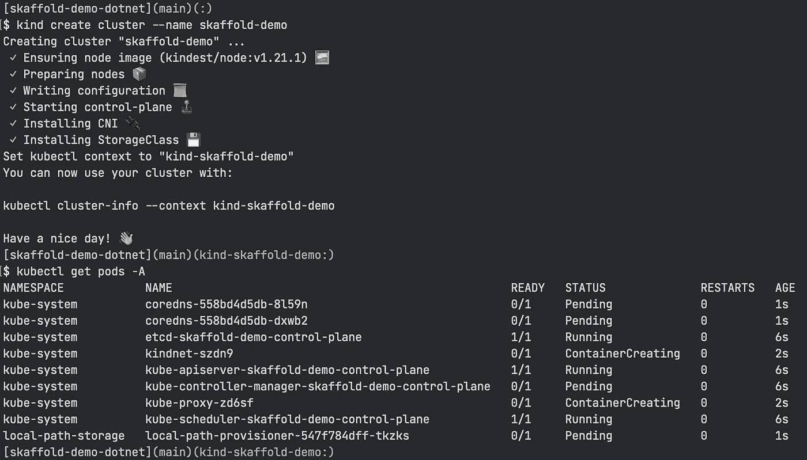

# 更快。Skaffold 的网络开发

> 原文：<https://itnext.io/faster-net-development-on-kubernetes-with-skaffold-38b1d261eed5?source=collection_archive---------1----------------------->


由[阿诺·弗朗西斯卡](https://unsplash.com/@clark_fransa?utm_source=medium&utm_medium=referral)在 [Unsplash](https://unsplash.com?utm_source=medium&utm_medium=referral) 上拍摄的照片

如果您现在正在阅读这篇文章，那么您可能已经在部署了。NET 应用程序，并寻找提高自己或团队生产率的方法。

尽管我很喜欢 Kubernetes 作为一个部署平台，但它给开发周期增加了一些摩擦。对于第一次接触基于容器的开发的开发人员来说尤其如此，但不应该是这样。理想情况下，应该有一种方法可以轻松快速地建立一个廉价的 Kubernetes 集群，并以最快的方式将我们的代码部署到该集群。

今天，我们将看到如何使用**Skaffold**来实现这一点，ska fold 是一个很好的工具，能够在任何 Kubernetes 集群中构建和部署我们的应用程序。我们将特别关注。NET 应用程序，试图在保持简单的同时尽可能减少构建时间。

# 示例 web API 项目

虽然 Kubernetes 可以托管任何类型的工作负载，但最常见的用例之一是托管公开 RESTful APIs 的服务。还有什么项目比 ASP.NET 核心的最小 API 模板更适合这个目的呢？让我们启动我们最喜欢的终端，并基于该模板创建一个新的应用程序:

```
mkdir SkaffoldDemo
cd SkaffoldDemo
dotnet new webapi -minimal -o SkaffoldDemo --no-https
```

让我们也创建一个解决方案，它很适合包含多个项目的应用程序。

```
dotnet new sln
dotnet sln add SkaffoldDemo
```

酷，我们现在有了经典的 API 示例，其中也包括 Swagger。我们现在可以为我们的应用程序编写一个合适的 docker 文件。由于**开发时间是本文**的主要关注点，**我们将对其进行优化以减少构建时间。为此，我们将:**

*   **小心地放置层，以避免每次都重新构建整个应用程序**
*   **利用 BuildKit 提供的一些缓存技巧**

**除此之外，我们想要构建两个不同的映像:一个适用于**调试**，它运行非优化代码并包含调试符号。另一个将是运行优化代码的**生产就绪**映像。**

**如果您从未听说过 BuildKit，它是一个用于构建容器映像的工具包，很像 Docker 中历史上包含的那个。BuildKit 是 Docker 构建引擎的发展，它采用了许多简洁的技术来加速构建过程。Docker 已经包含了这个新的引擎，尽管默认情况下并不使用它。要用 BuildKit 构建一个图像，只需在标准 docker 构建命令前面加上`buildx`参数，比如`docker buildx build .`。**

# **编写优化的 Dockerfile 文件**

**让我们创建 Dockerfile 文件。每个片段将在同一个文件中按顺序排列，但是为了方便起见，我们将分别讨论每个片段。**

**首先需要从 dotnet SDK 镜像说起。这个映像非常大，因为它包含了构建代码所需的一切(比如编译器)，所以我们将只使用这个映像来构建我们的应用程序，这个应用程序稍后将在一个更小的基础映像上发布。**

**然后，我们只复制解决方案/项目文件，因为这些是恢复我们的应用程序的依赖项唯一需要的文件。这并不是说这些步骤要在其他事情之前完成:BuildKit(和 Docker)将每个指令放在不同的层中。每次重建映像时，都会检查每一层的依赖关系。在这种情况下，只有当解决方案和项目文件发生更改时，restore 命令才会运行。**

**我们可以使用 BuildKit 中包含的另一个简洁的特性:我们可以让它缓存包含所有由`dotnet restore`(位于 */root/)下载的包的目录。nuget/packages* 。如果我们添加/升级一个引用，只有丢失的包会被下载，**加速构建过程**。**

**我们可以在这里定义一个基础层:**

*   **继承自 aspnet **运行时**映像(不包括编译器)，**
*   **定义调试和生产映像共享的所有公共方面。**

**一旦我们有了这个基础层，我们就可以将我们的生产应用程序构建为一个新层( *publish-release* )，然后将最后一层定义为 *release。*该层继承自*基础*层，并从*发布-发布*层复制构建工件。**

**注意，为了构建我们的应用程序，我们需要再次挂载之前添加的 NuGet 缓存层，否则编译器将找不到包(因为它们被有效地存储在缓存层中)。**

**我们可以对调试映像重复相同的过程，只需做一些调整，比如安装一些基本的调试工具，这些工具将在本文后面用到。**

**在尝试构建我们的应用程序之前，让我们创建一个`.dockerignore`文件，以避免构建文件污染我们的图像。**

```
**/bin
**/obj
```

**我们可以通过运行以下命令来测试 Dockerfile 文件:**

```
docker buildx build . --target debug -t skaffold-demo-debug

docker buildx build . --target release -t skaffold-demo-release
```

**我们已经成功地容器化了我们的应用程序，让我们将它部署到 Kubernetes 集群吧！**

# **具有种类的本地集群设置**

**不用说，要在 Kubernetes 上部署，我们需要一个集群。更好的是，它能够在您的开发机器上运行。我们可以借助 **Kind、Minikube、**等工具来实现这一点。我将使用 Kind，因为它安装起来非常快，并且只需要 Docker 启动并运行。**

**Kind 的安装方式有很多种，都是从官方[文档](https://kind.sigs.k8s.io/docs/user/quick-start/)中轻松跟随。要创建集群，只需运行以下命令:**

```
kind create cluster --name skaffold-demo
```

**这个命令将启动一个只由一个节点组成的 Kubernetes 集群。它还配置我们的。kube config 有一个新的上下文叫做 **kind-skaffold-demo** 。让我们通过运行来测试它:**

```
kubectl get pods -A
```

****

**如果一切顺利，您应该会看到一些控制面板吊舱正在启动或运行。现在我们有了一个工作集群和一个到它的连接，我们终于可以谈论 Skaffold 了。**

# **配置斯卡福德**

**要安装 Skaffold，您可以按照[官方文档](https://skaffold.dev/docs/install/)中针对您的操作系统的说明进行操作。安装完成后，我们可以继续配置它。**

**不管你喜不喜欢，Kubernetes 生态系统中的许多工具都依赖 YAML 文件进行配置，Skaffold 也不例外。skaffold.yaml 文件包含了构建和部署我们的应用程序所需的一切。在我们的例子中，运行它的最低要求是:**

**这个文件非常简单明了，除了两件事:**

*   **我们希望部署调试映像，并指定目标**
*   **我们还需要向集群部署一些 Kubernetes 资源**

**在最后一行，引用了另一个 **yaml** 文件。这个文件将包含在集群上部署应用程序所必需的 Kubernetes 资源，比如一个*部署*。将第二个文件放在哪里是一个偏好问题。我喜欢将它们与代码分开，所以我会将它们放在 **deploy** 目录中。**

**每次我们要求 Skaffold 运行我们的应用程序时，它都会:**

*   **建立我们的 docker 文件**
*   **在集群上部署映像(直接部署或部署到存储库中)**
*   **在**deploy/ska fold-demo . YAML**中创建 Kubernetes 资源**
*   **(可选)向新创建的 pod 打开端口转发**

**让我们通过运行以下命令来看看它的运行情况:**

```
skaffold dev --port-forward
```

****

**这将需要更长的时间，我们第一次运行它，因为斯卡福德将需要重建的形象。后续运行会快很多。**

**我们可以通过打开浏览器到[http://localhost:8080/swagger](http://localhost:8080/swagger)URL 来浏览我们的 API。**

**请注意，Skaffold 正在监视(Dockerfile 使用的每个文件/目录上的)更改。每次我们修改代码，斯卡福德都会在几秒钟内重建并重新启动它。在我的机器上，在对代码做了小的更改后重新部署应用程序只需要 11 秒钟，这比我以前需要至少 40 秒钟的工作流程有了很大的改进。**

**停止 Skaffold(通过按 CTRL-C)也会删除它创建的资源。为了保持部署在集群中运行，我们可以运行以下命令:**

```
skaffold run
```

**我们在这里看到的一切也适用于远程 Kubernetes 集群，但是有一个警告。在[许多本地集群](https://skaffold.dev/docs/environment/local-cluster/)上，Skaffold 能够将构建的映像直接推送到节点上。在远程集群上，这不仅不受支持，甚至是不可取的，因为这会带来安全风险。在这种情况下，我们需要将映像推送到外部映像存储库，并适当地配置部署。这本来就比较慢，因为映像将被推送到注册表中，然后由群集再次提取来运行它。**

**我希望这篇文章能够帮助您克服在 Kubernetes 上构建应用程序时遇到的一些麻烦。Skaffold 只是一种方式，但它是一种成熟的、被广泛采用的工具，可以完成工作。**

**像其他好的技术文章一样，你可以在 GitHub 上找到这个示例项目。**

**[](https://github.com/meronz/skaffold-demo-dotnet) [## GitHub-meronz/ska ffold-demo-dot net

### Kubernetes with Skaffold 的 ASP.NET API 服务开发示例。Docker 图像有两种版本…

github.com](https://github.com/meronz/skaffold-demo-dotnet) 

如果你做到了这一步，你可能会喜欢这个教程。如果你愿意，可以考虑跟着我。NET、Docker 和 Kubernetes。我会尽力分享有用的技巧和窍门！

👋🏻直到下一个！**