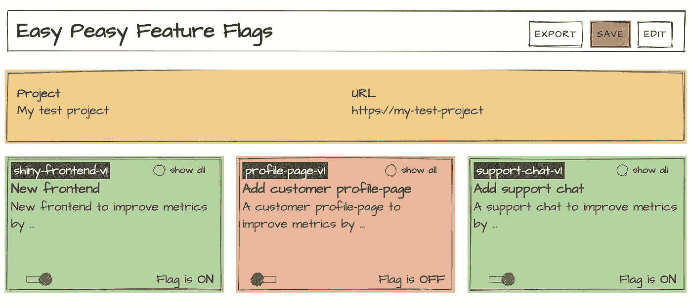
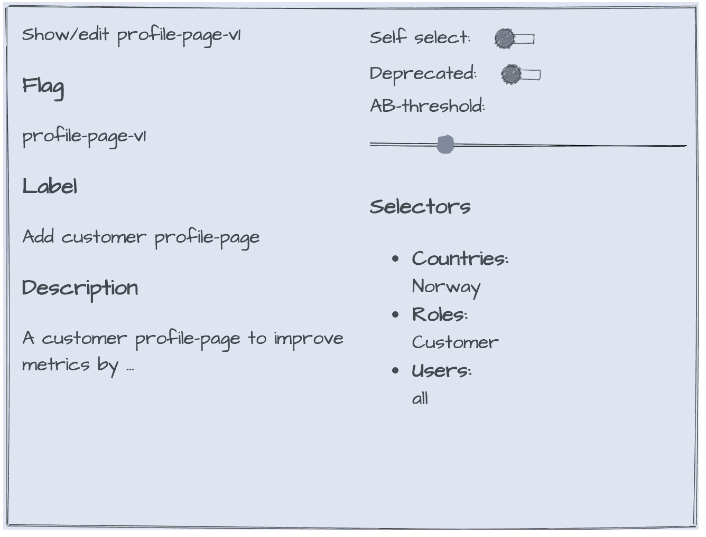

# 特性标志——使用 React 和 Mavo 的解释器和交互式演示

> 原文：<https://itnext.io/feature-flags-an-explainer-and-interactive-demo-using-react-and-mavo-5f84eed3d111?source=collection_archive---------1----------------------->



演示仪表板的屏幕截图

在这里，我将讨论特性标志的使用和一些相关的设计模式。此外，我还描述了一个演示实现，其中一个原型应用程序使用标志(React)和一个功能标志仪表板(Mavo)来管理标志。我还展示了错误处理/报告和分析是如何与特性标记一起实现的，使用了我称之为特性边界*的东西。*

马丁·福勒将特征标志[描述为“一套模式，可以帮助团队快速而安全地向用户交付新功能”。其思想是将新功能或更新的功能隐藏在功能标志之后，这些功能标志可以根据情况打开或关闭。功能标志被集成到软件中，并通过使用标志作为开关临时覆盖主要设计的控制流来工作。](https://martinfowler.com/articles/feature-toggles.html)

当沿着连续的东西轴移动时，这是一个非常有用的工具。它可以让您:

1.  经常在 flags 后面部署，而不用半生不熟的东西打扰最终用户(将部署与发布分开)，
2.  如果在发布/部署后出现了一些问题(类似于 kill switch/断路器，自动或手动关闭标志——但稍后当我讨论*功能边界*时会有更多关于这一点的内容),
3.  尝试新的特性(例如，通过使用它来进行 A/B 测试，或者通过为一个选择的测试组发布一个新的特性来提供有用的反馈)。

特性标记的灵活性和实用性来自于将它们作为软件的一部分来实现。但这显然也是反对的主要理由，因为它增加了应用程序和服务的复杂性和不稳定性风险。所以需要小心处理。你通常需要某种抽象，让你在你的软件中添加、维护和删除标志，并具有可预测性。当然，在 React 中，这意味着创建一些合适的组件，以声明的方式处理这些标志。这是在演示中完成的，我将展示如何实现。

*   带有功能标志的应用程序演示:[https://easy-peasy-features.now.sh/](https://easy-peasy-features.now.sh/)
*   功能标志仪表板演示:[https://easy-peasy-features.now.sh/features](https://easy-peasy-features.now.sh/features)
*   Github 回购:[https://github.com/kjartanm/easy-peasy-features](https://github.com/kjartanm/easy-peasy-features)

功能标志和基于管道的策略之间也有一些重叠，但我认为这真的是一件非常重要的事情，基于软件和基于管道的模式应该被视为互补的策略，使您能够以尽可能小的风险部署和发布。

# 什么是旗帜？

基本的特征标志功能类似于:

`if check('flag-x') then enable someFunctionality`

该检查通常是检查标志是否已启用，并结合用户对象上的属性与标志上的一些预设属性的匹配，以查看用户是否在标志的范围内。在演示中，一个用户对象看起来像这样:

```
{
    "userid": "user3",
    "name": "Cilla Customer, DK",
    "country": "dk",
    "role": "customer"
}
```

旗帜看起来像这样:

```
{
    "label": "Add customer profile-page",
    "flag": "profile-page-v1",
    "description": "A customer profile-page to improve metrics by ...",
    "threshold": 100,
    "self-select": false,
    "enabled": true,
    "deprecated": false,
    "expires": "2020-12-01",
    "selectors": {
        "country": [
            "all"
        ],
        "role": [
            "customer"
        ],
        "userid": [
            "all"
        ]
    }
}
```

这里的标志将是上的*，因为它已启用，并且是一个可接受的角色。这里的其他选择器更像通配符，但是您可以缩小标志的范围，将其限制在某个国家或有限的一组用户 id。标志的粒度取决于用户对象的粒度。如果您有完整的地址，您可以将该功能限制到特定的邮政编码，或者如果您有您老板的用户 id，您最终可以给他想要的闪亮的老板按钮，而不会打扰其他人！😉*

## 随机子集

除了属性选择器，该标志还有一个阈值属性，可用于选择原始选择器范围的随机子集，如 20%的挪威客户。在演示中，我只使用了一个存储在 localStorage 中的随机数，但是如果可以将 userId 视为一个数字，那么可以使用模操作符来获取这个数字(userid % 100)。“释放”使用了这种技术。



从旗帜仪表板演示。

## 标志存储和编辑

变得更复杂的是如何编辑和在哪里存储你的标志的问题。最简单的方法是将这些标志作为 JSON 捆绑到您的应用程序中，并从那里获取。另一方面，你有一些托管服务，比如 Launch Darkly、Configcat、Unleash (Unleash 也有开源版本)等等。托管服务的好处在于，它们通常带有一个仪表板 UI，允许您以一种用户友好的方式创建和管理标志。但是它们可能很贵！

这个演示/原型开始是希望探索一些中间地带，在那里你可以有一个很好的仪表板，但仍然有它集成到您的项目中。这就是为什么我使用 [Mavo](https://mavo.io/) 。Mavo 是创建可编辑前端的一个很好的工具，它提供了使用不同存储机制的可能性。其中之一是 GitHub，这意味着您可以使用 Mavo 为存储库中的 JSON 文件创建漂亮的 UI。在演示中，我使用 Mavo 为标志创建一个仪表板。然后可以将生成的 JSON 捆绑到构建中，或者作为简单的独立 API 进行部署，甚至可以作为更高级 API 的一部分。由于标志可能是潜在的隐私泄漏，因此有必要将标志检查转移到受保护的 API 中，而不是从端点提供整个 flag-JSON。

下面是编辑特性、创建上面的 ui 以及之前的 JSON-example 的标记。使用 Mavo，您可以使用 property-attribute 加上一些命名空间辅助属性来定义可编辑的属性。然后在保存时序列化为 JSON(也可能是其他格式)。下面是一个标记的例子。wired-prefix 来自 [*wiredjs*](https://wiredjs.com/) ，一组创建粗略感觉和外观的 ui 组件:

```
<wired-card class="card--main">
    <div class="card feature-details">
        <div class="feature-summary">
            <div>Show/edit [flag]</div>
            <h3>Flag</h3>
            <div property="flag" class="card-property-editor"></div>
            <h3>Label</h3>
            <div property="label" class="card-property-editor"></div>
            <h3>Description</h3>
            <div property="description"></div>
        </div>
        <div class="feature-editor">
            <div>
                <label>Self select:</label>
                <wired-toggle onchange="this.setAttribute('aria-checked', this.checked)" mv-mode="edit"
                    property="self-select" class="mv-editor" mv-attribute="aria-checked"></wired-toggle>
            </div>
            <div>
                <label>Deprecated:</label>
                <wired-toggle onchange="this.setAttribute('aria-checked', this.checked)" mv-mode="edit"
                    property="deprecated" class="mv-editor" mv-attribute="aria-checked"></wired-toggle>
            </div>
            <div>
                <label>AB-threshold:</label>
                <wired-slider class="feature-threshold" onclick="this.wiredRender(true)"
                    onchange="this.render();this.setAttribute('aria-valuenow', this.value)"
                    knobradius="12" mv-attribute="aria-valuenow" property="threshold"
                    aria-valuenow="100"></wired-slider>
            </div>
            <h3>Selectors</h3>
            <ul property="selectors">
                <li>
                    <label class="card-label">Countries:</label><br>
                    <span class="selector" property="country" mv-multiple mv-edit="#countries"></span>
                </li>
                <li>
                    <label class="card-label">Roles:</label><br>
                    <span class="selector" property="role" mv-multiple mv-edit="#roles"></span>
                </li>
                <li>
                    <label class="card-label">Users:</label><br>
                    <span class="selector" property="userid" mv-multiple></span>
                </li>
            </ul>
        </div>
    </div>
</wired-card>
```

> **NB！**在演示中，我使用 localStorage 作为存储机制，而不是 GitHub，因为它让我创建了一种沙箱，您可以在浏览器的隐私中测试仪表板和演示应用程序。当您在仪表板中修改标记时，应用程序会立即更新(如果它在另一个选项卡中打开)，因为它正在侦听 localStorage-updates。这是由标志上下文处理的，因此更改它不会影响其余的组件。

# 标志防护、标志开关和自我选择

在演示/原型中，我实现了三种与旗帜相关的设计模式:

*   国旗护卫队
*   标志开关
*   标志自选

*标志守卫*是简单的构造，只是隐藏了功能。在演示实现中，可以用以下方式在 React 中表示标志保护:

```
<FlagGuard flag="support-chat-v1">
    <ChatButton />
</FlagGuard>
```

在这种情况下，如果用户不在 **support-chat-v1** 标志的范围内，标志保护会隐藏聊天按钮。演示的保护实现非常简单:

```
export const FlagGuard = ({ flag, children }) => {
    const { checkFlag, user, timeStamp } = useContext(FlagContext);
    const [hasError, setHasError] = useState(false);
    const checkedFlag = useMemo(() => checkFlag(flag, user, timeStamp), [flag, user, timeStamp, checkFlag]);
    if (checkedFlag && checkedFlag.value && !hasError) {
        return <FeatureBoundary setHasError={setHasError} flag={flag}>{children}</FeatureBoundary>;
    } else {
        return <NoAccess flag={flag} status={checkedFlag.status}/>
    }
}
```

通用标志功能可从 *FlagContext* 中获得。如果用户在范围内，它就呈现出 *FeatureBoundary* 内的孩子，如果不在，它就呈现一些隐藏的注释。

*标志开关*是 if-else-construction，可在替换现有功能、A/B-experiments 或其他用户不在标志范围内时需要显示其他内容的用例中使用。在演示实现中，它看起来像这样:

```
<FlagSwitch flag="profile-page-v1">
    <FlagSwitch.On>
        <Link to="/profile"><UserIcon /><b>Profile</b></Link>
    </FlagSwitch.On>
    <FlagSwitch.Off>
        <UserIcon />
    </FlagSwitch.Off>
</FlagSwitch>
```

在这种情况下，如果用户在 **profile-page-v1** 标志的范围内，则标志会创建一个到个人资料页面的链接。然后，可以在 React 路由器设置中使用类似的标志开关进行补充:

```
<FlagSwitch.On>
    <Switch>
        <Route path="/" exact >
            <PseudoPage pageTitle="Landing" />
        </Route>
        <Route path="/about" >
            <PseudoPage pageTitle="About" />
        </Route>
        <Route path="/shop" >
            <PseudoPage pageTitle="Shopping" />
        </Route>
        <Route path="/profile" >
            <PseudoPage pageTitle="Profile" />
        </Route>
        <Route>
            <PseudoPage pageTitle="404!!" />
        </Route>
    </Switch>
</FlagSwitch.On>
<FlagSwitch.Off>
    <Switch>
        <Route path="/" exact >
            <PseudoPage pageTitle="Landing" />
        </Route>
        <Route path="/about" >
            <PseudoPage pageTitle="About" />
        </Route>
        <Route path="/shop" >
            <PseudoPage pageTitle="Shopping" />
        </Route>
        <Route>
            <PseudoPage pageTitle="404!!" />
        </Route>
    </Switch>
</FlagSwitch.Off>
```

效果是，如果您在配置文件范围内的用户(最初是 Cilla 客户)和配置文件范围外的用户(最初是所有其他用户)之间切换，您将看到“/profile”上的页面在配置文件页面和 404 页面之间切换。

演示实现基于复合组件模式，即上下文 API 版本([https://kentcdodds . com/blog/compound-components-with-react-hooks](https://kentcdodds.com/blog/compound-components-with-react-hooks))。除此之外，它非常类似于 FlagGuard 实现:

```
const FlagSwitchContext = createContext();const FlagSwitch = ({ flag, children }) => {
    const [hasError, setHasError] = useState(false);
    const { checkFlag, user, timeStamp } = useContext(FlagContext);
    const checkedFlag = useMemo(() => checkFlag(flag, user, timeStamp), [flag, user, timeStamp, checkFlag]);
    return (<FlagSwitchContext.Provider value={{ flag, status: checkedFlag.status, on: checkedFlag.value, hasError, setHasError }}>{children}</FlagSwitchContext.Provider>);
}function On({ children }) {
    const { on, flag, status, hasError, setHasError } = useContext(FlagSwitchContext);
    return (on && !hasError) ? <FeatureBoundary flag={flag} setHasError={setHasError} switchState="On">{children}</FeatureBoundary> : <NoAccess flag={flag} status={status} switchState="On" />;
}function Off({ children }) {
    const { on, flag, status, hasError, setHasError } = useContext(FlagSwitchContext)
    return (on && !hasError) ? <NoAccess flag={flag} status={status} switchState="Off" /> : <FeatureBoundary setHasError={setHasError} flag={flag} switchState="Off">{children}</FeatureBoundary>;
}FlagSwitch.On = On;
FlagSwitch.Off = Off;export { FlagSwitch };
```


*标志自选*是你可以自选测试新功能的用例。我还没有在其他地方的功能标志上下文中看到过这种情况。这通常是基于管道的策略，而不是基于标志的策略。但我认为它也应该是特性标志工具箱的一部分，因为在对应用程序的模块和部分进行实验时，完全可以使用这种模式——而不仅仅是在重写整个程序时。

自我选择给出了一个有偏差的用户样本，但有时这实际上非常有用。自我选择的群体可能主要是[创新者/早期采用者](https://en.wikipedia.org/wiki/Early_adopter)——和/或对当前功能不满意的用户。如果这个团队给出了负面的反馈，你可能就应该终止这个特性——至少在它当前的实现中，然后重新开始。

如果用户在该标志的范围内并且该标志被标记为 self-self-self-select，则通过显示切换来工作:

```
<FlagToggle flag="shiny-frontend-v1" label="Try my shiny new look and feel!" />
```

实现方式如下:

```
export const FlagToggle = ({ flag, label }) => {
    const { checkFlag, userSettings, setUserSettings, user, timeStamp } = useContext(FlagContext);
    const checkedFlag = useMemo(() => checkFlag(flag, user, timeStamp), [flag, user, timeStamp, checkFlag]);
    const [isSelected] = useState(userSettings[flag] && userSettings[flag].isSelected)
    const handleChange = useCallback(() => {
        const isSelected = !(userSettings[flag] && userSettings[flag].isSelected)
        const currentFlagSetting = userSettings[flag] ? userSettings[flag] : {};
        const newFlagSetting = { ...currentFlagSetting, isSelected };
        setUserSettings({ ...userSettings, [flag]: newFlagSetting });
    }, [flag, userSettings, setUserSettings])if (checkedFlag.isSelfSelect) {
        return (
            <div className="toggle-container">
                <input className="toggle-check" id="toggle" type="checkbox" onChange={handleChange} checked={isSelected}></input>
                <label className="toggle-label" htmlFor="toggle">{label}</label>
            </div>
        );
    } else {
        return (
            <NoAccess flag={flag} status={checkedFlag.status}></NoAccess>
        )
    }
}
```

即使用户在标志范围内，在用户自行选择标志之前，标志保护或标志开关中的标志检查也不会返回 true:

```
ReactDOM.render(
    <FlagProvider>
        <BrowserRouter>
            <FlagSwitch flag="shiny-frontend-v1">
                <FlagSwitch.On>
                    <App version="shiny"/>
                </FlagSwitch.On>
                <FlagSwitch.Off>
                    <App version="tired"/>
                </FlagSwitch.Off>
            </FlagSwitch>
        </BrowserRouter>
    </FlagProvider>, 
    document.getElementById('root'));
```

在演示中，效果是模拟两个版本的应用程序。您可以通过选择 shiny-frontend 范围内的用户(最初是 Ada Admin 和 Cilla Customer)来测试这一点。首先切换显示，然后您可以通过切换 self-select 来自启用 **shiny-frontend-v1** 。self-select toggle 也可以用于从用户那里获得再次关闭它的反馈，但这在演示/原型中没有实现。

# 累积范围

在演示/原型中，标志检查:

1.  首先检查标志是否启用，
2.  然后将属性与用户对象进行匹配，
3.  然后对照随机化的用户属性检查阈值，
4.  最后，它检查该标志是否被标记为自选择，如果是这样选择的。

这产生了一种累积效应，使您能够为那些在您的系统中某个组的随机 x%中进行自我选择的人开放该特性。这意味着你既可以做很小的实验，也可以做很大的实验，尤其是不同类型的实验，而且风险尽可能小。添加一个*特征边界*将进一步降低风险并有助于实验。

# 功能边界:错误处理，带标志的报告和分析

如果新特性中有一个 bug，比如说导致脚本执行崩溃的那种错误，应该如何处理？React 有一个叫做[错误边界](https://reactjs.org/docs/error-boundaries.html)的东西。错误边界是一个 React 组件(它需要一个类组件),用于实现某些生命周期方法。它创建了一种声明性的 try/catch，您可以使用它来封装 React 模块，并阻止该模块中的错误破坏整个应用程序的执行。在演示中，我将它实现为一个*特征边界*，我用它来包装一个有效标志的子标志。

```
export class FeatureBoundary extends React.Component { constructor(props) {
        super(props);
        this.state = { hasError: false };
    } static getDerivedStateFromError(error) {
        return { hasError: true };
    } componentDidCatch(error, errorInfo) {
        if (this.props.setHasError) {
            this.props.setHasError.call(null, true);
        } console.log(`This is error reporting for '${this.props.flag}': ${error}`);
    } doAnalytics = (msg) => {
        console.log(`This is analytics for '${this.props.flag}': ${msg}`);
    } render() {
        if (this.state.hasError) {
            return (<NoAccess flag={this.props.flag} status="error-caught-by-boundary" />);
        }
        return (<AnalyticsContext.Provider value={{ doAnalytics: this.doAnalytics }}>{this.props.children}</AnalyticsContext.Provider>);
    }
}
```

重复一遍，这是它在旗杆上的用法。如果该标志打开，则在要素边界内渲染子要素:

```
export const FlagGuard = ({ flag, children }) => {
    const { checkFlag, user, timeStamp } = useContext(FlagContext);
    const [hasError, setHasError] = useState(false);
    const checkedFlag = useMemo(() => checkFlag(flag, user, timeStamp), [flag, user, timeStamp, checkFlag]);
    if (checkedFlag && checkedFlag.value && !hasError) {
        return <FeatureBoundary setHasError={setHasError} flag={flag}>{children}</FeatureBoundary>;
    } else {
        return <NoAccess flag={flag} status={checkedFlag.status}/>
    }
}
```

特征边界有三个用途:

1.  它充当一种[断路器](https://martinfowler.com/bliki/CircuitBreaker.html)。如果特性中的某个地方有触发错误，它就关闭它。*因此，对最终用户的影响将与禁用标记的影响相同*。
2.  但是您仍然可以将错误报告给服务，比如 sentry.io，将 flag-id 附加到报告/上下文中。因此，如果通知在部署后突然出现，您将立即看到这是否是因为新功能——希望在任何最终用户注意到任何事情之前，您的支持系统不会受到影响😬。然后，您可以在修复时禁用该功能(在从报告中获得足够有用的数据之后)。然后以前滚的方式重新部署修复，小心地再次启用该标志。
3.  特征边界也可以作为分析的定位点。在演示中，它设置了一个带有必要标志信息的*分析提供者*，功能模块中的子组件可以使用这些标志信息来发送相关数据。这在 A/B 场景或类似的实验中应该很有用:

```
export const ShinyButton = () => {
    const { doAnalytics } = useContext(AnalyticsContext);
    const pressMyButton = () => {
        doAnalytics("add 1 for 'press my shiny button'")
    }
    return (<button className="btn--shiny-very" onClick={pressMyButton}>PRESS MY SHINY BUTTON</button>);
}
```

# 其他问题

演示/原型中有一些细节。功能标志的一个问题是它们是有时间限制的。当然，Fowler 提到了“权限切换”，使用标志(或者他称之为切换)来实现一个更持久的权限系统。我非常理解为什么。以这种方式将许可系统移动到它自己的层，当然有一些好处。并且使用 React 将权限转移到声明性组件中给出了一个非常好的关注点分离。但我仍然认为，它不应该是你用于试验，部分推出等相同的系统。在功能、设计模式、属性方面有明显的重叠，但也有一些显著的差异。因此，虽然有一些重叠，我将持有功能标记范围之外的权限切换。

所以，在我看来，旗帜是不会长久的。它们过期了，需要从代码中重构出来。这就是我在标志上添加“过期日期”和“不推荐使用”属性的原因。“过期日期”背后的想法是，旗帜可以在特定时间自动关闭，而无需有人在场来关闭它。或许还应该有一个补充的“开始日期”。总之，这意味着你可以使用标志卫士来为你的应用程序添加限时功能。可以独立于发布日期/周期安排的特性。在这种时候，这是一件好事，冠状病毒和一切。

标志中的 deprecated-属性可能是一种方式，表示是时候从代码中移除该标志了。结合环境变量，您可以让它在开发中抛出一个错误，并在生产中报告一个警告。这给了你一个主动淘汰标志的方法。首先你可以让它过期，然后你弃用它，然后你删除它。通过适当的日志记录/报告，应该有足够的时间和机会从代码中移除标志。