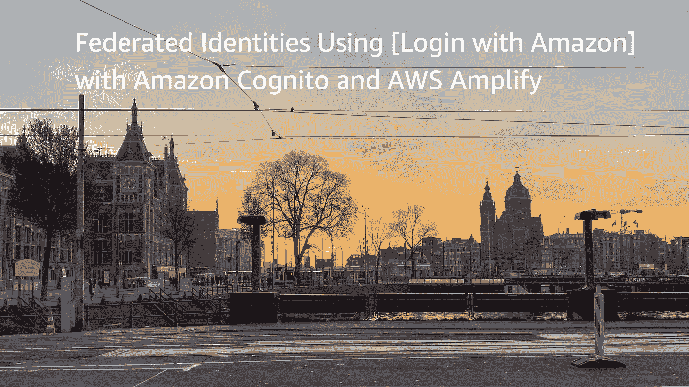
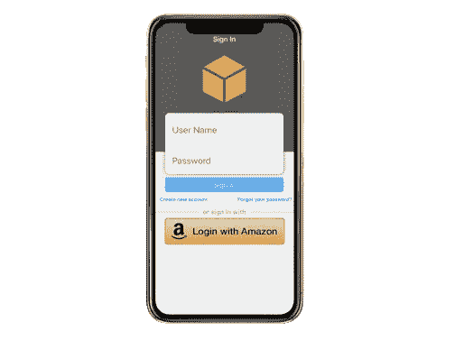
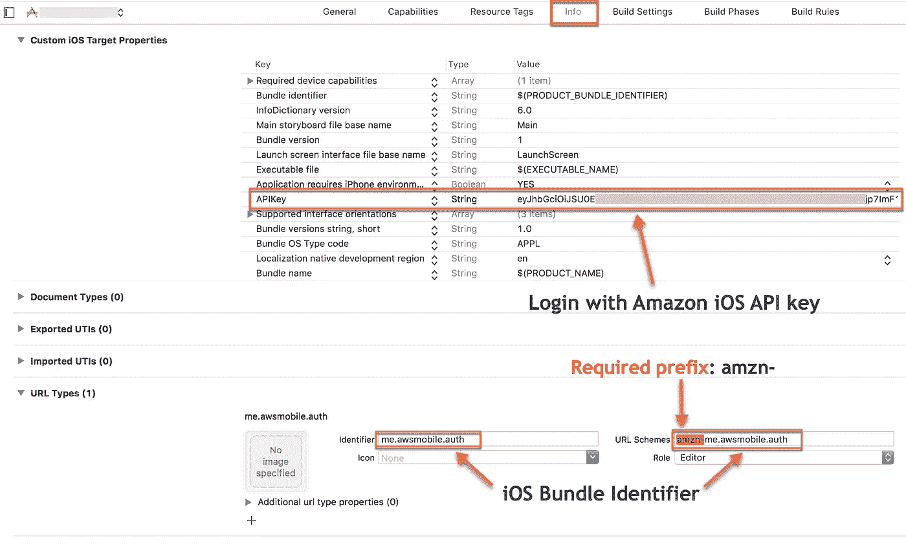
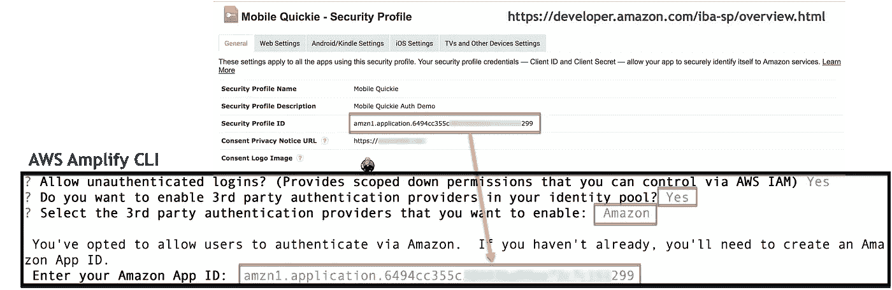

# 使用 Amazon 登录作为 iOS 的身份提供商

> 原文：<https://itnext.io/federated-identities-using-login-with-amazon-with-amazon-cognito-and-aws-amplify-bfb7dfb7e185?source=collection_archive---------1----------------------->



本文是将亚马逊 (LWA)的[登录添加到 iOS Swift 应用程序的第 2 部分，并继续为 iOS 开发人员提供认证跟踪，我们在其中介绍了](https://developer.amazon.com/login-with-amazon)[基本认证](/basic-authentication-for-ios-using-aws-amplify-and-amazon-cognito-233b943222d4)、[脸书登录](/facebook-login-using-aws-amplify-and-amazon-cognito-4acf74875a04)和[谷歌登录](/google-sign-in-using-aws-amplify-and-amazon-cognito-69cc3bf219ad)。在关于添加 Amazon 登录的第 2 部分系列的第 1 部分[中，我们配置了一个 Amazon 开发人员项目，克隆了一个入门 iOS 应用程序，使用我们的 Amazon APIKey 更新了该应用程序，并修改了 URL 方案，允许您的移动用户使用他们的 Amazon 凭据进行身份验证。我强烈建议查看第 1 部分的文章](/add-login-with-amazon-to-your-ios-swift-app-d1b07655d31a),为登录亚马逊做好准备，并在继续之前集成 LWA 图书馆。

在本文中，我们将通过云构建第 1 部分中的解决方案，使我们的 iOS 应用程序能够使用 Amplify CLI 与 Amazon Cognito 集成，从而将登录与 Amazon 身份联合起来。我们将使用 Amazon Cognito 身份池(联合身份)为您的每个 LWA 认证用户分配一个唯一的 Id，并授予这些用户临时 AWS 凭据(访问密钥和密码)以从您的 iOS 应用程序调用您的后端 AWS 资源。我们不需要 Amazon 用户池来做这件事，但是如果需要的话，以后添加它也不会有什么坏处。

**每个 AWS 请求都必须签名**

作为使用 AWS 后端的开发人员，所有访问您的 AWS 资源的请求都必须使用 AWS 凭证进行签名。Cognito Identity Pool 通过管理用户的唯一 Id 和授予对您的资源的访问权限来执行所有繁重的工作，因此您不必在应用程序中嵌入自己的开发人员 AWS 凭据。

**我们为什么要用亚马逊 Cognito？**

大规模的安全性和细粒度访问是我们使用 [Amazon Cognito 身份池(联合身份)](https://docs.aws.amazon.com/cognito/latest/developerguide/identity-pools.html)和 Amazon 登录来为每个经过身份验证的用户提供临时 AWS 凭证的原因。身份池处理两种类型的用户，未经身份验证的用户和经过身份验证的用户。未经认证的用户是指没有使用任何基本认证(用户名&密码)进行认证、没有登录 Amazon 或任何社交登录提供商的用户。这些用户承担 IAM 未经身份验证的角色。对于经过身份验证的用户(那些已经通过 Amazon 或其他 OpenID 提供者的登录进行了身份验证的用户)，身份池还将分配一个唯一的 ID 和临时 AWS 凭据，但是这些用户承担经过身份验证的 IAM 角色。作为开发人员，您决定授予这两个角色的权限。

在我之前的[谷歌登录](/google-sign-in-using-aws-amplify-and-amazon-cognito-69cc3bf219ad)、[脸书登录](/facebook-login-using-aws-amplify-and-amazon-cognito-4acf74875a04)和[登录亚马逊](/add-login-with-amazon-to-your-ios-swift-app-d1b07655d31a)集成文章中，用户只需选择*登录谷歌*、*继续脸书，或登录亚马逊*按钮，并分别使用他们的谷歌、脸书或亚马逊凭证进行身份验证，同时保持在您的应用程序流内。*登录亚马逊*从用户角度来看也是同样的交互。一旦用户通过身份验证，作为开发人员的您将收到一个令牌形式的信息，我们将使用该令牌并将其传递给 Amazon Cognito 进行验证。



# 使用亚马逊登录准备 iOS 应用程序

在本系列的第 1 部分中，我在 Github 上演示了如何将 LWA 集成到一个示例应用程序中。对于本文，让我们从同一个示例应用程序开始。

1.  从现有的**登录亚马逊(LWA)** 集成的 iOS 应用程序开始。该应用程序只有基本的 LWA 框架和一个小型代理类。从从 Github 克隆[示例应用开始。这个应用程序具有登录和注销亚马逊的全部功能。](https://github.com/mobilequickie/LoginWithAmazoniOSSwift)

```
$ git clone [https://github.com/mobilequickie/LoginWithAmazoniOSSwift.git](https://github.com/mobilequickie/LoginWithAmazoniOSSwift.git)
```

2.更新 Xcode 项目中的包标识符，以匹配您在安全配置文件中提供给 Amazon 的包标识符。例如 *com.domain.appname*

3.从亚马逊开发者门户[这里](https://developer.amazon.com/iba-sp/overview.html)获取你的亚马逊安全配置文件 **iOS API 密钥**，然后选择你的安全配置文件，选择 iOS 设置选项卡，然后点击 API 密钥栏下的**显示**。复制 API 键(它是 LOONG)并将键的值粘贴到 Info.plist 中的 **APIKey** 值中，如下所示。


您的 Amazon 安全配置文件中的 iOS API 密钥

4.更新 URL 方案以匹配您的包标识符。不要忘记在您的包标识符之前留下 **amzn-** 前缀。

例如***amzn-****com . domain . appname*



5.构建和启动应用程序，并通过认证流程，以确保它的工作。当禁用了使用 Amazon UI 登录按钮并启用了注销链接时，您就会知道它是有效的。

## 使用 Amplify CLI 初始化云后端以登录 Amazon

在初始化我们的后端之前，我们将使用 AWS Amplify CLI，它是 [AWS Amplify 工具链](https://aws-amplify.github.io/media/toolchain?utm_source=da&utm_medium=blog&utm_campaign=denhills&utm_term=ios_native)的一部分。如果您之前没有安装 AWS Amplify CLI，这里有一个快捷方式。*放大配置*仅当您尚未安装或配置 AWS unified CLI 时才需要。如果您安装了 AWS CLI，Amplify CLI 将利用这些凭据。

```
$ npm install -g @aws-amplify/cli
$ amplify configure
```

这是一次性安装。查看[入门教程](https://aws-amplify.github.io/media/get_started?utm_source=da&utm_medium=blog&utm_campaign=denhills&utm_term=iOS_native)了解更多细节。

## 将授权类别添加到您的 iOS 应用程序

在 iOS 项目文件夹的根目录下启动 Mac 终端。现在，我们将使用下面的 Amplify 命令初始化我们的 AWS 后端项目。

```
$ amplify init
```

将指导您完成设置项目的过程。**确保在适当的时候选择 iOS**。

接下来，让我们使用 Amplify auth 类别将 authenticated 添加到我们的移动项目中。我们将遵循 AWS iOS SDK 文档中的[联合身份](https://aws-amplify.github.io/docs/ios/authentication)选项中概述的相同流程。

在终端窗口中，导航到 iOS 项目的根目录，并将 auth 类别添加到您的应用程序中。CLI 会提示您输入配置参数。

```
$ amplify add auth❯ Manual Configuration
❯ User Sign-Up, Sign-In, connected with AWS IAM controls...
❯ Friendly name: **<ANY-NAME>**
❯ Identity Pool name: **<ANY-IDENTITY-POOL-NAME>**
❯ Allow unauthenticated logins? **Yes** ❯ Do you want to enable 3rd party authentication...? **Yes** ❯ Select the third party identity...**Amazon** ❯ Enter your Amazon App ID: **<YOUR-SECURITY-PROFILE-ID>**
```

> 注意:点击[此处](https://developer.amazon.com/lwa/sp/overview.html)，选择您在[第一部分](/add-login-with-amazon-to-your-ios-swift-app-d1b07655d31a)创建的安全配置文件，复制**安全配置文件 ID** ，如图所示，即可找到亚马逊应用 ID。在这种情况下，是的，安全配置文件 ID 是您的 Amazon 应用程序 ID，用于 Amazon Cognito 身份池集成。



将本地配置更改推送到您的 AWS 帐户

```
$ amplify push
```

我们现在有了与 Amazon Cognito 联合身份集成的 Amazon 登录。

**设置 AWS Mobile SDK 依赖项(Cocoapods)**

在这个例子中，我将使用 Cocoapods 进行依赖管理，因为这是目前推荐的将 AWS SDK 集成到 iOS 项目中的方法。更多关于[椰子的信息](https://cocoapods.org/)。一旦你安装了 Cocoapods，按照这个设置。

```
$ pod init
```

在由“pod init”创建的 *Podfile 中，*将 AWSMobileClient 依赖项添加到该文件，如下所示。

```
pod 'AWSMobileClient', '~> 2.9.0'
```

将 SDK 库引入您的项目:

```
$ pod install --repo-update
```

**将 awsconfiguration.json 文件集成到您的 iOS 项目中**

当使用 AWS Amplify CLI 提供后端资源时，它会在 iOS Xcode 项目的根目录中生成一个名为 *awsconfiguration.json* 的文件。该文件包含可通过应用程序访问的资源的描述，并在 Amplify 工具链添加、更新或删除资源时与项目同步。这种配置文件的自动更新是使用 Amplify CLI 从您的本地移动开发环境中提供 AWS 资源的巨大好处之一。

*您只需要将 awsconfiguration.json 文件添加到 Xcode 项目中一次。您可以通过将它拖到 Xcode 项目管理器中的 Finder 来完成此操作。*

如果要复制文件，系统会提示您。**取消选择复制项目框**。当情况发生变化时，AWS Amplify CLI 会更新该文件。如果您选中目标框，那么您的项目在被复制时可能不会收到更新。如果取消选中该框，则每当您通过 Amplify CLI 修改项目资源时，该文件都会更新。

**初始化视图控制器中的 AWSMobileClient**

`AWSMobileClient`通过管理与认证相关任务的应用程序会话，为开发人员提供客户端 API 和构建块。当您克隆示例 LWA 应用程序时，LoginViewController 拥有您的应用程序和 Amazon 登录之间的授权流的所有必要代码。

下面是对 ViewController 进行的四项更改，以集成 AWSMobileClient 并联合 LWA 身份提供者和 Cognito 联邦身份。

*#1 —第 13 行*新增*进口押汇*

*#2 —第 23 行*从 *viewDidLoad()* 中调用*initializeAWSMobileClient()*函数

*#3 —第 27–49 行*是 AWSMobileClient 初始化函数*initializeAWSMobileClient()*

*#4 —第 88–111 行* AWSMobileClient 从 Amazon 的登录中获取提供者令牌，并将其传递给 Cognito 联合身份池以检索唯一的 Id。

[https://gist . github . com/mobile quickie/47a 238 e 073043 a 271425 f 7 FFE 9d 56d 5 e](https://gist.github.com/mobilequickie/47a238e073043a271425f7ffe9d56d5e)

我们已经完成了 iOS 代码的更新。让我们运行应用程序并登录亚马逊。:)

注意:使用 Amazon 作为联合登录提供者的登录完全集成到 SDK 中，但不是 AWS SDK for iOS 提供的插件 auth UI 的一部分。插件身份验证 UI 本身支持基本身份验证(通过 Cognito 用户池)、脸书登录和谷歌登录。

## 最后的想法

现在，我们已经通过登录亚马逊(LWA)验证了我们的用户，并将 LWA 与亚马逊 Cognito 集成，为我们的移动用户提供临时、有限的 AWS 凭据来调用我们的 AWS 资源。通过保护您的资源和存储在您的资源上的用户数据的隐私，您的应用现在更加安全，并且您的应用可以扩展到数百万用户！

拥有超过 2 亿个亚马逊帐户，使用亚马逊登录是为您的用户提供的另一个伟大的第三方登录提供商。请记住，第三方登录提供商集成对开发人员的最大好处是能够收集用户信息，例如来自 LWA 的用户资料，其中提供了用户的全名、电子邮件地址和邮政编码。从用户的角度来看，另一个好处是他们不需要记住另一个用户名/密码。

试试用亚马逊登录，让我知道效果如何。