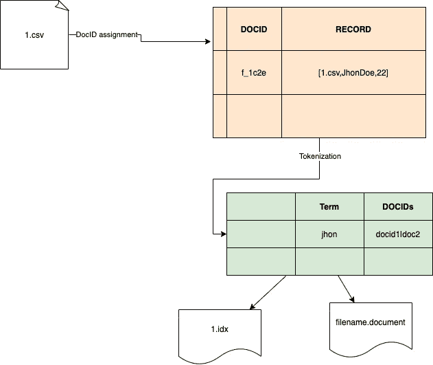
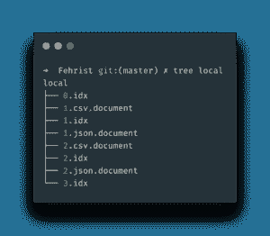
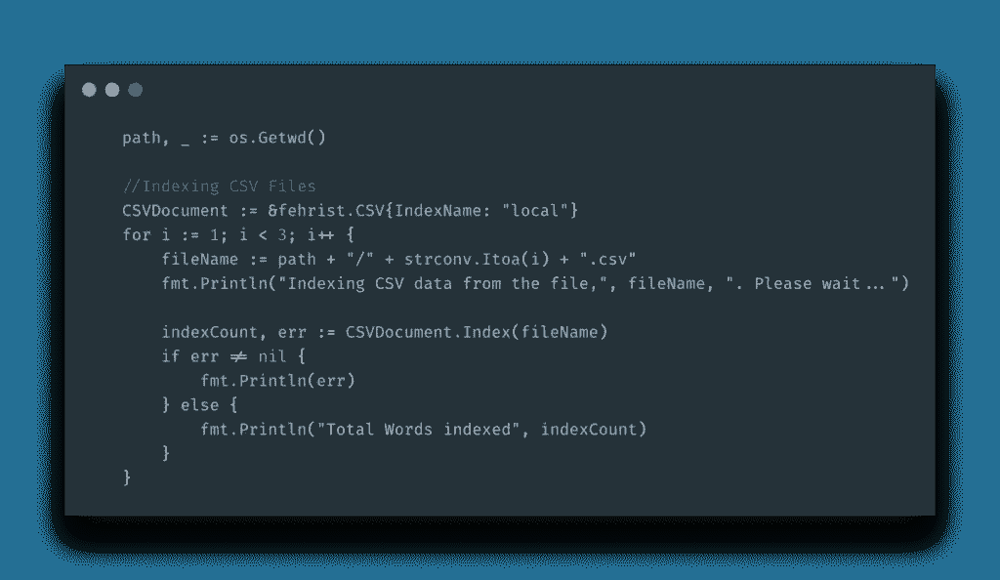
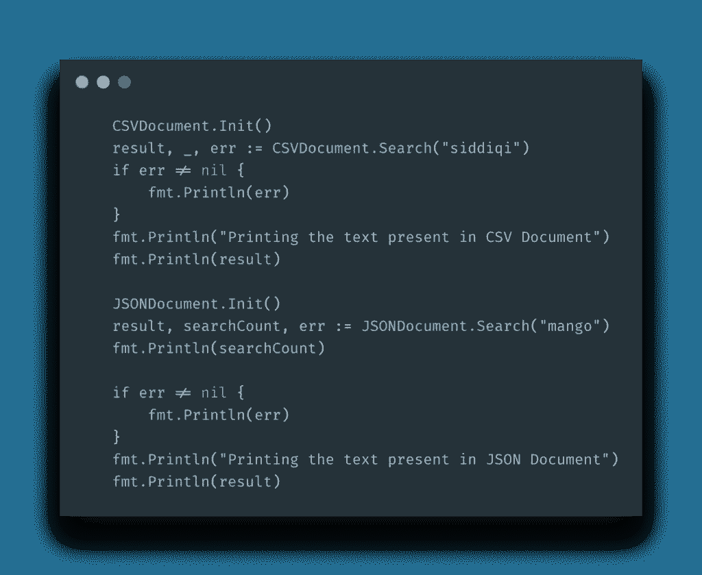
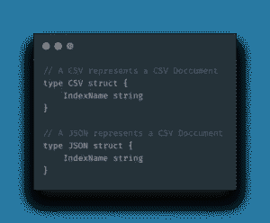

# fehrist—Go 中的文档索引库

> 原文：<https://itnext.io/fehrist-document-indexing-library-in-go-2516862456ad?source=collection_archive---------2----------------------->

今天我向你们展示我用 Go 语言制作的另一个库，叫做， **Fehrist**

来自 [Github 自述文件](https://github.com/kadnan/Fehrist):

> Fehrist *是一个纯粹的 Go 库，用于索引不同类型的文档。目前，它只支持 CSV 和 JSON，但灵活的架构让您可以自由添加更多的文档。Fehrist(فہرست)是乌尔都语的* ***索引*** *的意思。Arabic(فھرس)和 Farsi(فہرست)也使用类似的术语。*

*Fehrist* 基于用于索引目的的**倒排索引**数据结构。

# 我为什么会成功？

看起来我在 Python 之后爱上了 Golang。Go 是一种固执己见的语言，不会让你在各种小决策上分心。制作这个特殊库的原因仅仅是为了学习索引；它是如何工作的，有哪些算法可用。我选择了 [*倒排索引*](https://en.wikipedia.org/wiki/Inverted_index) 是因为它的灵活性，并且比其他的像 B+树更容易实现。我还从 ElasticSearch 获得了在磁盘上编写和排列索引文件的灵感。

# 它是如何工作的？

正如我提到的，它是基于一个倒排索引。在为每个记录分配一个 DOCID 的第一阶段之后，所有文件，无论其类型如何，都将被标记化。在 CSV、JSON 或 XML 文件的情况下，*记录*是一个单独的条目。在分配 DOCID 之后，它被标记化，其中文件中的每个术语被映射到相应的 DOCID 和文件名。然后，可以通过提供关键字来搜索成功的索引文档。搜索结果的输出是一个 JSON 结构。Golang `maps`数据结构用于中间数据处理和搜索。下图可能有助于您理解整个索引过程。

在第一步中，CSV 文件被提供给系统，然后按记录方式进行分割，并用 DOCID 进行映射。在第二步中，每条记录都被标记到每个术语中，并与出现次数进行映射。例如，在文档 *1.csv* 和 *2.csv* 中找到了 *Jhon* ，它将创建一个管道分隔的结构，然后将该结构分配为`map`的一个单独的条目，对应于其相应的键。如上图所示， *john* 出现在 docid**docid 1**和 **docid2 中。**围棋`maps`已被用于此目的。

最后，数据被保存到磁盘中。我从 ElasticSearch 那里窃取了磁盘数据管理的想法:

如上图所示，每个索引文件都保存为`.idx`文件。首先，它创建了一个以您提供的名称命名的文件夹。然后所有相关文件都存储在里面(*感谢 ElasticSearch 给了我这个想法*)。您还会看到扩展名为`.document`的文件，这实际上是最初的条目及其 DOCIds。然后，在[消息包](https://msgpack.org/index.html)的帮助下，所有数据被序列化。下面是索引 CSV 文件的代码。

该库是灵活的。由于 Go 提供的多态性，您可以通过实现一些方法非常容易地扩展这个库。

这样搜索就很容易了:

`Search`方法将索引名作为参数，因为创建了一个同名的文件夹，所有文件都存储在其中。`Init()`方法用于从`maps`中的文件和索引中提取所有数据。

正如我所说，这是一个灵活的库。你只需要添加你自己的文档类型`struct`，就像我为 JSON 和 CSV 做的那样。

# 结论

我希望你喜欢这篇文章，并在你的下一个项目中使用这个库。有几件事，它不包括像全面搜索。也不适用于*词干*和*停用词*。目前，它根据找到的确切关键字返回数据。你可以通过分叉来增强它。你可以从 [Github](https://github.com/kadnan/Fehrist) 下载这个库。

*mak sym Kaharlytskyi 在 Unsplash 上的标题照片*

*原载于 2020 年 6 月 7 日*[*http://blog . adnansiddiqi . me*](http://blog.adnansiddiqi.me/fehrist-document-indexing-library-in-go/)*。*