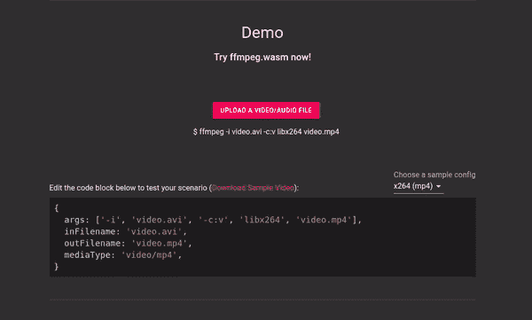

# FFmpeg.wasm，FFmpeg 的纯 WebAssembly / Javascript 端口

> 原文：<https://itnext.io/ffmpeg-wasm-a-pure-webassembly-javascript-port-of-ffmpeg-f13de6402452?source=collection_archive---------0----------------------->


官方网站:[https://ffmpegwasm.github.io/](https://ffmpegwasm.github.io/)

当谈到视频/音频处理时，ffmpeg 是一个著名的框架/工具，现在有了 ffmpeg.wasm，你可以在浏览器中使用 FFmpeg，而无需安装或将文件上传到服务器。虽然 ffmpeg.wasm 没有 ffmpeg 快，但对于某些用例来说，它可能会派上用场。

在这篇文章中，我想分享如何安装和使用 ffmpeg.wasm，以及支持你使用的技术细节。

# 安装 ffmpeg.wasm

要安装和使用 ffmpeg.wasm，只需要使用 npm/yarn:

```
$ npm install @ffmepg/ffmpeg
# or
$ yarn add @ffmpeg/ffmpeg
```

要在节点环境下使用 ffmpeg.wasm，还需要安装`@ffmpeg/core`。

```
$ npm install @ffmepg/core
# or
$ yarn add @ffmpeg/core
```

或者你可以使用 CDN

```
<script src='https://unpkg.com/@ffmpeg/ffmpeg@0.9.3/dist/ffmpeg.min.js'></script>
```

# 使用 ffmpeg.wasm

要使用 ffmpeg.wasm，只需要几行代码:

> 在 node 中执行脚本时，不要忘记添加`--experimental-wasm-threads`和`--experimental-wasm-bulk-memory`。

你也可以在官方网站尝试现场演示:[https://ffmpegwasm.github.io/#demo](https://ffmpegwasm.github.io/#demo)



将 AVI 转码为 x264 MP4 的演示

# 幕后

为了充分利用/理解 ffmpeg.wasm 的强大功能(对于大多数 WebAssembly 库也是如此)，您可能想知道一些技术细节:

## ffmpeg.load()内部

`ffmpeg.load()`是在调用其他 API 之前需要调用的 API。这个 API 内部的情况是:

1.  从远程服务器下载 ffmpeg-core.js(大约 25MB)
2.  实例化 ffmpeg.wasm wasm 代码

根据您的网络速度和主机硬件，此操作可能需要几分钟才能完成。

## 文件系统

当你查看 ffmpeg.wasm 的 API 时，你可能会发现一个叫做`ffmpeg.FS()`的 API 来处理文件系统操作。(在 ffmpeg.wasm 中我们使用 MEMFS / Memory 文件系统)你可以把这个 FS 想象成一个硬盘，你可以把输入文件放在那里，从 ffmpeg.wasm 命令中拉出输出文件。这是必不可少的，因为我们希望保持 FFmpeg 源代码的最小变化，并保留其与原始命令行界面的最大相似性。您可能会使用的一些命令操作:

*   `ffmpeg.FS('writeFile', 'filename', data)`:将文件写入 MEMFS，作为 ffmpeg.wasm 的输入
*   `ffmpeg.FS('readFile', 'filename')`:从 MEMFS 中读取文件作为 ffmpeg.wasm 的输出
*   `ffmpeg.FS('unlink', 'filename')`:删除 MEMFS 中的文件
*   `ffmpeg.FS('readdir', '/')`:列出特定路径下的文件

完整的 api 列表，可以查看:[https://EMS cripten . org/docs/API _ reference/file system-API . html](https://emscripten.org/docs/api_reference/Filesystem-API.html)

## SharedArrayBuffer

SharedArrayBuffer 是 JavaScript 中一个非常新的数据类型，目前大多数浏览器由于安全问题仍然缺乏完全的支持。但是在 ffmpeg.wasm 中，要使 pthread /多线程支持加速，它是一个必须使用的数据类型。

*   SharedArrayBuffer 简介:[https://developer . Mozilla . org/en-US/docs/Web/JavaScript/Reference/Global _ Objects/SharedArrayBuffer](https://developer.mozilla.org/en-US/docs/Web/JavaScript/Reference/Global_Objects/SharedArrayBuffer)
*   可以用 SharedArrayBuffer 吗？:[https://caniuse.com/sharedarraybuffer](https://caniuse.com/sharedarraybuffer)

## 网络工作者

当你运行`ffmpeg.run()`时，你可能会发现大量的网络工作者产生了。这是一个正常的情况，因为 web 工作人员在 FFmpeg 中模拟线程，这很好，因为我们不希望 ffmpeg.wasm 阻塞我们的主线程。

## 利用 CPU 能力

因为大多数库都使用 ffmpeg(例如 x264)，他们使用类似 x86 的汇编语言来加快进程。但遗憾的是，WebAssembly 不能直接使用这些 x86 汇编代码，因为它不兼容或者不支持某些指令。因此，将 x86 程序集移植到 SIMD 程序集以使其工作需要时间。

它还有很长的路要走，因为 ffmpeg.wasm 仍然处于早期阶段(现在只有 v0.9)，虽然与原始版本相比它仍然非常慢，但随着 WebAssembly 的增长和发展，我相信它会变得越来越有用。😃

欢迎随时尝试和评论，问题或/和公关！

github:[https://github.com/ffmpegwasm/ffmpeg.wasm](https://github.com/ffmpegwasm/ffmpeg.wasm)