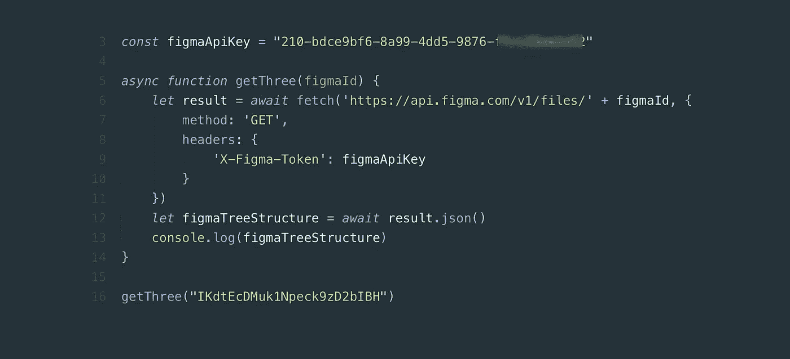
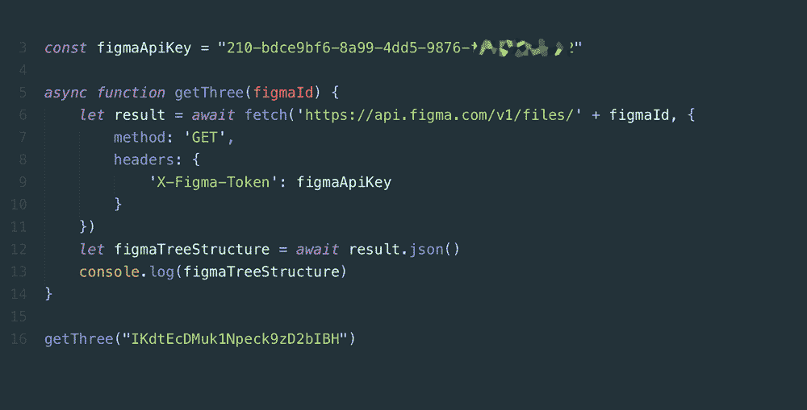
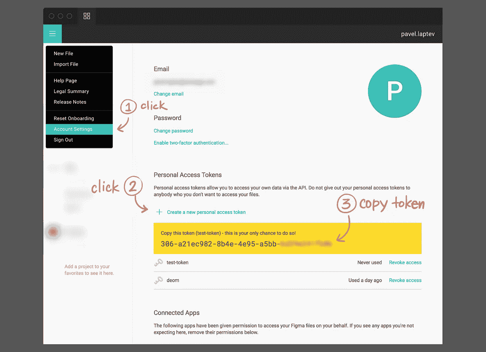
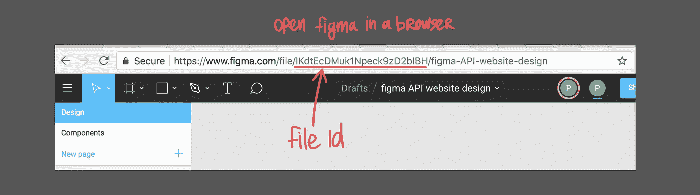
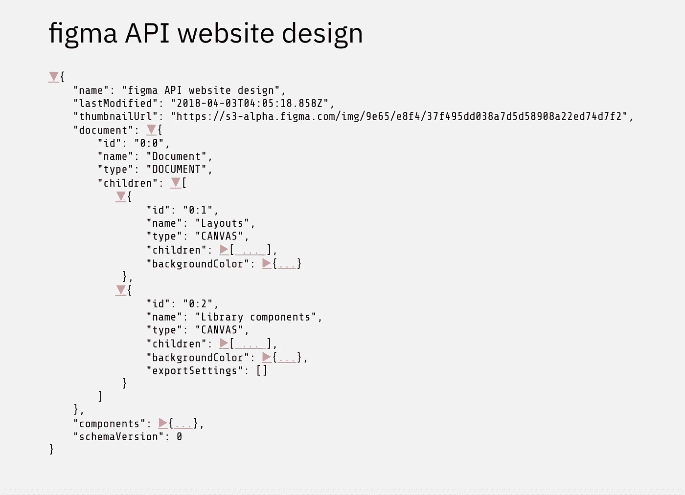
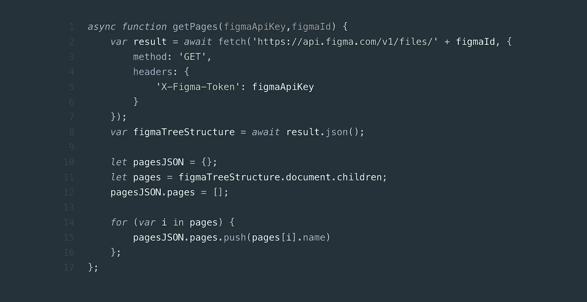
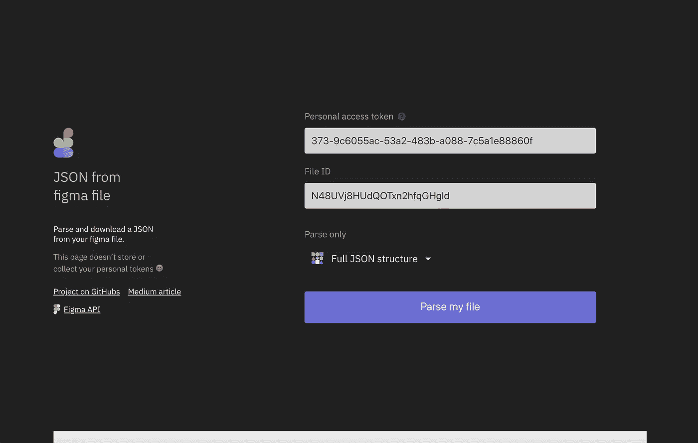

# Figma web API

> 原文：<https://itnext.io/figma-web-api-c581ba769e04?source=collection_archive---------3----------------------->

万岁！Figma 给了我们一个 Web API，它为我们打开了非常广阔的机会。当我搬到 Figma 的时候，我在 Sketch 中错过的一件事是编写插件的能力，玩它。现在我们有了这个功能，对我来说它甚至更好，因为它是在 JavaScript 中哈哈

## 目录:

*   [简单的脚本](#8f36)
*   [JSON 过滤器示例](#bfaa)
*   [来自 figma 文件项目的 JSON】](#bfaa)
*   Figma 的 Web API 如何改进我的工作？

Figma 发表了一篇关于 Figma 的 API 的文章，但它更浪漫，进行概述的目的多于实际。

[](https://blog.figma.com/introducing-figmas-platform-ee681bf861e7) [## 介绍:Figma 的平台

### 开放设计生态系统的第一步

blog.figma.com](https://blog.figma.com/introducing-figmas-platform-ee681bf861e7) 

我们将讨论实践。因此，当我发现 Figma 发布了一个 Web API 时，我去了 https://www.figma.com/developers/docs#intro，开始寻找如何使用 API 的方法。我的目标是得到一个 JSON 文件，这在你处理设计库的时候非常有用，但是我没有找到任何我可以复制/粘贴并自己检查的脚本，只有 API 描述，这肯定是有用的，但是当你已经知道如何得到 JSON 的时候。但是我在 [GitHub 这里](https://github.com/figma/figma-api-demo)找到了一些例子。

我给你看一个脚本，我们将分解它，告诉你如何过滤它。

# 简单脚本

下面是一个简单的脚本，用来获得一个带有项目结构的基本 JSON 文件。



这里发生了什么？从技术角度来看，引擎盖下是 Fetch API[https://developer . Mozilla . org/ru/docs/Web/API/Fetch _ API/Using _ Fetch](https://developer.mozilla.org/ru/docs/Web/API/Fetch_API/Using_Fetch)和 **await** 方法[https://dev . to/johnpaulada/synchronous-Fetch-with-async await](https://dev.to/johnpaulada/synchronous-fetch-with-asyncawait)

[](https://jsbin.com/nexagil/2/edit?js,console) [## Figma API JSON 三—测试示例

### 下面是 JS 上面的脚本和控制台结果的一个简单例子。它展示了整个 JSON three。

jsbin.com/nexagil/2/edit?js，控制台](https://jsbin.com/nexagil/2/edit?js,console) 

在脚本中，要获得一个文件结构，我们需要两样东西或两个键:

## 1.个人访问令牌



## 2.文件 ID



有了这两把钥匙和几行代码，奇迹就来了。现在我们可以用不同的方式解析我们的 JSON 获得页面、画板、版本等等。剩下的就是细节了😎

# JSON 过滤器示例

过滤你的 JSON 也很简单。让我们过滤一个 JSON，只得到页面。

我们需要创建一个空对象，稍后在里面添加我们的页面。

```
let pagesJSON = {};
```

接下来让我们为页面创建一个变量。要从 JSON 获取页面，首先你需要知道 Figma 的 JSON 结构是什么样子的。它看起来像这样



在这个结构中，我们需要一个父关键字“文档”和“子关键字”它的页面。

```
let pages = figmaTreeStructure.document.children;
```

现在在 **pagesJSON** 中创建一个新的参数并清空数组内部

```
pagesJSON.pages = [];
```

最后一部分是一个循环，我们遍历所有的页面，获取它们的名称，然后放入 pagesJSON.pages 数组

```
for (var i in pages) {
    pagesJSON.pages.push(pages[i].name)
};
```



# 来自 figma 文件项目的 JSON

为了展示 Figma API 的威力，我做了这个网页作为实验【https://pavellaptev.github.io/JSON-from-Figma 

在此页面上，您可以获得完整的 JSON 结构、页面和嵌套画板、仅页面或画板，还可以通过标志名称过滤所有画板。

 [## 来自 figma 的 JSON

### 此页面不存储或收集您的个人代币😊

pavellaptev.github.io](https://pavellaptev.github.io/JSON-from-Figma/) 

它已经有了一个测试令牌和一个用于演示的文件 id。希望会有帮助。请随意在这里制造问题

【https://github.com/PavelLaptev/JSON-from-Figma/issues 

# Figma 的 Web API 如何改进我的工作？

我的一个大学问我，当我让他测试我上面的页面时，好的，API 我理解…很好…但是我们为什么需要这个？

重点不在 API，重点是[你能用它做什么](https://blog.figma.com/introducing-figmas-platform-ee681bf861e7)。有很多实现。例如，JSON 文件可以通过自动化改进您的工作，您不需要每次都手动重写和复制/粘贴每个画板来创建设计库积压，您可以通过不同的方式从库中获得和过滤 JSON，它几乎没有限制。这要简单得多，而且可以节省你喝咖啡休息的时间。

祝你愉快，愿原力与你同在💪