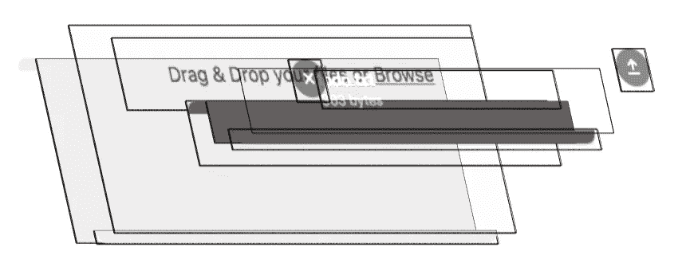
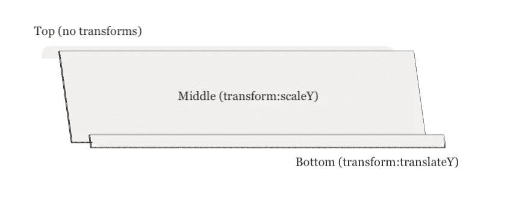
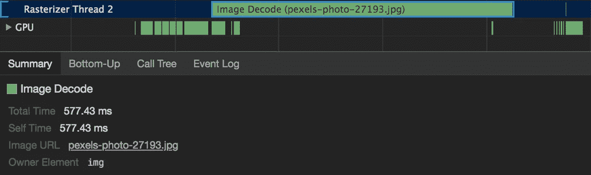

# 我在构建 FilePond 时面临的 5 个有趣的技术挑战

> 原文：<https://itnext.io/filepond-frontend-trickery-a3073c934c77?source=collection_archive---------2----------------------->

[FilePond](https://pqina.nl/filepond) 是 2018 年 3 月发布的 MIT 授权 JavaScript 文件上传库。它可以作为本地 JavaScript 插件使用，但也可以使用特殊的适配器组件与 [Vue](https://github.com/pqina/react-filepond) 、 [React](https://github.com/pqina/react-filepond) 、 [Angular](https://github.com/pqina/ngx-filepond) 和 [jQuery](https://github.com/pqina/jquery-filepond) 一起使用。

我们将看看 FilePond 动画引擎，它渲染拖放区域的方式，图像预览插件如何利用新的 createImageBitmap API，最后我们将研究我们的老朋友文件输入的局限性。

# 动画引擎

我想用一个中央动画循环驱动整个 FilePond 接口，因为在从 DOM 读取信息的同时用多个循环创建高性能动画会变得非常棘手。

FilePond 接口由一个视图树组成，每个视图都有一个根元素，并有一个`read`和`write`函数。对于核心动画循环的每个节拍，FilePond 调用根视图的 read 方法，然后根视图调用其子视图的 read 方法，依此类推。然后，当所有视图都被读取后，它调用根视图上的 write 方法，这个视图调用其子视图上的 write 方法，依此类推，直到到达视图树的末尾。所以它基本上是在 FilePond DOM 子树上读，然后在同一个子树上写。

Chrome 图层检查器显示文件池视图

`read`方法从 DOM 中读取布局信息。这包含当前元素位置、宽度、高度和边距等数据。然后将检索到的布局信息存储在每个视图中，以便可以在 write 方法中使用。因为所有的读取被分组，所以浏览器只需要进行一次布局计算，随后对布局信息的请求是“自由的”。

`write`方法负责更新视图。它将应用布局信息，更新文本元素，并应用附加到视图的动画。这些动画可以是补间动画或基于弹簧的动画。

核心动画循环一直运行，直到不再接收动作、视图已经更新、所有动画已经完成并且界面达到空闲状态。然后，FilePond 等待，直到空闲状态被用户或 API 调用扰乱。

因为 DOM 读取和写入已经分组，我们只使用“变换”和“不透明度”来制作动画，所以没有[布局破坏](https://developers.google.com/web/fundamentals/performance/rendering/avoid-large-complex-layouts-and-layout-thrashing)(写入方法不能使布局无效，因为读取已经完成)，浏览器只需进行合成，从而实现非常快的性能。

一个典型的 6 倍 CPU 速度的文件池帧:所有逻辑运行，DOM 更新，浏览器重新计算样式，最后处理合成

# 制作文件拖放区的动画

文件池放置区域需要随着每个文件的放置而垂直增长。我非常想制作这个动画，因为所有其他元素都是动画，而且拖放区大小的改变让我感觉很不合适。

*   我可以使用`scaleY`来缩放 GPU 上的拖放区域，但是缩放圆角矩形会导致圆角拉伸，这看起来很奇怪。
*   或者我可以制作`height`属性的动画，但是那会非常慢，因为它不能在 GPU 上合成。此外，它没有子像素，所以你可以在下面的动画中看到，当左边的方块接近最大高度时，动画变得不太流畅。

左动画高度，右动画变换 scaleY ( [codepen](https://codepen.io/rikschennink/pen/jKJgOb) )

为了避免这种情况，我们可以使用一种叫做 [9 切片缩放](https://w3.eleqtriq.com/2014/03/the-holy-grail-of-image-scaling/)的技术

我们使用三个独立的 div 来放置区域，而不是一个 div。

1.  呈现左上角和右上角圆角的静态顶部 div。
2.  在 y 轴上缩放的中间 div。
3.  被转换并呈现左下角和右下角的底部 div。

为了模拟高度动画，我们将中间的 div 高度设置为`1px`，并使用`scaleY()`变换来改变它的高度。设置`transform: scaleY(100)`将导致`100px`高 div。同时，我们可以使用`transform: translateY(100px)`将底部 div 移动到 100 像素的垂直偏移量

这是它在 Chrome web inspector 图层视图中的外观

通过结合这两种变换，我们可以创建动画高度的错觉，动画表现良好，我们的角落保持良好和尖锐，我们得到了子像素定位的平滑。

# 假进度指示器

在高速连接下，一个微小的文件可以在眨眼之间上传到服务器上。这可能会让您的用户怀疑他们的文件是否已经上传，因为状态几乎立即切换到*“上传完成”*，跳过了“*忙上传...”*状态。

为了防止这种不确定性，FilePond 将在每次上传的第一秒显示一个假的进度指示器。如果上传时间较长，则实际的文件上传过程将会接管。这可以给用户额外的信心，即文件实际上已经被上传。

自己试试，哪个版本感觉更好？

左:有假进度指示器，右:没有

# 文件输入是怎么回事？

这是非常不幸的，但是除了严重的风格问题，我们心爱的文件输入有另一个更紧迫的限制。无法设置文件输入的`files`属性。我尽力了。

我完全理解为什么设置一个指向`value`属性的路径是非常安全的(您可以将它指向用户文件系统上的一个文件)，但是选择将一个新创建的文件对象添加到文件列表会非常有用。

目前，拖放的文件必须异步上传。因为文件对象包含在 drop 事件中，所以它们不能存储在文件输入中。它们要么保存在内存中，要么使用`XMLHttpRequest`(或`fetch`)立即上传。

> 在浏览器中创建的文件对象也是如此。例如，用文本编辑器生成的文件，或者在客户端修改过的图像。

如果我们可以设置或添加文件到文件输入的`files`属性。

*   设置表单验证会更容易，因为拖放的文件和通过浏览窗口在文件系统上选择的文件都可以存储在同一个列表中。
*   我们不再需要修改服务器来接受异步上传。通常我们想知道哪些文件已经上传，这样我们就可以在最终的表单提交中引用它们。
*   我们可以更容易地应用渐进增强技术。服务器将只接收文件列表，不管它们来自哪里。如果某个 CMS 在其表单模块中公开了一个文件输入，我们可以在前端做任何我们想做的事情，只要我们设置了文件列表。

为了避免这个问题， [FilePond 文件编码插件](https://github.com/pqina/filepond-plugin-file-encode)可以将文件编码为 base64 字符串。为了做到这一点而不停止动画文件被发送到一个工作线程进行编码。当 worker 完成编码时，base64 编码的字符串被发送回来并存储在一个隐藏的输入字段中。

一旦上传，base64 字符串就可以在服务器上变回实际的文件。

虽然这创造了与父表单 post 同步发送文件的机会，但也产生了一些其他问题。一个已经说过了，数据需要在服务器上变回一个文件。另一个与内存使用有关。提交时，字符串比文件对象占用更多的内存。这导致一些浏览器在提交包含大量数据的表单时出错。另一件要记住的事情是，一些服务器安全软件会将表单数据标记为可疑的(由于值的长度)。

# 图像加载

当把一张图片放到 FilePond 上时，我想展示一个预览，这给单调的体验增加了一点色彩。由于预览图像应该是可选的，我把这个功能移到了一个单独的插件中。然后，该插件将呈现拖放图像的预览，并根据图像裁剪插件提供的裁剪信息调整这些预览。

问题是，如果你想渲染一个大的 JPEG 编码图像的预览，浏览器需要一些时间来解码图像和渲染结果位图数据。

6MB JPEG 的解码时间在 6x CPU 速度变慢的情况下测得

当浏览器正在解码时，主线程停止，一切都冻结了。对于任何正在运行的动画来说，这都是一个坏消息。

为了解决这个问题，FilePond 内部提供了一个选项来对 CPU 繁重的操作进行排队。它将等待运行这些操作，直到它处于空闲状态。这允许对繁重的操作进行计时，并防止动画意外冻结。

我认为一旦浏览器被锁定，显示某种繁忙状态还是不错的。事实证明，我很幸运，[基于 WebKit 的浏览器可以运行 CSS 动画，即使主线程被冻结](http://www.phpied.com/css-animations-off-the-ui-thread/)。在处理重负载队列之前，文件池将切换到繁忙的状态，并且文件进度指示器将开始其无限旋转动画(不受即将被阻塞的主线程的影响)。

通过在单独的线程上解码图像，可以进一步提高图像预览插件的速度。我们可以通过最近添加的`[createImageBitmap](https://developer.mozilla.org/en-US/docs/Web/API/WindowOrWorkerGlobalScope/createImageBitmap)` API 来做到这一点(在撰写本文时，Chrome 和 Firefox 都支持它)。文件对象被发送给 Web Worker，Web Worker 使用`createImageBitmap`对文件进行解码，然后返回一个`BitmapImage`对象，该对象可以使用`drawImage`方法呈现给`<canvas/>`。

# 暂时就这样吧！

让我知道这是否有趣！我很乐意再写一些关于其他挑战的内容，比如渲染平滑的渐变，让屏幕阅读器可以访问 FilePond，处理和读取 JPEG EXIF 方向，以及为 React、Vue 和 Angular 编写适配器组件。

如果您有任何问题，[在 Twitter 上找到我](https://twitter.com/rikschennink)