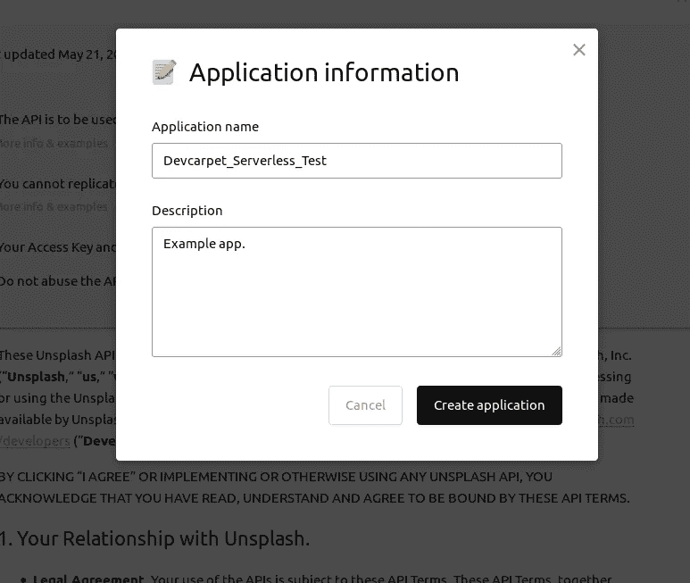
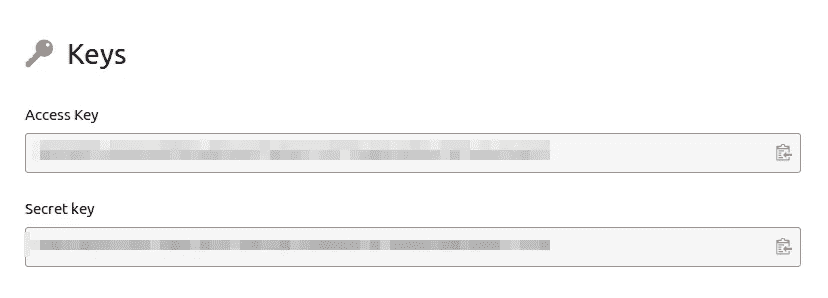
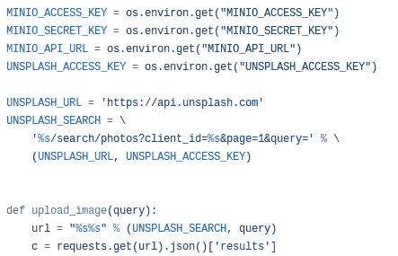
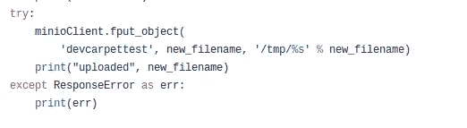
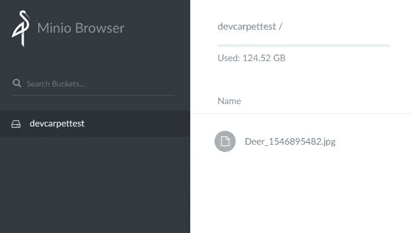

# 文件从 MicroK8s 上的 Kubeless 上传到 Minio

> 原文：<https://itnext.io/files-upload-from-kubeless-on-microk8s-to-minio-607e06598a4b?source=collection_archive---------4----------------------->

无服务器上传到对象存储

在这篇文章中，我将演示如何编写一个简单的 python 函数，它将从 [**Unsplash**](https://unsplash.com/) 下载一个图像，并上传到 [**Minio** ，](https://github.com/minio/minio) S3 兼容对象存储器。

要跟踪和执行本文中的代码，您需要 MicroK8s、Kubeless 和 Python3。你可以在我的文章中阅读关于 MicroK8s 的无服务器介绍:

[](https://medium.com/@bluszcz/serverless-microk8s-kubernetes-fcd6b875cd33) [## 无服务器 MicroK8s Kubernetes

### 在基于 Snap 的 Kubernetes 集群上安装 Kubeless 和裂变

medium.com](https://medium.com/@bluszcz/serverless-microk8s-kubernetes-fcd6b875cd33) 

# 不溅

Unsplash 是一个非常受欢迎的营销服务；-) —免费提供数千张免版税照片。

如果您没有 Unsplash 帐户，请[创建一个](https://unsplash.com/join)。


接下来，注册一个新的应用程序:[https://unsplash.com/oauth/applications/new.](https://unsplash.com/oauth/applications/new.)



在 Unsplash 中注册新应用程序

此后，您将收到您的访问密钥(我们稍后会用到):



API 凭据。

我们可以通过先执行 ***卷曲*** 命令，再执行 ***jq*** 命令来验证钥匙是否工作:

```
$ export UNSPLASH_ACCESS_KEY="..."
$ curl -s [https://api.unsplash.com/photos/\?client_id\=$UNSPLASH_ACCESS_KEY](https://api.unsplash.com/photos/\?client_id\=$UNSPLASH_ACCESS_KEY) |jq '.[0] |{desc: .description}'
{
  "desc": "5 bottles of DOSE Juice on a shelf"
}
```

# 米尼奥

Minio 是一个开源对象存储服务器，与 S3 兼容。一个有趣的特性是，它还可以充当其他对象存储系统之间的网关。

我们可以使用 Kubernetes 安装 Minio，但是在我们需要准备一个持久卷之前:

```
$ cat pv.yaml 
kind: PersistentVolume
apiVersion: v1
metadata:
  name: task-pv-volume
  labels:
    type: local
spec:
  storageClassName: standard
  capacity:
    storage: 10Gi
  accessModes:
    - ReadWriteOnce
  hostPath:
    path: "/tmp/data"
```

接下来，我为这里生成了 yaml 文件:Minio[https://www.minio.io/kubernetes.html](https://www.minio.io/kubernetes.html)。您需要做的是取消对 storageClassName 的注释，并用正确的值填充它，在我的例子中它是标准的(与上面的 *pv.yaml* 文件相同):

```
storageClassName: standard
```

并将数值输入 Minio ***访问密钥*** 和***秘密密钥*** 。

```
$ kubectl create -f minio-deployment.yaml
```

要验证:

```
$ kubectl get services                                                                                                               
NAME            TYPE           CLUSTER-IP       EXTERNAL-IP   PORT(S)          AGE
kubernetes      ClusterIP      10.152.183.1     <none>        443/TCP          4d
minio-service   LoadBalancer   10.152.183.228   <pending>     9000:32302/TCP   72m
```

# 用于 Kubeless 的 Python 函数

现在，最有趣的部分来了——我们要写一些代码:)为此，有两个有用的 API:

*   [https://unsplash.com/developers](https://unsplash.com/developers)
*   [https://docs.minio.io/docs/python-client-quickstart-guide](https://docs.minio.io/docs/python-client-quickstart-guide)

正如我们在 Minio 文档中看到的，它使用了特殊的 python 包。让我们通过简单地导入 minio 来尝试执行一个函数，看看这个包在 Kubeless 中是否可用:

```
$ cat /tmp/up.py             
import miniodef hello(event, context):
    print (event)
    return event['data']$ kubeless function deploy up --runtime python3.6 --from-file up.py --handler up.helloINFO[0000] Deploying function...                        
INFO[0000] Function up submitted for deployment         
INFO[0000] Check the deployment status executing 'kubeless function ls up' 
$ kubeless function  ls                                                               
NAME  NAMESPACE HANDLER    RUNTIME   DEPENDENCIES STATUS       
hello default   test.hello python3.6              1/1 READY    
up    default   up.hello   python3.6              0/1 NOT READY
$ kubeless function  ls
NAME  NAMESPACE HANDLER    RUNTIME   DEPENDENCIES STATUS   
hello default   test.hello python3.6              1/1 READY
up    default   up.hello   python3.6              1/1 READY
$ kubeless function call up --data "Let's pray..."
ERRO[0000] {"kind":"Status","apiVersion":"v1","metadata":{},"status":"Failure","message":"no endpoints available for service \"up:http-function-port\"","reason":"ServiceUnavailable","code":503}

FATA[0000] the server is currently unable to handle the request
```

它没有，这是预期的:)每个曾经使用 AWS Lambda 的人肯定都记得构建 python 包，将它们调整到特定的大小，然后与 Lambda 一起上传。在这里，我们可以跳过它，将依赖项作为额外的参数提供:

```
$ cat requirements.txt 
minio
requests
$ kubeless function  deploy up --runtime python3.6 --from-file /tmp/up.py --dependencies requirements.txt --handler up.hello
```

现在，当我们列出我们的函数时，我们将在依赖项列表中看到我们的包:

```
$ kubeless function ls up      
NAME NAMESPACE HANDLER  RUNTIME   DEPENDENCIES STATUS       
up   default   up.hello python3.6 minio        0/1 NOT READY
                                  requests
$ kubectl get pods
NAME                  READY   STATUS             RESTARTS   AGE

up-5f6cbd8bb7-957ls   0/1     Init:1/2           0          2m5s
```

描述 pod 以查看它正在构建新的 docker 映像:

```
$ kubectl describe pod up-5f6cbd8bb7-957ls...Events:
  Type    Reason     Age                   From               Message
  ----    ------     ----                  ----               -------
  Normal  Scheduled  6m26s                 default-scheduler  Successfully assigned default/up-5f6cbd8bb7-957ls to t480
  Normal  Pulled     6m25s                 kubelet, t480      Container image "kubeless/unzip@sha256:f162c062973cca05459834de6ed14c039d45df8cdb76097f50b028a1621b3697" already present on machine
  Normal  Created    6m25s                 kubelet, t480      Created container
  Normal  Started    6m25s                 kubelet, t480      Started container
  Normal  Pulling    6m24s                 kubelet, t480      pulling image "python:3.6"
  Normal  Pulled     4m36s                 kubelet, t480      Successfully pulled image "python:3.6"
  Normal  Created    2m3s (x2 over 4m34s)  kubelet, t480      Created container
  Normal  Started    2m3s (x2 over 4m33s)  kubelet, t480      Started container
  Normal  Pulled     2m3s                  kubelet, t480      Container image "python:3.6" already present on machine
```

快速检查依赖项是否工作(在我们正在导入的代码中 **minio** 模块):

```
$ kubeless function call up --data "Let's pray..."
Let's pray...
```

由于依赖项正在工作，我准备了简单的 python 脚本来从 Unsplash 获取图像——我在这里上传了[，由于 Medium 中较差的等宽字体支持，我没有在这里复制粘贴它——其中最重要的部分是下载图像:](https://github.com/Devcarpet/microk8s-kubeless-minio/blob/master/up.py)



并上传到部署在 Kubernetes Minio:



我将这段代码部署为一个函数:

```
$ kubeless function delete up
$ kubeless function  deploy up \ 
 --runtime python3.6 --from-file up.py \ 
 --dependencies requirements.txt --handler up.hello \ 
 --env MINIO_ACCESS_KEY=$MINIO_ACCESS_KEY \ 
 --env MINIO_SECRET_KEY=$MINIO_SECRET_KEY \ 
 --env MINIO_API_URL=$MINIO_API_URL \  
 --env UNSPLASH_ACCESS_KEY=$UNSPLASH_ACCESS_KEY
```

函数的最后一次调用(上传成功后将输出文件名):

```
$ kubeless function call up                                                                                                           Deer_1546895482.jpg
```

并查看 [Minio web 面板](http://localhost:9000):



一切正常:)我希望你喜欢看这篇文章。