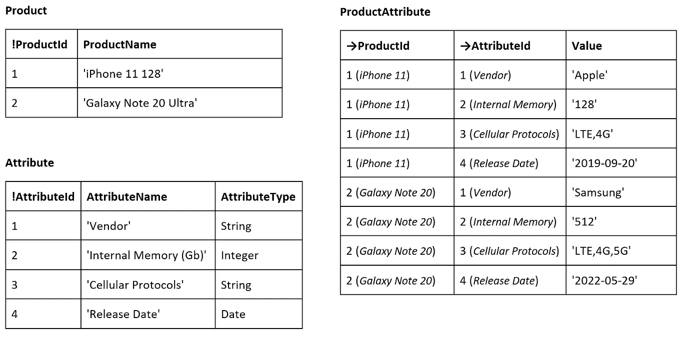
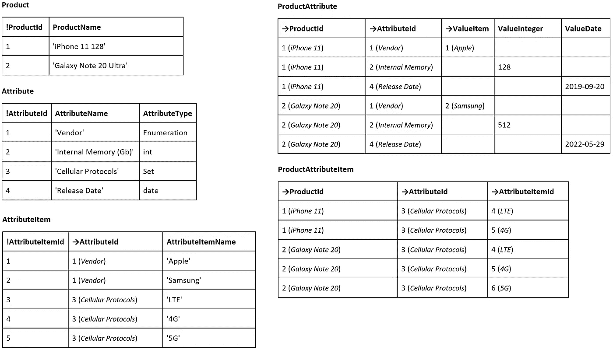
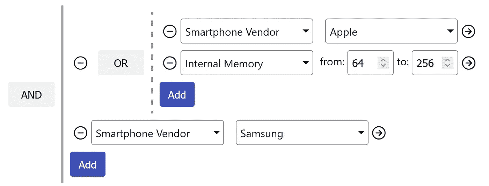

# 按动态属性过滤

> 原文：<https://itnext.io/filtering-by-dynamic-attributes-90ada3504361?source=collection_archive---------0----------------------->


在开发中，有一种非常常见的情况，当需要为一些实体使用动态属性时，甚至更多——实体本身可以是完全动态的。我认为这种应用程序最著名的例子是 JIRA，管理员可以添加或删除票证属性，然后每个人都可以使用它们(查看或修改票证的值)。同时，JIRA 为使用动态属性过滤和排序票据提供了充足的机会，这表明使用动态属性的工作已深入集成到 JIRA 数据存储中，否则在处理大量对象时很难获得良好的性能。例如，如果有数千(数百万)个存储的对象(例如，JIRA 门票)，并且如果过滤没有在数据存储本身中实现，则有必要将每个对象读入应用存储器，以检查它是否匹配过滤和分类条件。显然，它看起来效率不高。在我参与的几个项目中，我遇到了类似的问题，我想利用这一经验提供一个在我看来非常有效的解决方案。
*注。在下文中，我们将只关注 SQL 数据库。很可能，许多人会同意这样的说法，即 SQL 数据库现在仍然是存储应用程序数据的最流行的方式。*

# 表结构

在过滤数据之前，您必须首先弄清楚如何正确地组织 SQL 表中的数据。在最简单的情况下，动态属性的表结构可能如下所示:

*   **产品** —将要扩展动态属性的对象列表
*   **属性** —动态属性列表(名称和类型)
*   **产品属性** —产品的动态属性值

让我们看一个例子，我们有一个手机型号列表，我们想动态添加一些附加属性，如“供应商”、“内存(Gb)”、“蜂窝协议”、“发布日期”等。

在这种情况下，数据可能如下所示:



这个简单的结构中有一点可能会导致某些问题——注意，**值**列的类型是字符串。乍一看，这似乎合乎逻辑，因为属性类型可以不同，但是任何类型都可以表示为字符串。但是，就筛选和排序而言，这并不是最佳选择，因为通常情况下，字符串比较与编码值比较并不对应。例如，当比较字符串 *'2.11'* 和 *'11.2'* 以及比较数字 2.11 和 11.2 时，会得到完全相反的结果——即 *'2.11'* 比 *'11.2'* 大，但 2.11 小于 11.2

使用字符串的另一个问题是，相同的数据可能以不同的方式编码。我认为许多开发人员都遇到过由不同的日期格式引起的问题:2022 年 5 月 29 日，2022 年 5 月 22 日，2022 年 5 月 29 日——相同的日期，但不同的字符串。

通常，属性值可以是更复杂的结构，如列表，如果它们被编码为单个字符串，这样的值在数据库级别几乎变得无法管理。

记住以上内容，考虑新的表结构:



现在，值表( **ProductAttribute** )中每个属性类型(引用、数字、日期)都有一列。列表值被移到单独的表 **ProductAttributeItem** 中。

使用该结构，我们可以尝试选择一些符合特定标准的产品。

# SQL 过滤

让我们考虑一个“复杂滤波器”，例如:



在 SQL 中，它可以表示为:

```
**(**
  **[1]***/*Vendor*/* = **1***/*Apple*/* 
  **AND**
  **[2]***/*Internal Memory*/* >= **64**
  **AND** 
  **[2]***/*Internal Memory*/* <= **256**
**)
OR
([1]***/*Vendor*/* = **2***/*Samsung*/***)**
```

想法是将表达式注入到某个 SQL 查询中，以便数据库服务器自己进行过滤。为此，它需要:

1.  分析过滤器中使用了哪些属性
2.  将一个值表( **ProductAttribute** )连接到过滤器中出现的唯一属性

过滤器包含两个属性:

*   **[1]供应商** —引用枚举
*   **【2】内部存储器** —编号

因此，最终查询应该包含一个子查询，其中 **ProductAttribute** 用适当的列别名连接了两次:

```
**SELECT**
    [ATTRIBUTES].ProductId
**FROM**
**(**
    **SELECT**
        [P].ProductId,
        [AT_1].ValueItem **[1]**,
        [AT_2].ValueInt **[2]**
    **FROM** Product
        [P]
    **LEFT JOIN** ProductAttribute
        [AT_1] ON
        [AT_1].AttributeId = **1**/*Vendor*/
        AND
        [AT_1].ProductId = [P].ProductId
    **LEFT JOIN** ProductAttribute
        [AT_2] ON
        [AT_2].AttributeId = **2**/*Internal Memory*/
        AND
        [AT_2].ProductId = [P].ProductId
**)** [ATTRIBUTES]
**WHERE
(**
  **[1]***/*Vendor*/* = **1***/*Apple*/* 
  **AND**
  **[2]***/*Internal Memory*/* >= **64**
  **AND** 
  **[2]***/*Internal Memory*/* <= **256**
**)
OR
([1]***/*Vendor*/* = **2***/*Samsung*/***)**
```

正如我们所看到的，原始的过滤表达式(像任何其他具有相同属性的表达式一样)可以注入到查询中，过滤将直接在 SQL 数据库中执行。除了这个过滤会非常高效(我们会添加索引，对吧？)，我们还能够在排序的数据集中选择一个范围(带有获取偏移量的分页)，如果在应用程序级别进行过滤，这将要求所有数据都在应用程序的内存中。

# 构建动态 SQL

理论上，这看起来不错，但是不清楚如何在实际应用中使用这种方法，因为必须首先解决以下任务:

1.  将过滤标准转换为 SQL 布尔表达式
2.  使用所有必需的连接准备适当的基本选择查询

您的 ORM 很难足够灵活来执行这些技巧，想到的第一个想法是将动态 sql 查询构建为文本，这当然是可能的，但我建议使用一些允许使用 SQL 语法树的 SQL 构建器，这将是更安全、更灵活的解决方案。

此外，作为一个例子，我将使用 [SqExpress](https://github.com/0x1000000/SqExpress) 库。Net 平台。当然，您可以使用其他类似的库——原理是一样的。

让我们从构建一个布尔表达式开始:

*注意:这里它是硬编码的，但是并不妨碍从一些过滤器模型中动态地创建它。*

小检查，这是我们想要的:

```
**Console**.WriteLine(**TSqlExporter**.Default.ToSql(filter));//[1]=1 AND [2]>=64 AND [2]<=256 OR [1]=2
```

使用语法树遍历，我们可以在表达式中找到所有唯一的属性 id:

当我们知道所有的属性 id 时，我们可以读取它们的类型:

现在，使用过滤表达式中关于属性的信息，我们可以构建一个子查询，其中 **ProductAttribute** 表将针对每个唯一属性连接一次:

将所有这些结合在一起:

这对于简单的属性来说很好，但是如果一个属性是“Set”(值是一组项目)，那么将需要更多的工作。例如，我们希望通过蜂窝协议进行过滤:

要由数据库服务器执行，该过滤查询必须修改如下 **: IN** 操作符应替换为 **EXISTS** 子查询，以便使用 **ProductAttributeItem** 表。这可以通过修改过滤器语法树来实现:

```
**EXISTS**
**(**
  **SELECT** 1 
  **FROM** [dbo].[ProductAttributeItem] 
    [A0] 
  **WHERE** 
     [A0].[AttributeId]=3 
 **AND** 
     [A0].[ProductId]=[A1].[ProductId] 
     **AND** 
     [A0].[AttributeItemId] **IN(**3,5**)**
**)**
```

修改后，过滤器可用于查询:

使用上述技术和方法，您不仅可以创建具有动态扩展实体的应用程序，还可以提供丰富的功能来根据各种标准过滤这些实体。

链接:

*   [SqGoods](https://github.com/0x1000000/SqGoods) —这是一个演示 web 应用程序，演示动态实体的动态过滤；
*   [本文源代码代码](https://github.com/0x1000000/DynAttDemo)
*   [SqExpress](https://github.com/0x1000000/SqExpress) —文章示例中使用的 sql 查询构建器。