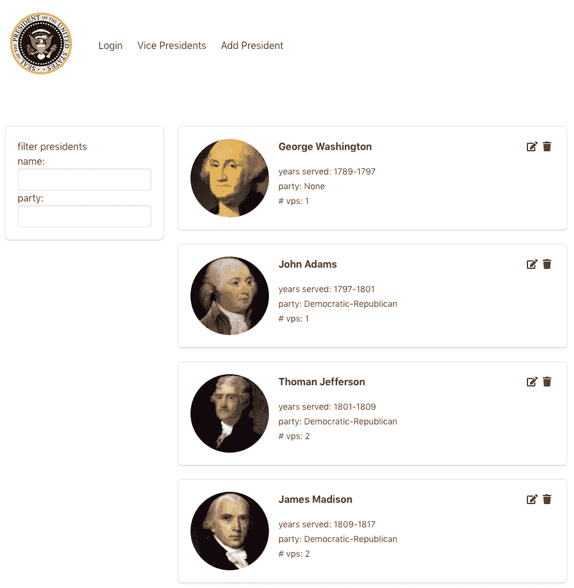
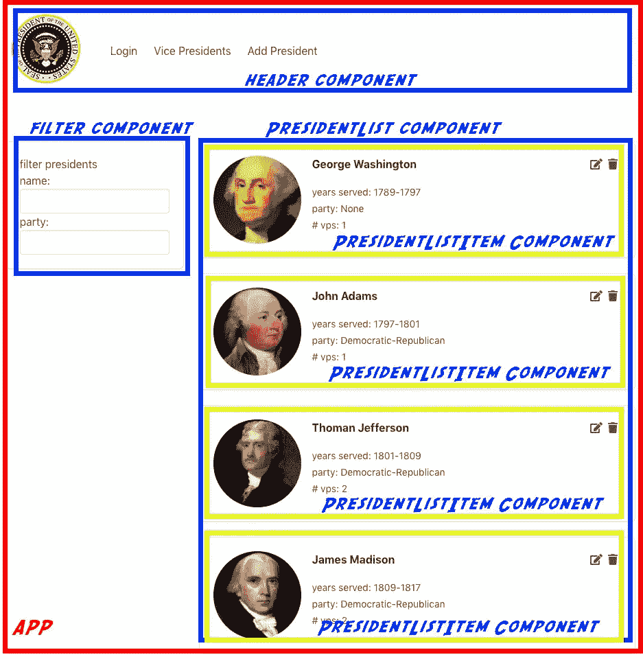
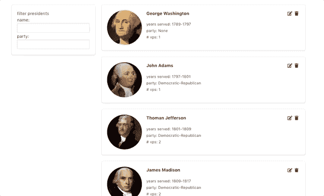

# 在 Vuex 中过滤数据

> 原文：<https://itnext.io/filtering-data-in-vuex-7361141d7baa?source=collection_archive---------3----------------------->


像软件开发中的大多数挑战一样，通常有多种方法来实现一个解决方案。过滤 Vuex 中的数据也不例外。这是一个潜在的实现。根据您的情况，这可能适用，也可能不适用。对我来说，这很好。

# 设置

我有一个名为 Presidents 的示例应用程序。



我打赌看着它你就能猜到它是干什么的。它展示了美国总统。想不到！

为了简单起见，我在 node 本地运行了一个 Express 服务器，当应用程序加载 App.vue 组件时，会调用 Vuex 来加载数据。下面是应用程序组件的代码:

```
<script>
import HeaderComponent from './components/Header';
import { mapGetters } from 'vuex';export default {name: "app",
    components: { "header-component" : HeaderComponent },
    created() {
        this.$store.dispatch("getPresidents"); }
};
</script>
```

在上面的代码中可以看到，当 created()钩子被触发时，Vuex 中调用了 *getPresidents()* 动作:

```
import axios from 'axios';const state = {
    presidents: []
};const actions = {
    getPresidents({commit}) {
        axios.get('/api/presidents').then((response) => {
            commit('UPDATE_PRESIDENTS', response.data);
        });
    }
};const mutations = {
    UPDATE_PRESIDENTS(state, payload) {
        state.presidents = payload;
    }
};
```

在 getPresidents()操作中，我们使用 axios 进行 HTTP 调用并从服务器加载数据。然后，数据显示在 PresidentList 组件中。如果我们从组件的角度来考虑用户界面，下面是它的展示方式:



我们有主应用程序组件，用红色表示，标题、过滤器和 presidentList 组件用蓝色表示，PresidentListItem 组件用黄色表示。

Vuex 存储上有一个 getter，由 PresidentList 组件访问，并为每位总统呈现一个 PresidentListItem 组件。

到目前为止，一切顺利。

让我们把注意力转向滤波器组件。

# 在 Vuex 中过滤

我希望能够根据*的名字、党派或者两者来过滤总统名单。*

我最初的实现传递了两个字符串给 Vuex 商店，但是我真的不喜欢这个设置，所以我决定创建一个名为 *filterObj* 的自定义对象。

filterObj 将使跟踪过滤标准变得容易。我的自定义对象也让我能够很容易地看到我是在处理 1 个还是 2 个过滤标准。

下面是自定义 *filterObj* 的代码。

```
const filterObj = {
    _presidentName: undefined,
    _partyAffiliation: undefined,
    _filterCount: 0
}Object.defineProperty(filterObj, "presidentName", {
    enumerable: true,
    get(){
        return this._presidentName;
    },
    set(newVal) {
        if(newVal === ''){
            this._presidentName = undefined;
            this._filterCount--;
        } else {
            if(this._presidentName === undefined){
                this._filterCount++;
            }
            this._presidentName = newVal.toLowerCase();
        }
    }
});Object.defineProperty(filterObj, "partyAffiliation", {
    enumerable: true,
    get(){
        return this._partyAffiliation;
    },
    set(newVal) {
        if(newVal === ''){
            this._partyAffiliation = undefined;
            this._filterCount--;
        } else {
            if(this._partyAffiliation === undefined){
                this._filterCount++;
            }
            this._partyAffiliation = newVal.toLowerCase();
        }
    }
});Object.defineProperty(filterObj, "filterCount", {
    enumerable: true,
    get(){
        return this._filterCount;
    },
    set(newVal) {

        this._filterCount = newVal;
    }
});export default filterObj;
```

我这样实现它有三个原因:

1.  我总是希望传入的值是小写的，在 presidentName 的 setter 中很容易做到这一点。
2.  当我应用过滤器时，我想知道我处理了多少个过滤标准。这样做的原因是，如果我只处理 1 个过滤器，我实际上是在执行逻辑 or 运算，而如果我有 2 个标准，我是在执行逻辑 AND 运算。
3.  传递一个包含我需要的所有信息的对象很简单

每当用户与 UI 中的过滤器组件控件交互时，它都与 *filterObj* 保持同步:

```
<template>
    <div>
        <div class="box">filter presidents <br>
            <label for="name">name: </label>
            <input type="text" class="input" v-model="filterObj.presidentName" [@keyup](http://twitter.com/keyup)="filterPresidents">

            <label for="name">party: </label>
            <select class="input" [@change](http://twitter.com/change)="filterPresidents" v-model="filterObj.partyAffiliation"> 
                <option  v-for="(party, key) in parties" :value="party" :key="key">{{ party }}</option>
            </select>
        </div>
    </div>
</template><script>
    import filterObj from "../utils/filterObj";
    export default {
        name: 'FilterPanel',
        data() {
            return {
                parties: ['','republican', 'democrat', 
                          'federalist', 'whig',       
                          'democratic-republican', 'none'],
                filterObj
            }
        },
        methods: {
            filterPresidents() {
                this.$store.dispatch('filterPresidents', 
                this.filterObj);
            }
        }
    }
</script>
```

每当控件中的数据发生变化时，我们就调用组件上的 *filterPresidents()* 方法。

使用 Vuex 时的一个规则是，我们从不直接修改状态。相反，我们*将*分派给*商店上的*行动。我们可以在 filterPresidents()方法中传递过滤器对象来实现这一点:

```
filterPresidents() {
       this.$store.dispatch('filterPresidents', 
       this.filterObj);
}
```

一旦“进入”商店，*动作* *提交突变*，而*以某种方式突变*状态:

```
const state = {
    presidents: [],
    filterObj: {}
};const actions = {
    filterPresidents({commit}, filterObj) {
        commit('UPDATE_FILTER', filterObj);}
};const mutations = {
    UPDATE_FILTER(state, payload) {
        state.filterObj = payload;
    }
};
const getters = {
    presidents: state => state.presidents
}
```

准备就绪后，剩下要做的就是将我们的 getter 从上面显示的简单 getter 更新为一个识别状态的 getter，我们可以使用它来进行动态过滤:

```
const getters = {    
    presidents: state => {
        switch(state.filterObj.filterCount) {
            //no filters passed
            case 0:
            case undefined:
                return state.presidents;//only 1 filter passed
            case 1:
                return state.presidents.filter(president => {
                    for(let key in state.filterObj) {
                        if(president[key]) {
                       if(president[key].toLowerCase().includes(state.filterObj[key]))
                                return true
                        }
                    }
                    return false;
                });//2 filters passed
            case 2:
                return state.presidents.filter(president => {
                    for(let key in state.filterObj) {
                        if(president[key]) {
                            if(!president[key].toLowerCase().includes(state.filterObj[key]))
                                return false;
                        }
                    }
                    return true;
                });
        }
    }
};
```

现在，我们可以根据传递给商店的“过滤器”数量轻松进行过滤。



可能有办法让这更有效，但这是一项正在进行的工作。无论如何，如果你有改进修改的建议，请发表评论。

你可以在 GitHub 上查看[的完整源代码。](https://github.com/aritzcovan/vue-presidents)

同时，感谢你的阅读和快乐的陪伴！

*原载于*[*http://ritzcovan.com*](http://ritzcovan.com/index.php/2018/10/01/filtering-data-in-vuex/)*。*