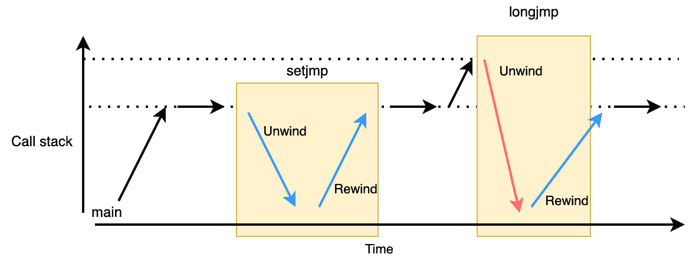
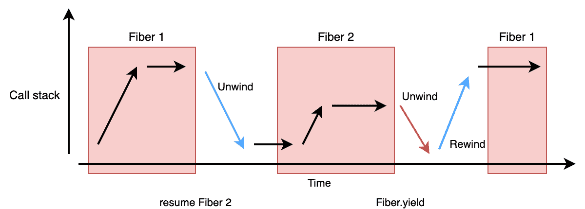
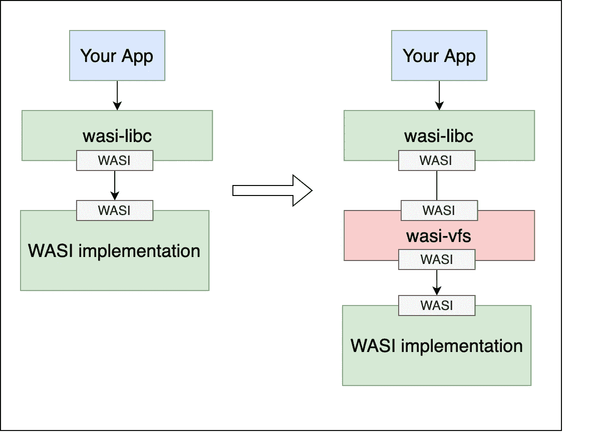
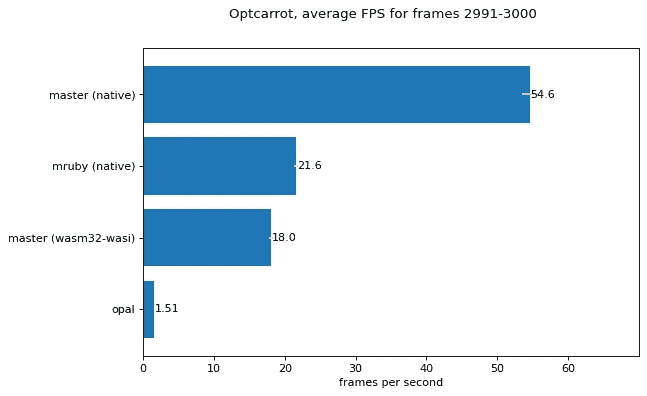
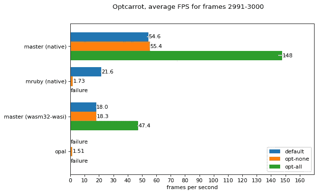

# Ruby 中 WebAssembly/WASI 支持的更新

> 原文：<https://itnext.io/final-report-webassembly-wasi-support-in-ruby-4aface7d90c9?source=collection_archive---------0----------------------->

# 概观

CRuby 是一个高度可移植的 C 应用，它运行在许多平台上(你可以在 CI [这里](https://rubyci.org/)看到哪些平台经过测试)。然而,“可移植性”只是在源代码级别，构建的可执行文件不能跨架构和系统调用接口移植。

该项目通过将 CRuby 移植到 WASI·ABI 的独立 WebAssembly，使其在可执行文件级别上具有可移植性。此外，我们在 WASI 实现了一个 VFS(虚拟文件系统),将 Ruby 脚本打包成一个 WebAssembly 二进制文件。这些改进使得发布 Ruby 脚本变得更加容易。

这是[要求的 2021 年红宝石协会拨款](https://www.ruby.or.jp/en/news/20211025)的最终报告。

# 关于 WebAssembly 和 WASI

WebAssembly 不仅用于将现有项目移植到 web 浏览器，还用于提供沙箱化的可移植可执行文件。它不仅限于 web，而且正被用于各种情况，如边缘计算、嵌入式环境和插件系统的接口。

Ruby 社区已经使用 Emscripten 将 CRuby 移植到 WebAssembly，但它严重依赖于主机 JavaScript 环境。这使得它很难用于上述应用。

WASI 致力于为 WebAssembly 模块定义一组标准的系统调用，允许 WebAssembly 模块不仅可以跨架构移植，还可以跨实现这组标准系统调用的环境移植。WASI 根本不依赖 JavaScript。

为 C 和 C++用户提供了 [WASI SDK](https://github.com/WebAssembly/wasi-sdk) ，这是一个 LLVM 编译器工具链，带有基于 musl 和 cloudlibc 的 libc [wasi-libc](https://github.com/WebAssembly/wasi-libc) 。

# 履行

现在克鲁比的主分支通过我们的几个补丁支持 WASI 作为建造目标。支持的初始补丁集是 [ruby/ruby#5407](https://github.com/ruby/ruby/pull/5407) (已经合并)。

在[“合并基于 WASI 的 WebAssembly 支持的提案”](https://bugs.ruby-lang.org/issues/18462)中跟踪此功能。

如今的 WASI 系统调用有限，WebAssembly 本身也没有上下文切换机制。因此，CRuby 需要一些变通办法来解决这些问题。值得注意的变化是:

*   使用 Asyncify 为一些缺失的功能添加仿真实现:异常使用 setjmp/longjmp，纤程使用 ucontext，GC 使用 register scan
*   支持无线程环境

除了与线程和进程相关的测试之外，当前主分支通过了 basictest、bootstraptest 和 ruby/spec。它还支持静态链接的扩展库。

你可以在这里看到如何建立 WASI 目标红宝石:[https://github.com/ruby/ruby/blob/master/wasm/README.md](https://github.com/ruby/ruby/blob/master/wasm/README.md)

此外，我成为了一个持续维护这个特性的提交者。

# 由 Asyncify 支持的仿真

如上所述，当前的 WebAssembly 没有上下文切换功能，但是有一种用户技术可以通过二进制转换暂停和恢复 WebAssembly 进程。这种技术被称为[不对称](https://kripken.github.io/blog/wasm/2019/07/16/asyncify.html)。

Asyncify 提供了两种操作来控制程序的执行。

1.  停止当前执行，并展开到根调用框架，同时将执行状态和函数局部寄存器(也称为 Wasm 局部寄存器)写到内存中
2.  在恢复保存的执行状态和寄存器时，回退到停止的调用帧。

你可以在 ruby/ruby 库的`[wasm](https://github.com/ruby/ruby/tree/master/wasm)`[目录下看到这些仿真实现。](https://github.com/ruby/ruby/tree/master/wasm)

## setjmp/longjmp

由于这些神奇的操作，setjmp 和 longjmp 可以像下面这样简单地模拟:

1.  setjmp 通过展开到 main 来保存当前的堆栈指针和执行状态，然后重绕到 setjmp 的调用点。
2.  longjmp 退绕到 main，但是丢弃收集的执行状态，并倒绕到步骤 1 中保存的 setjmp 的调用点，然后恢复保存的堆栈指针。



然而，随着调用栈越来越深，这个 setjmp 仿真变得越来越慢！此外，setjmp 用于 Ruby VM 的核心。因此，我们通过在核心实现中避免重绕到 main 来减轻性能损失。

我们也考虑过使用[异常处理提议](https://github.com/WebAssembly/exception-handling)，它比微基准测试中的 Asyncify 方法快 1.88 倍。然而，我们发现在 C 层用 try-catch 风格重写 setjmp/longjmp 的所有使用需要相当多的修改。我们决定现在使用一种非对称的方法来最小化补丁的影响，而不是性能的提高。

## 纤维(ucontext)

与 setjmp/longjmp 类似，WASI 上的光纤利用了 Asyncify。它只是通过展开/倒带和交换堆栈指针来切换执行状态。



## 扫描 GC 的寄存器(Wasm 局部变量)

CRuby 使用保守的垃圾收集，通过扫描一些值空间来寻找有生命的对象，从而标记类似指针的值。

运行 WebAssembly 程序时，可以将 Ruby 对象(`VALUE`)放入:

1.  Wasm 堆栈:在 Wasm 规范中定义
2.  函数局部寄存器(Wasm 局部寄存器):在 Wasm 规范中定义
3.  c 堆栈:在线性内存中分配

不像 3 这样的普通内存空间。c 堆栈，1。Wasm 堆栈和 2。不能动态扫描函数局部寄存器。幸运的是，Asyncify 将 Wasm 局部变量和 Wasm 堆栈作为执行状态写入，因此 GC 通过 Asyncify 展开和倒带，并扫描存储在线性内存中的执行状态。

# WASI 的虚拟文件系统

我们在 WASI 实现了一个名为 [wasi-vfs](https://github.com/kateinoigakukun/wasi-vfs) 的 VFS(虚拟文件系统)，将 Ruby 脚本打包成一个 WebAssembly 二进制文件。它不仅适用于 Ruby，也适用于任何使用 wasi-libc 的应用程序。

## 使用

您可以使用与运行 wasmtime 或 wasmer 相同的选项来打包目录。

```
# Without packing
$ wasmtime run ruby.wasm --mapdir /::./lib -- /irb.rb
irb(main):001:0>
...
# Packing with wasm-vfs
$ wasm-vfs pack ruby.wasm --mapdir /::./lib -o irb.wasm
$ wasmtime run irb.wasm -- /irb.rb
irb(main):001:0>
...
```

注意，它目前需要链接`libwasi_vfs.a`，因为它依赖链接器的符号解析机制来挂钩 WASI 系统调用，并且还需要合并数据段。然而，在[模块链接](https://github.com/WebAssembly/module-linking)到位后，该限制将被取消。



## 它是如何工作的？

`wasi-vfs pack`命令是 Wizer 的包装器，Wizer 是 Wasm 应用程序的预初始化器。参见[字节码联盟:让 JavaScript 在 WebAssembly 上快速运行](https://bytecodealliance.org/articles/making-javascript-run-fast-on-webassembly)。

wasi-vfs 中的初始化过程扫描映射的目录，然后将它们复制到内存中的虚拟文件系统中。然后 Wizer 会拍摄该状态的快照，并将其保存为 Wasm 文件。

# 与 JavaScript 的互操作

我们还实现了一个 Ruby JavaScript interop 库，作为浏览器和 Node.js 的 npm 包[。它已经在 try.ruby-lang.org](https://github.com/kateinoigakukun/ruby.wasm/blob/main/packages/npm-packages/ruby-wasm-wasi/README.md)[中使用。](https://try.ruby-lang.org/playground/)

```
const vm = await DefaultRubyVM();
vm.eval(`
  luckiness = ["Lucky", "Unlucky"].sample
  JS::eval("document.body.innerText = '#{luckiness}'")
`);
```

# 性能基准

这里是一份[optre b](https://github.com/mame/optcarrot)与原生 CRuby 和其他 Ruby 实现进行比较的性能基准报告。(越大越好)

`master (wasm32-wasi)`和`opal`使用 Node.js v16.14.0 作为他们的 js 和 Wasm 运行时。



Performance profiler 报告了最重函数的类似趋势，因此瓶颈不在 CRuby 实现中，而是 Wasm 运行时比本机运行时慢。此外，它还包括我们上面提到的非对称管理费用。

# 其他琐碎的工作

*   ruby.wasm :预构建 wasm 目标 ruby 的夜间发布
*   [wasi-preset-args](https://github.com/kateinoigakukun/wasi-preset-args) :预设 wasi 模块命令行参数的工具。这对于设置传递给 Ruby 的脚本路径很有用。像 [Compute@Edge](https://www.fastly.com/jp/products/edge-compute/serverless) 这样的平台无法给出参数，所以这个工具是必不可少的
*   optcarrot.wasm :一个在浏览器上用 Ruby 编写的游戏模拟器，由 WebAssembly 提供支持
*   [irb . wasm](https://github.com/kateinoigakukun/irb.wasm):web assembly 支持的浏览器上的 IRB
*   [katei/ruby](https://wapm.io/katei/ruby) ， [katei/irb](https://wapm.io/katei/irb) :非官方 WAPM 套餐

# 未来工作思路

*   将初始化的虚拟机状态快照为可执行的 Wasm 文件
*   压缩 wasi-vfs 嵌入的文件
*   在浏览器中运行示例代码的 RDoc 集成
*   扩展 RubyGems 以允许静态链接扩展库

# 结论

我们已经展示了如何通过 WASI·ABI 将 CRuby 移植到 WebAssembly，并介绍了相关工具。这一成果将推动 Ruby 在更多环境中的使用。另外，这个特性将由 Ruby 的新手森英士·斋藤来维护。当然，欢迎任何投稿！

如果没有发现重大问题，它将随 Ruby 3.2 一起发布。