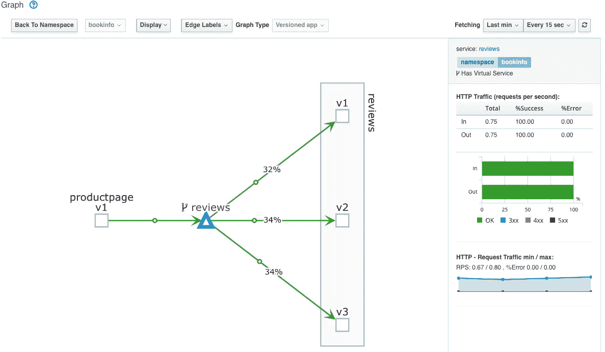

# 在你与 Kiali 的 Istio mesh 中发现问题

> 原文：<https://itnext.io/find-issues-in-your-istio-mesh-with-kiali-89d37d5e1fb1?source=collection_archive---------4----------------------->

你可能已经在 [Kiali](https://www.kiali.io/) 中看到了漂亮的图形，它向你展示了你的 [Istio](https://istio.io/) 网格是如何组成的，以及流量在哪里流动。

显示从产品页面工作负载到评论工作负载的流量

另一个重要的特征是当事情不像你期望的那样时突出显示。

我录制了一段 8 分钟的视频，让您对 Kiali 在图表中可以告诉您的内容有一些印象，以及您如何深入挖掘以找到背后的问题:

【https://www.youtube.com/watch?v=6NWPi8lm2Y0 

视频并没有展示 Kiali 可以呈现的所有内容。如果你想了解更多，请查看我的同事 Mazz 发来的这篇文章，他做了一个更深入的视频，讲述了图表可以向你展示什么。

另外，请务必在 Medium 上关注 [Kialiproject，了解更多关于 Kiali 的信息。](https://medium.com/kialiproject)