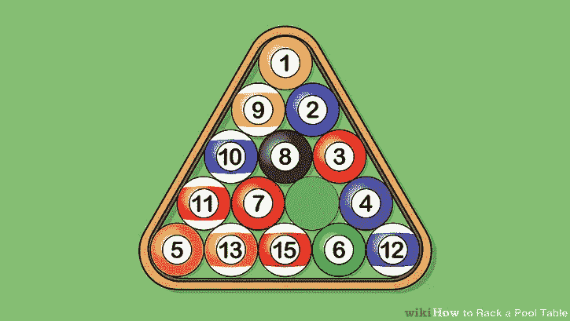
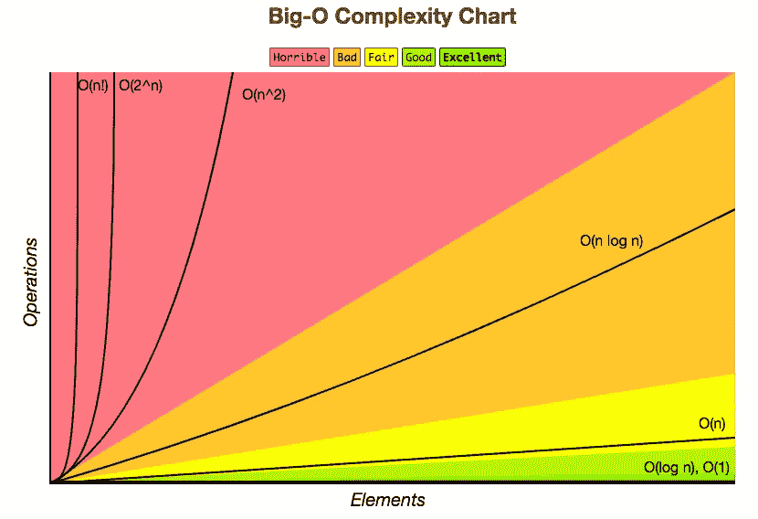

# 找到丢失的号码:我如何回答，我应该如何回答

> 原文：<https://itnext.io/find-the-missing-number-how-i-answered-it-how-i-shouldve-answered-it-c9dc81698079?source=collection_archive---------4----------------------->



哪个球不见了？图片来源:90%维基百科，9% photopea.com，1%我

在初创公司 XYZ 的一次现场技术面试中，有人问了我以下问题:

> 给你一个由 99 个整数组成的数组。它正好缺少 1 到 100 范围内的一个整数，并且未排序。写一个函数`findMissingNumber(arr)`来寻找丢失的整数。

面试官(旁白:他非常友好)然后让我尽我所能解决问题，不要担心效率。

# 我是如何解决的

我建议我接下来要做的第一件事，就是对我的数组进行升序排序，然后写一个从 1 到 100 的 for 循环，一旦 for 循环的索引和数组在给定索引减 1 处的值不匹配，我就返回这个索引。

我最后写下了下面的内容(在纠正了那些讨厌的一个一个的错误之后，比如`<=`对`<`和`i = 0`对`i = 1`

```
const findMissingNumber = (arrayWithMissingInteger) => {
  const sortedArr = arrayWithMissingInteger.sort((a, b) => {
    return a - b;
    }
  );

  for (let i = 1; i <= 100; i++) {
    if (sortedArr[i - 1] !== i) {
      return i;
    }
  }
}
```

他接着说事情看起来不错，然后让我分析运行时。然后我告诉他，自从我排序后，我的运行时现在是在`O(n log n)`。



对一个数组进行排序的开销从 O(n)跳到 O(n log n)[http://bigocheatsheet.com/](http://bigocheatsheet.com/)

然后他继续告诉我，有一种方法可以让运行时间降低到`O(n)`，然后我就紧张了。然后他给了我一个暗示，让我试着“总结经验”在一些玩笑之后，我决定解决这个问题的一个小版本，看看我是否能把它放大。

我在白板上写了以下内容:

```
const arrayWithAllNumbers = [1, 2, 3];const arrayWithMissingNumber = [3, 1];(1 + 2 + 3) - (3 + 1) = 2
```

我松了一口气，然后告诉他，我会把从 1 到 100 的所有数字加起来，然后用我的`arrayWithMissingNumber`之和减去那个数，就得到答案。

他没有让我写下代码，因为他似乎认为我已经了解了全局，但我会写下以下内容:

```
const findMissingNumber = (arrayWithMissingInteger) => {
  let sum = 0;
  for (let i = 1; i <= 100; i++) { sum += i }

  let missingIntSum = 0;
  for (int of arrayWithMissingInteger) { missingIntSum += int } return sum - missingIntSum;
}
```

然而，他确实温和地提醒我如何算出从 1 到 100 的总数。我反驳说我*猜*我就用一个如上的 for-loop 就好了，他礼貌的笑了(伏笔！)然后我们开始解决下一个问题。几个小时后，我开车回家，对这个问题感觉很好。我向他展示了勇气和勇气！

# 我应该如何解决它:三角级数

我回到家，然后脱下我最近买的商务休闲装，放松了一下，在谷歌上搜索了一下这个问题，并继续学习关于[三角系列](https://www.interviewcake.com/concept/java/triangular-series)。

事实证明，如果我们有一系列从 1 开始并随每个数字增加 1 的整数，并且我们知道最后一个数字`n`是什么，则该系列的总和减少到:∑ = `(n^2 + n) / 2`

哦……我要把这个写在博客上。

这在派对上是一个很酷的魔术。

```
[1, 2, 3, 4, 5]1 + 2 + 3 + 4 + 5 = 15(5^2 + 5) / 2 = 15=========================[1, 2, 3 ... 100]1 + 2 + ... 99 + 100 = ??(100^2 + 100) / 2 = 5050
```

如果我知道这一点，(或者奇迹般地我记得休斯女士八年级几何课上的一堂课)，我会在白板上写下如下内容:

```
const findMissingNumber = (arrayWithMissingInteger) => {
  let sum = (Math.pow(100, 2) + 100) / 2; for (int of arrayWithMissingInteger) { sum -= int } return sum;
}
```

这让我只遍历一个包含 99 个整数的数组，而不是遍历两个包含 100 个整数和 99 个整数的数组来获取缺失的数字。

# 结束语

总的来说，回答这个问题对我来说是一个道德上的胜利。面试官和我建立了友好的关系，感觉更像是结对编程会议，我们一起逐步优化解决方案，我向他展示了我可以通过解决问题的一个较小版本来解决问题。

不知道三角级数在我的头顶，我可以接受，只是继续前进。从好的方面来说，如果我发现自己在打台球，发现正好有一个球从三角架上不见了，我会知道该怎么做。

*感谢阅读！请随意在下面留下一些掌声！*