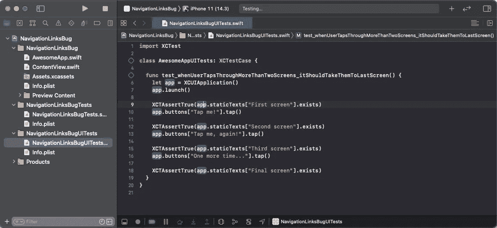
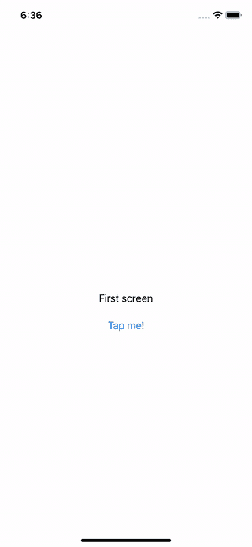
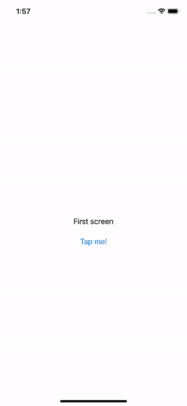
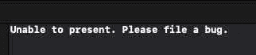

# 发现并报告 SwiftUI 错误

> 原文：<https://itnext.io/finding-and-reporting-a-swiftui-bug-e4e7788ab7d8?source=collection_archive---------2----------------------->



**TL；**博士:SwiftUI 2.0 有一个 bug，出现在 iOS 版本 14.5 及以上，当你在同一个 SwiftUI 视图中有两个以上的 NavigationLink 时，你的 navigation link 逻辑会开始以一种意想不到的方式重定向。

# 介绍

最近，我和我的搭档承担了在我们内部的 iOS 应用程序中构建用户入职体验的任务。这种体验的要求包括使用户能够来回导航，以及由于 API 调用，两次弹出(返回到父视图)。

由于我们的 iOS 应用程序中的大部分 UI 开发都是使用 SwiftUI 构建的，我们认为可以轻松使用 SwiftUI 的可编程 [**NavigationLinks**](https://developer.apple.com/documentation/swiftui/navigationlink) 来构建这种体验。

在这篇博客文章中，我将记录如何重现我和我的一对在 SwiftUI 2.0 中发现的一个 bug，其中有两个以上的 NavigationLinks(一个通用工作流)会破坏 iOS 14.5+中的导航逻辑，以及如何向苹果报告这个 bug。

*顺便说一句，如果你想跟随你身边的代码，我已经在*[***GitHub***](https://github.com/tjmaynes/gists/tree/main/swift/swiftui-navigation-links-bug)*上提供了这个项目的源代码。*

# 设置

为了重现这个 bug，让我们按照 [**红绿重构**](https://www.codecademy.com/articles/tdd-red-green-refactor) 开始，用 Xcode 编写我们第一个失败的 XCUITest 测试，如下所示:

在我们的 UI 测试中，我们希望能够点击四个不同的屏幕(“第一个屏幕”、“第二个屏幕”、“第三个屏幕”和“最后一个屏幕”)。在运行 UI 测试之后，我们期望看到我们的 UI 测试失败，因为我们还没有实现使这个 UI 测试通过的代码。现在我们是红色的，我们可以继续编写实现代码，使我们的 UI 测试绿色化。

# 输入导航链接

我们决定使用 SwiftUI[**navigation links**](https://www.hackingwithswift.com/quick-start/swiftui/how-to-use-programmatic-navigation-in-swiftui)，因为它使开发人员能够以编程方式在多个 swift ui 视图之间导航。使用导航链接有多种方式，包括:

*   像按钮一样使用 NavigationLink(非编程方式)
*   使用 NavigationLink 的`isActive`以编程方式控制一个导航链接
*   使用 NavigationLink 的`tag`和`selection`以编程方式控制多个导航链接

对于我们的特定用例，通过使用`NavigationLinks`的`tag`和`selection`特性来使我们的 UI 测试通过是有意义的。因此，我们开始编写我们的实现。

首先，我们为 AwesomeApp 添加了一个新的`Scene`，以便在启动时加载。

接下来，在一个名为`ContentView.swift`的文件中，我们将创建一个名为`ButtonView`的可重用视图，它包含一个文本标题和一个可点击的按钮，这样用户就可以导航到不同的屏幕。

接下来，我们创建了我们的`ContentView`，它将负责编排`ButtonViews`到`NavigationLink`之间的导航流。为了实现这一点，我们设置了一个名为`selection`的`State`变量，我们将在用户点击每个屏幕时更新该变量(从而更新状态以显示下一个视图),然后为每个`NavigationView`分配一个`tag`,这样当`selection`更新时，SwiftUI 将根据其标签将用户重定向到正确的`NavigationLink`目的地。

我们现在应该可以运行我们的 UI 测试了。如下图所示。



我们发现我们的 UI 测试通过了，通过在模拟器中打开应用程序并看到一切都相应地工作，我们现在准备好推进到管道。最终，我们发现所有东西都通过了我们的管道！那么，我们到此为止… *对吗*？

# 虫子

我们让项目经理知道我们的故事已经准备好接受 QA 了，他们可以从 [**AppCenter**](https://appcenter.ms/) 下载最新的 iOS QA 版本。不到五分钟后，我们从 Product 得到一条消息，说故事变得越来越`restarted`(我们的 backlog 在[**Pivotal Tracker**](https://www.pivotaltracker.com/)中)因为体验没有起作用。我们的 PM 甚至包括他们所经历的屏幕记录，正如你所猜测的，这与我们在 iOS 模拟器中看到的体验不同。

在与我们的项目经理反复沟通后，我们发现我们的项目经理运行的是最新的 iOS 版本(目前是 iOS 14.7.1)，所以我们下载了最新版本的 Xcode(由于客户端限制，我们无法在客户端机器上轻松完成)，并在 iOS 14.5 模拟器上运行该应用程序。**像变魔术一样**我们能够重现 bug，并且看到我们的 UI 测试也没有通过！*下面是 iOS 14.5 模拟器中出现故障的屏幕截图:*



我们甚至在控制台窗口中收到苹果公司的错误报告:



我们能够“打开”和“关闭”bug，当我们注释掉第三个`NavigationLink`时，这意味着为了控制 SwiftUI 中多个视图的流动，并支持 iOS 设备 14.5 和更高版本。

# 打开错误报告

为了向苹果披露我们的 bug，我们先登录苹果的 [**反馈助手**](https://feedbackassistant.apple.com/) 门户。接下来，在左上角，我们将点击“新帖子”图标。接下来，我们将从预定义的“反馈起点”列表中选择“开发人员工具”。在此之后，我们将有一个新的“反馈表”需要填写。

对于我们，我们将在反馈表中输入以下内容:

*   这个 bug 的“描述性标题”将是“SwiftUI——无法在同一个 swift ui 视图中使用两个以上的 NavigationLinks”。
*   我们在“SwiftUI 框架”中看到了这个问题。
*   我们正在报告 SwiftUI 框架的“不正确/意外行为”

接下来，我们将添加一个有用的描述。有用的描述有很多形状和大小，所以最好有一些结构来帮助苹果开发者解决你报告的问题。以下是您可以遵循的格式示例:

```
**# Expected behavior:**
I should be able to...**# Unexpected behavior:**
It is doing this instead...**# Reproducible steps:**
1\. Step 1
2\. Step 2
```

试着把你自己放在苹果支持团队的位置上…你需要什么来重现这个 bug？

对于我们来说，让我们将以下内容作为对 Apple 支持团队的有用描述:

```
Reproducible builds:
The bug exists in iOS 14.5+ simulators and devices.

Expected behavior:
I should be able to programmatically control the flow of multiple NavigationLinks destinations (within the same View) using `selection` and `tag`.

Unexpected behavior:
When a third NavigationLink is added to a SwiftUI View, the second NavigationLink will redirect back to the NavigationView root and not to the third NavigationLink destination.

Notes:

I've included a SwiftUI test that should fail (thus reproducing) the bug when running the XCUITest suite in an iOS 14.5 simulator. This XCUITest suite passes when running in an iOS 14.3 simulator.

```swift
import XCTest

class AwesomeAppUITests: XCTestCase {

  func test_whenUserTapsThroughMoreThanTwoScreens_itShouldTakeThemToLastScreen() {
    let app = XCUIApplication()
    app.launch()

    XCTAssertTrue(app.staticTexts["First screen"].exists)
    app.buttons["Tap me!"].tap()

    XCTAssertTrue(app.staticTexts["Second screen"].exists)
    app.buttons["Tap me, again!"].tap()

    XCTAssertTrue(app.staticTexts["Third screen"].exists)
    app.buttons["One more time..."].tap()

    XCTAssertTrue(app.staticTexts["Final screen"].exists)
  }
}
```

```swift
import SwiftUI

struct ButtonView: View {
  let message: String
  let buttonTitle: String
  let onTap: () -> Void

  var body: some View {
    VStack {
      Text(message).padding()

      Button(action: { onTap() }) {
        Text(buttonTitle)
      }
    }
  }
}

struct ContentView: View {
  @State private var selection: String?

  var body: some View {
    NavigationView {
      VStack {
        ButtonView(
          message: "First screen",
          buttonTitle: "Tap me!",
          onTap: { self.selection = "view-2" }
        )

        NavigationLink(
          destination: ButtonView(
            message: "Second screen",
            buttonTitle: "Tap me, again!",
            onTap: { self.selection = "view-3" }
          ),
          tag: "view-2",
          selection: self.$selection
        ) { EmptyView() }

        NavigationLink(
          destination: ButtonView(
            message: "Third screen",
            buttonTitle: "One more time...",
            onTap: { self.selection = "view-4" }
          ),
          tag: "view-3",
          selection: self.$selection
        ) { EmptyView() }

        NavigationLink(
          destination: Text("Final screen"),
          tag: "view-4",
          selection: self.$selection
        ) { EmptyView() }
      }
    }
  }
}
```
```

该描述包括预期和意外的行为、注释和一些可重复的 Swift 测试案例和代码。最后，让我们将视频记录(动画 gif)也上传到反馈表中。

> 你可以在这里 找到我在 OpenRadar 门户 [**报告的 bug。**](https://openradar.appspot.com/radar?id=5059954041946112)

# 结论

如果您碰巧在 SwiftUI 或您所依赖的任何标准库和/或依赖项中遇到一个 bug，请尝试花时间在博客帖子中记录该 bug。这有助于加深对你的工具链的理解，提高你的沟通技巧，并且你可能会帮助另一个面临同样问题的孤独流浪者。此外，在适当的问题跟踪门户中报告 bug 也会非常有帮助。

如果你愿意支持我成为一名作家，可以考虑注册成为一名灵媒。只要每月 5 美元，你就可以无限制地使用媒体。感谢你阅读我的博文！