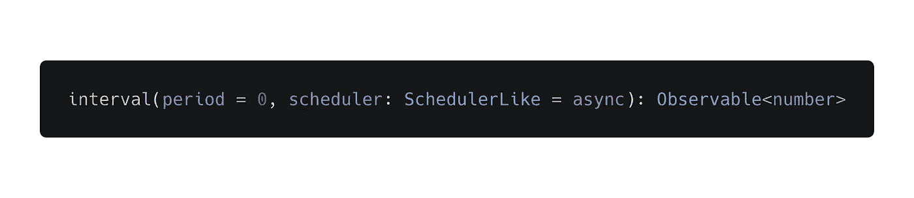
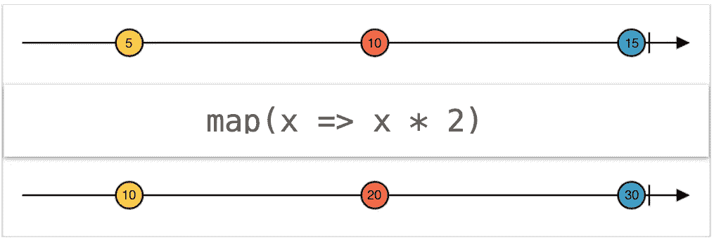
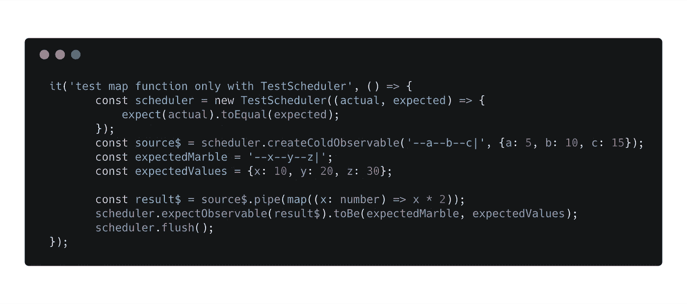
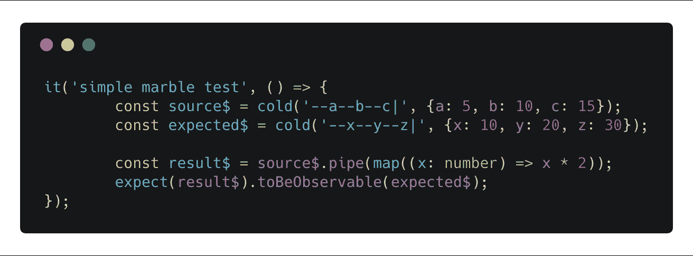
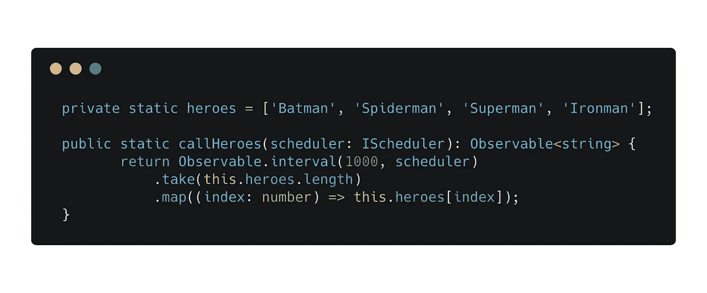
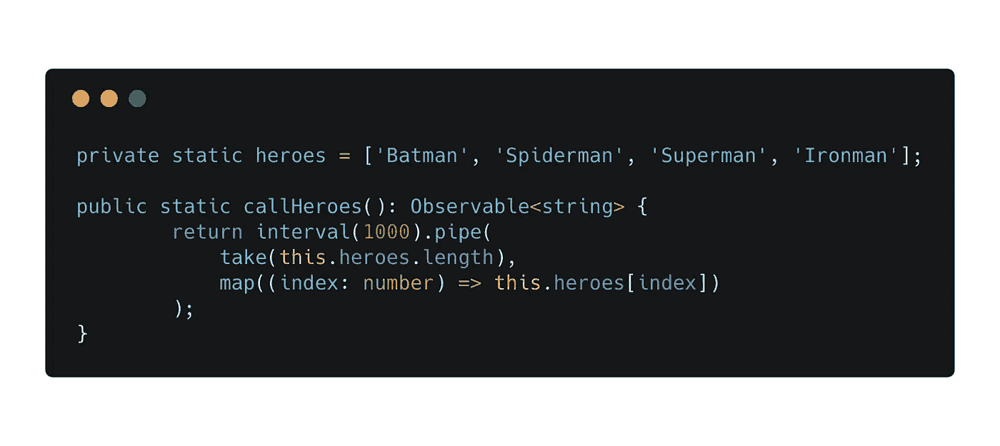
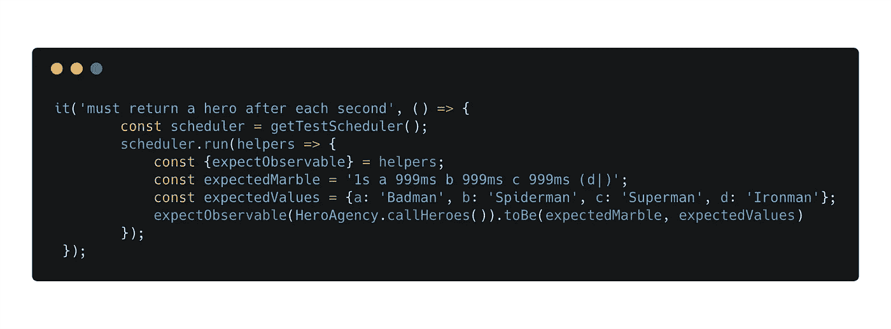

# 关于 RxJS marble 测试和 TestScheduler 的发现

> 原文：<https://itnext.io/findings-about-rxjs-marble-testing-and-the-testscheduler-b23c6bdf6b49?source=collection_archive---------3----------------------->

最近，我编写了一个定制的 Rx 操作符，用于重试失败的 http 请求。RxJS 允许我们只用几行代码就处理这样的异步问题，这种方式让我非常喜欢这个库。但是我们如何测试这样的操作链呢？

测试异步代码很难。

老实说，我经常需要更多的时间来为我的流编写单元测试，而不是实现有效的代码本身。

我开始问自己，我们如何以一种可读性更强、耗时更少的方式编写包含异步操作符(如 interval、debounce 或 timer)的测试？

我终于撸起袖子，做了一件很久以前就想做的事。在我的一个生产项目中引入大理石测试。

# 大理石测试

大理石测试是一种测试我们的

大理石测试本身并不难，而且有很多很好的资源。但是我想对生态系统、TestScheduler 以及版本 5 和版本 6 之间的差异有一个总体的了解。这些主题很少被记录，我花了比预期更多的时间来研究它们。这篇博文提供了我在路上遇到的一些发现。

## TestScheduler 作为基本概念

计划者及时组织活动。这在 RxJS 中意味着控制事件发射顺序。在大多数情况下，您不必考虑调度程序，因为 RxJS 团队已经为我们做了。尽管我们应该知道调度程序的一般用途，并且我们还应该知道向运营商提供调度程序的可能性。我们来看看“音程”的签名。

操作符接受调度程序作为可选的最后一个参数，默认为异步调度程序。在 Rx 中有 6 个内置的调度程序。其中之一是 TestScheduler 派生的 VirtualTimeScheduler。在测试过程中，我们希望使用虚拟时间而不是真实时间。我们可以通过传入一个 TestScheduler 来实现。

TestScheduler 有能力改变“时间的含义”。它使我们能够以同步的方式测试异步操作。根据经验，在测试期间，我们应该将 TestScheduler 传递给所有调度器没有缺省为 null 的操作符。但是 TestScheduler 为我们提供了更多。

如果我们看一下 TestSchedulers API，我们可以看到像 createColdObservable 或 createHotObservable 这样的方法接受大理石图作为输入。我们能使用这些方法来编写大理石测试吗？

## 大理石测试，有和没有第三方图书馆

在我们使用 TestScheduler 的方法编写 marble 测试之前，让我们首先使用一个 marble 图来可视化我们的测试。

我们想测试一个简单的 map 函数，它接受一个值并对其进行加倍。我们可以看到输入流发出值 5、10 和 15，然后完成。然后，该流被映射到结果流 10、20 和 30。让我们尝试只使用 TestScheduler 来实现这个测试。

这份试卷包含许多样板文件。首先，我们需要传递一个函数，该函数对实际可观察值和预期值做出断言。然后，我们需要手动调用 flush 来提示调度程序执行其所有排队的操作。测试感觉臃肿。这就是第三方库的用武之地。像 jasmine-marbles 或 rxjs-marbles 这样的库只是 TestScheduler 周围的薄薄的包装器，它允许我们以一种可读性更好、更简洁的方式编写测试。让我们来看看用茉莉-弹珠写的同一个例子。

外面有不同的大理石图书馆。茉莉弹珠，rxjs 弹珠，jest 弹珠等等。茉莉弹珠很常见，也用在很多例子和演示中。Rxjs-marbles 的优势在于它可以用于不同的测试框架。

**测试调度器的发展**

因此，我们已经介绍了 TestScheduler 的基础知识以及它为我们提供了什么。需要注意的是，RxJS 5 和 RxJS 6 有很多不同之处。关于 v5 TestScheduler 的文档很难找到。这样做的原因是因为它旨在供库的作者而不是库的消费者使用。官方的 Rx 文档提到，对于库的用户来说，一些特性不能很好地工作或者根本不能工作。什么？

但是还有希望。通过 RxJS 6，他们改进了 TestScheduler。虽然用 RxJS 5 测试操作符链很难，但版本 6 提供了更令人愉快的测试体验。

## ***testScheduler.run(回调)***

在 TestScheduler 上引入 run 方法是一个非常重要的特性，它解决了困扰我很久的问题。当我们用以前版本的 TestScheduler 测试异步代码时，我们必须改变我们的函数，使它接受调度程序作为参数。

我真的不喜欢这种方式。感觉我把测试和生产代码混在一起了。我们如何用新的 TestScheduler 及其 run 方法做得更好？所有使用 AsyncScheduler(如 debounce 或 timer)的操作符在 run 方法中执行时都会自动使用 TestScheduler。这意味着我们的流自动使用虚拟时间而不是真实时间。

因此，让我们为 RxJS 6 重写相同的功能，删除 scheduler 作为参数，并用 TestScheduler 的 run 方法测试它。让我们也使用一些析构从运行方法回调助手参数中提取一些有用的助手方法。

注意我们是如何使用语法“1s a 999ms b 999ms c 999ms (d|)”的。这是 RxJS 6 的另一个很酷的功能，叫做“时间推进”。通常，当在 run 方法中运行时，一个“-”代表一个 1 ms 虚拟时间的帧。外面的“-”代表 10ms 的虚拟时间。使用时间推进语法，我们可以将虚拟时间推进毫秒(ms)、秒(s)甚至分钟(m)。这对于测试我们的流非常有用。当我们开始使用时间推进时，重要的是要知道，在流的开始，我们按 1s 处理，然后发出 a。发出 a 后，我们使用 999ms 而不是 1s。原因是 b 也使用了 1 毫秒的虚拟时间。

# 结论

大理石测试为我们提供了一个干净和全面的方法来测试和可视化我们的可观测量。弹珠本身被用在很多教程和教学中，因此被很好地记录下来。我发现很难概述 TestScheduler 本身、库和 TestScheduler 之间的区别以及版本 5 TestScheduler 和版本 6 TestScheduler 之间的区别。由于我们的项目仍然使用版本 5，我也损失了大量的时间让 marble 测试在更复杂的场景下工作，比如 http 重试操作符。我希望这篇博文能给你提供我开始时所遗漏的概述。

喜欢你读过的吗？如果你喜欢这篇博客，请鼓掌，分享或关注我。想了解更多关于可观察对象的内部工作方式吗？或者你甚至想学习如何编写你自己的可观察对象吗？然后看看我在 itnext 上的文章“揭开可观察事物的神秘面纱”。

 [## 揭开可观察事物的神秘面纱

### 实用的方法

itnext.io](/demystifying-observables-979a63763eb1) 

> 你想让你的 Angular、RxJS、TypeScript 和 JavaScript 技能更上一层楼吗？不要错过查看我的 [*Youtube 频道*](https://www.youtube.com/channel/UCFT4YVZl7AFia7rZBTEvavw) *的机会。*

[https://www.youtube.com/channel/UCFT4YVZl7AFia7rZBTEvavw](https://www.youtube.com/channel/UCFT4YVZl7AFia7rZBTEvavw)