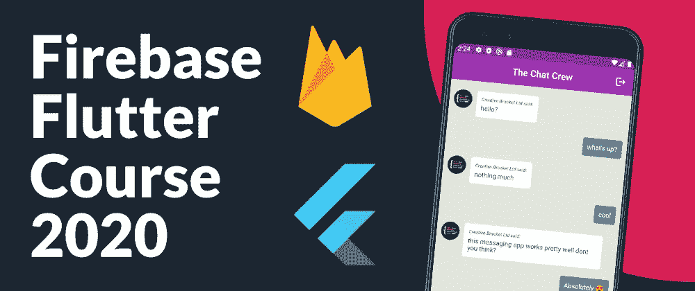
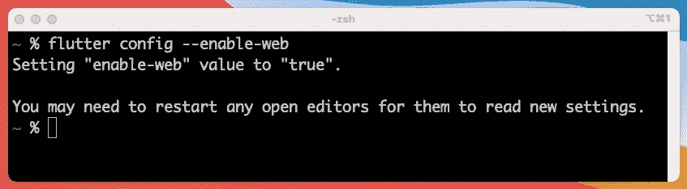
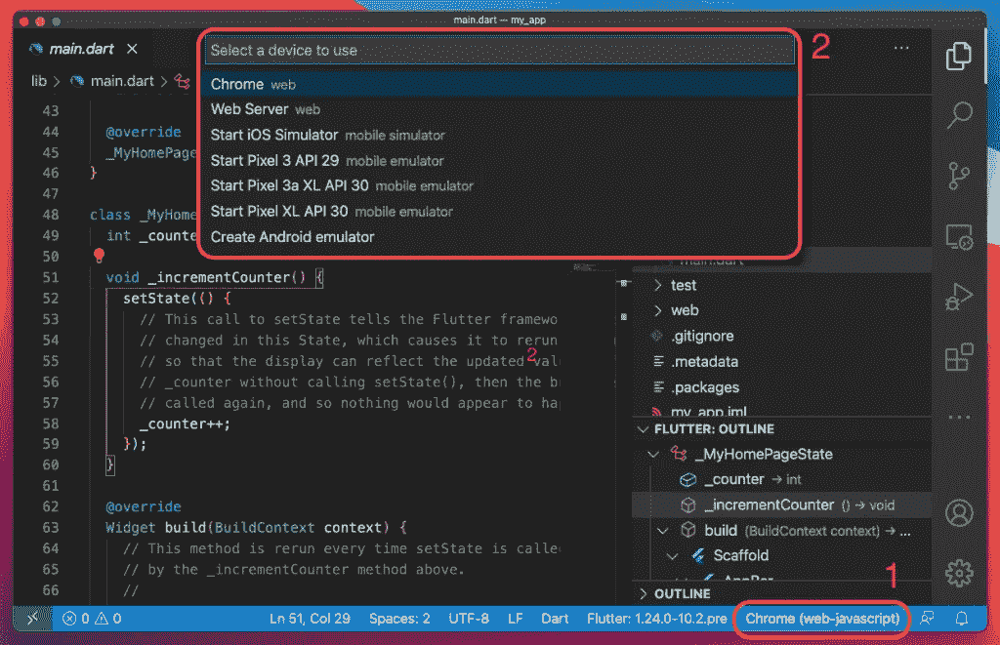
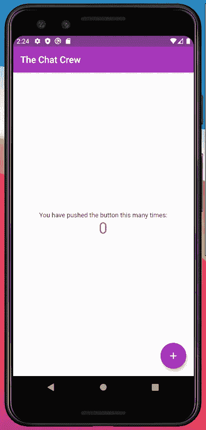
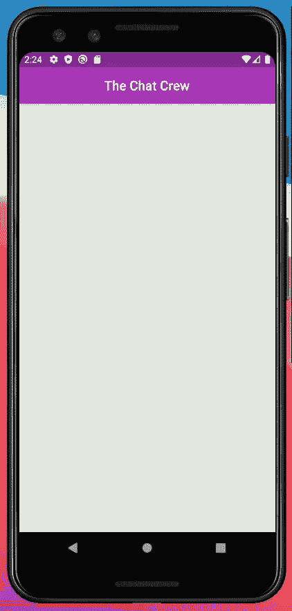
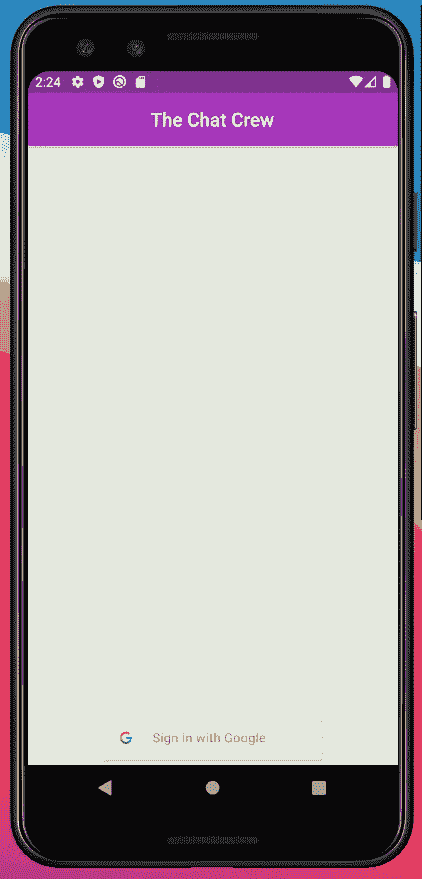

# Firebase 认证和 Flutter 2020 完整课程

> 原文：<https://itnext.io/firebase-authentication-and-flutter-full-course-2020-2d6ed32810a5?source=collection_archive---------2----------------------->

## 为 Android 和 Web 平台构建一个消息应用程序



Firebase 是一个平台，提供快速构建应用程序所需的基础设施。在[之前的](https://creativebracket.com/fullstack-flutter-mongodb-mini-course/)迷你课程中，我们用 Flutter 和 MongoDB 构建了一个移动和网络应用。在这个完整的课程中，我们将构建一个带有 Firebase 身份验证和 Flutter 的消息应用程序。

我们从零开始建立一个 Flutter 项目，并构建消息传递 UI 的一般外观和感觉。然后，我们创建一个 Firebase 项目，同时设置和配置我们的 Android 和 Web 应用程序。我们将使用 [**google_sign_in**](https://pub.dev/packages/google_sign_in) 包和 Cloud Firestore 设置 Firebase 身份验证，以存储我们的聊天消息。我们将学习如何设置正确的安全规则，以确保只有经过身份验证的用户才被允许向我们的集合中写入数据。

# 建立颤振项目

在创建一个 Flutter 项目之前，我们需要启用 Flutter Web 支持，因为我们也将在 Web 浏览器中运行这个应用程序。运行以下命令以启用 Flutter Web 支持:

```
$ flutter channel beta # checkout the beta channel
$ flutter upgrade
$ **flutter config --enable-web**
```



启用 Flutter Web 后，您可以继续创建您的 Flutter 项目:

```
$ flutter create my_messaging_app
```

在这个过程完成后，在你选择的编辑器中打开目录，无论是 Visual Studio 代码还是 Android Studio 作为*推荐的*编辑器用于 Flutter 开发。

确保为编辑器安装了相关的扩展。对于 Visual Studio 代码，您需要 [Dart 代码扩展](https://dartcode.org/)。对于 Android Studio，在**配置** > **插件**下的插件库中搜索“Flutter”。

# 运行颤振项目

使用下面 Visual Studio 代码中的步骤启动任何设备模拟器。这假设您已经使用 Android Studio 中的 AVD 管理器或任何其他方式设置了列出的模拟器。确保您选择的模拟器启用了 Play Store 支持。



您可以通过在终端中键入`flutter run`命令并点击`Enter`来运行一个 Flutter 项目。或者，您可以使用编辑器控件来运行您的 Flutter 应用程序。

# 为 Firebase 身份验证构建 UI

打开 **lib/main.dart** ，重构`MyApp` StatelessWidget，如下所示:

```
class MyApp extends StatelessWidget {
  @override
  Widget build(BuildContext context) {
    return MaterialApp(
      title: '**The Chat Crew**', // <== Change this line
      **debugShowCheckedModeBanner: false**, // <== Add this line
      theme: ThemeData(
        primarySwatch: **Colors.purple**, // <== Change this line
      ),
      home: MyHomePage(title: '**The Chat Crew**'), // <== Change this line
    );
  }
}
```



通过移除`_incrementCounter()`方法和`_counter`字段来重构`_MyHomePageState`类。

```
class _MyHomePageState extends State<MyHomePage> {
  // Remove commented out lines
  **// int _counter = 0;**  **// void _incrementCounter() { 
  // setState(() { 
  //   _counter++; 
  // }); 
  // }**   @override Widget build(BuildContext context) { ... }
}
```

在`build()`方法中，移除`Scaffold()`小部件的`floatingActionButton:`部分和在`Column()`子部件中呈现的两个`Text()`小部件。事实上，一旦去掉不必要的部分，您应该会看到下面的代码:

```
class _MyHomePageState extends State<MyHomePage> {
  @override Widget build(BuildContext context) {
    return Scaffold(
      appBar: AppBar(
        title: Text(widget.title),
        **centerTitle: true**, // <== Added this line
      ),
      **backgroundColor: Color(0xffdee2d6)**, // <== Added this line 
      body: Column(
        mainAxisAlignment: MainAxisAlignment.center,
        children: <Widget>[],
      ),
    );
  } 
}
```



该应用程序的应用程序栏下方的部分由一个显示聊天消息的消息墙和底部区域组成，底部区域将显示登录按钮或消息表单。

消息墙将呈现在一个`Expanded()`小部件中，因为它占据了大部分屏幕空间。

```
body: Column( 
  mainAxisAlignment: MainAxisAlignment.center,
  children: <Widget>[
    Expanded(
      child: Container(),
    ),
  ],
),
```

要显示登录按钮，安装[**flutter _ Sign in _ button**](https://pub.dev/packages/flutter_signin_button)包:

```
$ pub global activate crawl # install the crawl cli 
$ **crawl add flutter_signin_button**
```

导入 **flutter_signin_button** 并在`Expanded()` widget 后显示:

```
**import 'package:flutter_signin_button/flutter_signin_button.dart';**
 .. body: Column(
  mainAxisAlignment: MainAxisAlignment.center,
  children: <Widget>[
    Expanded(
      child: Container(),
    ),
    **Container**(
      padding: const EdgeInsets.all(5),
      child: **SignInButton**(
        **Buttons.Google**,
        padding: const EdgeInsets.all(5),
        onPressed: () {},
      ),
    ),
  ],
),
```

**停止整个应用程序并重新启动**，以便加载在登录按钮上显示 Google 徽标所需的图像资产。



[**观看完整课程**](https://youtu.be/oyVDDRczuJI) 了解完成签到和签出流程的详细信息。

# 分享是关怀🤗

如果你喜欢读这篇文章，请通过你的社交媒体渠道分享。还可以查看并 [**订阅我的 YouTube 频道**](https://youtube.com/c/CreativeBracket) ( *也点击铃铛图标*)获取 Dart 和 Flutter 的全栈开发教程。

[**订阅时事通讯**](http://eepurl.com/gipQBX) 获取我的免费 35 页**Dart**电子书入门，并在新内容发布时得到通知。

**喜欢，分享和** [**关注我**](https://twitter.com/creativ_bracket) 了解更多关于 Dart 的内容。

*原载于 https://creativebracket.com*[](https://creativebracket.com/firebase-authentication-and-flutter-full-course-2020/)