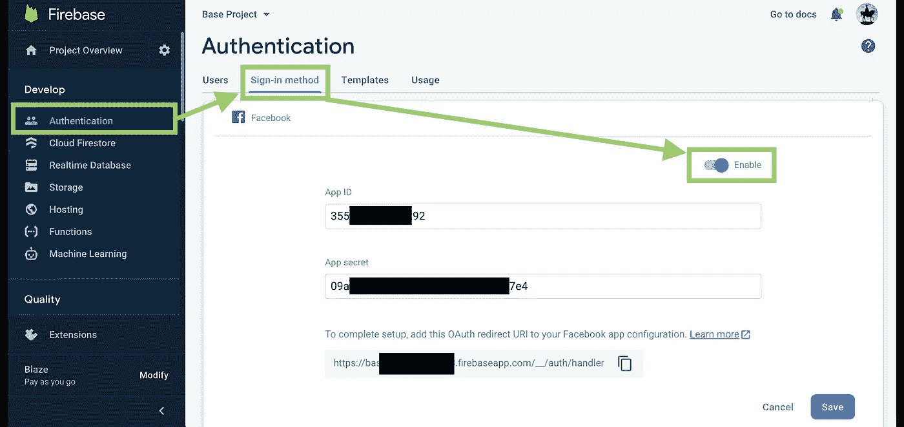
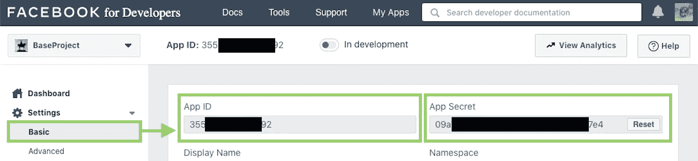
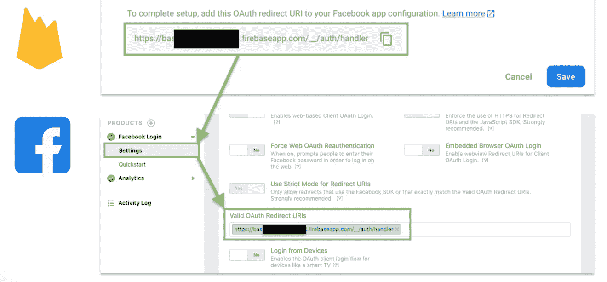
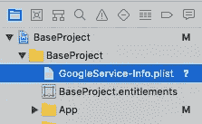
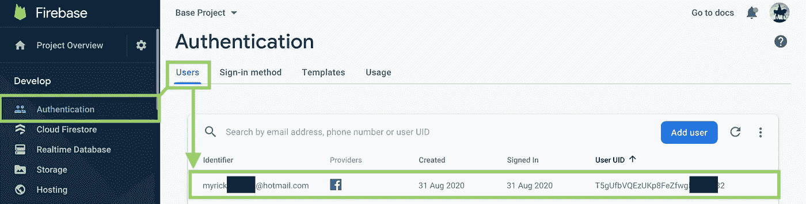

# Firebase 身份验证—脸书 iOS

> 原文：<https://itnext.io/firebase-authentication-facebook-i-93aaf489839d?source=collection_archive---------5----------------------->

irebase 认证是一个在 Firebase 项目中管理用户身份的工具。它提供了很多认证方法，包括[电子邮件/密码](https://medium.com/firebase-developers/ios-firebase-authentication-sdk-email-and-password-login-6a3bb27e0536)、[电话号码](/firebase-phone-auth-in-ios-3ae060d80ecc?source=your_stories_page---------------------------)和脸书等。脸书登录是现代应用程序中非常常见的选项。App 通过实现脸书登录功能可以受益匪浅。

开发者必须首先创建 [Firebase](https://firebase.google.com/) 和[脸书](https://developers.facebook.com/)项目，以完成认证过程。实现整个功能的步骤只有 9 个步骤。开始吧！

# 程序

## 1.项目初始化

在 [Firebase 控制台](https://firebase.google.com/)创建一个 Firebase 项目，在[脸书开发者控制台](https://developers.facebook.com/)创建一个脸书项目。

## 2.启用脸书登录方法

导航到“身份验证”会话的“登录方法”选项卡，并启用脸书登录方法。

在脸书开发者控制台可以找到**应用 ID** :

## 3.复制 OAuth 重定向 URI 到脸书项目设置

## 4.Firebase 项目设置

使用`GoogleService-Info.plist`将您的 iOS 应用程序链接到 Firebase 项目，T0 是在您的应用程序注册过程中生成的文件，包含重要信息，如`PROJECT_ID`、`BUNDLE_ID`和`API_KEY`。

必须将 GoogleService-Info.plist 添加到您的目标中

## 5.添加 Firebase 身份验证依赖项

Firebase 身份验证 SDK 可以由 CocoaPods 添加。将`pod 'Firebase/Auth'`包含在`Podfile`中，之后运行`pod install`。

## 6.初始化 Firebase SDK

在应用程序开始时，在`AppDelegate.swift`文件中初始化 Firebase 配置，见第 8 行。

## 7.实现脸书登录 SDK

 [## Swift —脸书 iOS 登录 SDK

### 脸书 SDK 允许用户登录并授予应用程序权限，以便从脸书检索个人信息…

itnext.io](/swift-facebook-ios-login-sdk-dada412d8341) 

脸书为用户提供了一个易于使用的登录 SDK 来登录并授予应用程序检索他/她的个人信息的权限。SDK 默认登录按钮或自定义按钮都可以用来触发登录功能。默认登录按钮更容易实现。

确保`LoginButtonDelegate`的`loginButton(_: didCompleteWith: error:)`被正确实现，以便成功的登录回调可以被捕获，Firebase 认证过程(下一步)可以被连续调用。

## 8.使用脸书访问令牌登录 Firebase

通过脸书 SDK 成功登录后，生成一个`AccessToken`。`tokenString`属性可以用来识别用户。Firebase Auth SDK 将使用它在 Firebase 数据库中创建一个用户。

## 9.验证是否创建了 Firebase 用户

在所有过程之后，新的用户数据应该显示在“身份验证”会话的“用户”选项卡上。

# 摘要

1.  Firebase 提供了脸书身份验证选项，可以使用脸书访问令牌创建用户帐户。
2.  开发人员必须首先在开发人员控制台上创建 Firebase 和脸书项目。必须在 Firebase 控制台上启用脸书登录选项。
3.  开发人员必须首先实现脸书登录 SDK，并在`LoginButtonDelegate`中捕获登录成功回调。

# 你可能会喜欢

 [## Swift —脸书 iOS 登录 SDK

### 脸书 SDK 允许用户登录并授予应用程序权限，以便从脸书检索个人信息…

itnext.io](/swift-facebook-ios-login-sdk-dada412d8341)  [## iOS Swift 脸书共享

### 如今，通过脸书分享是如此普遍。脸书为开发者提供了一个共享 SDK 来实现共享到…

itnext.io](/ios-swift-facebook-sharing-e473e6b2fc48) 

# 参考

## 1.Firebase 脸书登录官方文档

 [## 在 iOS | Firebase 上使用脸书登录进行身份验证

### 您可以让您的用户使用他们的脸书帐户通过 Firebase 进行身份验证，方法是将脸书登录集成到您的…

firebase.google.com](https://firebase.google.com/docs/auth/ios/facebook-login) 

## 2.脸书登录官方文档

 [## iOS -脸书登录-文档-开发人员的脸书

### 当人们使用脸书登录到你的应用时，他们可以向你的应用授予权限，以便你可以检索信息或…

developers.facebook.com](https://developers.facebook.com/docs/facebook-login/ios) 

欢迎您通过[Twitter @ my rik _ chow](https://twitter.com/myrick_chow)关注我，了解更多信息和文章。感谢您阅读这篇文章。祝您愉快！😄