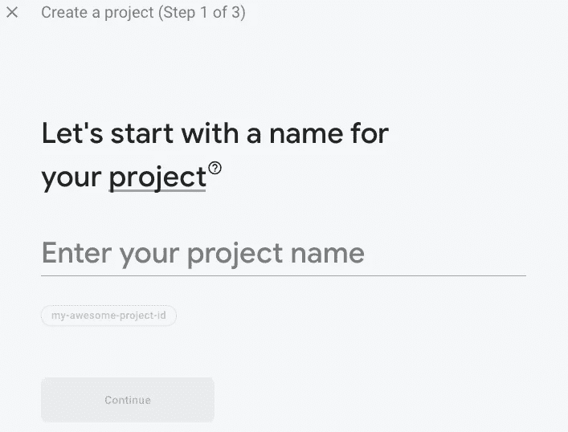
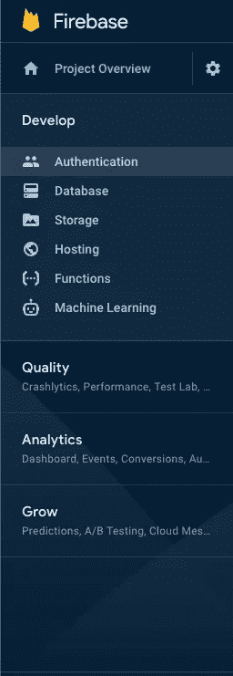
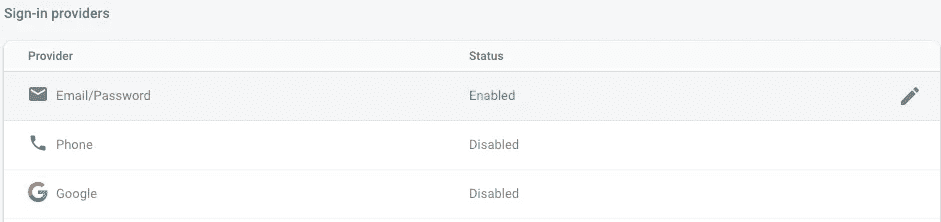
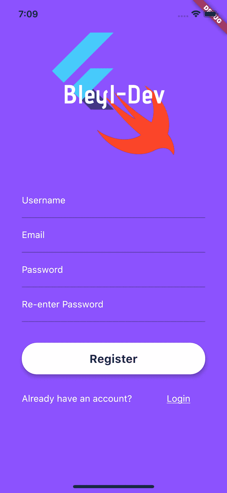

# Flutter 2020 中的 Firebase 认证变得简单

> 原文：<https://itnext.io/firebase-authentication-in-flutter-2020-made-simple-19eaad197bfe?source=collection_archive---------1----------------------->


当我第一次开始开发 flutter 时，我进入并开始熟悉的第一个核心主题是 Firebase。这是 Flutter 工程师工具箱的核心部分，如果你想让你的应用不仅仅是视图，你必须知道这一点。

Firebase 是谷歌支持的工具，允许开发人员管理他们的移动和网络应用程序的认证。它还为开发人员提供了一种存储这些用户的数据、存储照片和其他文件的方式，并且是初创公司和小型开发人员的理想起点，因为定价模式可以随着您的应用程序而扩展。firebase 可以为您提供许多其他工具，例如分析、测试和云功能等等。然而，本文的重点是 Firebase 的核心和最初目的:身份验证。

如果你仍然需要为你的应用程序创建一个登录和注册界面，那么看看我在 youtube 上的“Flutter，start to finish”播放列表。

在你的 Flutter 项目中使用 Firebase 有 3 个关键部分:Firebase 配置、Flutter 应用配置和认证方法。

Firebase 配置和 Flutter 应用程序配置:首先，导航到[https://firebase.google.com。](https://firebase.google.com.)

如果您还没有创建 Firebase 项目，请点击“开始”按钮。


假设您还没有创建项目，那么继续创建一个新项目。您应该会被引导到如下所示的屏幕。



填写所要求的信息，然后一步一步地完成这些步骤。完成创建项目大约需要 30 秒钟。

完成后，您应该会被重定向到您的项目仪表板。然后，您需要选择“添加应用程序”按钮。


添加应用程序按钮

我们将不得不创建两个不同的应用程序连接到这个项目:一个 iOS 应用程序，一个 android 应用程序。

先说 iOS 的 app。

我们接下来要查找我们的应用程序的捆绑包 ID。这可以通过进入 Xcode 找到，点击你的项目“Runner”(有文件夹的 Xcode 标志)，在 General 选项卡上你应该看到“Bundle Identifier”。


将这个包 ID 复制到 Firebase 上提供的文本字段中，然后下载提供的 google 服务文件。然后，您希望将该文件放在 info.plist 文件所在的文件夹中。之后，您可以跳过剩余的 firebase 步骤，返回到您的仪表板。

恭喜您，您的应用程序现已设置为 iOS 通过 Firebase 认证。接下来，我们想对 Android 做同样的事情。

再次找到“添加应用”按钮，选择 android。


添加应用程序按钮

为了找到你的 android 应用的标识符，你将进入你的 flutter 项目，选择 android->app->buid.gradle，找到值“applicationId”。这是您要给 Firebase 的标识符。给你的应用取个名字，然后下载谷歌服务文件，放在你的 android->app 文件夹里。

按照 firebase 提供的步骤进行操作，以确保您的。gradle 文件中有正确的导入。

恭喜你。现在，您已经完成了应用程序 android 端的设置。

要完成我们的设置，还有最后一件事要做。在 Firebase 上，导航到如下所示的身份验证。



在“登录提供商”下，点击电子邮件和密码，并通过点击第一个开关启用它。这将允许我们使用用户的电子邮件和密码注册用户。



设置项目的最后一步是将必要的 firebase 包添加到我们的应用程序中。为此，请转到以下软件包页面:[https://pub.dev/packages/firebase_auth#-installing-tab-](https://pub.dev/packages/firebase_auth#-installing-tab-)。我们希望将以下依赖项(添加在第页找到的最新版本)添加到我们的。yaml 文件。

```
dependencies:   
    **firebase_auth: ^0.16.1**
```

运行命令:

```
flutter pub get
```

然后，我们希望将以下导入添加到我们的注册和登录屏幕。

```
**import** 'package:firebase_auth/firebase_auth.dart';
```

我们现在正式完成了 Firebase 和我们的应用程序的设置！我们终于可以继续讨论身份验证方法了。

身份验证方法:在我们的 Register 类中，我们希望修改我们的 button 小部件，以便“onpressed”方法如下所示:

```
onPressed: () **async** {
  **try** {
    FirebaseUser user = (**await** FirebaseAuth.*instance* .createUserWithEmailAndPassword(
            email: **_emailController**.**text**,
            password: **_passwordController**.**text**,)).**user**;
    **if**(user != **null**){
      UserUpdateInfo updateUser = UserUpdateInfo();
      updateUser.**displayName** = **_usernameController**.**text**;
      user.updateProfile(updateUser);
      Navigator.*of*(context).pushNamed(AppRoutes.*menu*);
    }
  } **catch** (e) {
    print(e);
    **_usernameController**.**text** = **""**;
    **_passwordController**.**text** = **""**;
    **_repasswordController**.**text** = **""**;
    **_emailController**.**text** = **""**;
    *//* ***TODO: alertdialog with error*** }
},
```

我将对此进行分解，以便对正在发生的事情有一个非常清楚的了解。

```
onPressed: () **async** {
  **try** {
  } **catch** (e) {
    print(e);}
},
```

我们需要我们的方法是异步的，因为我们将调用的 Firebase 方法将是未来的方法。我们还希望确保将所有内容都包含在 try，catch 语句中，因为我们希望在身份验证失败时捕获 firebase 抛出的任何错误。

```
**catch** (e) {
    print(e);
    **_usernameController**.**text** = **""**;
    **_passwordController**.**text** = **""**;
    **_repasswordController**.**text** = **""**;
    **_emailController**.**text** = **""**;
    *//* ***TODO: alertdialog with error*** }
```

在我们的 catch 语句中，我们希望在控制台中打印出我们的错误，以便在调试时我们可以看到正在发生的事情，然后我们希望获取我们的用户名字段、密码字段、重复密码字段和电子邮件字段，并将它们重置为空字符串，因为身份验证失败了。您还可以添加一个警告对话框，通过打印出“e”的值，让用户知道身份验证出了什么问题。

```
FirebaseUser user = (**await** FirebaseAuth.*instance* .createUserWithEmailAndPassword(
            email: **_emailController**.**text**,
            password: **_passwordController**.**text**,)).**user**;
```

“用户”被设置为等于尝试使用“createUserWithEmailAndPassword”方法创建新用户时得到的响应。如果失败，将会抛出一个错误。如果成功，那么“用户”将被设置为新创建的经过身份验证的用户。我传递我的电子邮件控制器和密码控制器，用户将它们作为我的参数填入。

```
**if**(user != **null**){
      UserUpdateInfo updateUser = UserUpdateInfo();
      updateUser.**displayName** = **_usernameController**.**text**;
      user.updateProfile(updateUser);
      Navigator.*of*(context).pushNamed(AppRoutes.*menu*);
    }
```

我们要做的最后一件事是添加给定的用户名，并将其设置为经过身份验证的用户的“显示名称”。我们通过利用“UserUpdateInfo”类来实现这一点。我们可以创建这个类的一个实例，并为“displayName”设置它的值，然后将它作为一个参数传递给 Firebase 的“updateProfile”方法，用于我们新验证的用户。这将更新用户显示名称，供我们将来使用。

完成后，我们可以导航到应用程序，因为我们已经完成了用户的创建和设置。

然后，我们想进入登录类，找到登录按钮的 onpressed 方法。最后，它应该看起来像下面这样。

```
onPressed: () **async** {
  **try** {
    FirebaseUser user =
    (**await** FirebaseAuth.*instance*.signInWithEmailAndPassword(
      email: **_emailController**.**text**,
      password: **_passwordController**.**text**,
    )).**user**;
    **if** (user != **null**) {
      Navigator.*of*(context).pushNamed(AppRoutes.*menu*);
    }
  } **catch** (e) {
    print(e);
    **_emailController**.**text** = **""**;
    **_passwordController**.**text** = **""**;
    *//* ***TODO: AlertDialog with error*** }
},
```

就像在我们的 register 类中一样，我们希望将“onpressed”方法的内容包装在一个 try catch 中，并捕捉任何错误消息，同时将我们的文本字段重置为空字符串。我们还想确保我们的方法是异步的。

```
FirebaseUser user =
    (**await** FirebaseAuth.*instance*.signInWithEmailAndPassword(
      email: **_emailController**.**text**,
      password: **_passwordController**.**text**,
    )).**user**;
    **if** (user != **null**) {
      Navigator.*of*(context).pushNamed(AppRoutes.*menu*);
    }
```

在我们的 try 语句中，我们希望调用 firebase auth . instance . signinwithemailandpassword。如果成功，并且电子邮件和密码与现有用户匹配，则该用户将不等于 null，我们可以导航到我们的应用程序，否则，将会引发错误。

这两个方法完成后，我们就完成了设置我们的应用程序来使用 firebase 进行注册和登录！



更多精彩内容请关注我，订阅我的 youtube 频道@BleylDev。