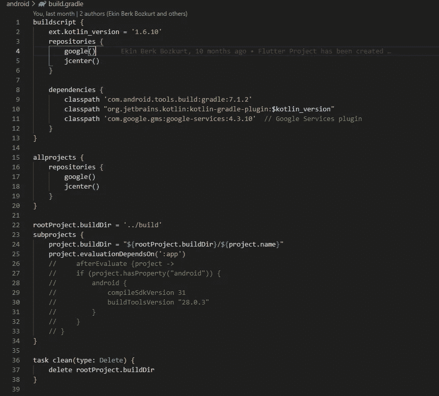
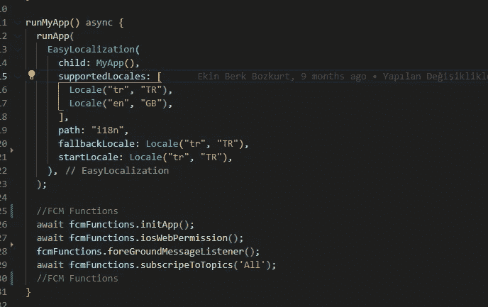
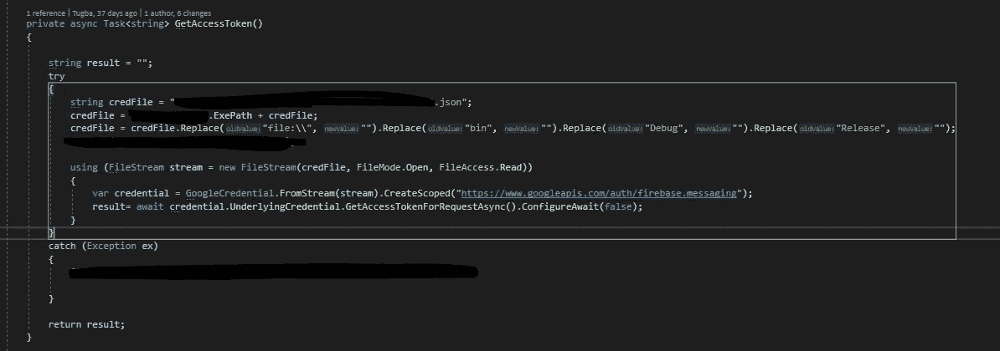

# 使用 Flutter 的 Firebase 云消息传递

> 原文：<https://itnext.io/firebase-cloud-messaging-with-flutter-b103435a3b2e?source=collection_archive---------1----------------------->

你好，

我叫[图巴](https://www.linkedin.com/in/tugbacekirge/)；我在 [Arkitek R & D](https://www.linkedin.com/company/arkitek-net/) 担任软件开发团队负责人。在 Arkitek 中，我们使用诸如[**【VueJS】**](https://vuejs.org/)[**Flutter**](https://flutter.dev/)**和 [**C#**](https://docs.microsoft.com/en-us/dotnet/csharp/) 等技术构建移动、桌面和网络应用。自 2021 年以来，我们一直在 Flutter 中开发我们的 web/mobile 项目，不用说，Flutter 非常棒。两年后，我们发现了许多诀窍和一些变通方法，只要有机会，我会试着分享。**

**如果你喜欢我的内容，可以[给我买个 p](http://buymeacoffee.com/turtlepile) izza！**

**在本文中，我将尝试解释我们的分步指南**

## **1-如何将 FCM 添加到您的 Flutter 移动应用程序并管理订阅。**

## **2-如何向应用程序发送消息:服务器端**

**在我开始之前，我想提及并感谢我的小儿子， [Ekin Berk Bozkurt](https://www.linkedin.com/in/ekinberkb/) ，他为我们的 flutter 项目做出了惊人的工作和巨大的努力。我们爱你，伊金·❤**

**还有一件事！这是我的第一个中型职位，所以原谅我，如果我犯了错误。**

**好，我们开始吧..:)**

**我们的 flutter 项目运行在多个平台上:IOS、Android 和 Web。在本文中，我将简单介绍一下从 **FCM** 到 **IOS** 和 **Android** 平台。**

**首先，我们将在 FCM 中创建和注册我们的应用程序。我会尽力不在这个过程中留下漏洞，但如果我留下了，请原谅我。**

1.  **去 https://console.firebase.google.com/创建你的项目，如果你还没有的话。**

**2.选择 **IOS** App(如果你不是在搭建 IOS app，可以跳过 2 跳到 3)

**注册一个 IOS app 需要遵循 5 个步骤:**
2.1 —注册你的 App。FCM 要求提供一些信息(Apple ID 等),您可以很容易地从 [AppStoreConnect](https://appstoreconnect.apple.com/apps)
2.2 中获得这些信息——在您完成表单后，您将获得一个**Google service-info . plist**文件。下载文件- >打开 **XCode** - >转到 Runner- >将此文件添加到您的 **Info.plist** 所在的同一个文件夹中。*(重要:需要用 XCode 执行这个动作，否则不起作用。不要使用 VS 代码或文件浏览器等..)***

**2.3 —添加 Firebase SDK: ***此操作发生错误，在***
再次打开 **XCode** 后收回，参见“添加包”部分。键入[https://github.com/firebase/firebase-ios-sdk](https://github.com/firebase/firebase-ios-sdk)并回车。它会显示你可以添加的库，我只会选择分析和消息。**

**2.4 —从 **XCode** 中打开您的 **AppDelegate.m** 文件，使这些导入
[*@ import*](http://twitter.com/import)*FirebaseCore；* [*@ import*](http://twitter.com/import)*firebase messaging；* [*@导入*](http://twitter.com/import)*firebase analytics；***

***而这几行:
(BOOL)application:(ui application *)application
difinishlaunchingwithoptions:(ns dictionary *)launch options {***

***if(*[*)@可用*](http://twitter.com/available) *(iOS 10.0，*){
【UNUserNotificationCenter currentNotificationCenter】。delegate =(id<unusernotificationcenteredelegate>)self；
}* ***——→>>>【FIRApp configure】；<<<<←——*** *【GeneratedPluginRegistrant registerWithRegistry:self】；
//应用启动后定制的覆盖点。
return【超级应用:应用 diddfinishlaunchingwithoptions:launch options】；
}***

**[*@ end*](http://twitter.com/end)

2.5——回到 firebase 控制台，选择你的 IOS 项目，点击“设置”图标，进入**项目设置**页面。转到“**控制台信息**”选项卡。我们需要注册我们的 APNs 认证密钥(Apple 推送通知)，您可以通过以下步骤获得该密钥:**

**转到->[https://developer . Apple . com/account/resources/certificates/list](https://developer.apple.com/account/resources/certificates/list)
2 . 5 . 1—添加新密钥
2.5.2 —随意命名您的密钥，我用了类似于**MyAppNameAPNs**
2 . 5 . 3—点击查看苹果推送通知服务
2.5.4 —继续- >注册
2.5.5 —下载
2.5**

**返回 firebase 控制台。点击 APNs 认证密钥，在步骤 5 上传文件，输入 KeyID 和你的 TeamID *(苹果开发者账户- >会员)***

**现在让我们将 FCM 添加到我们的 android 项目中:*(如果您不是在开发 Android 项目，请跳过 3，跳到第 5 步)*

3 —转到 firebase 控制台，添加一个 Android 项目。3.1-输入你的应用程序信息并继续。
3.2 —下载**Google-service . JSON**
3.3—打开 **VSCode** 并将该文件添加到 app 文件夹下。
3.4 —打开 **app/build gradle** 在依赖项中添加实现行并应用插件

*依赖项{
实现平台(' com . Google . firebase:Firebase-bom:30 . 1 . 0 ')
//为 Google Analytics 添加 Firebase SDK 的依赖项
//使用 BoM 时，不要在 Firebase 依赖项中指定版本
实现' com . Google . Firebase:Firebase-Analytics '*** 

**3.4.1 —将此行添加到依赖关系部分:**

*   ***class path ' com . Google . GMS:Google-Services:4 . 3 . 10 '//Google Services 插件***

**3.4.2 —将 google()添加到所有项目和构建脚本的存储库中。**

**您的构建梯度应该如下所示:**

****

**build.gradle**

**4 —对于 IOS ->打开 XCode ->目标->选择您的项目->登录和功能
单击+(加号)按钮并选择**

*   **推送通知->检查**
*   **后台模式->勾选这两个:
    —后台抓取
    —远程通知**

***如果您需要更详细的解释，请阅读本文档*  **5—打开 VS 代码，进入您的终端，按顺序输入以下内容:****

****5.1 —颤振发布添加[**firebase _ core**](https://pub.dev/packages/firebase_core)****

****5.2 — dart pub 全局激活 flutterfire_cli****

****5.3 —导出路径="$PATH":"$HOME/。发布缓存/bin "****

*****如果您收到此错误- >警告:Pub 将可执行文件安装到$HOME/中。pub-cache/bin，它不在您的路径上。您可以通过将它添加到您的 shell 的配置文件中来解决这个问题。bashrc，。bash_profile 等。)*****

****5.4 — firebase 登录****

*****会询问凭证，您需要在 firebase 控制台中输入您正在使用的凭证。*****

****5.5 —扑火配置****

****选择您的项目。****

****它将创建 **firebase_options** 。dart 文件。****

****6-我们在单个 dart 文件中管理我们的 FCM 函数，因此我们可以正确地访问它。创建一个文件，命名为 **FCMFunctions** 。飞镖****

****我们的 FCMFunctions.dart 类似于 [this](https://gist.github.com/turtlepile/3eddc47e5a0a79ef19c4a263719b2a4a) :****

****7-打开 main.dart****

****导入“包:arkitek _ app _ internal/data/FCM functions . dart”；****

****并在 runApp 中调用您的函数****

********

****主.镖****

****注意:在第 9 行，我们订阅了一个我们命名为**“All”**的频道。我们用这个向每个人发送通知。同样在登录后，我们正在调用****

*****wait FCM functions . subscripettopics(" ACC "+response[0][' AccID ']。toString())；*****

****因此，每个用户默认订阅两个频道:All 和自己的帐户频道。我们决定采用这种方式，因为管理基于用户的通知非常复杂且具有挑战性。****

*****//简而言之，如何管理用户基础通知- >您需要获得一个 FCM 令牌，将其存储在 DB 中，并且如果令牌超过两个月，则归档每个令牌，因为没有方法来检查令牌是否有效。所以是的，我们不想走那条路。*****

****7—转到 **pubspec.yaml** 并添加
firebase _ messaging:^11.4.2
firebase _ analytics:^9.1.9****

*****注意:我从依赖项中删除了 firebase SDK，因为我得到了一个错误。*****

****不要忘记保存(pub get)****

******免费赠品:******

****我们在项目中使用了 **image_picker** ,在实现 FCM 的时候出现了这个错误。如果你看到这个错误，说明你的 gradle 已经过期，需要更新:
*任务执行失败:app:lintVitalRelease。
>无法解析配置*'的所有工件:image _ picker _ Android:debugUnitTestRuntimeClasspath '。****

******如何修复:**
1->pubspec . YAML->image _ picker:^0.8.5+3
2->gradle-wrap pler . properties
distribution URL = https \://services . gradle . org/distributions/gradle-7.4-bin . zip
3->build . gradle->>dependencies
class path ' com . Android . tools . build:7.1****

****所以，客户端和上面的非常相似。让我们深入到服务器端，我将尝试解释我们如何发送通知。****

****我们在后端项目中使用 C#。如果你熟悉它，这将很容易理解。****

****— — — — —
服务器端
——————
我关注的文档:[https://firebase . flutter . dev/docs/messaging/SERVER-integration](https://firebase.flutter.dev/docs/messaging/server-integration)****

****1 —首先，我们需要安装 **FirebaseAdmin** ，所以我们去 **NuGet** 并安装这个包****

*****安装-打包 firebase admin-版本 2.3.0*
2 —安装 FA 后，打开 firebase 控制台- >进入**项目设置** - > **云消息** - > **管理服务账号** - >选择账号->key->add key
下载 JSON 文件。**我们将使用此文件从 google 获取令牌**
3 —将此文件添加到您的解决方案中，因为我们将读取此文件以获取凭据。*(凭证还有其他选项，好奇的可以查一下)(重要提示:不要公开分享那个文件)*****

****4 —我们需要一个通知类。我们的 MessageMain 类类似于 [this](https://gist.github.com/turtlepile/79e3e894de741bfe243d559169d441be) :****

****Notification.cs****

****5 —发送通知！****

****5.1:****

****使用以下方式导入这些内容:****

******使用谷歌。Apis . Auth.OAuth2******

******使用 Newtonsoft。Json******

****创建一个函数****

****SendNotification(){****

****…….****

****message main**message main**= new message main()；****

****Message = new Message()；****

****通知 Notification = new Notification()；****

****Android config Android = new Android config()；****

****安卓。优先级=优先级。高；//这个很重要。它允许你的通知弹出，甚至当应用程序正在运行(Android)****

****消息。安卓=安卓；****

****notification.title = "新任务:"+ dsWork。WO_WORKS[0]。描述；****

****notification.body = dsWork。WO_WORKS[0]。描述细节；****

****消息。通知=通知；****

******message . topic = " ACC "+AA _ ACCOUNTS[0]。ID；//这个很重要。它是用户为自己的帐户订阅的频道。******

****messageMain.message = message****

****var access token = await**getaccessstoken**()。configurewait(false)；****

****var URL = " https://FCM . Google APIs . com/v1/projects/{ YOUR-PROJECT-NAME }/messages:send "；****

******http client**client = new http client()；****

****客户。BaseAddress =新的 Uri(URL)；****

****客户。DefaultRequestHeaders . accept . clear()；****

****客户。DefaultRequestHeaders . accept . add(new MediaTypeWithQualityHeaderValue(" application/JSON "))；****

****客户。DefaultRequestHeaders . Authorization = new AuthenticationHeaderValue(" Bearer "，access token)；****

****string json = **JsonConvert** 。serialize object(**message main**)；****

****var content = new string content(JSON，Encoding。UTF8，" application/JSON ")；****

****var result = await 客户端。PostAsync(url，内容)；****

****对于**getaccessstoken->>******

********

****GetAccessToken 函数****

****为了总结→我们创建了一个名为“ **SendNotification** ”的方法，在我们的例子中，它获取任务细节和用户信息。我们初始化 MessageMain 类和其他子类，并相应地设置属性。之后，我们调用**getaccessstoken**并从 google 获取令牌来发送通知并通过 HttpClient 发布。****

********

****❤****

****这就是了！这就是我们如何在 IOS 和 Android 应用中实现 FCM 的。为了节省时间，我尽量直截了当，并提到了一些重要的轶事。****