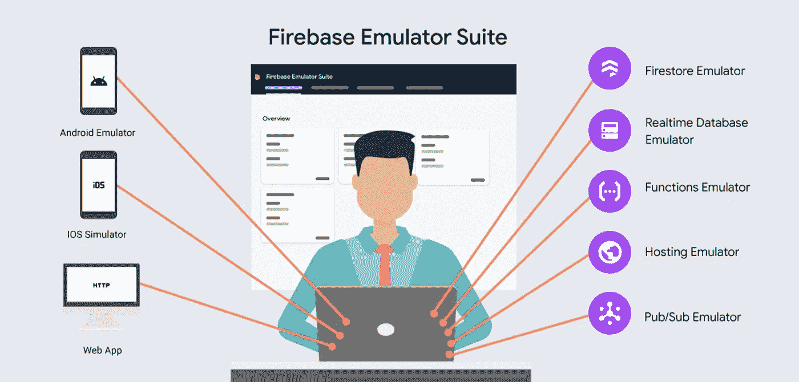
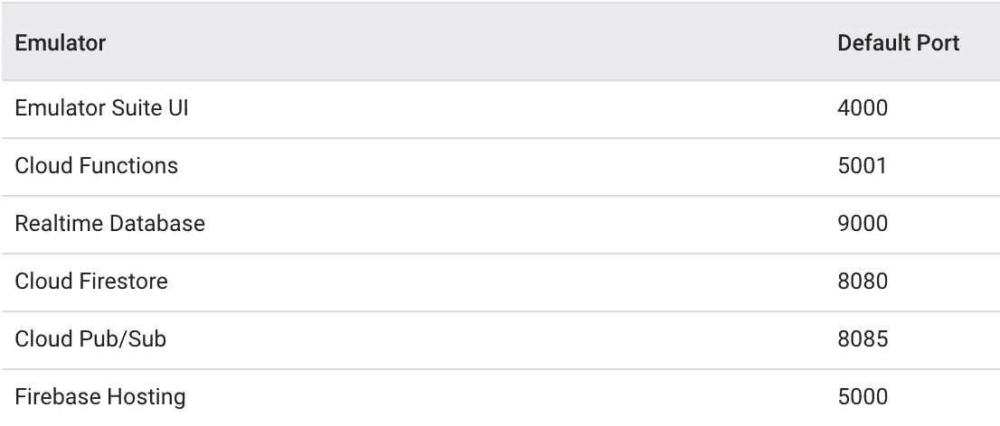
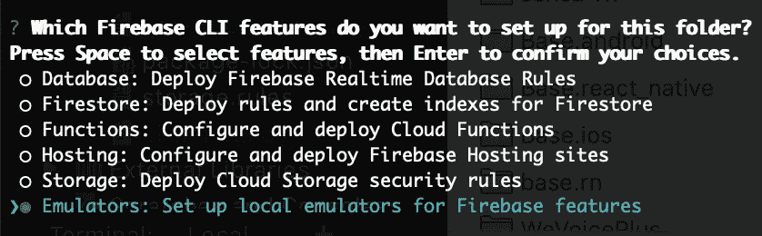
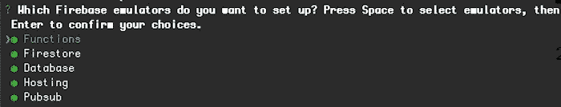
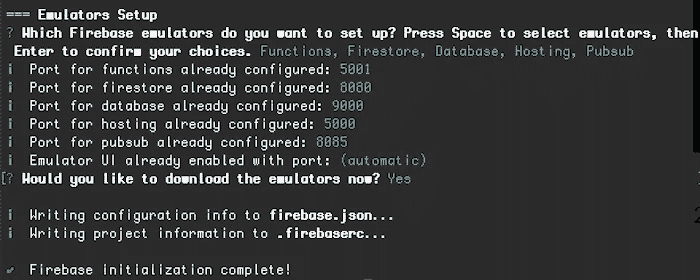
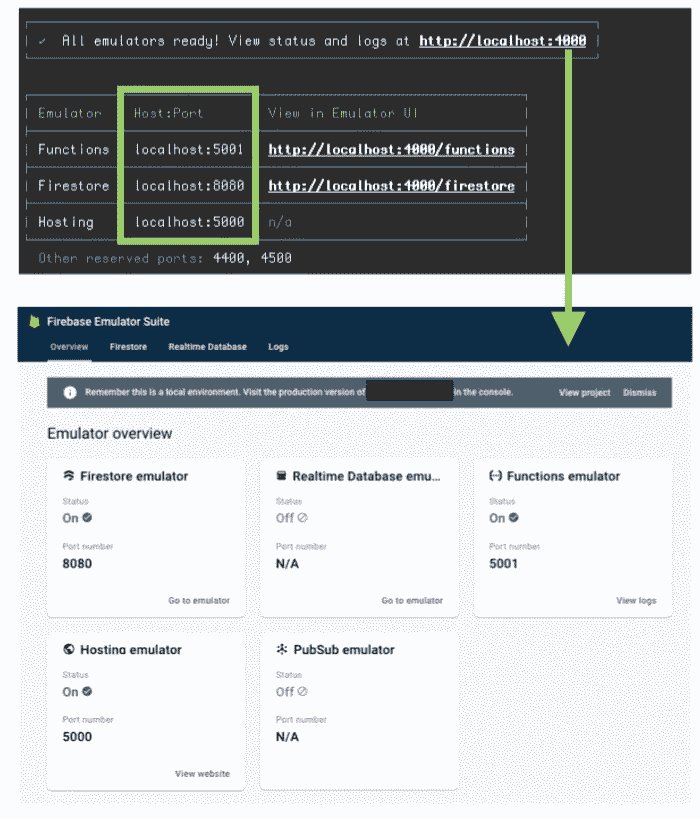
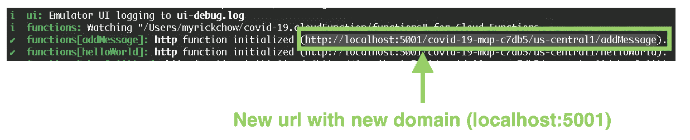
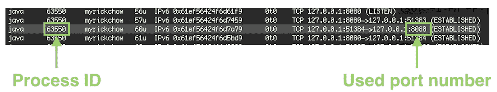
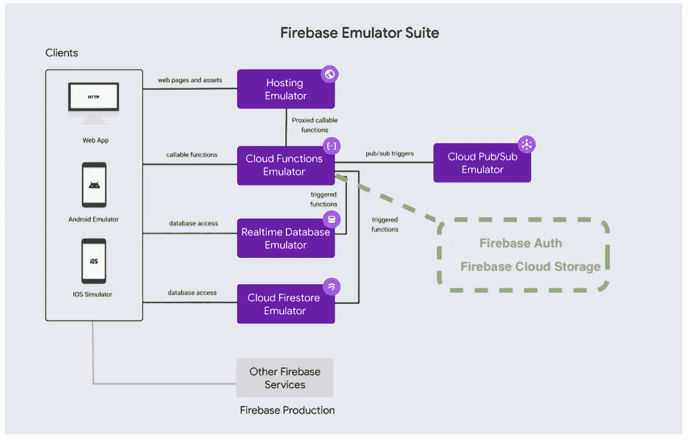

# 2020 Firebase 仿真器用户界面

> 原文：<https://itnext.io/firebase-emulator-suite-6b51446ca2e7?source=collection_archive---------2----------------------->



T2:在部署到 Firebase 服务器之前，irebase 为开发者提供了一个很好的工具来本地测试他们的代码。它总共支持 5 个 Firebase 特性:

1.  [Cloud Firestore](https://firebase.google.com/docs/firestore) —一个 noSQL 数据库
2.  [实时数据库](https://firebase.google.com/docs/database)——云火商店的前身
3.  [云功能](https://firebase.google.com/docs/functions)——一组运行在谷歌服务器上的服务器代码。函数可以由 HTTP 请求和 Firebase 事件触发，例如 Firestore CRUD、 [Firebase Auth](https://firebase.google.com/docs/auth) 和 [Firebase CloudStorage](https://firebase.google.com/docs/storage) 事件等。
4.  [云发布/订阅](https://firebase.google.com/docs/functions/pubsub-events) —可以定期执行的某些服务器功能的调度程序
5.  [Firebase Hosting](https://firebase.google.com/docs/hosting) —托管网页和资产的工具

通过运行 Firebase Emulator UI，您的计算机就变成了一个本地 Firebase 服务器，您可以立即测试所有代码。不同的模块仿真器在不同的端口上运行，如下所示:



在这篇文章中，我将详细介绍 Firebase 模拟器的设置和一些技巧。开始吧！

# 6 步设置

## 步骤 1)安装 Firebase CLI 工具

```
npm install -g firebase-tools
```

## 步骤 2)仿真器安装

在 Firebase 项目初始化期间，可以选择和安装“模拟器”。在终端运行以下命令:

```
firebase init
```



## 步骤 3)选择要在本地模拟的 Firebase 特性



## 步骤 4)为不同的 Firebase 功能定义端口



## 步骤 5)启动模拟器

可以通过以下简单命令使用空数据启动仿真器:

```
firebase emulators:start
```

如果你想要一些初始数据，在开始命令中添加`--import`参数。这将在下一节**“导入和导出模拟数据”**中详细讨论

```
firebase emulators:start --import=./fooSimulatedDataDirectory --export-on-exit
```



## 步骤 6)使用云函数进行测试



如果已经实现了云功能，终端显示的 url 会更新到新的本地域(`localhost:5001`)。您可以打一个电话，看到数据实际上传到 Firebase 模拟器，而不是远程 Firebase 服务器。

# 港口管理问题

每台计算机的端口有限，Firebase Emulator 可能想要使用一个端口(例如 Firestore 的`8080`),但它已被其他应用程序使用。此时，Firebase 模拟器将失败，并显示以下错误:

`Error: Could not start Firestore Emulator, port taken.`

解决办法很简单。只需在终端运行以下命令，所有当前活动的端口信息就会显示出来:

`sudo lsof -i -n -P | grep TCP`



获取特定端口的进程 ID 后(例如 Firestore 的`8080`)。可以通过运行以下命令来停止该过程:

`kill 63550`

终于可以成功运行启动 Firebase 模拟器的命令了！

```
firebase emulators:start
```

# Firebase 仿真器的限制



虽然 Firebase Emulator 可以模拟云 Firestore、实时数据库、托管和发布/订阅触发的事件，但它不能模拟以下事件:

1.  由 Firebase Auth 中的用户创建和删除触发
2.  云存储中的文件上传和删除

# 导入和导出模拟数据

默认情况下，Firebase Emulator 会在关闭后清除所有模拟数据。为了开发和质量保证，经常需要保存模拟数据并与其他团队成员共享。

因此，我们应该使用以下命令:

## 将数据导出到目录

```
firebase emulators:export ./fooSimulatedDataDirectory
```

## 用初始数据启动仿真器

```
firebase emulators:start 
--import=./fooSimulatedDataDirectory
```

## 使用初始数据启动模拟器，并在模拟器关闭后导出数据

```
firebase emulators:start 
--import=./fooSimulatedDataDirectory 
--export-on-exit=./newFooSimulatedDataDirectory// If not specifying the export directory, import directory is used.
firebase emulators:start 
--import=./fooSimulatedDataDirectory 
--export-on-exit
```

*参考:* [*Firebase 官方文档*](https://firebase.google.com/docs/emulator-suite/connect_firestore#import_and_export_data)

# 摘要

1.  Firebase 为云 Firestore、实时数据库、托管、云功能和发布/订阅提供模拟器。
2.  Firebase Emulator 会在每次终止时清除数据。开发人员应该定义导出模拟数据的路径，并在每次启动模拟器时导入数据。
3.  Firebase Emulator 无法模拟云函数的所有功能。它只能模拟云 Firestore、实时数据库和 Pub/ Sub 触发的事件。如果你想测试一些其他的特性，你最好打开另一个 Firebase 项目进行测试。

# 参考文献和阅读材料:

## 1.Firebase 本地仿真器

 [## 本地运行函数| Firebase

### Firebase CLI 包括一个云函数模拟器，可以模拟以下函数类型:HTTPS 函数…

firebase.google.com](https://firebase.google.com/docs/functions/local-emulator) 

## 2.Firebase 本地仿真器 UI

[](https://firebase.google.com/docs/emulator-suite) [## Firebase 本地仿真器套件简介

### Firebase Local Emulator Suite 是一套高级工具，面向希望在本地构建和测试应用程序的开发人员…

firebase.google.com](https://firebase.google.com/docs/emulator-suite) 

欢迎您通过[Twitter @ my rik _ chow](https://twitter.com/myrick_chow)关注我，了解更多信息和文章。感谢您阅读这篇文章。祝您愉快！😄