# 使用 React + Redux 从零开始实现 Firebase 登录功能

> 原文：<https://itnext.io/firebase-login-functionality-from-scratch-with-react-redux-2bf316e5820f?source=collection_archive---------0----------------------->

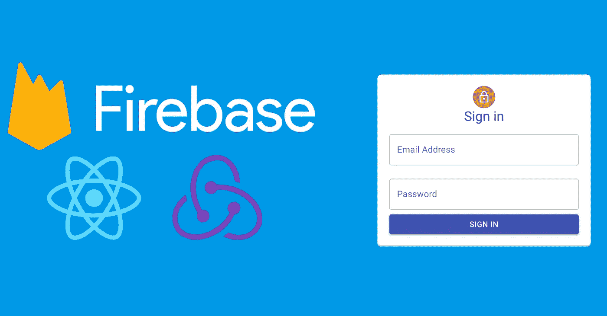

在本教程中，我们将使用 React 和 Redux 创建一个带有全功能登录页面的 Firebase web 应用程序。我们还将创建必要的登录路由，以便拥有一个只有在用户登录后才能访问的受保护路由。

Firebase 提供了一个免费的 spark 计划，不需要信用卡，因此任何人都可以跟随并设置自己的 firebase web 应用程序。完整代码链接在底部。这将是你未来应用的很好的开始代码！

我假设您熟悉 npm、javascript 和 React，但很少或没有 Redux 或 Firebase 经验。

# 设置您的 Firebase 项目。

登录到 [Firebase 控制台](https://console.firebase.google.com)并添加一个新项目。遵循这些步骤，直到您到达项目主屏幕。点击菜单中的认证选项卡，然后点击**设置登录方式**按钮。

在本教程中，我们将设置**电子邮件/密码**认证方法。单击编辑并打开第一个开关。

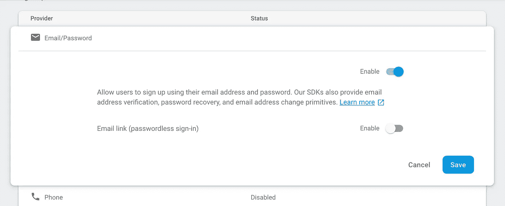

启用身份验证后，单击**数据库**菜单链接，然后单击云 Firestore 部分中的创建数据库。

为了这个项目，我们将建立 Firestore。如果您想使用实时数据库，本教程基本上是相同的，因为身份验证是与您选择的数据库分开处理的。


在测试模式下选择**开始**。

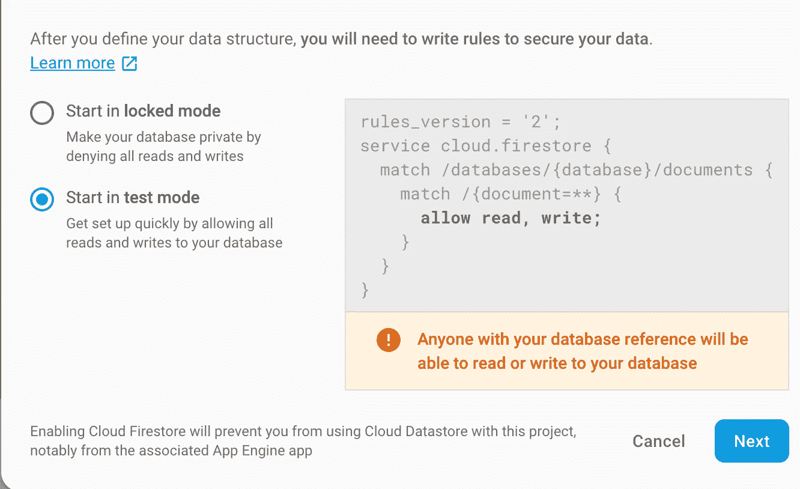

接下来，为您的数据库主机选择最适合您的项目的位置。多地区选择之一通常是完美的。

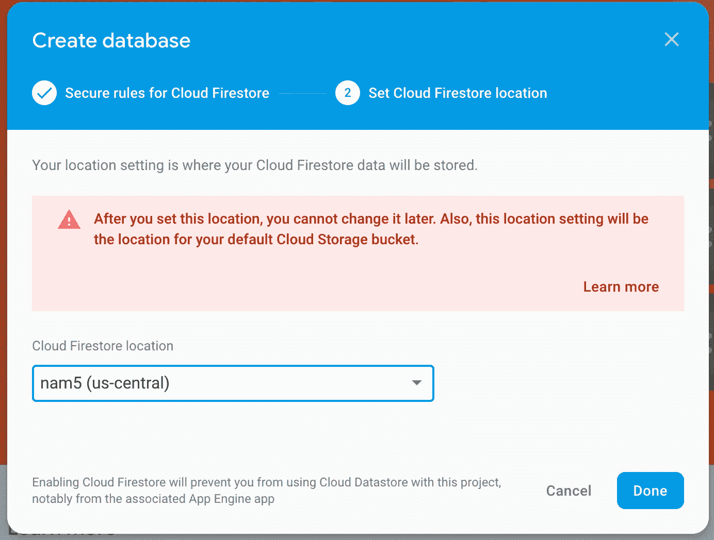

单击“完成”, firebase 将为我们计划要做的事情做好准备。

# 设置 react 应用程序。

首先安装 [create-react-app](https://github.com/facebook/create-react-app) 。完成后，在您希望应用程序所在的目录中运行以下命令:

```
create-react-app your-project-name
```

完成后，让我们确保一切正常。打开在终端/命令行中生成的 create-react-app 的新项目目录，并运行以下命令:

```
npm run start
```

您的浏览器应该会打开，您应该会看到如下所示的页面:

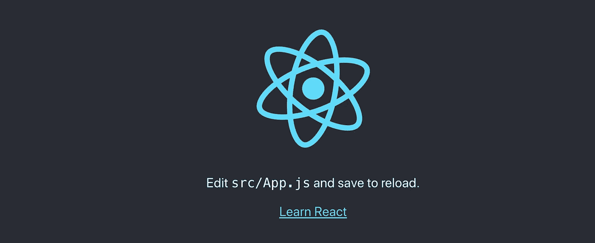

# 在 react 应用程序中初始化 firebase

运行以下命令安装 [firebase-tools](https://github.com/firebase/firebase-tools) 。

```
npm install -g firebase-tools
```

完成后，运行以下命令登录 firebase

```
firebase login
```

按照步骤操作。成功登录后，运行以下命令在 react-app 中初始化 firebase(确保您在项目目录中):

```
firebase init
```

我们将为这个项目设置主机和 firestore，如果你喜欢 firebase 的实时数据库，请随意选择该选项，因为本教程将对两者都有效，但请确保在选择实时数据库之前设置它。

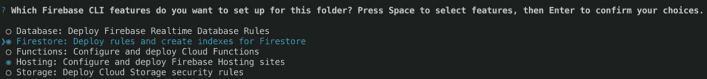

点击回车键，你应该会看到一个 firebase 项目列表。选择您之前创建的那个。

如果出现错误，请确保在继续操作之前，按照之前设置 Firestore 的步骤进行操作。

选择 Firestore 规则和 Firestore 索引的默认文件名。

选择 **build** 作为默认的公共目录，因为这是我们的项目编译的目录。**不选公。**

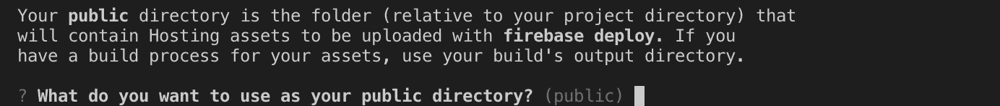

键入 **y** 确认这将是一个单页应用程序。

键入 **N** 拒绝覆盖 index.html，因为 create-react-app 已经给了我们所需要的。

让我们确认一下我们是否正确设置了 firebase。首先，构建用于部署的 react 应用程序。

```
npm run build
```

然后，运行以下命令来提供应用程序的本地版本，看看如果将它部署到 firebase 会是什么样子:

```
firebase serve
```

你应该在 [http://localhost:5000](http://localhost:5000) 看到你的 react 应用。

## 安装必要的软件包。

Create-react-app 几乎提供了我们需要的所有东西，但我们仍然需要添加一些东西才能开始。

对于 [Redux](https://github.com/reduxjs/redux) ，让我们运行以下命令:

```
npm install redux 
```

对于 [React-Redux](https://github.com/reduxjs/react-redux)

```
npm install react-redux
```

让我们也安装 [Redux Thunk](https://github.com/reduxjs/redux-thunk) 。它是一个非常有用的中间件，允许您轻松地创建异步操作:

```
npm install redux-thunk
```

对于我们的客户端路由，让我们安装[反应路由器](https://reacttraining.com/react-router/web/guides/quick-start)。这将允许我们设置我们的登录页面和受保护的登录区域:

```
npm install react-router-dom
```

最后，让我们安装 firebase，它允许我们在 react 应用程序中与 firebase 进行交互。

```
npm install firebase
```

## 为您的项目选择一个 UI 库(或者不选择)。

我将使用[材质 Ui](https://material-ui.com/getting-started/installation/) ，但是你可以随意选择 bootstrap 或者任何你喜欢的库。我不打算详细介绍样式或基本组件设置。

```
npm install @material-ui/core
```

将以下内容粘贴到您的 **public/index.html** 页面的标题中，以获得 Roboto 字体。

```
<link rel="stylesheet" href="https://fonts.googleapis.com/css?family=Roboto:300,400,500,700&display=swap" />
```

安装材料图标库:

```
npm install @material-ui/icons
```

这就是我们的设置！

# 设置我们的授权操作。

这是一个很大的设置，但现在我们准备开始编码！我们将开始在我们的 **src** 目录中创建三个文件夹:**动作**、**减速器、firebase。**

然后，创建这五个空文件: **actions/index.js** ， **actions/auth.js** ， **reducers/index.js** ， **reducers/auth.js** ， **firebase/firebase.js** 。

## 获取我们的 firebase 配置文件设置。

回到[火焰基座控制台](https://console.firebase.google.com)并点击顶部的齿轮图标:

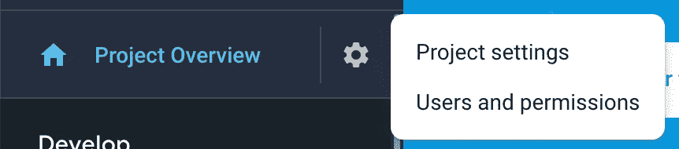

单击项目设置链接并滚动到底部。然后，让我们将 firebase 添加到我们的 web 应用程序中:

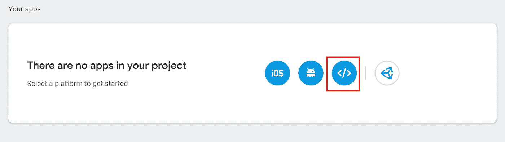

然后将其注册到您的项目中:

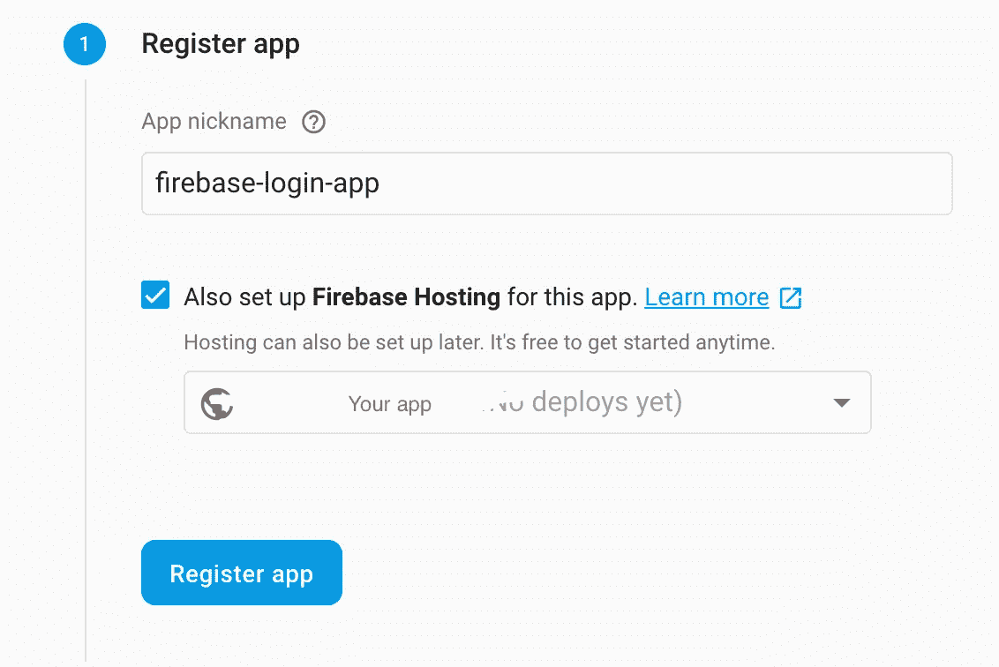

单击注册应用程序后，您可以离开此表单向导，返回到项目设置页面并滚动到底部。你应该看到你的应用程序了。让我们像这样得到**配置**值:

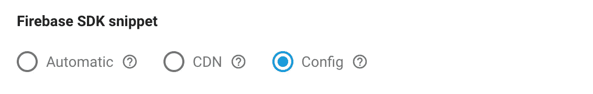

将 firebaseConfig 变量复制粘贴到 **firebase/firebase.js** 中:

```
**const** firebaseConfig = { Your config values }
```

添加以下导入内容:

```
**import** firebase **from** "firebase/app";
**import** "firebase/auth";
**import** "firebase/firestore";
```

然后，让我们初始化应用程序和数据库，并导出它们以在我们的操作文件中使用:

```
**export** **const** myFirebase = firebase.initializeApp(firebaseConfig);
**const** baseDb = myFirebase.firestore();
**export** **const** db = baseDb;
```

以下是 **firebase/firebase.js** 的完整文件代码:

## 创造我们的行动。

打开 **actions/auth.js** 并添加以下导入以获得我们的 firebase 实例:

```
**import** { myFirebase } **from** "../firebase/firebase";
```

我们需要创建操作来完成以下任务:登录、注销和在页面刷新时重新建立会话。为此，我们应该创建以下动作类型*(随意调整命名)*:

```
**export** **const** LOGIN_REQUEST = "LOGIN_REQUEST";
**export** **const** LOGIN_SUCCESS = "LOGIN_SUCCESS";
**export** **const** LOGIN_FAILURE = "LOGIN_FAILURE";**export** **const** LOGOUT_REQUEST = "LOGOUT_REQUEST";
**export** **const** LOGOUT_SUCCESS = "LOGOUT_SUCCESS";
**export** **const** LOGOUT_FAILURE = "LOGOUT_FAILURE";**export** **const** VERIFY_REQUEST = "VERIFY_REQUEST";
**export** **const** VERIFY_SUCCESS = "VERIFY_SUCCESS";
```

如您所见，我们已经将每个动作分成三个部分，以跟踪应用程序中的异步状态。我们想知道什么时候发出请求，什么时候请求成功，什么时候请求失败。唯一的例外是验证，因为这不需要失败状态。

接下来，我们需要创建返回我们的动作类型和必要参数的函数，我们的 reducer 将读取这些参数。让我们从登录操作开始。

对于请求登录的用户:

```
**const** requestLogin = () => {
  **return** {
    type: LOGIN_REQUEST
  };
};
```

对于接受 firebase 用户对象的成功登录:

```
**const** receiveLogin = user => {
  **return** {
    type: LOGIN_SUCCESS,
    user
  };
};
```

最后，一个失败的例子:

```
**const** loginError = () => {
  **return** {
    type: LOGIN_FAILURE
  };
};
```

使用前面的函数作为模板，为剩下的五个动作类型创建动作函数。所有五个都不接受任何参数。如果你想花额外的时间，一个健壮的应用程序应该在我们的 reducer 中存储失败消息，这样我们就可以向用户指出发生了什么类型的错误，但是为了使本教程简单，我们将简单地使用一个发生错误时设置的布尔值。

现在我们可以创建我们的[***thunks***](https://daveceddia.com/what-is-a-thunk/)*，它将与 firebase 交互来执行我们需要的所有操作。*

> *thunk 是*函数*的另一种说法。但它不仅仅是一个旧功能。这是由另一个函数返回的函数的特殊(不常见)名称。*

*我们可以从让用户登录 firebase 开始。我们将使用 firebase[***signingwithemailandpassword***](https://firebase.google.com/docs/reference/js/firebase.auth.Auth.html#signinwithemailandpassword)*功能。我们希望我们的 thunk 从我们未来的*登录*组件接收凭证，并且还接收*分派*函数，该函数被传递给我们从组件发起的所有操作:**

```
****export** **const** loginUser = (email, password) => dispatch => {}**
```

**如你所见，第一个函数将接收我们的用户名和密码，这是我们在创建*登录*组件时提供的，并返回一个接收调度函数的函数，当我们在组件中调用该函数时，调度函数会隐式传递该函数。**

**我们想这样构造我们的***loginUser()***thunk:**

**让我们将代码分解成每一步。首先，我们调度***request log in()***，这将告诉我们的应用程序用户正在登录。然后，我们通过调用***my firebase . auth()***得到我们的 firebase auth 实例。**

**然后我们调用我们想要使用的身份验证方法，在本例中是***signInWithEmailAndPassword()****，并传递我们的用户凭证。之后，我们使用一个 **then()** 来调度 ***receiveLogin(user)，当登录成功时，它将被传递给 firebase 用户对象。*** 我们传递用户是因为想在 redux 中存储 firebase 用户对象，这样我们以后就可以在我们的应用程序中使用它。我们不会在本教程中使用它，但当你在将来要写的动作中开始尝试与 Firestore 数据库交互时，你会感谢我的！***

**最后，我们捕捉发生的任何错误并分派***loginError()****，这样我们就可以让我们的用户知道出错了。***

***我们剩下的两个 thunks 的构造几乎完全一样， ***logoutUser()*** 调用 firebase[***sign out()***](https://firebase.google.com/docs/reference/js/firebase.auth.Auth.html#signout)*方法:****

***并且 ***verifyAuth()*** 调用 firebase[***onAuthStateChanged()***](https://firebase.google.com/docs/reference/js/firebase.auth.Auth.html#onauthstatechanged)*方法，该方法寻找预先存在的用户会话并重新建立它。在我们的例子中，这将在刷新时发生。该方法还会在应用程序运行时设置一个侦听器，以便在用户会话令牌过期时对其进行更改。****

***您可以看到，我们还调度了***receive log in()***，这样，如果用户使用预先存在的会话“登录”,我们就可以在 reducer 中重新填充用户对象。我们检查用户是否为空，因为我们只希望在 firebase 找到用户会话时让某人登录。***

****actions/auth.js** 到此为止！以下是完整的文件:**

**现在我们可以设置我们的 **actions/index.js** 文件来导出我们刚刚做的一切，以便于导入。**

**我们只需要一句话:**

```
****export** * **from** "./auth";**
```

# **安装我们的减速器。**

**打开 **reducers/auth.js** ，从 actions 导入我们刚刚创建的所有动作类型。reducer 接收这些数据，并将其传递给 switch 语句。**

```
****import** {
  LOGIN_REQUEST,
  LOGIN_SUCCESS,
  LOGIN_FAILURE,
  LOGOUT_REQUEST,
  LOGOUT_SUCCESS,
  LOGOUT_FAILURE,
  VERIFY_REQUEST,
  VERIFY_SUCCESS
} **from** "../actions/";**
```

**然后，我们可以创建我们的 reducer 函数。我们可以将其构建如下:**

```
****export** **default** (state = {}, action) => {
  **switch** (action.type) {
    **default**:
      return state;
  }
};**
```

**然后，我们可以为我们需要的所有标志和对象创建一些默认状态:**

```
****export** **default** (
  state = {
    isLoggingIn: **false**,
    isLoggingOut: **false**,
    isVerifying: **false**,
    loginError: **false**,
    logoutError: **false**,
    isAuthenticated: **false**,
    user: {}
  },
  action
) => {
  **switch** (action.type) {**
```

**好了，我们现在可以研究我们的开关盒了。当用户试图登录时，我们希望让我们的应用程序知道，是的，他们正在登录，我们还希望清除之前可能发生的任何错误:**

```
****case** LOGIN_REQUEST:
      **return** {
        ...state,
        isLoggingIn: **true**,
        loginError: **false**
      };**
```

**当成功登录时，我们希望告诉我们的应用程序，它不再尝试让用户登录，用户现在已通过身份验证，我们希望存储我们的操作通过的用户:**

```
****case** LOGIN_SUCCESS:
      **return** {
        ...state,
        isLoggingIn: **false**,
        isAuthenticated: **true**,
        user: action.user
      };**
```

**最后，当登录失败时，我们希望告诉我们的应用程序，它也不再尝试让用户登录，没有用户通过身份验证，并且失败已经发生:**

```
****case** LOGIN_FAILURE:
      **return** {
        ...state,
        isLoggingIn: **false**,
        isAuthenticated: **false**,
        loginError: **true**
      };**
```

**其余五个案例的结构相似。在用下面的代码检查您的工作之前，尝试自己做这些。**

**以下是完整的文件:**

**现在我们可以使用 redux 库中的***combine reducers()***函数创建默认的缩减器。打开 **reducers/index.js** 并添加以下导入:**

```
****import** { combineReducers } **from** "redux";**import** auth **from** "./auth";**
```

**然后，调用合并函数。您将在这里添加其他减速器，同时扩展您的应用程序。**

```
****export** **default** combineReducers({ auth });**
```

**现在我们已经拥有了减速器所需的一切！**

# **安装我们的 Redux 管道。**

**所以我们已经创建了我们需要的动作和 reducer，现在我们必须向应用程序提供我们的 Redux 状态。**

**在 **src** 文件夹中创建一个名为 **configureStore.js** 的新文件**

**这个文件将初始化我们的商店，设置我们的 thunk 中间件，调用我们的 **verifyAuth()** 动作，并导出我们的函数，以便我们可以将它提供给我们的应用程序的根目录。我们可以从进口开始:**

```
****import** { applyMiddleware, createStore } **from** "redux";
**import** thunkMiddleware **from** "redux-thunk";**import** { verifyAuth } **from** "./actions/";
**import** rootReducer **from** "./reducers";**
```

**我们正在导入我们的 ***verifyAuth()*** 动作，以及***combine reducerss()***的输出，它实际上只是一个由我们的 reducer 的所有状态组成的大对象，但目前我们只有一个。**

**然后，我们可以创建并导出将返回已配置存储的函数。**

```
****export** **default** **function** configureStore(persistedState) {
  **const** store = createStore(
    rootReducer,
    persistedState,
    applyMiddleware(thunkMiddleware)
  );
  store.dispatch(verifyAuth());
  **return** store;
}**
```

**每次我们的应用程序启动时都会调用该函数，这也发生在用户刷新页面时。我喜欢在这里分派 ***verifyAuth()*** ，因为它确保这将是我们的 redux store 发生的第一件事，如果用户会话存在，它将在应用程序的其余部分加载之前验证我们的用户，这将让我们路由到我们的安全路由，而不会显示我们的登录页面。**

**在 **src** 文件夹中创建另一个名为 **Root.js** 的文件**

**该组件将为*应用*提供我们的商店。我们还将在这里初始化 react-router。我们将把实际路线添加到*应用程序中。这些是我们需要的进口商品:***

```
****import** React **from** "react";**import** { Provider } **from** "react-redux";
**import** { BrowserRouter **as** Router } **from** "react-router-dom";**import** App **from** "./App";
**import** configureStore **from** "./configureStore";**
```

**接下来，我们需要初始化我们配置的存储。**

```
****const** store = configureStore();**
```

**然后，我们需要将该存储提供给应用程序的其余部分，并初始化路由器。**

```
****function** Root() {
  **return** (
    <Provider store={store}>
      <Router>
        <App />
      </Router>
    </Provider>
  );
}**export** **default** Root;**
```

**以下是完整的文件:**

**顾名思义， *Root* 将是我们 app 的根组件。现在，create-react-app 已经将根组件定义为 *App* 。要改变这一点，打开 **src/index.js** 移除 *App* 导入并用 *Root* 替换。您完成的文件应该如下所示:**

# **设置我们的路线。**

**我们已经在*根*中初始化了路由器，但是我们的应用程序仍然没有路由。我们现在可以创建正常的路由，但是我们需要能够创建受保护的路由，这些路由只能在用户登录后才能访问。如果他们没有登录，他们应该被重定向到登录页面。**

**在 **src** 中新建一个名为 **components** 的文件夹，并添加三个名为 **ProtectedRoute.js、Home.js、**和 **Login.js** 的新文件**

**打开**components/protected route . js**并添加以下导入:**

```
****import** React **from** "react";
**import** { Route, Redirect } **from** "react-router-dom";**
```

**然后让我们添加组件代码:**

```
****const** ProtectedRoute = ({
  component: Component,
  isAuthenticated,
  isVerifying,
  ...rest
}) => (
  <Route
    {...rest}
    render={props =>
      isVerifying ? (
        <div />
      ) : isAuthenticated ? (
        <Component {...props} />
      ) : (
        <Redirect
          to={{
            pathname: "/login",
            state: { from: props.location }
          }}
        />
      )
    }
  />
);**export** **default** ProtectedRoute;**
```

**理解这个组件超出了本教程的范围。泰勒·麦金尼斯在他的网站上创建了一个优秀的[教程，如果你想知道这是如何运作的！](https://tylermcginnis.com/react-router-protected-routes-authentication/)**

**现在我们可以创建我们所有的路线。打开 **App.js** ，去掉 create-react-app 给我们的所有模板代码。我们可以添加以下导入:**

```
****import** React **from** "react";**import** { Route, Switch } **from** "react-router-dom";
**import** { connect } **from** "react-redux";**import** ProtectedRoute **from** "./components/ProtectedRoute";
**import** Home **from** "./components/Home";
**import** Login **from** "./components/Login";**
```

**正如您所看到的，我们已经从 react-redux 导入了 [***connect()*** ，这让我们可以将组件链接到 redux 存储，以提取我们需要的数据。为此，我们希望在组件底部定义一个***mapStateToProps()***函数，并将其传递给 ***connect()。***](https://react-redux.js.org/api/connect)**

**让我们这样做:**

```
****function** mapStateToProps(state) {
  **return** {
    isAuthenticated: state.auth.isAuthenticated,
    isVerifying: state.auth.isVerifying
  };
}**export** **default** connect(mapStateToProps)(App);**
```

**我们从 auth reducer 中取出这个组件所需的状态片段，并返回一个映射到组件 props 的对象。**

**现在我们可以在定义路由的地方添加组件代码，并使用我们的 *ProtectedRoute* 组件来保护根路由。**

```
****function** App(props) {
  **const** { isAuthenticated, isVerifying } = props;
  **return** (
    <Switch>
      <ProtectedRoute
        exact
        path="/"
        component={Home}
        isAuthenticated={isAuthenticated}
        isVerifying={isVerifying}
      />
      <Route path="/login" component={Login} />
    </Switch>
  );
}**
```

***开关*将只选择这些路线中的一条，我们在技术上不需要它，因为我们没有冲突的路线，但这是一个好的做法，它也将防止您在这里添加可能绕过我们的*保护路线的额外路线。*你放在我们的*保护路由*下的任何路由，比如说在 home 组件中，也将自动受到保护，而无需你使用该组件，因为它们是子路由。**

**以下是 **App.js** 的完整代码:**

# **现在我们可以制作登录页面了。**

**打开 **components/Login.js** ，我们就可以开始添加我们的代码了。我将在 Material Ui 中包含我的代码，但是您可以随意创建这个页面。我们需要它有以下内容:电子邮件和密码的输入，提交按钮，一些 redux 状态，以及一个用用户名和密码调度我们的 ***loginUser()*** 动作的函数。**

**无论您选择如何做，这些导入都是必需的:**

```
****import** React, { Component } **from** "react";
**import** { connect } **from** "react-redux";
**import** { Redirect } **from** "react-router-dom";
**import** { loginUser } **from** "../actions";**
```

**然后让我们从 Redux 中获取我们需要的状态:**

```
****function** mapStateToProps(state) {
  **return** {
    isLoggingIn: state.auth.isLoggingIn,
    loginError: state.auth.loginError,
    isAuthenticated: state.auth.isAuthenticated
  };
}
**export** **default** connect(mapStateToProps)(Login);**
```

**我们希望设置一个仅在用户通过身份验证时才呈现的重定向:**

```
****const** { classes, loginError, isAuthenticated } = this.props;
**if** (isAuthenticated) {
   **return** <Redirect to="/" />;
} **else** {
   **return** ( //Your Login component JSX**
```

**最后，我们希望有一个提交函数来调用我们的 redux***loginUser()***动作。**

```
**handleSubmit = () => {
    **const** { dispatch } = this.props;
    **const** { email, password } = this.state;
    dispatch(loginUser(email, password));
};**
```

**下面是我使用 Material Ui 的*登录*组件:**

# **最终作品。**

**打开 **component/Home.js** ，在你的保护区内创建你想要的！我已经创建了一些基本代码，您可以在下面使用它们来测试功能。**

```
****import** React, { Component } **from** "react";
**import** { connect } **from** "react-redux";
**import** { logoutUser } **from** "../actions";**class** Home **extends** Component {
  handleLogout = () => {
    **const** { dispatch } = this.props;
    dispatch(logoutUser());
  };
  render() {
    **const** { isLoggingOut, logoutError } = this.props; **return** (
      <div>
        <h1>This is your app's protected area.</h1>
        <p>Any routes here will also be protected</p>
        <button onClick={this.handleLogout}>Logout</button>
        {isLoggingOut **&&** <p>Logging Out....</p>}
        {logoutError **&&** <p>Error logging out</p>}
      </div>
    );
  }
}**function** mapStateToProps(state) {
  **return** {
    isLoggingOut: state.auth.isLoggingOut,
    logoutError: state.auth.logoutError
  };
}**export** **default** connect(mapStateToProps)(Home);**
```

**终于到时间了！启动应用程序！**

```
**npm run start**
```

**因为我们使用的是 firebase 包，firebase 将在 webpack 的开发服务器环境中完美地工作。当应用程序启动时，您应该立即被重定向到/login，并看到您创建的表单。**

**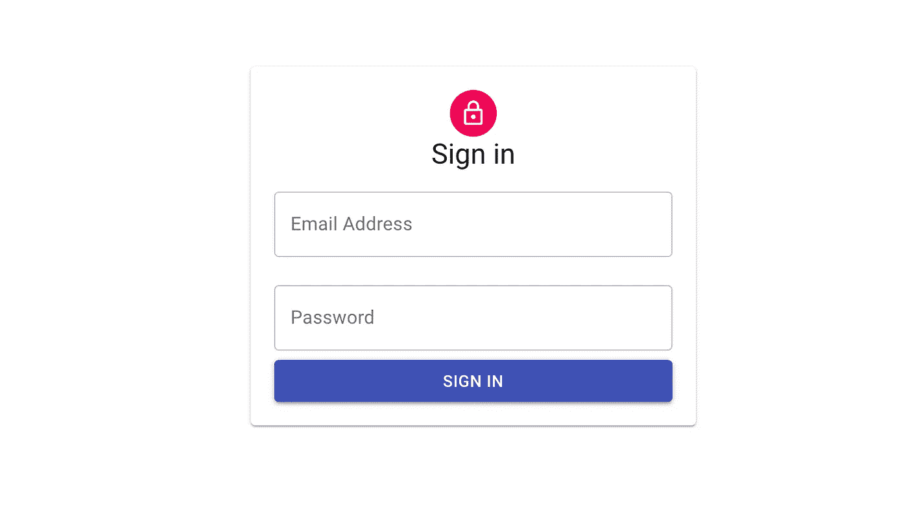**

**尝试登录应该会给你一个错误，因为我们没有在 Firebase 中添加任何用户。**

**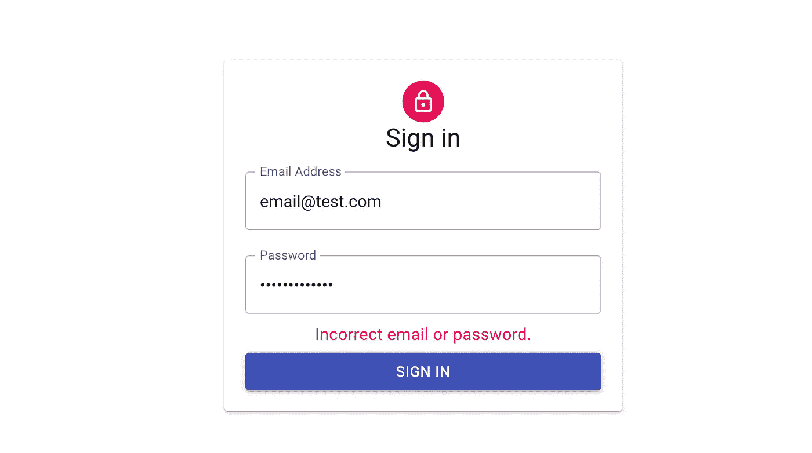**

**打开 [Firebase 控制台](https://console.firebase.google.com)，点击菜单中的认证链接。我们想添加一个用户:**

**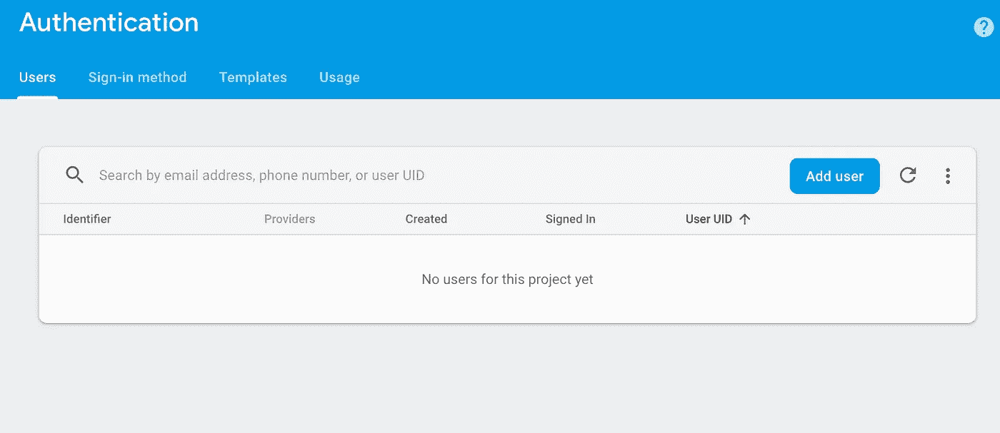**

**添加要测试的用户:**

****

**现在，您可以返回到您的应用程序，并尝试使用您刚刚创建的用户登录！您应该被重定向到应用程序根 URL 上的我们的*主页*组件。**

**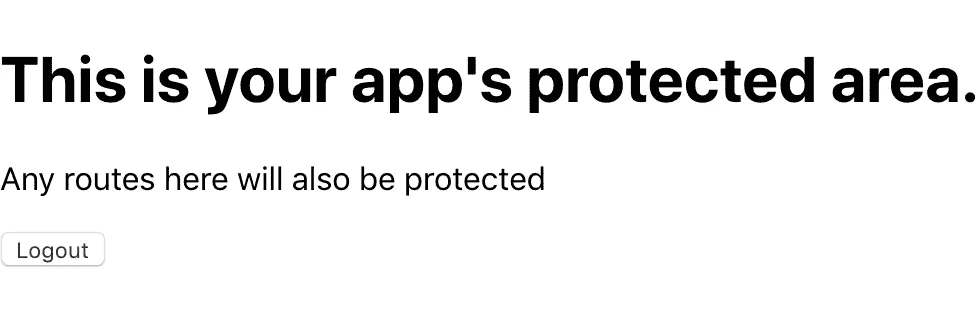**

**刷新页面也将使您保持登录状态。如果您想知道我们为什么需要 verify auth，您可以从 **configureStore.js** 中删除***verify auth()***dispatch 并尝试刷新页面。您应该被重定向回*登录*组件。最后，您可以测试 logout 按钮，看看我们的 ***logoutUser()*** 动作是否工作。您应该被重定向回登录页面。**

**要将您的应用发布到 firebase，请确保您的 Firestore 数据库退出测试模式，方法是编辑您的 **src** 目录中 **firestore.rules** 中的 **allow** 行，如下所示:**

```
**allow read, write: if false;**
```

**然后，要将您的应用发布到 firebase，请使用 *npm 构建您的应用，运行 build* 并运行以下命令:**

```
**firebase deploy**
```

**您的应用程序现已上线。**

**感谢您的关注！在未来的教程中，我计划扩展功能，直到我们最终拥有一个成熟的 firebase web 应用程序。我希望这能对你有所帮助。这段代码将是任何 firebase web 应用程序的良好开端。如果您正在分叉，请确保执行本文中的 firebase 初始化步骤，并在 **firebase/firebase.js** 设置您的 web 应用程序 API 密钥**

**[](https://github.com/chaseoc/firebase-login-page) [## chase oc/fire base-登录-页面

### 这个项目是用 Create React App 引导的。在项目目录中，您可以运行:在…中运行应用程序

github.com](https://github.com/chaseoc/firebase-login-page)**