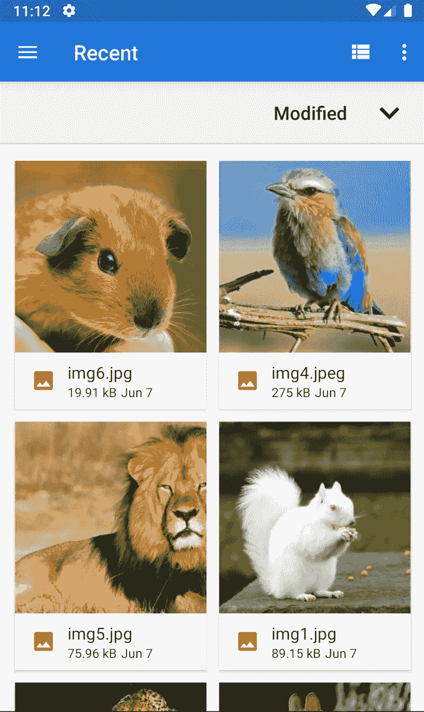

# Firebase 存储—在 Flutter 中上传和下载文件和多文件选择器

> 原文：<https://itnext.io/firebase-storage-uploading-and-downloading-files-multi-file-picker-in-flutter-7360a90c68a7?source=collection_archive---------0----------------------->

这个演示展示了如何上传文件到 firebase 存储。在本次演示中，我们将只上传图像到 firebase 存储。

**让我们开始……**



# **观看视频教程**

# **添加依赖关系**

对于这个例子，我们需要三个插件

**#1 多文件拾取器**

这个插件帮助我们从文件浏览器或图库中选择多个图像。

*文件挑选者:^2.1.6*

**#2 Http 包**

*http: ^0.12.2*

**#3 燃料库**

*燃料库 _ 储存地:^7.0.0*

# **添加下拉菜单**

让我们在 UI 中添加一个下拉菜单来选择多个文件类型。

在这里，我们正在添加音频，视频，图像和其他。

```
dropDown() {
    return DropdownButton(
      hint: new Text('Select'),
      value: _pickType,
      items: <DropdownMenuItem>[
        new DropdownMenuItem(
          child: new Text('Audio'),
          value: FileType.AUDIO,
        ),
        new DropdownMenuItem(
          child: new Text('Image'),
          value: FileType.IMAGE,
        ),
        new DropdownMenuItem(
          child: new Text('Video'),
          value: FileType.VIDEO,
        ),
        new DropdownMenuItem(
          child: new Text('Any'),
          value: FileType.ANY,
        ),
      ],
      onChanged: (value) => setState(() {
            _pickType = value;
          }),
    );
}
```

# **打开文件浏览器**

让我们打开设备的文件浏览器并获取文件。

*确保在 iOS 中添加图库权限，在 Android 中添加存储访问权限。*

**安卓**:

将下面的代码放在 Android 项目中应用程序标记之外的 AndroidManifest.xml 中。

```
<uses-permission android:name="android.permission.READ_EXTERNAL_STORAGE" />
```

iOS :

打开 iOS 项目 info.plist 文件，添加以下条目。

```
Limited Photos<key>PHPhotoLibraryPreventAutomaticLimitedAccessAlert</key>
<true/>
Camera<key>NSCameraUsageDescription</key>
<string>$(PRODUCT_NAME) camera description.</string>
Photos<key>NSPhotoLibraryUsageDescription</key>
<string>$(PRODUCT_NAME)photos description.</string>
```

下面的代码将打开文件资源管理器。

我们还将检查磁盘是否已挂载。

```
// Necessary variables 

String _path;
Map<String, String> _paths;
String _extension;
FileType _pickType;
bool _multiPick = false;
GlobalKey<ScaffoldState> _scaffoldKey = GlobalKey();
List<StorageUploadTask> _tasks = <StorageUploadTask>[];

void openFileExplorer() async {
    try {
      _path = null;
      if (_multiPick) {
        _paths = await FilePicker.getMultiFilePath(
            type: _pickType, fileExtension: _extension);
      } else {
        _path = await FilePicker.getFilePath(
            type: _pickType, fileExtension: _extension);
      }
    } on PlatformException catch (e) {
      print("Unsupported operation" + e.toString());
    }
    if (!mounted) return;
}
```

# **上传文件到 Firebase**

这里我们有 uploadToFirebase 方法，它遍历文件数组并将每个文件上传到 Firebase 控制台。

```
uploadToFirebase() {
    if (_multiPick) {
        _paths.forEach((fileName, filePath) => {upload(fileName, filePath)});
    } else {
        String fileName = _path.split('/').last;
        String filePath = _path;
        upload(fileName, filePath);
    }
}

upload(fileName, filePath) {
    _extension = fileName.toString().split('.').last;
    StorageReference storageRef =
        FirebaseStorage.instance.ref().child(fileName);
    final StorageUploadTask uploadTask = storageRef.putFile(
        File(filePath),
        StorageMetadata(
        contentType: '$_pickType/$_extension',
        ),
    );
    setState(() {
        _tasks.add(uploadTask);
    });
}
```

# **从 Firebase 下载文件**

下面的代码将借助' *StorageReference* '从 firebase 存储器下载文件。我们正在创建一个临时文件，并将下载的字节写入该文件。然后，我们将在 SnackBar 中显示图像。

```
Future<void> downloadFile(StorageReference ref) async {
    final String url = await ref.getDownloadURL();
    final http.Response downloadData = await http.get(url);
    final Directory systemTempDir = Directory.systemTemp;
    final File tempFile = File('${systemTempDir.path}/tmp.jpg');
    if (tempFile.existsSync()) {
      await tempFile.delete();
    }
    await tempFile.create();
    final StorageFileDownloadTask task = ref.writeToFile(tempFile);
    final int byteCount = (await task.future).totalByteCount;
    var bodyBytes = downloadData.bodyBytes;
    final String name = await ref.getName();
    final String path = await ref.getPath();
    print(
      'Success!\nDownloaded $name \nUrl: $url'
      '\npath: $path \nBytes Count :: $byteCount',
    );
    _scaffoldKey.currentState.showSnackBar(
      SnackBar(
        backgroundColor: Colors.white,
        content: Image.memory(
          bodyBytes,
          fit: BoxFit.fill,
        ),
      ),
    );
}
```

就是这样。

***这里是完整的代码。***

```
import 'package:flutter/material.dart';
import 'dart:io';
import 'package:firebase_storage/firebase_storage.dart';
import 'package:file_picker/file_picker.dart';

import 'package:flutter/services.dart';
import 'package:http/http.dart' as http;

class UploadMultipleImageDemo extends StatefulWidget {
  UploadMultipleImageDemo() : super();

  final String title = 'Firebase Storage';

  [@override](http://twitter.com/override)
  UploadMultipleImageDemoState createState() => UploadMultipleImageDemoState();
}

class UploadMultipleImageDemoState extends State<UploadMultipleImageDemo> {
  //
  String _path;
  Map<String, String> _paths;
  String _extension;
  FileType _pickType;
  bool _multiPick = false;
  GlobalKey<ScaffoldState> _scaffoldKey = GlobalKey();
  List<StorageUploadTask> _tasks = <StorageUploadTask>[];

  void openFileExplorer() async {
    try {
      _path = null;
      if (_multiPick) {
        _paths = await FilePicker.getMultiFilePath(
            type: _pickType, fileExtension: _extension);
      } else {
        _path = await FilePicker.getFilePath(
            type: _pickType, fileExtension: _extension);
      }
      uploadToFirebase();
    } on PlatformException catch (e) {
      print("Unsupported operation" + e.toString());
    }
    if (!mounted) return;
  }

  uploadToFirebase() {
    if (_multiPick) {
      _paths.forEach((fileName, filePath) => {upload(fileName, filePath)});
    } else {
      String fileName = _path.split('/').last;
      String filePath = _path;
      upload(fileName, filePath);
    }
  }

  upload(fileName, filePath) {
    _extension = fileName.toString().split('.').last;
    StorageReference storageRef =
        FirebaseStorage.instance.ref().child(fileName);
    final StorageUploadTask uploadTask = storageRef.putFile(
      File(filePath),
      StorageMetadata(
        contentType: '$_pickType/$_extension',
      ),
    );
    setState(() {
      _tasks.add(uploadTask);
    });
  }

  dropDown() {
    return DropdownButton(
      hint: new Text('Select'),
      value: _pickType,
      items: <DropdownMenuItem>[
        new DropdownMenuItem(
          child: new Text('Audio'),
          value: FileType.AUDIO,
        ),
        new DropdownMenuItem(
          child: new Text('Image'),
          value: FileType.IMAGE,
        ),
        new DropdownMenuItem(
          child: new Text('Video'),
          value: FileType.VIDEO,
        ),
        new DropdownMenuItem(
          child: new Text('Any'),
          value: FileType.ANY,
        ),
      ],
      onChanged: (value) => setState(() {
            _pickType = value;
          }),
    );
  }

  String _bytesTransferred(StorageTaskSnapshot snapshot) {
    return '${snapshot.bytesTransferred}/${snapshot.totalByteCount}';
  }

  [@override](http://twitter.com/override)
  Widget build(BuildContext context) {
    final List<Widget> children = <Widget>[];
    _tasks.forEach((StorageUploadTask task) {
      final Widget tile = UploadTaskListTile(
        task: task,
        onDismissed: () => setState(() => _tasks.remove(task)),
        onDownload: () => downloadFile(task.lastSnapshot.ref),
      );
      children.add(tile);
    });

    return new MaterialApp(
      home: new Scaffold(
        key: _scaffoldKey,
        appBar: new AppBar(
          title: Text(widget.title),
        ),
        body: new Container(
          padding: EdgeInsets.all(20.0),
          child: Column(
            crossAxisAlignment: CrossAxisAlignment.start,
            mainAxisAlignment: MainAxisAlignment.start,
            children: <Widget>[
              dropDown(),
              SwitchListTile.adaptive(
                title: Text('Pick multiple files', textAlign: TextAlign.left),
                onChanged: (bool value) => setState(() => _multiPick = value),
                value: _multiPick,
              ),
              OutlineButton(
                onPressed: () => openFileExplorer(),
                child: new Text("Open file picker"),
              ),
              SizedBox(
                height: 20.0,
              ),
              Flexible(
                child: ListView(
                  children: children,
                ),
              ),
            ],
          ),
        ),
      ),
    );
  }

  Future<void> downloadFile(StorageReference ref) async {
    final String url = await ref.getDownloadURL();
    final http.Response downloadData = await http.get(url);
    final Directory systemTempDir = Directory.systemTemp;
    final File tempFile = File('${systemTempDir.path}/tmp.jpg');
    if (tempFile.existsSync()) {
      await tempFile.delete();
    }
    await tempFile.create();
    final StorageFileDownloadTask task = ref.writeToFile(tempFile);
    final int byteCount = (await task.future).totalByteCount;
    var bodyBytes = downloadData.bodyBytes;
    final String name = await ref.getName();
    final String path = await ref.getPath();
    print(
      'Success!\nDownloaded $name \nUrl: $url'
      '\npath: $path \nBytes Count :: $byteCount',
    );
    _scaffoldKey.currentState.showSnackBar(
      SnackBar(
        backgroundColor: Colors.white,
        content: Image.memory(
          bodyBytes,
          fit: BoxFit.fill,
        ),
      ),
    );
  }
}

class UploadTaskListTile extends StatelessWidget {
  const UploadTaskListTile(
      {Key key, this.task, this.onDismissed, this.onDownload})
      : super(key: key);

  final StorageUploadTask task;
  final VoidCallback onDismissed;
  final VoidCallback onDownload;

  String get status {
    String result;
    if (task.isComplete) {
      if (task.isSuccessful) {
        result = 'Complete';
      } else if (task.isCanceled) {
        result = 'Canceled';
      } else {
        result = 'Failed ERROR: ${task.lastSnapshot.error}';
      }
    } else if (task.isInProgress) {
      result = 'Uploading';
    } else if (task.isPaused) {
      result = 'Paused';
    }
    return result;
  }

  String _bytesTransferred(StorageTaskSnapshot snapshot) {
    return '${snapshot.bytesTransferred}/${snapshot.totalByteCount}';
  }

  [@override](http://twitter.com/override)
  Widget build(BuildContext context) {
    return StreamBuilder<StorageTaskEvent>(
      stream: task.events,
      builder: (BuildContext context,
          AsyncSnapshot<StorageTaskEvent> asyncSnapshot) {
        Widget subtitle;
        if (asyncSnapshot.hasData) {
          final StorageTaskEvent event = asyncSnapshot.data;
          final StorageTaskSnapshot snapshot = event.snapshot;
          subtitle = Text('$status: ${_bytesTransferred(snapshot)} bytes sent');
        } else {
          subtitle = const Text('Starting...');
        }
        return Dismissible(
          key: Key(task.hashCode.toString()),
          onDismissed: (_) => onDismissed(),
          child: ListTile(
            title: Text('Upload Task #${task.hashCode}'),
            subtitle: subtitle,
            trailing: Row(
              mainAxisSize: MainAxisSize.min,
              children: <Widget>[
                Offstage(
                  offstage: !task.isInProgress,
                  child: IconButton(
                    icon: const Icon(Icons.pause),
                    onPressed: () => task.pause(),
                  ),
                ),
                Offstage(
                  offstage: !task.isPaused,
                  child: IconButton(
                    icon: const Icon(Icons.file_upload),
                    onPressed: () => task.resume(),
                  ),
                ),
                Offstage(
                  offstage: task.isComplete,
                  child: IconButton(
                    icon: const Icon(Icons.cancel),
                    onPressed: () => task.cancel(),
                  ),
                ),
                Offstage(
                  offstage: !(task.isComplete && task.isSuccessful),
                  child: IconButton(
                    icon: const Icon(Icons.file_download),
                    onPressed: onDownload,
                  ),
                ),
              ],
            ),
          ),
        );
      },
    );
  }
}
```

请在本文下方留下您的宝贵意见。

如果你觉得这个有用，请点击“鼓掌”。

[](https://www.buymeacoffee.com/vipinvijayan) [## Vipin Vijayan

### 嘿👋我刚刚在这里创建了一个页面。你现在可以给我买杯咖啡了！

www.buymeacoffee.com](https://www.buymeacoffee.com/vipinvijayan)