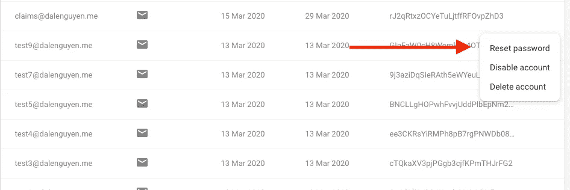
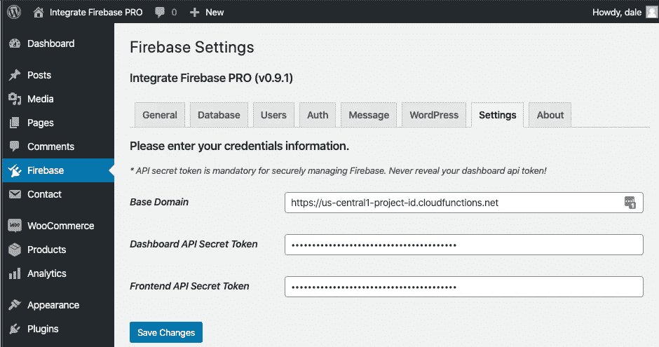
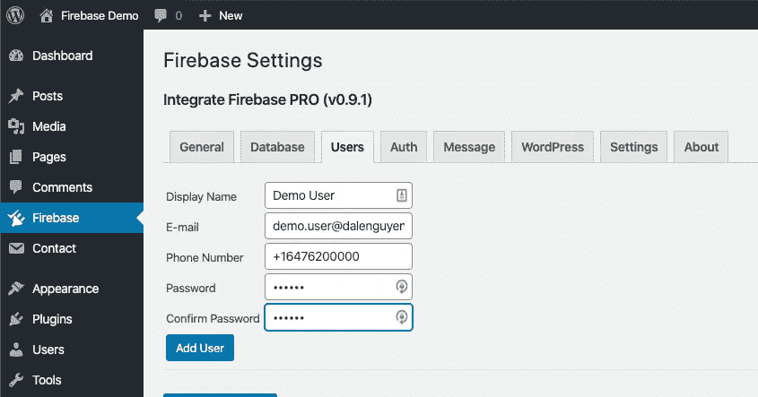
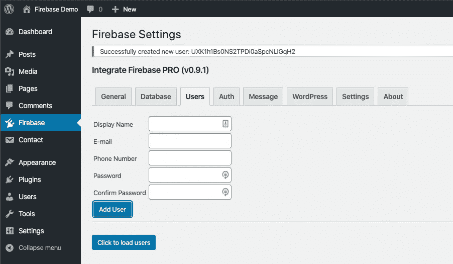
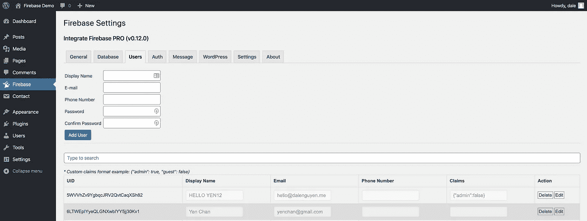
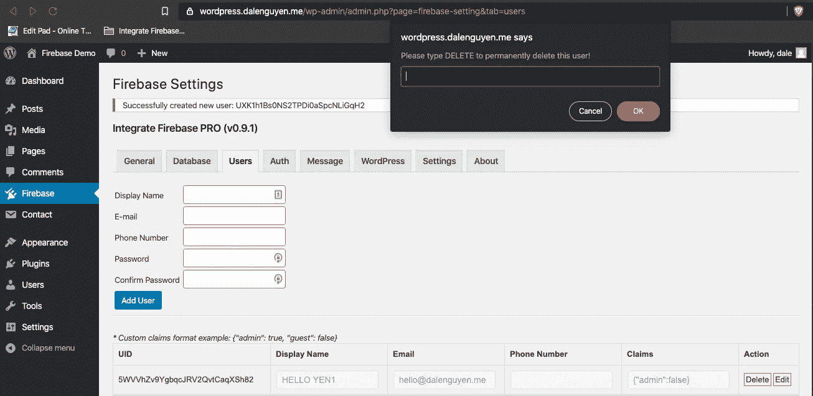

# WordPress 仪表盘中的 Firebase 用户管理

> 原文：<https://itnext.io/firebase-users-management-in-wordpress-dashboard-61b4a1ca066?source=collection_archive---------1----------------------->

> 如果你对 Integrate Firebase PRO 版本感兴趣，请阅读完整更新的文档:[*【https://firebase-wordpress-docs.readthedocs.io/】*](https://firebase-wordpress-docs.readthedocs.io/)

**演示:**[**https://wordpress.dalenguyen.me/**](https://wordpress.dalenguyen.me/)

*   文章 1: [如何将 Firebase 整合到 WordPress](/how-to-integrate-firebase-and-wordpress-b017ee274687)
*   第 2 篇:[如何从 Firestore 检索数据并显示在 WordPress 上](/how-to-retrieve-data-from-firestore-and-display-on-wordpress-8638854a762e)
*   第 3 篇:[如何在 WordPress 中使用 Firebase 自定义声明](https://medium.com/@dalenguyen/how-to-work-with-firebase-custom-claims-in-wordpress-aaf83965bd20?sk=85786e3739d42b18c3e2c7344bc5f436)
*   第 4 条:[将数据从 WordPress 保存到 Firebase(实时+ Firestore)](/how-to-save-data-from-wordpress-to-firebase-realtime-firestore-2eda917d01fb)
*   第五条: [Firebase WordPress 用户集成](/firebase-wordpress-user-integration-c18a28e41cbd)
*   第六篇: [**如何在 WordPress 仪表盘**](/firebase-users-management-in-wordpress-dashboard-61b4a1ca066#d4c2-1605c6edec5f) 中管理 Firebase 用户
*   第 7 篇:[如何将数据从 WordPress 同步到 Firebase](/sync-data-from-wordpress-to-firebase-d6e5860d3a06)
*   第 8 条:[一键登录 WordPress & Firebase 或通过电子邮件链接](https://medium.com/@dalenguyen/one-click-login-to-wordpress-firebase-or-via-email-link-d7610d71cd23)
*   第 9 条:[从 WordPress](https://medium.com/@dalenguyen/upload-files-to-cloud-storage-from-wordpress-e8acc8ce70cd) 上传文件到云存储
*   第十条:[远程 URL 登录到 Firebase & WordPress](/remote-url-login-to-firebase-wordpress-2027fad7c159)
*   第 11 条: [2 种给 WordPress 添加 Firebase 认证的方法& WooCommerce](https://dalenguyen.medium.com/2-ways-to-add-firebase-authentication-to-wordpress-woocommerce-df500c3b104e)
*   第十二条:[如何将 WooCommerce 购买数据发送到 Firebase](https://dalenguyen.medium.com/how-to-send-woocommerce-purchase-data-to-firebase-8c8b4c8cff39)
*   第 13 条:[从 WordPress](https://dalenguyen.medium.com/create-manage-firebase-database-from-wordpress-13347d8ffb2e) 创建&管理 Firebase 数据库

Google 提供了一个很好的认证工具。但是在用户管理方面并不方便。如你所见，选择是有限的。

*Firebase 默认选项*

这就是为什么我想让网站管理员更容易直接通过 WordPress dashboard 创建、读取、更新和删除 Firebase 用户。

# 先决条件

在实现这一点之前，您必须使用您的基本域和仪表板 API 秘密令牌来配置 **Firebase >设置**。你可以看看如何在[整合 Firebase 到 WordPress](https://firebase-wordpress-docs.readthedocs.io/en/latest/firebase-wordpress-integration.html) 部分设置它。

*Firebase 设置*

**Firebase 用户管理**

用户管理位于 **Firebase > Users** 选项卡下。您将看到一个表单，您可以在其中向 Firebase 添加一个新用户。记住用户将被添加到 Firebase，而不是 WordPress。

*添加新的 Firebase 用户*

如果该过程成功，您将收到一条包含用户 id 的消息通知。

*添加 Firebase 用户*

如果您想阅读、修改或删除用户，您可以点击“点击加载用户”。您可以找到关于 Firebase 用户的信息，在那里您可以更新显示名称、电子邮件、电话号码，甚至用户自定义声明。

Firebase 用户列表

当您删除用户时，会有一个确认您是否要删除它的提示，以确保您不会意外按下删除按钮。

*删除一个 Firebase 用户*

**注意**:现在的限制是 1000 个用户。我会努力在下一个版本中做得更好。