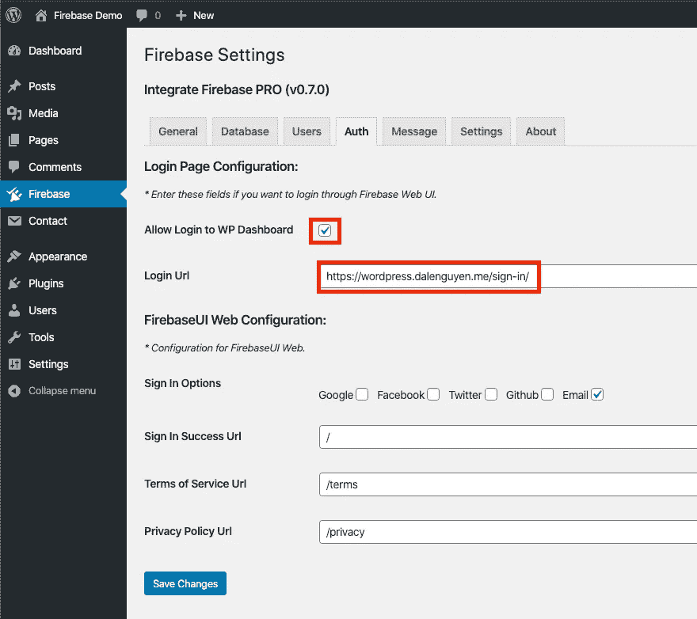
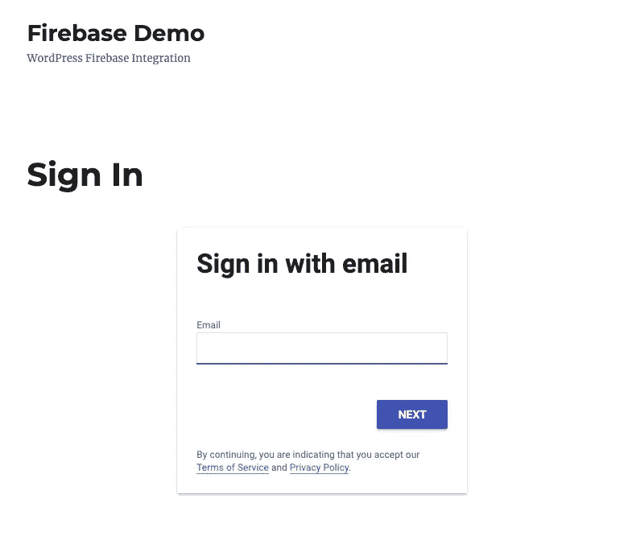

# Firebase WordPress 用户集成

> 原文：<https://itnext.io/firebase-wordpress-user-integration-c18a28e41cbd?source=collection_archive---------3----------------------->


> 如果你对 Integrate Firebase PRO 版本感兴趣，请阅读完整更新的文档:[*【https://firebase-wordpress-docs.readthedocs.io/】*](https://firebase-wordpress-docs.readthedocs.io/)

**演示:**[**https://wordpress.dalenguyen.me/**](https://wordpress.dalenguyen.me/)

*   文章 1: [如何将 Firebase 整合到 WordPress](/how-to-integrate-firebase-and-wordpress-b017ee274687)
*   第 2 篇:[如何从 Firestore 检索数据并显示在 WordPress 上](/how-to-retrieve-data-from-firestore-and-display-on-wordpress-8638854a762e)
*   第 3 篇:[如何在 WordPress 中使用 Firebase 自定义声明](https://medium.com/@dalenguyen/how-to-work-with-firebase-custom-claims-in-wordpress-aaf83965bd20?sk=85786e3739d42b18c3e2c7344bc5f436)
*   第 4 条:[将数据从 WordPress 保存到 Firebase(实时+ Firestore)](/how-to-save-data-from-wordpress-to-firebase-realtime-firestore-2eda917d01fb)
*   第五篇: [**Firebase 用户集成**](/firebase-wordpress-user-integration-c18a28e41cbd)
*   第六篇:[如何在 WordPress 仪表盘中管理 Firebase 用户](/firebase-users-management-in-wordpress-dashboard-61b4a1ca066#d4c2-1605c6edec5f)
*   第 7 篇:[如何将数据从 WordPress 同步到 Firebase](/sync-data-from-wordpress-to-firebase-d6e5860d3a06)
*   第 8 条:[一键登录 WordPress & Firebase 或通过电子邮件链接](https://medium.com/@dalenguyen/one-click-login-to-wordpress-firebase-or-via-email-link-d7610d71cd23)
*   第 9 条:[从 WordPress](https://medium.com/@dalenguyen/upload-files-to-cloud-storage-from-wordpress-e8acc8ce70cd) 上传文件到云存储
*   第十条:[远程 URL 登录到 Firebase & WordPress](/remote-url-login-to-firebase-wordpress-2027fad7c159)
*   第 11 条: [2 种给 WordPress 添加 Firebase 认证的方法& WooCommerce](https://dalenguyen.medium.com/2-ways-to-add-firebase-authentication-to-wordpress-woocommerce-df500c3b104e)
*   第十二条:[如何将 WooCommerce 购买数据发送到 Firebase](https://dalenguyen.medium.com/how-to-send-woocommerce-purchase-data-to-firebase-8c8b4c8cff39)
*   第 13 条:[从 WordPress](https://dalenguyen.medium.com/create-manage-firebase-database-from-wordpress-13347d8ffb2e) 创建&管理 Firebase 数据库

这个功能是从 [Integrate Firebase PRO](https://firebase.dalenguyen.me/download) 插件的 **v0.7.0** 开始提供的。为了让 WordPress 和 Firebase 用户更好地集成，有很多任务需要完成，因为它们在两个独立的系统中。

这个特性解决了认证问题。这是我的一个客户的例子。客户有一个移动应用程序(Firebase 用户)，他们希望这些用户不用再次注册就可以登录一个单独的 WordPress 网站。

集成 Firebase PRO 插件可以帮助实现这一点。

在这个阶段，使用订阅者或客户角色(WooCommerce)对 WordPress dashboard 进行身份验证是有帮助的。而密码更改将由 Firebase 用户主导。用户在登录 WordPress 仪表板后不能更改他们的密码。他们必须使用 Firebase 中的*忘记密码*功能来创建新密码。而且如果两个系统的密码不一样，下次用户通过 FirebaseUI Web shortcode 登录时，会自动更改 WordPress 中的密码。

# 如何使用 Firebase 用户登录 WP 仪表板

*** * *重要提示:**在此之前，您应该为自己打开一个仪表板，并打开另一个私人窗口，以便使用 Firebase 的电子邮件登录，然后在退出当前窗口之前为该用户分配管理员权限，以确保您可以使用您的 Firebase 用户再次登录(使用**管理员**权限)。

如果注销时没有给其他用户分配管理员权限，您可以重命名插件文件夹并照常登录。

该流程将利用 FirebaseUI Web 工作流来对用户进行身份验证。为了做到这一点，你必须登录 WordPress Dashboard，然后**Dashboard>Firebase>Auth**。



*Firebase 授权设置*

勾选**允许登录 WP 仪表盘**并输入你的**登录网址**。它可以是你的主页，也可以是一个单独的登录页面。从现在开始，每次用户导航到[https://your-webiste.com/wp-admin](https://your-webiste.com/wp-admin)，它都会重定向到你的新登录页面。

该页面将包含登录的短代码。

```
// Login, Register through FirebaseUI Web
[firebaseui_web][/firebaseui_web]
```



*新 WP 登录页面*

用户登录后，如果用户不存在，它会在 WordPress 中创建一个新用户。然后自动向 WordPress 仪表盘验证它。

当用户从仪表板注销时，这意味着他们也将从 Firebase 注销。

你在演示网站上试试:[https://WordPress . dalen guyen . me](https://wordpress.dalenguyen.me)

# **从 Restful API 创建新的 WordPress 用户**

集成 Firebase PRO 有自己的 Restful API 端点，帮助创建新的 WordPress 用户。

在这种情况下，当你有一个移动应用程序，并且你想在 WordPress 中复制用户，你可以在用户注册到你的应用程序后调用 API 来创建一个新用户。

```
Endpoint: POST [https://example.com/firebase/v2/users/register](https://your-website.com/firebase/v2/users/register)Example payload: {
 username: 'dale',
 email: 'dale@dalenguyen.me',
 password: 'the-password'
}
```