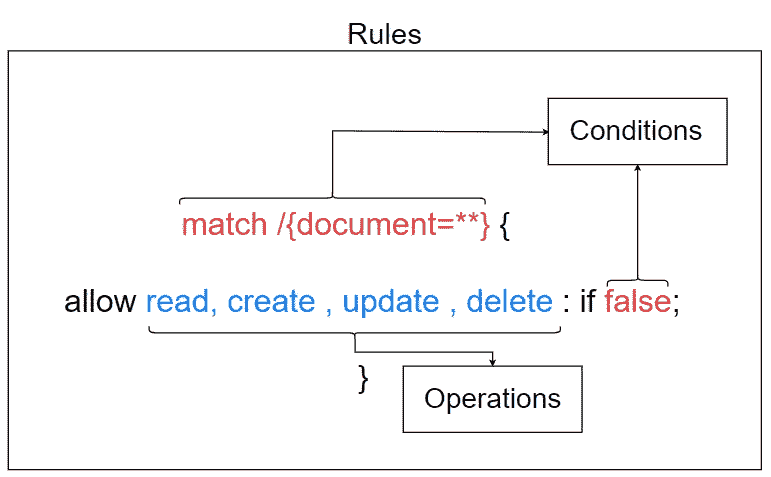
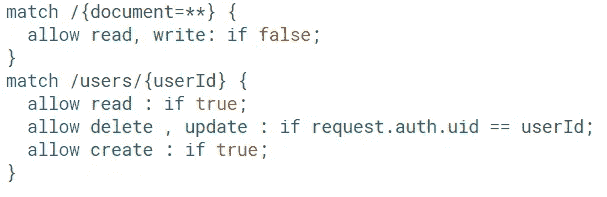
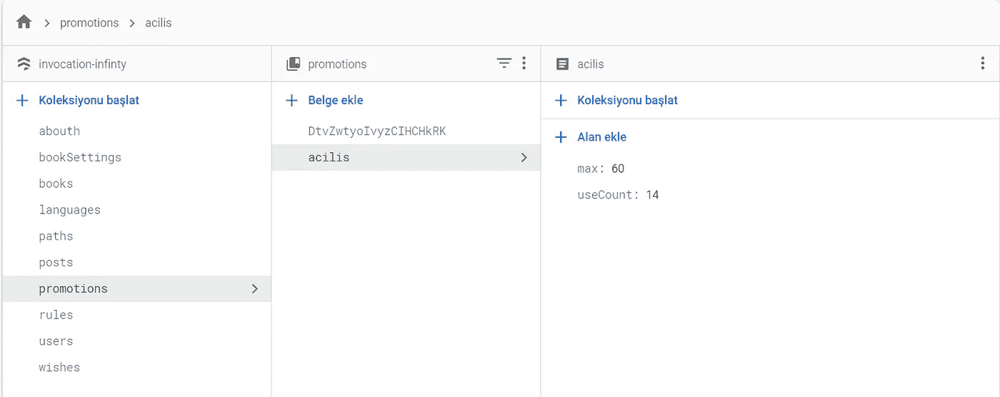
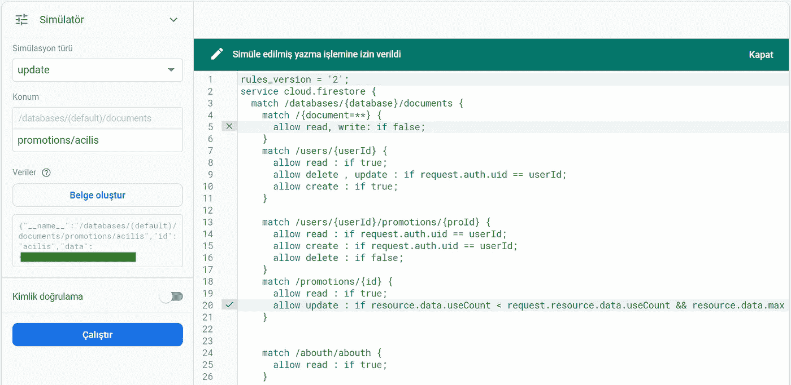
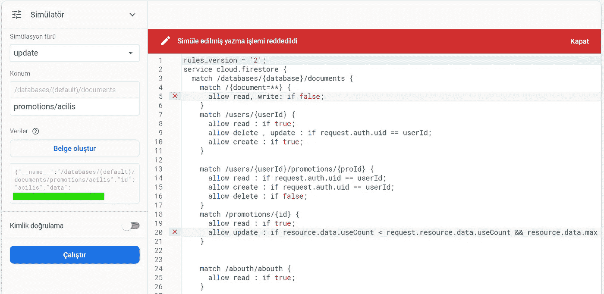

# 基于文档和字段的 Firebase 授权的 Firestore 安全规则

> 原文：<https://itnext.io/firestore-security-rules-with-firebase-auth-based-on-document-and-fields-d25afd1bdefd?source=collection_archive---------2----------------------->

与最近的过去不同，更重要的是安全地存储信息，而不是尽可能多地分发信息(正如我在封面照片中试图投射的那样)。在这种情况下，数据安全是当今最重要的问题之一。。

Firestore 是一个文档化的 NoSQL 数据库，非常有用且可扩展。它有一个相当简单的安全基础设施。

您可以在 Firestore 安全规则基础架构中使用 Firebase 身份验证服务。因此很容易创建基于用户的安全规则。

不幸的是，我没有得到足够的关于这个主题的文档，所以我觉得有必要写这篇文章。

这个信息大家都已经知道了，我就简单举个例子。

# **目录**

**1。了解 Firestore 安全规则**

*它是如何工作的？*

**2。语法**

*怎么写规则？*

**3。基于文档的规则**

如何保护文件？

**4。用 Firebase Auth 记录规则**

*如何根据不同用户保护文档？*

**5。基于字段的规则**

*如何根据不同用户保护文档？*

**6。优化**

*如何保护自己的钱包？*

**7。基于复杂字段的规则**

*文档公开时如何保护文档字段？*

## **1)了解 Firestore 安全规则**

图片上解释了云 Firestore 安全规则的工作原理。有 4 种操作，每种规则有 2 个条件。

每个规则都有；

`match /path`条件。您可以为每个文档或集合编写规则。

b)允许的操作列表。有 4+1 种操作；`Read`、`Delete`、`Update`、`Create`(或对`delet`、`update`、`create`有效的`write`)。如果条件不同，你可以分开写。

c)如果条件。在满足第一个条件的情况下，应当允许所请求的操作。

## **2)语法**

如果你使用的文件名称包括"`{}`"你可以使用参数那一栏。此外，该匹配条件适用于该级别的所有文档。(例如图片第二次匹配中的“匹配所有用户”)。

**运算符**
`&&`和
`||`或
`==`等于
`!=`不等于

`request`请求端信息
`resource`数据库端信息

`request.auth`请求端认证信息
`request.resource`请求端参数

`request.resource.data`变更请求数据
`resource.data` 资源(firestore 中)数据

你可以用`.fieldName`两边数据得到数据。

## **3)单据基础规则**

`match /{document=**} {
allow read, write: if false;
}`

所有文件对所有操作关闭，除非有例外。建议您在规则的开头添加此列，并为每个权限编写一条规则。

`match /infos/about {
allow read : if true;
}`

Everyone `read`关于文档，但不删除、创建或更新。

`match /books/{bookId} {
allow read , create: if true;
}`

每个人`read`、`create`，但任何人都不能`update`、`delete`收藏任何一本书。

## **4)使用 Firebase Auth 的文档规则**

`match /users/{userId} {
allow read ,delete , update : if request.auth.uid == userId;
allow create : if true;
}`

users 集合中的 every one`create`文档，但是只有 userId 等于 documentID 的用户才能执行其他操作

`match /users/{userId}/publishedPosts/{postId} {
allow read : true;
allow create : if request.auth.uid == userId;
allow delete : if false;
}`

所有人`read`该用户发布的所有帖子。但是只有这个用户`create`拥有帖子，任何人都不能`delete`发帖。

在这种情况下，不允许任何人`update`。

## **5)基于字段的规则**

`match /posts/{postID}{
allow read : true;
allow write: if request.resource.data.ownerId == request.auth.uid;
}`

每个人都可以 `read`发帖，但是只有这个用户可以`update`、`delete`和`create`。这个例子只有“`user132`”可以写操作。

其他示例:

`match /users/{userId} {
allow read ,delete , update : if request.auth.uid == userId;
allow create : if request.resource.data.age > 18;
}`

我们在第四篇文章的例子中添加了另一个条件:如果“年龄”字段大于 18 岁，每个人都可以创建文档。

## **6)优化**

我们需要根据规则优化我们的数据库架构。Firestore 的建议包括我们需要将机密信息存储在子集合中并使用云功能进行处理的信息。这是一个很好的解决方案。但每次都不便宜。

我们可以在子集合中存储匿名帖子所有者的信息。这些信息只写一次，通常是不可读的。(因为匿名。)

但是例如我们有一个促销活动。每个促销代码的文档。假设促销有多次使用和一个配额。当然，恶意的人会想要改变这些数字。因此，我们有一份文件，每个人都可以阅读，但不是每个人都可以改变。根据 Firestore 的建议，把你的推广用途写在别处，用功能进行处理。这是+2 读+2 写操作的平均成本。但是对每个小数据都这样做通常代价很高。

由于这些原因，我将在实地的基础上通过规则。

我的解决方案；

## **7)基于复杂字段的规则**

这是我的晋升文件。

`match /promotions/{id} {
allow read : if true;
allow update : if resource.data.useCount < request.resource.data.useCount
&& resource.data.max == request.resource.data.max;
}`

`match /users/{userId}/promotions/{proId} {
allow read : if request.auth.uid == userId;
allow create : if request.auth.uid == userId;
allow delete : if false;
}`

这种情况下。每个人都可以`read`在一个促销集合中推广文档。任何人都不能`delete`和`create`。

同样如果`useCount field value in incoming data is greater than in value of original data`(仅增加)和`max is equal to original data`(无权限更新`max`字段)的人可以`update`单据。

请阅读突出显示的绿色。

拒绝许可。因为 max 与原始数据不同。

其他示例:

`match /posts/{postID} {
allow read: if true;
allow create: if true;
allow update: if request.resource.data.vote is number
|| request.resource.data.randomNumber is number
&& request.resource.data.anonymous == resource.data.anonymous
&& request.resource.data.content== resource.data.content
&& request.resource.data.userName == resource.data.userName
&& request.resource.data.owner == resource.data.owner && request.auth.uid != null;
}`

`vote` 和`randomNumber` 字段是可更新的。

`anonymous`、`content`、`userName`、`owner`字段不可更新。

希望这篇文章能解决你的问题。干得好！