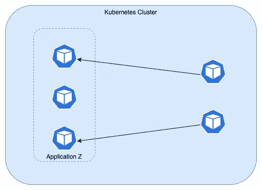
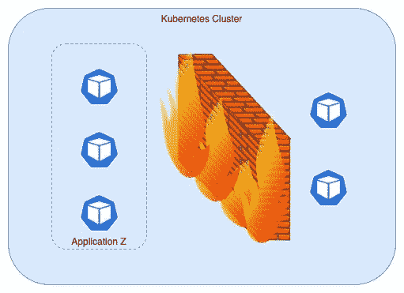
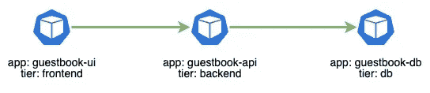
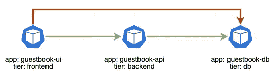
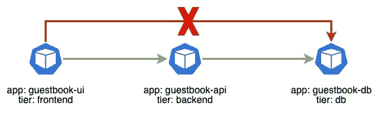

# Kubernetes 中应用程序的防火墙

> 原文：<https://itnext.io/firewall-for-applications-in-kubernetes-af0acbe337da?source=collection_archive---------2----------------------->

在这篇博客中，我们将探讨 kubernetes 的一个特性，它旨在提高集群中运行的应用程序的安全性

在 kubernetes 集群中，我们可以运行许多应用程序，每个应用程序都有多个副本。默认情况下，任何 pod 都可以与同一集群中运行的任何其他 pod 进行通信。



集群中不同 pod 之间的通信

但是不建议允许这样的特征存在。如果一个入侵者进入了一个容器，那么他/她就可以从被入侵容器内部进入所有的容器。因此，我们需要一个针对应用程序的防火墙，通过它可以决定是允许还是拒绝集群内部的流量(包括入站和出站流量)。



k8s 集群中的受限 pod 通信

拯救者来了， ***网络策略*** 帮助为运行在 kubernetes 集群中的应用程序创建防火墙。

让我们通过一些例子来了解对这种防火墙的需求以及网络策略如何帮助实现这一点。

# **留言簿**

考虑一个应用程序 ***留言簿*** 具有如下 3 个不同的组件:

*   留言簿-用户界面(前端)
*   留言簿-api(后端)
*   留言簿-数据库(数据库)

这些组件之间的预期通信就像 ui 与 api 通信，api 与 db 通信。



留言簿单元之间的预期通信

但是，当留言簿应用程序的所有这些组件都运行在 kubernetes 集群中时，从技术上讲，ui 组件在默认情况下可以与 db 通信。



guestbook-ui pod 可以访问 db pod，这是不期望的

# **使用网络策略为集群中的应用程序设置防火墙**

> 由于网络策略是应该由网络插件实现的功能，请确保您的网络插件支持网络策略资源。创建没有此类插件的网络策略资源将不起作用。Calico、Cilium、Kube-router、Romana 和 Weave Net 是一些支持网络策略的网络插件

首先，通过在所有名称空间中创建如下网络策略，禁用允许 kubernetes 集群中运行的所有 pods 之间进行所有通信的默认行为。

```
apiVersion: networking.k8s.io/v1kind: NetworkPolicymetadata: name: deny-allspec: podSelector: {} ingress: {}
```

现在，没有一个 pod 可以与 kubernetes 集群中运行的任何其他 pod 通信。现在，根据要求，允许集群中的 pod 的入站/出站流量。

对于留言簿应用程序，要允许流量进入 ***留言簿-api*** 窗格，但只能从 ***留言簿-ui*** 窗格进入，请创建如下网络策略。

```
apiVersion: networking.k8s.io/v1kind: NetworkPolicymetadata: name: allow-ui-to-apispec: podSelector: matchLabels: app: guestbook-api tier: backend ingress: - from: podSelector: matchLabels: app: guestbook-ui tier: frontend
```

并且允许进入流量到 ***留言簿-db***pod，但是只允许来自 ***留言簿-API***pod 的流量，创建如下网络策略。

```
apiVersion: networking.k8s.io/v1kind: NetworkPolicymetadata: name: allow-api-to-dbspec: podSelector: matchLabels: app: guestbook-db tier: db ingress: - from: podSelector: matchLabels: app: guestbook-api tier: backend
```

使用这些网络策略的最终设置只允许 pod 之间的有效通信



留言簿-ui 窗格无法按预期访问数据库窗格

# **关于网络政策的更多信息**

## **命名空间选择者**

在某些情况下，我们必须允许从名称空间中的任何 pod 进入。例如，所有应用程序单元都应该允许来自 ***监控*** 名称空间中所有单元的进入。可以使用名称空间选择器轻松实现这种设置，如下所示。

```
apiVersion: networking.k8s.io/v1kind: NetworkPolicymetadata: name: allow-monitoring-namespacespec: podSelector: {} ## applies to all pods in the namespace ingress: - from: namespaceSelector: matchLabels: team: monitoring ## labels of the monitoring namespace
```

## **IP 块**

不仅仅是标签，网络策略还允许使用 IP 块进行配置。以下网络策略允许来自 10.72.X.X 的进入，但阻止来自 10.72.10.X 的流量

```
apiVersion: networking.k8s.io/v1kind: NetworkPolicymetadata: name: allow-using-ipspec: podSelector: {} ingress: - from: ipBlock: cidr: 10.72.0.0/16 except: 10.72.10.0/8
```

# **结论**

k8s 集群各个级别都有安全就好。为 kubernetes 集群中的应用程序单元添加防火墙可以减少攻击面，从而提高安全性，因此强烈建议这样做。

*最初发布于*[*https://www . prabhujayakumar . dev*](https://www.prabhujayakumar.dev/blog/save-your-k8s-cluster-from-dos/)*。*