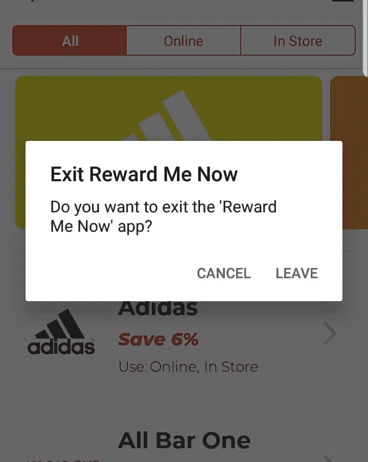

# 一级安卓，带 React Native

> 原文：<https://itnext.io/first-class-android-with-react-native-c3bff02b79a6?source=collection_archive---------2----------------------->

iOS 模拟器是如此流畅和灵敏…有时，拥有一个最喜欢的平台会影响你作为移动开发者的工作质量。带有 React Native 的 Android 有时会感觉像一个二等平台，但今天你可以做一些事情，这会让你的 Android 用户脸上露出笑容。


照片由[亚历山大·奈特](https://unsplash.com/@agkdesign?utm_source=unsplash&utm_medium=referral&utm_content=creditCopyText)在 [Unsplash](https://unsplash.com/s/photos/robot?utm_source=unsplash&utm_medium=referral&utm_content=creditCopyText) 上拍摄

## 平台可触摸

在你的组件中默认使用 [React Native Touchable](https://github.com/react-native-community/react-native-platform-touchable) 将会给你的 Android 体验带来巨大的不同。这将在 iOS 上使用`<TouchableOpacity />`，在 Android 上使用`<TouchableNativeFeedback />`。默认情况下，这会给你带来 Android 上的本地连锁反应。


安卓系统的连锁反应

请注意，如果您的可触摸对象有圆角，那么在交互时，您可能会在元素周围看到一个框效果。要解决这个问题，请用以下样式的`<View />`包裹你的`<Touchable />`。

```
<View style={{ borderRadius: 5, overflow: "hidden" }}>
  <Touchable style={{ borderRadius: 5 }}>
     ...    
  </Touchable>
</View>
```

## 本地驱动程序

Android 上的动画有时看起来有点“不稳定”。这是因为当你使用`[useNativeDriver](https://facebook.github.io/react-native/blog/2017/02/14/using-native-driver-for-animated)`选项时，Android 上带有 React Native 的动画通常工作得更好。

然而故事并没有就此结束，因为`useNativeDriver`只支持有限的选项，尽管如此，它支持的一件事是[React Native transformations](https://facebook.github.io/react-native/docs/transforms)。

当使用 React Native 制作动画时，通常最好花更多时间使用变换制作动画；`translateX`、`translateY`、`scaleX`、`scaleY`，而不是`bottom`、`top`、`left`、`right`、`flex`、`width`、`height`等位置和大小属性。这将允许您使用`useNativeDriver`选项，并显著提高 Android 上的动画性能。

## 材料设计(底部标签)

当我们为移动平台开发时，我们通常希望遵循平台推荐的设计指南。iOS 更严格地执行其设计准则。Android，因为它有多个手机制造商使用他们自己的皮肤，可以更宽松一些。

材质设计很棒。用你自己的设计重新实现底部标签有时是个坏主意，会让人们远离 Android 优先的体验。


反应原生材料底部标签

[素材底部导航](https://github.com/timomeh/react-native-material-bottom-navigation)就是做这个的库。

## 硬件背面处理

破坏你 Android 优先体验的最后一个大错误是没有正确操作硬件后退按钮。对于我的一个客户来说，他们的应用程序[“立即奖励我”](https://rewardmenow.co.uk/)已经完成了高质量的后台处理。

如果用户在堆栈中的某个位置，并且屏幕是“可弹出的”(例如，他们不在根屏幕上，或者已经提交了表单并且不能返回)，那么后退按钮将弹出屏幕，如果用户不能返回，他们将获得一个对话框，询问他们是否要离开应用程序，以避免意外按下和关闭应用程序。



硬件上的对话框被按下

还实现了 back 按钮来关闭侧菜单，并在流程完成后弹出多个屏幕，请确保在您的应用程序中测试所有场景。下面是一个要点，其中包含了钩子和实用函数的代码，以实现上图中的效果。

手柄背部按压 Gist([https://Gist . github . com/lukebrandonfarrell/6b6d 705363 Dade bbf 549 ef 03 ff 4b 8575](https://gist.github.com/lukebrandonfarrell/6b6d705363dadebbf549ef03ff4b8575))

截至 React Native 0.60.4，随着 [Hermes](https://facebook.github.io/react-native/docs/hermes/) : *“一个为在 Android 上运行 React Native 应用程序而优化的开源 JavaScript 引擎”的推出，Android 受到了❤️更多的喜爱。*