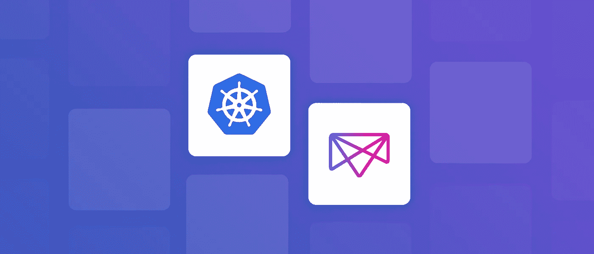
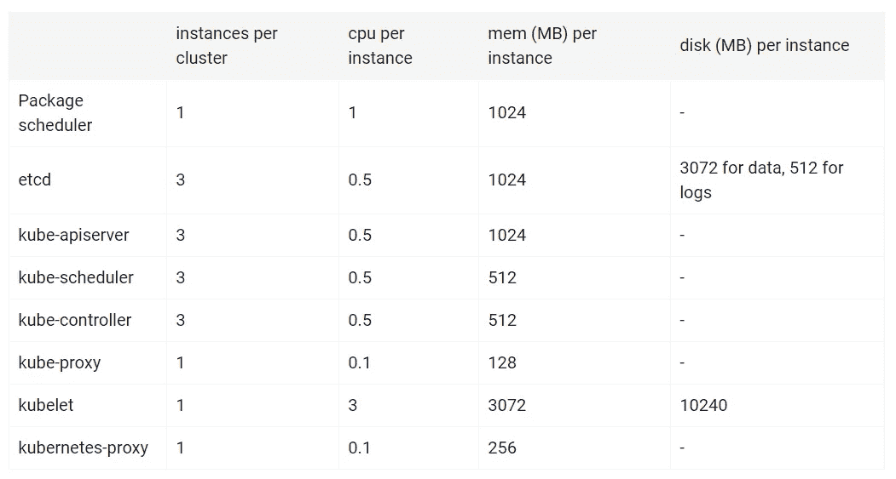
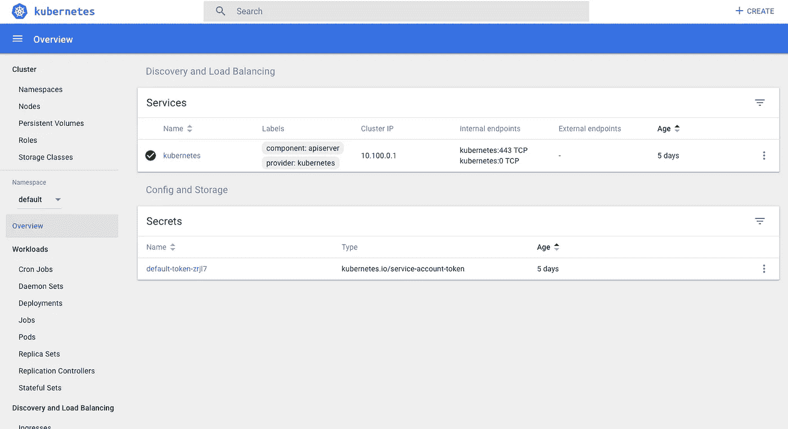
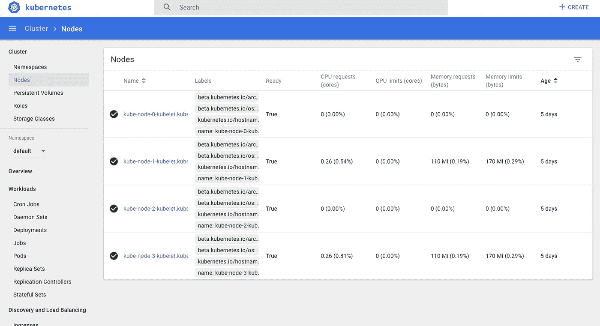
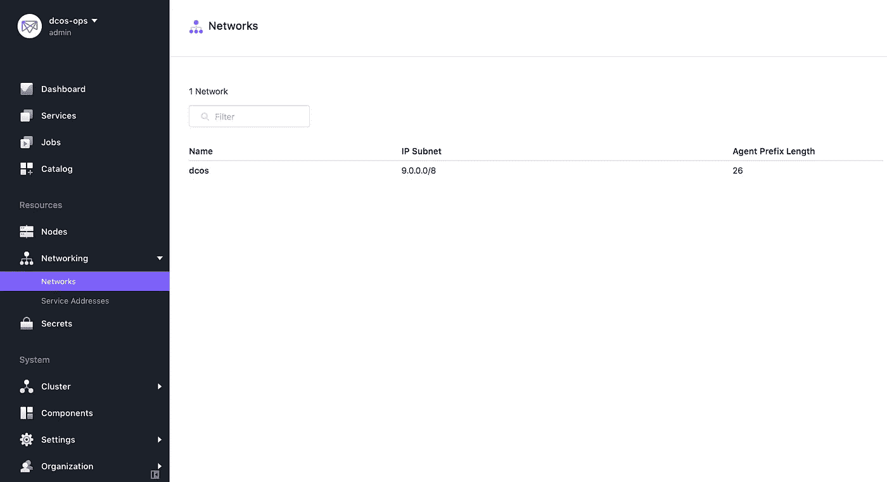
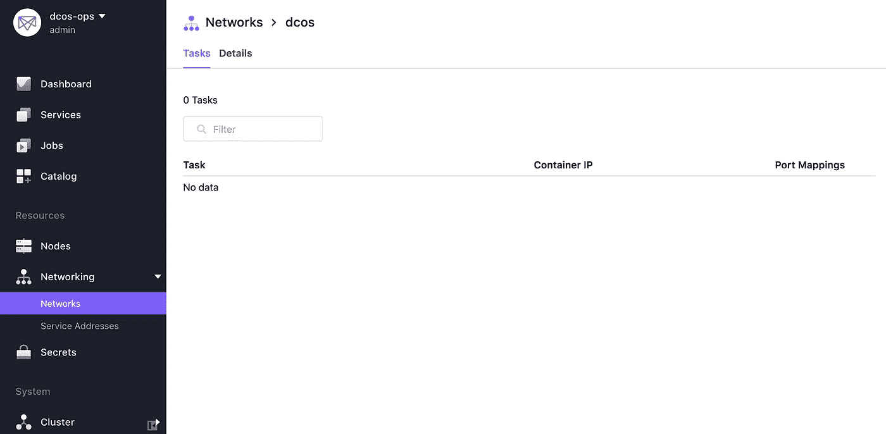

# 与 Kubernetes 在 DC 操作系统上的首次互动

> 原文：<https://itnext.io/first-interaction-with-kubernetes-on-dc-os-2c2749da1266?source=collection_archive---------4----------------------->



资料来源:mesosphere.com

自从 1.11 发布以来，DC/OS 已经支持他们所说的“Kubernetes-as-a-Service”(做得好，营销！).它被定位为运行托管 Kubernetes 集群的一种方式，提供额外的开箱即用功能，如 HA、安全性以及部署和升级的方便性。减轻运行和管理 Kubernetes 集群的复杂性，同时利用在 DC/OS 上运行 Kubernetes 和其他框架(如 Kafka、Elasticsearch 等)的优势。这对我很有吸引力，因为它增加了另一项服务，我可以向用户提供这项服务，同时将所有内容都放在一个 DC/操作系统集群中；更多产品，让所有微服务和谐共处。非常酷！

在过去的几天里，我终于有了几分钟的时间开始尝试这个新产品，并阅读了相关的文档。在这篇文章中，我想分享我在 DC 操作系统上开始使用 Kubernetes 的最初几个小时的经历。我将分享和讨论我的经验，解释一些组件，提供提示，并希望展示您也可以开始使用。

Github 资源，如果你想尝试或跟随:

[](https://github.com/geekbass/kubernetes-dcos) [## geekbass/kubernetes-dcos

### kubernetes-dcos -在 DC 操作系统上运行 kubernetes

github.com](https://github.com/geekbass/kubernetes-dcos) 

**部署**

重要的事情先来。我们需要让 Kubernetes 在我们的 DC/操作系统集群上运行。将包和服务部署到 DC 操作系统非常简单。你可以从[DC/操作系统目录](https://docs.mesosphere.com/1.11/gui/catalog/)或者从[命令行界面](https://docs.mesosphere.com/1.11/cli/)安装软件包。Kubernetes 也不例外，支持这两种选项。在这篇文章中，我们将使用 CLI，因为我们需要安装“kubernetes cli”包，以便我们可以在以后轻松地配置“kubectl”。

我做的第一个部署是[快速入门示例](https://docs.mesosphere.com/services/kubernetes/1.0.3-1.9.7/quick-start/)(接受所有默认设置)，只是为了看看当我部署它时会发生什么，并感受一下会发生什么。它真的会像预期的那样起作用吗？

```
dcos package install kubernetes
```

成功了！在不到 10 分钟的时间内，它在集群中安装了所有必要的组件(参见先决条件部分)。但是，快速启动并不比在本地运行 [minikube](https://kubernetes.io/docs/tasks/tools/install-minikube/) 好多少。不过，它确实证明了部署时不会出现任何问题。我真的打算看到一个真正的托管 HA K8s 集群，我有可能在某一天将其投入生产。

我删除了当前的部署，并阅读了关于[高级安装](https://docs.mesosphere.com/services/kubernetes/1.0.3-1.9.7/advanced-install/)的文档，大约 5 分钟后，我想出了下面的 JSON 来满足我当前对一个好的“生产”风格测试平台的需求(参见上面 git repo 中的 options.json)

```
{
    "service": {
       "service_account": "kubernetes",
       "service_account_secret": "kubernetes/sa"
  },
    "kubernetes": {
    "high_availability": true,
    "node_count": 4,
    "reserved_resources": {
      "kube_cpus": 20,
      "kube_mem": 20000,
      "kube_disk": 10500
       }
    }
}
```

请注意，我使用的是 DC 操作系统的企业版，因此我使用的是服务帐户选项。你可以在上面的 Kubernetes 服务账户中看到更多信息的[高级安装](https://docs.mesosphere.com/services/kubernetes/1.0.3-1.9.7/advanced-install/)文档和 git repo。

从上面的 JSON 中，您可以看到 Mesosphere 为我们提供了一个“高可用性”密钥，它将在 h a 中部署 K8s 组件。然后指定“node_count”，这是 K8s 工作节点的数量，以及您希望在 DC/OS 集群上为每个工作节点保留多少 cpu、内存和磁盘来运行 K8s 服务。部署完成后，我们应该最终得到一个 HA K8s 集群，其中有 4 个工作节点，每个节点有 20 个 CPU、20 GB 内存和 100 GB 磁盘。注意:我们还没有为 ingress 做任何事情，因为它不是默认安装的一部分。

```
dcos package install kubernetes --options=options.json
```

万岁。一切顺利，仅用了大约 12 分钟就完全安装了 HA 所需的所有组件！



高可用性部署—来源:docs.mesosphere.com

我不得不说，Kubernetes 在 DC 操作系统上的部署是我在该平台上看到的最令人印象深刻的事情之一。这简直是再简单不过了。我不是最有经验的 Kubernetes 用户，但是我已经使用过它很多次了，并且理解了它的许多组件和复杂性。中间层在这方面做得很好。

**仪表板**

Kubernetes 部署提供的一个很好的特性是 Kubernetes 仪表板。我不打算在这上面花太多时间，但这绝对是应该提到的，因为它是任何 Kubernetes 环境中的必备组件。K8s 集群启动并运行后，您可以通过浏览器中的以下 URL 访问控制面板:

[http://${DCOS 网址}/service/kubernetes-proxy/](http://${DCOS_URL}/service/kubernetes-proxy/)

访问通过 DC/操作系统用户界面和管理路由器服务进行管理，其外观和行为与您预期的一样。



你可以看到我下面有 4 个 woker 节点。



这没什么特别的，但是我想我应该提到它是安装的一部分，以及如何访问它。大多数情况下，这是您在建立自己的 K8s 集群时必须自己设置的另一个组件。到目前为止很开心！

**Kubetctl**

“库贝拥抱”工具(我发音为“库贝-C-T-L”)。如果你曾经玩过 K8s 集群或者安装过 minikube，那么你可能已经安装了这个命令行工具。我真的很喜欢使用这个工具，并且已经在我的机器上安装了它，但是你肯定需要安装它来继续和/或做我们已经讨论过的任何事情。您可以根据您的操作系统需求从这里获得[安装](https://kubernetes.io/docs/tasks/tools/install-kubectl/)。您还需要安装[DC/操作系统命令行界面](https://docs.mesosphere.com/1.11/cli/)来简化 kubectl 环境的配置。

一旦安装了 kubectl 并安装了 DC/OS CLI，就可以配置 kubectl 来访问您的集群了。

安装 DC/操作系统 Kuberenetes CLI:

```
dcos package install kubernetes --cli
```

执行以下操作，以允许 DC/操作系统 CLI 自动设置对群集的访问:

```
dcos kubernetes kubeconfig
kubeconfig context 'dcos-ops' created successfully
```

通过运行几个命令进行验证:

```
kubectl get nodes
NAME                                   STATUS    ROLES     AGE       VERSION
kube-node-0-kubelet.kubernetes.mesos   Ready     <none>    5d       v1.9.7
kube-node-1-kubelet.kubernetes.mesos   Ready     <none>    5d       v1.9.7
kube-node-2-kubelet.kubernetes.mesos   Ready     <none>    5d       v1.9.7
kube-node-3-kubelet.kubernetes.mesos   Ready     <none>    5d       v1.9.7kubectl cluster-info
Kubernetes master is running at [https://${DCOS_URL}/service/kubernetes-proxy](https://10.32.88.197/service/kubernetes-proxy)
KubeDNS is running at [https://](https://10.32.88.197/service/kubernetes-proxy/api/v1/namespaces/kube-system/services/kube-dns:dns/proxy)[${DCOS_URL}](https://10.32.88.197/service/kubernetes-proxy)[/service/kubernetes-proxy/api/v1/namespaces/kube-system/services/kube-dns:dns/proxy](https://10.32.88.197/service/kubernetes-proxy/api/v1/namespaces/kube-system/services/kube-dns:dns/proxy)To further debug and diagnose cluster problems, use 'kubectl cluster-info dump'.
```

真的很简单，我不需要做太多。请注意，您可以设置多个环境和上下文。在某些时候，您可能需要重新运行 kubeconfig 来重新获得访问权限，因为默认情况下，您将失去 dcos 身份验证，需要重新登录。

现在我们已经可以与我们的 Kubernetes 集群进行交互了，让我们开始在那里进行一些部署并开始试验。这应该就像任何 K8s 集群一样。

启动一个简单的部署:

```
kubectl run nginx --image=nginx --port 8080
deployment.apps "nginx" createdkubectl get pods
NAME                    READY     STATUS    RESTARTS   AGE
nginx-b87c99f86-9lfnn   1/1       Running   0          14s
```

让我们删除当前窗格，并确保它会重新出现:

```
kubectl delete pods nginx-b87c99f86-9lfnn
pod "nginx-b87c99f86-9lfnn" deleted

kubectl get pods
NAME                    READY     STATUS              RESTARTS   AGE
nginx-b87c99f86-9lfnn   0/1       Terminating         0          1m
nginx-b87c99f86-zpjg6   0/1       ContainerCreating   0          2skubectl get pods
NAME                    READY     STATUS        RESTARTS   AGE
nginx-b87c99f86-9lfnn   0/1       Terminating   0          1m
nginx-b87c99f86-zpjg6   1/1       Running       0          10skubectl get pods
NAME                    READY     STATUS    RESTARTS   AGE
nginx-b87c99f86-zpjg6   1/1       Running   0          14s
```

酷！没什么特别的，不过就是在按预期做事。

缩放怎么样？

```
kubectl get deployment
NAME      DESIRED   CURRENT   UP-TO-DATE   AVAILABLE   AGE
nginx     1         1         1            1           3mkubectl scale --replicas=20 deployment/nginx
deployment.extensions "nginx" scaledkubectl get deployment
NAME      DESIRED   CURRENT   UP-TO-DATE   AVAILABLE   AGE
nginx     20        20        20           1           4mkubectl get pods
NAME                    READY     STATUS    RESTARTS   AGE
nginx-b87c99f86-2rqbp   1/1       Running   0          9s
nginx-b87c99f86-5zqmx   1/1       Running   0          8s
nginx-b87c99f86-6ncqg   1/1       Running   0          9s
nginx-b87c99f86-8dhfb   1/1       Running   0          8s
nginx-b87c99f86-9596z   1/1       Running   0          8s
nginx-b87c99f86-bs96v   1/1       Running   0          9s
nginx-b87c99f86-cqlmf   1/1       Running   0          8s
nginx-b87c99f86-crdnx   1/1       Running   0          8s
nginx-b87c99f86-fc6ph   1/1       Running   0          8s
nginx-b87c99f86-fzszg   1/1       Running   0          8s
nginx-b87c99f86-kbqmz   1/1       Running   0          9s
nginx-b87c99f86-lk669   1/1       Running   0          8s
nginx-b87c99f86-m4kgz   1/1       Running   0          9s
nginx-b87c99f86-mfgns   1/1       Running   0          8s
nginx-b87c99f86-nph4v   1/1       Running   0          9s
nginx-b87c99f86-pthd5   1/1       Running   0          8s
nginx-b87c99f86-qfr86   1/1       Running   0          9s
nginx-b87c99f86-rkpzr   1/1       Running   0          8s
nginx-b87c99f86-z9n6g   1/1       Running   0          8s
nginx-b87c99f86-zpjg6   1/1       Running   0          3m kubectl delete deployment nginx
deployment.extensions "nginx" deletedkubectl get pods
NAME                    READY     STATUS        RESTARTS   AGE
nginx-b87c99f86-5zqmx   0/1       Terminating   0          4m
nginx-b87c99f86-9596z   0/1       Terminating   0          4m
nginx-b87c99f86-bs96v   0/1       Terminating   0          4m
nginx-b87c99f86-kbqmz   0/1       Terminating   0          4m
nginx-b87c99f86-lk669   0/1       Terminating   0          4m
nginx-b87c99f86-pthd5   0/1       Terminating   0          4m
nginx-b87c99f86-qfr86   0/1       Terminating   0          4m
nginx-b87c99f86-z9n6g   0/1       Terminating   0          4m
nginx-b87c99f86-zpjg6   0/1       Terminating   0          7m 
```

同样，这里绝对没有发生什么特别的事情，但是你可以看到它正在做一些事情。这是工作，因为它应该没有真正的任何汗水，血液或眼泪在这一点上。我真的很喜欢只需发出几个命令就可以设置与 K8s 集群的交互的简单性。到目前为止非常简单。

我认为在这里看到一件事真的很好，特别是作为 DC/操作系统集群的运营或管理员，这是一种从 DC/操作系统 UI 中查看 Kubernetes 服务运行的方式。我可能会发现，试图在不同的编排者(Marathon 和 Kubernetes)之间追踪不同的服务会变得令人困惑。当然，这并不是一个巨大的损失，但是试着把所有的事情都放在一个罩下会很好。

**与 DC/OS 上所有东西的通信**

对我来说，这是在 DC 操作系统上运行 Kubernetes 最有趣的特性。能够为我的用户提供更多选择来管理他们的微服务。共享集群中的所有微服务和大数据服务和谐共存，能够轻松地相互交互和利用。示例:运行在 Kubernetes 上的服务可以利用运行在 DC/OS 上的 Kafka 集群，反之亦然。我所说的容易是指在用户端只需很少的定制和努力。DC 操作系统已经通过其处理服务发现、DNS 和具有 VIP 和覆盖等功能的网络的方式使这成为可能。

让我们看看如何与运行在 Kubernetes 中的服务和运行在 DC/OS 中的其他服务进行交互。让我们创建另一个部署，使用一个公开的端口作为备用，因为我们知道可以将 NodePort 用于持久 URL:

```
kubectl run nginx --image=nginx --port=80
deployment.apps "nginx" created

kubectl expose deployment nginx --port=80 --target-port=80 --type=NodePort
service "nginx" exposed

kubectl describe services nginx
Name:                     nginx
Namespace:                default
Labels:                   run=nginx
Annotations:              <none>
Selector:                 run=nginx
Type:                     NodePort
IP:                       10.100.124.239
Port:                     <unset>  80/TCP
TargetPort:               80/TCP
NodePort:                 <unset>  30291/TCP
Endpoints:                9.0.1.79:80
Session Affinity:         None
External Traffic Policy:  Cluster
Events:                   <none>
```

所以有几件事我很想知道:

*   DC/OS 中运行的其他服务如何与 Kubernetes 中的服务交互？其他 DC/操作系统服务→ Kubernetes 服务
*   Kubernetes 服务如何与 DC/OS 集群上运行的其他服务进行通信？Kubernetes 服务→DC/操作系统服务

开箱即用的 DC/操作系统为其所有服务提供了基于 DNS 的服务发现机制。这允许容易的服务通信和负载平衡。我不会详细介绍这是如何工作的，也不会解释所提供的不同选项，但重要的是要知道，您可以根据以下命名约定解析运行在 DC/操作系统上的服务:

```
<service-name>.<group-name>.<framework-name>.mesos
```

有更好的方法可以做到这一点，比如通过 VIP，但我们必须明确指定这一点，因为它不是默认的。但是这也适用于运行在 DC 操作系统上的 Kubernetes 服务吗？

不幸的是，它不会，除非我错过了什么(绝对有可能)。我尝试了所有我能想到的命名约定，但都无法解决。我甚至点击 [MesosDNS api](https://docs.mesosphere.com/1.11/networking/DNS/mesos-dns/mesos-dns-api/) 在我的集群中搜索任何名为“nginx”的东西，但没有任何结果。这告诉我，要么是我遗漏了什么，要么是 Kubernetes 中运行的服务没有进入 MesosDNS 和/或它正在使用自己的服务。

但是，上面“describe”输出中的端点(9.0.1.79:80)和容器 IP (10.100.124.239)又如何呢？我们在 DC 操作系统上的其他服务能与之交互和通信吗？答案是肯定的。

```
curl 9.0.1.79:80
<!DOCTYPE html>
<html>
<head>
<title>Welcome to nginx!</title>
<style>
    body {
        width: 35em;
        margin: 0 auto;
        font-family: Tahoma, Verdana, Arial, sans-serif;
    }
</style>
</head>
<body>
<h1>Welcome to nginx!</h1>
<p>If you see this page, the nginx web server is successfully installed and
working. Further configuration is required.</p><p>For online documentation and support please refer to
<a href="[http://nginx.org/](http://nginx.org/)">nginx.org</a>.<br/>
Commercial support is available at
<a href="[http://nginx.com/](http://nginx.com/)">nginx.com</a>.</p><p><em>Thank you for using nginx.</em></p>
</body>
</html>curl 10.100.124.239:80
<!DOCTYPE html>
<html>
<head>
<title>Welcome to nginx!</title>
<style>
    body {
        width: 35em;
        margin: 0 auto;
        font-family: Tahoma, Verdana, Arial, sans-serif;
    }
</style>
</head>
<body>
<h1>Welcome to nginx!</h1>
<p>If you see this page, the nginx web server is successfully installed and
working. Further configuration is required.</p><p>For online documentation and support please refer to
<a href="[http://nginx.org/](http://nginx.org/)">nginx.org</a>.<br/>
Commercial support is available at
<a href="[http://nginx.com/](http://nginx.com/)">nginx.com</a>.</p><p><em>Thank you for using nginx.</em></p>
</body>
</html>
```

以上输出来自使用 Marathon 在 DC/OS 上运行的容器中附加和执行 curl。这里需要注意几点:所使用的端点地址实际上来自我们在配置集群时创建的[DC/操作系统覆盖](https://docs.mesosphere.com/1.11/networking/SDN/dcos-overlay/)网络，并在我们指定的端口公开。所使用的 IP 是 K8s 默认 IP，它是从 K8s 使用的网络中分配的，因为在 K8s 集群上，所有容器都默认获得 IP 地址。我们可以用这些来交流，但它们可能会在某个时候改变。

因此，如果端点来自 DC/操作系统 Overylay，我应该能够从 DC/操作系统用户界面的“网络”选项卡下看到它，并能够解析 FQDN？让我们看看。



覆盖概述



“dcos”覆盖 IP

嗯……我在 DC/操作系统覆盖界面中看不到运行在 Kubernetes 中的“nginx”服务，但是我可以使用来自覆盖网络(端点)的 IP 从运行在 Kubernetes 之外的服务点击它。我将不得不在这方面做更多的研究，但至少目前我知道在 DC 操作系统上运行的其他服务可以使用在 Kubernetes 上运行的服务。只是不知道如何使用 FQDN 或任何可以持久的东西。

反之亦然怎么样？K8s 中运行的服务如何与 DC/OS 中运行的其他服务通信？这被证明是非常简单的，和你可能已经在做的事情没有什么不同。我们选择使用[贵宾](https://docs.mesosphere.com/1.11/networking/load-balancing-vips/virtual-ip-addresses/)为我们服务。

因此，让我们连接到运行在 Kubernetes 上的 nginx 容器，并尝试访问运行在 Kubernetes 之外的 DC/OS 上的一个服务:

```
kubectl exec -it nginx-7587c6fdb6-vzlqp /bin/sh### Omitting installation of some packages here ##### curl dotnet.marathon.l4lb.thisdcos.directory:8000
<!DOCTYPE html>
<html>
<head>
    <meta charset="utf-8" />
    <meta name="viewport" content="width=device-width, initial-scale=1.0" />
    <title>Home Page - aspnetapp</title> ...
...
... </body>
</html># nslookup dotnet.marathon.l4lb.thisdcos.directory
Server:  198.51.100.4
Address: 198.51.100.4#53Name: dotnet.marathon.l4lb.thisdcos.directory
Address: 11.220.254.231
```

所以从上面的输出可以看出，对于运行在 K8s 中的服务来说，与运行在 DC/OS 中的其他服务进行解析和通信是极其简单的。厉害！

因此，对于服务发现和联网，Kubernetes 服务似乎很容易与 DC/OS 中的其他服务发生碰撞，但反之则不太容易。正如我之前提到的，我可能遗漏了一个关键部分，因为我不是 Kubernetes 专家。也许这是目前与 Kubernetes 中运行的服务进行交互的一个限制？无论哪种方式，目前都有简单的方法来解决这个问题，如利用[节点端口](https://kubernetes.io/docs/concepts/services-networking/service/#type-nodeport)，但如果能看到所有使用 DC/OS Overylay 网络的服务在 DC/OS UI 中可见和/或可解析，那就更好了。我会回到文档和社区，看看是否有人能帮我解决这个问题！

**做**

头几个小时还不错！仍然有许多事情要做，许多事情要弄清楚。我给自己列了一个“要做”的清单，列出了我需要弄清楚的事情，当我有时间的时候，我可能会在某个时候写下来。

*   升级—发布新版本时如何升级 K8s 集群。
*   多 K8s 集群——这应该会出现在 DC 操作系统的后续版本中。在 DC/操作系统中管理多个 K8s 集群。不确定这是否有意义，但我可以看到一个用例，允许每个开发团队有一个单独的 K8s 集群。
*   入口—设置外部 DC/操作系统群集通信到 K8s 的入口。这里有很多不同的选择。
*   监控和记录 Kubernetes 及其服务—我们已经为当前的 DC/操作系统服务设置了日志记录和监控，但是我们还需要为 K8s 设置什么吗？
*   深入了解 Kubernetes 如何在 DC/操作系统上运行——需要了解它在 DC/操作系统上实际上是如何运行的。我想就像其他框架一样。它在用 UCR 吗？我不能移交没有一个更好的全面了解它如何运行在 DC/OS 第一。

总之，到目前为止，我对在 DC/OS 上运行和配置 K8s 集群(HA'd)是如此容易感到非常满意。虽然还有很多事情要做，而且到目前为止只花了几个小时的时间，但我真的不需要付出太多努力。只需一点点读取和执行几个命令就可以完成很多工作。我对一切都运行良好印象深刻，就像一个独立的 Kubernetes 集群一样。到目前为止，我唯一的抱怨是弄清楚如何从 DC/OS 上的其他服务持久地与运行在 Kubernetes 上的服务交互(可能是我的疏忽)。除此之外，我的第一次互动非常顺利，总体来说我非常满意。希望我能很快有机会浏览我的“待办事项”清单，并开始分享我的发现。