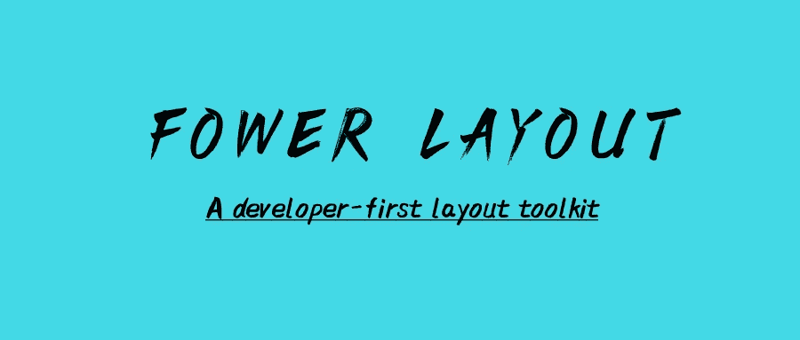
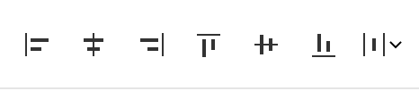
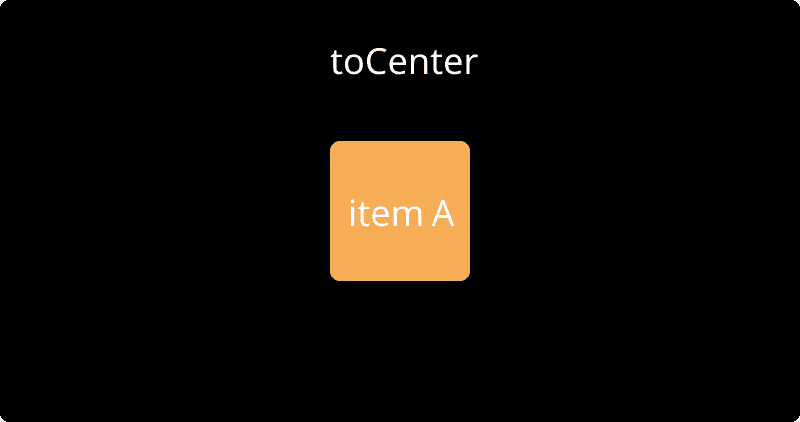
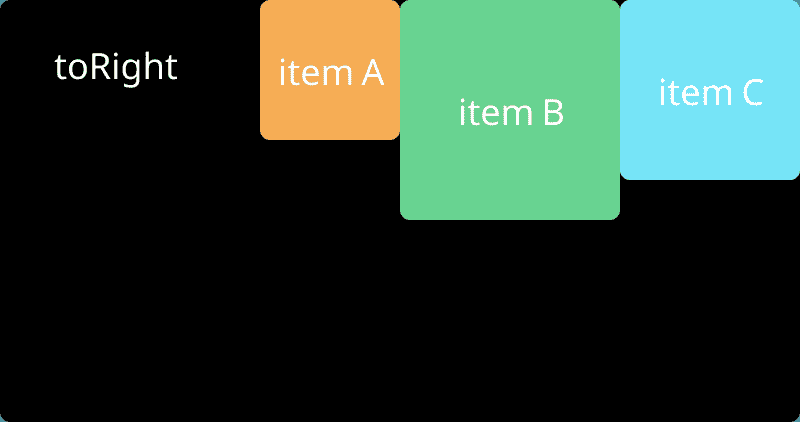
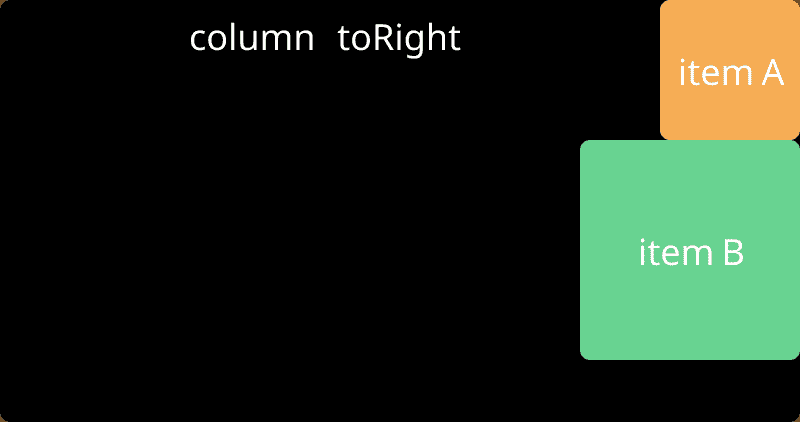
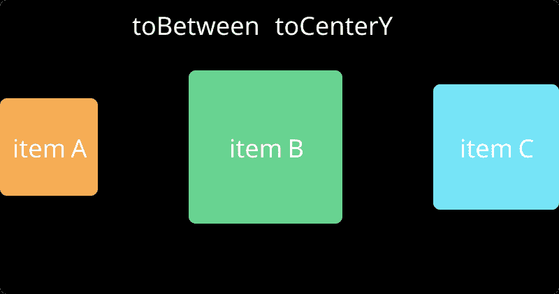
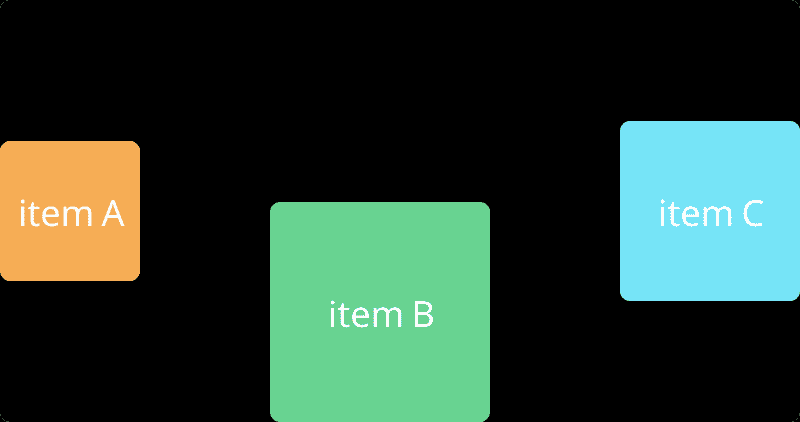

# 一个开发者优先的 web 布局引擎

> 原文：<https://itnext.io/first-of-all-this-article-has-a-bit-of-a-headline-and-i-apologize-to-the-readers-c7f6e66952af?source=collection_archive---------5----------------------->



首先，这篇文章有点标题，我向读者道歉。这篇文章的标题是布局引擎。但我建议你一定要看这篇标题党文章，看完一定会有所收获。

# 为什么要写这篇文章？

前几天，我发布了我的一个前端开源项目，名为: [Fower](https://github.com/forsigner/fower) 。很多用户问我 Fower 和 Tailwindcss 有什么区别？我的回答是，福勒也有同样的哲学——功利第一。其实效用至上理念的 CSS 框架早就有了，比如: [ACSS](https://acss.io/) 、 [Tachyons](https://tachyons.io/) 。

Fower 和 Tailwindcss 最大的区别之一就是 Fower 提供了一个非常好用的布局工具:Fower Layout toolkit，这也是我写这篇文章的原因。下面我将详细分享开发 Fower 布局的初衷及其设计思路。

# Web 布局历史记录

让我们简单回顾一下网页布局的历史。在 Web 布局的整个演变过程中，我们经历了无布局、表格布局、定位布局、浮动布局、Flexbox 布局、网格布局。
这里就不细说各种布局的特点和优缺点了。我只说一下我个人的观点和结论:现阶段考虑功能性、易用性、浏览器兼容性等。，使用 Flexbox 布局是最好的选择。有兴趣了解更多的人可以看看下面这篇文章。

*   [网页布局历史](http://grid-layout.com/history.html)
*   [柔性盒](https://developer.mozilla.org/en-US/docs/Learn/CSS/CSS_layout/Flexbox)
*   [CSS 网格布局](https://developer.mozilla.org/en-US/docs/Web/CSS/CSS_Grid_Layout)

# 布局的核心

在我看来，布局的核心是处理容器和物品在某个方向(x，y)上的空间关系。这里有四个基本要素:容器、元素、方向和空间关系。其实这也是 flexbox 布局的核心。几乎所有 flexbox 布局的概念和用法都是围绕这四个元素开发的。当我们得到一个设计草图时，如果我们能快速识别出其中的容器和元素，并明确它们的空间关系，我们就能快速构建界面。

# 草图和图中的布局



Figma 和 Sketch 是两个非常知名的设计软件。我们可以看到，他们在处理元素空间关系时一贯使用非常生动的指令:上对齐、右对齐、下对齐、左对齐、基于空间对齐。这也是最直观的方式。

# Swift UI 和 Flutter 中的布局

现在我们来看两个现代 UI 解决方案:Swift UI 和 Flutter，它们是如何处理 UI 布局的。

在 Swift UI 中，我们可以看到 HStack、VStack、aligment、space 等关键词。我们发现 Swift UI 也是围绕四个元素开发的:容器、元素、方向和空间关系:

```
struct ContentView: View {
    var body: some View {
        HStack(alignment: .top) {
            VStack {
                CalendarView()
                Spacer()
            }
            VStack(alignment: .leading) {
                Text("Event title").font(.title)
                Text("Location")
            }
            Spacer()
        }.padding()
    }
}
```

在 Flutter 中，我们可以看到行、列、对齐和空间等关键字。我们发现颤振也是围绕容器、元素、方向和空间关系这四个要素展开的:

```
Row(
  mainAxisAlignment: MainAxisAlignment.spaceEvenly,
  children: [
    Image.asset('images/pic1.jpg'),
    Image.asset('images/pic2.jpg'),
    Image.asset('images/pic3.jpg'),
  ],
);Column(
  mainAxisAlignment: MainAxisAlignment.spaceEvenly,
  children: [
    Image.asset('images/pic1.jpg'),
    Image.asset('images/pic2.jpg'),
    Image.asset('images/pic3.jpg'),
  ],
);
```

我们发现 Swift UI 和 Flutter 的布局理念与 Flexbox 布局非常相似。此外，我们发现他们的布局代码直接附加在容器和元素上，不像传统的 Web，样式代码需要分离到单个 CSS 文件中。Fower 和 Swift UI 和 Fluter 使用相似的概念，风格是容器和元素的一部分，这也是现代 UI 开发的选择

一些参考资料:

*   [https://www . swiftbysundell . com/articles/swift ui-layout-system-guide-part-1/](https://www.swiftbysundell.com/articles/swiftui-layout-system-guide-part-1/)
*   [https://flutter.dev/docs/development/ui/layout](https://flutter.dev/docs/development/ui/layout)

# Flexbox 布局的缺点

上面提到了设计软件和现代 UI 框架的布局方法。它们与 Flexbox 布局概念非常相似。Flexbox 布局的缺点是什么？

虽然 Flexbox 很优秀，但对我来说，它有一个最大的缺点，那就是它不是开发者优先的。Flexbox 布局不够好用，开发者体验不够好。

Flexbox 有许多概念:主轴、横轴、方向、对齐项目、对齐内容、伸缩开始、伸缩结束、伸缩中心等。最大的问题是当主轴方向发生变化时，`align-items`、`justify-content`等属性使得 UI 的呈现非常不符合人的直觉。尤其是对于不经常写 UI 的我(经常需要写后端，做杂等。)，每隔一段时间，我可能会忘记`align-items`、`justify-content`的用法。

# 我的理想布局(设计方案)

上面我们讲了 Flexbox 布局的缺点:不是开发者优先。

我理想中的布局方式应该和现代设计软件一样好用。我们只需要关注布局的四个要素:容器、元素、方向、空间关系。用法是找到容器和元素，设置元素在容器中的方向，然后设置空间关系。

这里的核心是如何表达空间关系。我觉得最直观的表达方式就是设计软件。我把这种表达方式抽象为:toCenter，to centex，toCenterY，toTop，toRight，toBottom，toLeft，toBetween，toAround，toEvenly。

*   要居中，使子元素居中对齐，请参见[在线演示](https://fower.vercel.app/docs/to-center)
*   使子元素水平居中对齐，参见[在线演示](https://fower.vercel.app/docs/to-center-x)
*   要使子元素垂直居中对齐，请参见[在线演示](https://fower.vercel.app/docs/to-center-y)
*   顶部，使子元素向左对齐，参见[在线演示](https://fower.vercel.app/docs/to-left)
*   向右，使子元素向右对齐，参见[在线演示](https://fower.vercel.app/docs/to-right)
*   底部，使子元素与底部对齐，参见[在线演示](https://fower.vercel.app/docs/to-bottom)
*   向左，使子元素向左对齐，参见[在线演示](https://fower.vercel.app/docs/to-left)
*   要使子元素之间有间隔，请参见[在线演示](https://fower.vercel.app/docs/to-between)
*   甚至，使子元素空间均匀，参见[在线演示](https://fower.vercel.app/docs/to-evenly)
*   为圆，使儿童元素周围的空间，见[在线演示](https://fower.vercel.app/docs/to-around)

不管你的容器是水平的(行)还是垂直的(列)，这些指令的表达式比如 toRight 和 toBottom 都会符合你的视觉习惯。

为什么这种抽象的表达方式更好？我认为有几个优点:

*   更符合人的直觉。你只需要记得按照方向来处理空间关系就可以了，比如:toRight，toBotom 等。没有比这更符合人类直觉的了。另一个好处是，你的记忆负担会变得很小。
*   更少的代码，更好的可维护性，更高的开发效率

我理想的写代码方式(伪代码):

1.下面的代码会自动将容器中的元素水平和垂直居中，容器方向默认为 row，所以可以省略:

```
<Container toCenter>
  <ItemA />
</Container>
```

效果如下:



2.下面的代码将把三个元素 A、B、C 在容器中右对齐。容器默认为 row，因此可以省略:

```
<Container toRight>
  <ItemA />
  <ItemB />
  <ItemC />
</Container>
```

效果如下:



3.下面的代码将使两个元素 A 和 B 在容器中向右对齐。这次我们声明 column，所以元素是垂直排列的:

```
<Container column toRight>
  <ItemA />
  <ItemB />
</Container>
```

效果如下:



4.使用成分:

```
<Container toBetween toCenterY>
  <ItemA />
  <ItemB />
  <ItemC />
</Container>
```

效果如下:



这里只是四个伪代码的例子。事实上，您可以使用“toLeft”、“toRight”和其他指令来实现大多数 UI 布局。

上面，我们抽象了空间关系的表达式，并将指令应用于容器。让我们来看看一个布局效果，你会如何用代码来构建它？



我来说说我的理想方案，伪代码如下:

```
<Container toBetween toCenterY>
  <ItemA />
  <ItemB selfBottom />
  <ItemC />
</Container>
```

这里我们抽象出另一种类型的指令:selfTop，selfRight，selfBottom，selfLeft，selfStretch。这些指令可以作用于元素，单独控制元素的对齐。

所以我们有一些作用于元素的指令:

*   selfTop，使元素靠上对齐
*   selfRight，使元素靠右对齐
*   selfBottom，使元素靠下对齐
*   selfLeft，使元素左对齐
*   自拉伸，使元素自动拉伸

最后，总结我们的布局工具设计计划:

*   容器方向控制指令，使用 row，column，如果没有声明，默认为 row
*   内部元素的容器对齐指令:toCenter、to centex、toCenterY、toTop、toRight、toBottom、toLeft、toBetween、toAround、toEvenly，这些指令可用于控制子元素的对齐，与行和列方向无关
*   元素自对齐指令:selfTop、selfRight、selfBottom、selfLeft、selfStretch。这些指令分别控制元素本身的对齐方式
*   当使用任何容器指令时，flexbox 布局将自动触发，无需手动设置`display: flex;`

以上 4 个设计理念是我个人的理想布局。

# 前布局

回到我们的标题:开发者第一的网页布局引擎。其实 flex layout 不能称之为布局引擎，那么它是什么呢？也许我们称之为布局工具包会更恰当。

这里的布局引擎指的是: [Fower layout toolkit](https://fower.vercel.app/docs/fower-layout-introduction) ，一个基于 flexbox 的布局工具。

Fower layout 最大的特点就是开发者至上，使用起来非常简单，符合人的直觉。

关于更详细的 Fower 布局信息，可以看看官方文档的介绍: [Fower 布局介绍](https://fower.vercel.app/docs/fower-layout-introduction)