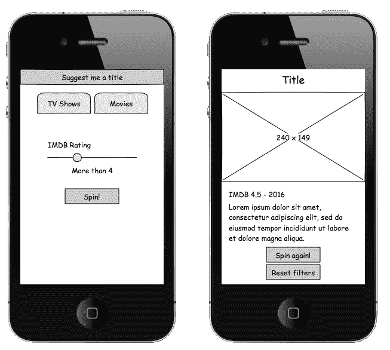
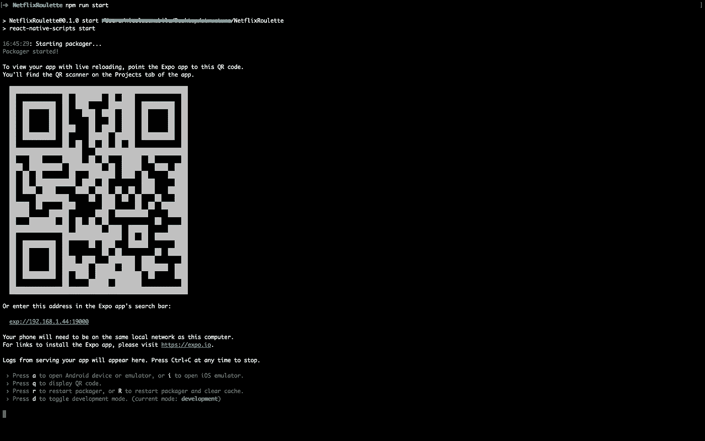
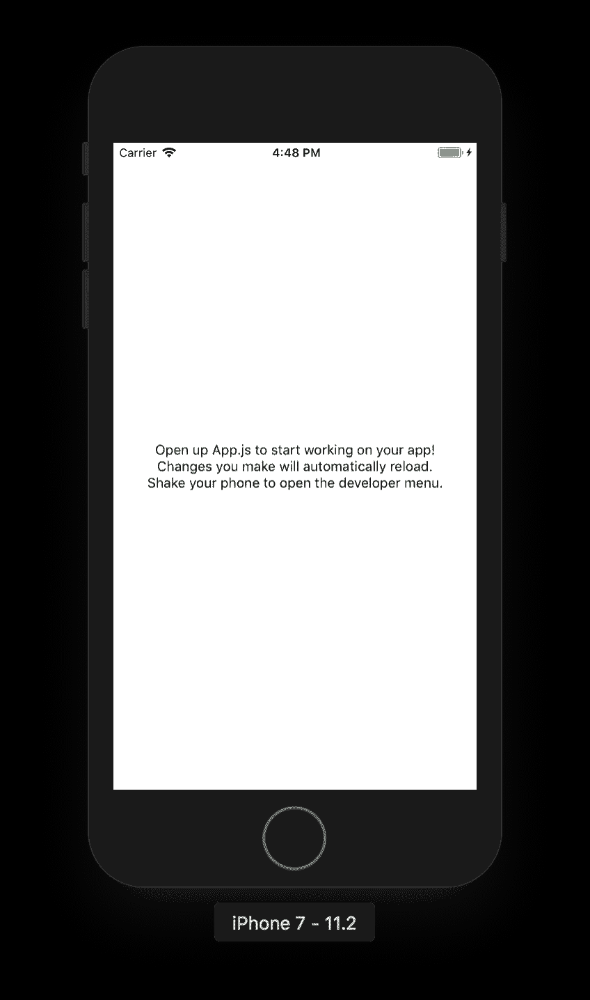
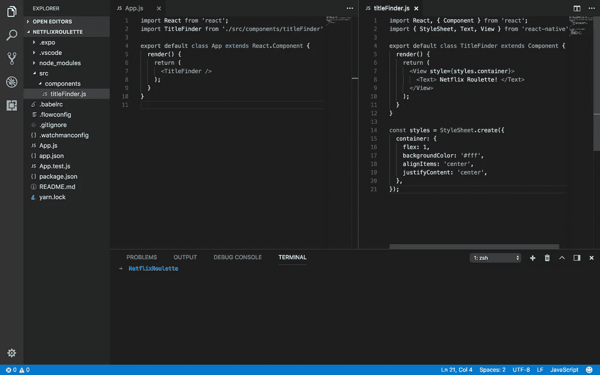
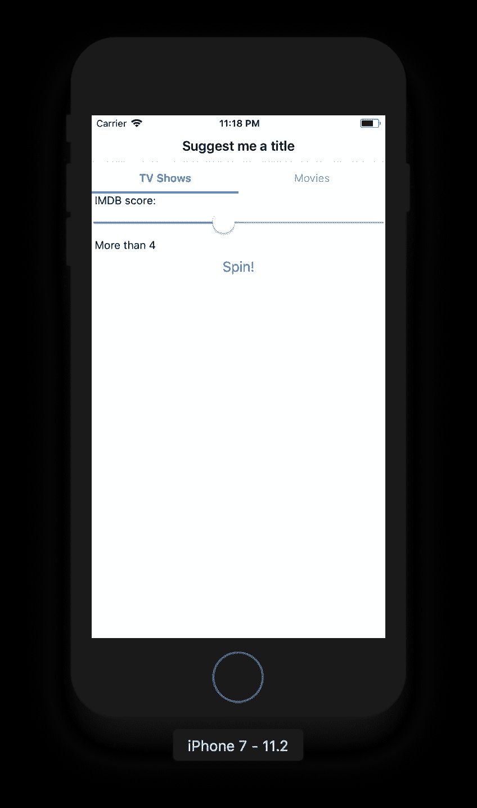
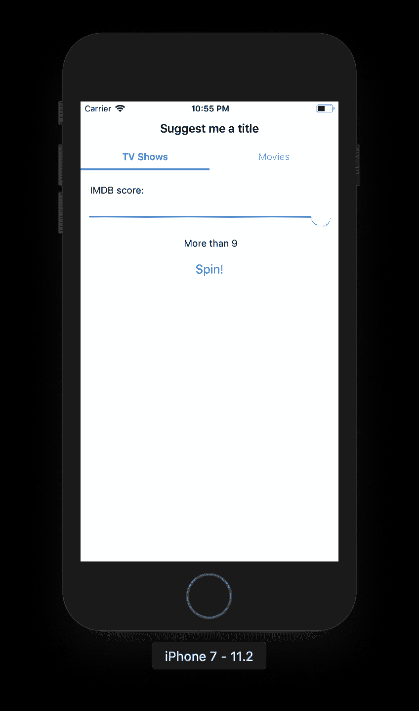

# 使用 React Native 的第一步

> 原文：<https://itnext.io/first-steps-with-react-native-85d6b4581a00?source=collection_archive---------4----------------------->


目标受众:任何稍有 Javascript 经验的人。

那么，我们在这里做什么？

在这篇文章中，我将带领你创建一个简单的应用程序，同时解释这一令人敬畏的技术的一些核心概念。

[*点击这里在 LinkedIn* 上分享这篇文章](https://www.linkedin.com/cws/share?url=https%3A%2F%2Fitnext.io%2Ffirst-steps-with-react-native-85d6b4581a00)

## 我们开始吧！

当你舒服地坐在电视机前，意识到你已经看完了你最喜欢的电视节目，却不知道接下来该看什么时，没有什么比这种空虚感更糟糕的了，所以，让我们来做一个网飞轮盘赌吧！



TL；DR 这里是回购的链接

[](https://github.com/nicolas-amabile/NetflixRoulette) [## 尼古拉-阿马比尔/网飞轮盘赌

### 在 GitHub 上创建一个帐户，为 NetflixRoulette 的发展做出贡献。

github.com](https://github.com/nicolas-amabile/NetflixRoulette) 

有几种方法可以生成 React 原生项目。今天我们将使用 create-react-native-app(将在以后的帖子中讨论利弊)。

在终端上键入以下命令:

```
npm install -g create-react-native-app
create-react-native-app NetflixRoulette
cd NetflixRoulette
npm start
```


如果一切顺利，您应该会在终端上看到如下内容:



如果你想在你的真实设备上运行你的应用程序，下载 expo 客户端( [Android](https://play.google.com/store/apps/details?id=host.exp.exponent&hl=en) 或 [iOS](https://itunes.apple.com/us/app/expo-client/id982107779?mt=8) )并扫描二维码，就这么简单。

您也可以使用模拟器，键入“a”用于 android(这可能需要一些额外的配置)，或者键入“I”用于 iOS(如果您在 mac 上并且安装了 XCode，那么一切都准备好了)。

无论您选择哪个选项，我们的应用程序现在看起来都像这样:



入口点是 App.js 文件。如果您打开它，您将看到生成上面屏幕的代码。包含一些文本的简单视图组件。

在根级别开始编写我们的组件没有多大意义，所以让我们在项目中添加一些结构。

让我们创建一个' *src* '文件夹，其中包含一个' *components* '文件夹。

在 components 文件夹中创建一个 titleFinder.js 文件，并添加以下代码:

```
import React, { Component } from 'react'import { StyleSheet, Text, View } from 'react-native'export default class TitleFinder extends Component { render() { return ( <View style={styles.container}> <Text> Netflix Roulette! </Text> </View> ) }}const styles = StyleSheet.create({ container: { flex: 1, backgroundColor: '#fff', alignItems: 'center', justifyContent: 'center', },})
```

然后将 App.js 上的代码替换为以下内容:

```
import React from 'react'import TitleFinder from './src/components/titleFinder'export default class App extends React.Component { render() { return ( <TitleFinder /> ) }}
```

现在入口点将创建我们的第一个组件 TitleFinder 的一个实例，

## 什么是组件？

你在屏幕上看到的任何东西都是某种组件。这是一个返回一些 JSX 来渲染的函数。

## JSWhat？JSX

JSX 是一个用于编写组件的 Javascript 扩展。与 HTML 语义相同。在这种情况下，我们不会使用 HTML 组件(div、p、h1 等)，但我们将使用现成的 react 本地组件，最终将创建本地组件。

## 巴比伦式的城市

JSX →普通 Javascript

Babel 是一个 JavaScript transpiler，它将 JSX 转换成普通的旧版本 ES5 JavaScript，可以在任何浏览器上运行(甚至是旧版本)。



## 状态

一个组件的变量，如果值发生变化，它将触发重新呈现，因此更新后的值会立即显示在用户界面上。

与常规变量的区别在于，不能直接设置值，需要使用一个名为 setState 的函数。

## 无状态与有状态组件

不是在所有的场景中，我们都需要创建我们所谓的有状态组件(具有内部状态的组件)。在某些情况下，我们只想以特定的方式呈现一些信息，但是组件内部没有任何东西可以改变这些值。最好的工具是无状态组件。更多的 lightway 组件只是在屏幕上呈现信息。

让我们看一些例子:

正如我们在草图中看到的，第一个屏幕将包含以下元素:

*   带有文本“给我一个标题建议”的标题
*   两个标签，一个用于电视节目，另一个用于电影
*   用于选择最小 IMDB 额定值的滑块
*   旋转规则带的按钮

## 页眉

就像 TitleFinder 一样，让我们创建另一个名为 Header 的组件。

同样，在 *src/components* 文件夹中，用以下代码创建一个名为 *header.js* 的文件:

```
import React from ‘react’
import { View, Text, Platform, StyleSheet } from ‘react-native’const Header = ({ title }) => (
 <View style={styles.container}>
    <Text style={styles.title}>{title}</Text>
 </View>
)const styles = StyleSheet.create({
 container: {
    height: Platform.OS === ‘ios’ ? 60 : 80,
    width: ‘100%’,
    borderBottomWidth: 1,
    borderBottomColor: ‘#dadadc’,
    justifyContent: ‘flex-end’,
    alignItems: Platform.OS === ‘ios’ ? ‘center’ : ‘flex-start’,
    backgroundColor: Platform.OS === ‘ios’ ? ‘#f8f8f8’ : ‘#3f51b5’
 },
 title: {
    fontFamily: Platform.OS === ‘ios’ ? “System” : “Roboto”,
    color: Platform.OS === ‘ios’ ? “#000” : “#fff”,
    fontSize: 17,
    fontWeight: ‘bold’,
    paddingBottom: Platform.OS === ‘ios’ ? 10 : 17,
    paddingLeft: Platform.OS === ‘ios’ ? 0 : 25
 }
})export default Header
```

请注意，在这种情况下，Header 不是一个类，也不是从 React.Component 继承的。相反，我们将创建一个接收一些参数并返回一些 JSX 的函数。

以防您不熟悉 ES6:

({ title })和(props)完全一样，通过做 props.title. Object 析构[这里](https://developer.mozilla.org/en-US/docs/Web/JavaScript/Reference/Operators/Destructuring_assignment)来访问标题。

## 制表符

*src/components/tab.js*

```
import React from 'react'
import { TouchableOpacity, Text, StyleSheet } from 'react-native'const Tab = ({ name, isActive, onPress }) => (
  <TouchableOpacity
    style={isActive ? [styles.container, styles.active] : styles.container}
    onPress={() => onPress(name)}>

    <Text style={isActive ? [styles.text, styles.textActive] : styles.text}>
      {name}
    </Text></TouchableOpacity>
)const styles = StyleSheet.create({
  container: {
    flex: 1,
    justifyContent: 'center',
    alignItems: 'center',
    height: 40
  },
  active: {
    borderBottomWidth: 3,
    borderBottomColor: '#0479fb'
  },
  text: {
    color: '#9d9d9d'
  },
  textActive: {
    color: '#0479fb',
    fontWeight: 'bold',
    paddingTop: 3
  }
})export default Tab
```

因为我们将有这个组件的多个实例，我们需要一种方法让用户知道哪个是活动的，这就是为什么我们发送一个名为 *isActive* 的标志。这样我们就可以决定需要使用哪种风格。

稍后我们将返回到按下时的*，但是现在假设它只是一个从外部发送的函数(在其他地方实现的),并且将在有人触摸标签时被触发。*

## 滑块

在这种情况下，我们不会创建一个组件，我们只是将这些代码作为 TitleFinder 组件的渲染功能的一部分。

与其直接这么做，不如让我们编写一个函数，确切地返回这段代码:

```
renderScorePicker () { const scoreToDisplay = this.state.minimumScore === 0 ? 'Any' : `More than ${this.state.minimumScore}` return ( <React.Fragment> <Text
            key='scoreLabel'
            style={styles.scoreLabel}>
            IMDB score:
         </Text> <Slider key='scorePicker' step={1} minimumValue={0} maximumValue={9} onValueChange={(newValue) => this.setState({minimumScore: newValue})} value={this.state.minimumScore} style={styles.scoreSlider} /> <Text
            key='scoreValue'
            style={styles.scoreValue}>
            {scoreToDisplay}
         </Text> </React.Fragment> )}
```

以之前的 React 版本(<16), we were forced to return exactly one component, so in this case (Text, Slider and another Text) we would have needed something to wrap all the content, a <view>为例。现在，使用 React 16 可以返回元素数组或使用 React。片段不会向组件树添加任何额外的节点。这样，它更平坦，性能更好。</view>

还记得我们将*状态*定义为当值改变时在 UI 上自动更新的变量吗？它是这样工作的:

将值映射到状态:

```
value={this.state.minimumScore}
```

在 *onChange* 上，我们需要调用 *setState* 来更新新值:

```
onValueChange={(newValue) => {
   this.setState({minimumScore: newValue})
}}
```

这样，当输入(本例中为滑块)发生变化时，就会执行 *onValueChange* 函数，并用新值更新本地状态。由于每次抛出 *setState* 函数更新一个变量，渲染将再次运行，值将在 UI 上更新。

## 纽扣

TitleFinder 组件中的一个函数 button 也是如此。

```
renderSpinButton () {
   const buttonText = this.state.data ? 'Spin again!' : 'Spin!'
   return (
      <View style={styles.buttonContainer}> <Button onPress={this.fetchData.bind(this)} title={buttonText} /> </View> )
}
```

那是什么？

```
onPress={this.fetchData.bind(this)}
```

*fetchData* 将是一个函数，它将调用端点并检索数据。但是为什么我们需要做*。绑定*的东西？如果你不这样做，你将不能在函数实现(在这个例子中是 fetchData)中访问*这个*(作为 TitleFinder)。在这种情况下*这个*将是按钮本身。通过使用*。bind* 我们定义了函数执行的上下文。当我们一会儿讨论实现时，这将更有意义。

如果我们已经有一些数据要显示，文本将会改变，但是等等，我没有解释本地状态，是吗？

## 把所有的放在一起

跟我说一会儿，我一会儿再解释。让我们在 *src* 文件夹中创建一个名为 *constants.js* 的文件，并将该内容粘贴到其中:

```
export const BASE_RECOMMENDATION_URL = 'https://api.reelgood.com/v1/roulette/netflix?'export const BASE_IMAGE_URL = 'https://img.reelgood.com/content/show'export const IMAGE_POSTFIX = 'poster-780.jpg'export const BASE_OPTIONS = { nocache: true, kind: 0, minimumScore: 0, sources: [ 'amazon_prime', 'fx_tveverywhere', 'hbo', 'netflix', 'showtime', 'starz' ], free: true}export const MAX_SCORE = 9export const TV_SHOWS = 'TV Shows'export const MOVIES = 'Movies'
```

我们稍后会用到它们。

让我们编写 TitleFinder 构造函数方法:

但是首先导入我们刚刚创建的常量:

```
import * as Constants from ‘../constants’constructor(props) {
    super(props)
    this.state = {
      loading: false,
      error: null,
      data: null,
      minimumScore: 0,
      activeTab: Constants.TV_SHOWS
    }
}
```

只有在构造函数上我们才直接给状态赋值。我们称之为初始状态。

*   *加载*:我们将使用它来显示一个微调器，同时获取数据。
*   *错误*:有些事情可能会出错，我们需要知道它并做出相应的反应。
*   *数据*:我们会得到一个推荐，并且会存储在这里。
*   *minumumScore* 和 *activeTab* 是我们在用户更改值时需要跟踪的输入。

**关于状态的重要说明**

```
this.setState({someValue: 'new value'})
console.log(this.state.someValue)
```

猜猜控制台上打印的是什么

世事难料。*设置状态*函数是异步的。这意味着在下一行中，你不能确定值是否已经被更新。这就是为什么我们需要使用回调。 *setState* 的第二个参数是一个回调函数，将在值最终更新后执行。

```
this.setState({someValue: 'new value'}, () => { console.log(this.state.someValue) // 'new value' 
})
```

我们还没有包括选项卡。让我们构建一个小组件来处理这两个选项卡:

```
const TypeSelector = ({activeTab, onTabPress}) => {
  return (
    <View style={{ flexDirection: 'row' }}>
      <Tab 
        name={Constants.TV_SHOWS} 
        isActive={activeTab === Constants.TV_SHOWS}
        onPress={onTabPress}
      />
      <Tab 
        name={Constants.MOVIES} 
        isActive={activeTab === Constants.MOVIES}
        onPress={onTabPress}
      />
    </View>
  )
}
```

在 TitleFinder 组件上编写这两个函数:

```
renderType () {
  return (
    <TypeSelector
      activeTab={this.state.activeTab}
      onTabPress={this.onTabPress} />
  )
}

onTabPress = tab => {
  this.setState({ activeTab: tab })
}
```

请注意，我们没有使用。*为*按下*这次绑定*。只是为了向你展示另一种编写函数的方法。胖箭头语法(= >)保留了上下文，所以在这个函数中， *this* 表示 TitleFinder，而不是 TypeSelector 组件(触发动作的那个)。

最后是渲染函数:

```
render() { return ( <View style={styles.container}> <Header title='Suggest me a title' /> {this.renderType()} {this.renderScorePicker()} {this.renderSpinButton()} </View> )}
```

在我们查看模拟器/设备之前，还有两件事:

*   移除容器的样式(我们稍后会处理)
*   为 *fetchData* 创建一个占位符函数:

```
fetchData () { console.log('Fetch data called') }
```

如果一切顺利，您将会看到这样的内容:



如果您选择电视节目或电影，当值改变时，选项卡组件和滑块都会更新。

让我们首先用下面的代码在 *src* 文件夹中创建一个名为 *utils.js* 的文件:

```
import * as Constants from './constants'export function getImageURL (id) {
  return `${Constants.BASE_IMAGE_URL}/${id}/${Constants.IMAGE_POSTFIX}`
}export function getRecommendationUrl ({activeTab, minimumScore}) {
  let params = ''
  let modifieldFilter = Object.assign({}, Constants.BASE_OPTIONS)
  modifieldFilter.kind = activeTab === Constants.TV_SHOWS ? 1 : 2
  modifieldFilter.minimumScore = minimumScoreconst keys = Object.keys(modifieldFilter)
  keys.forEach((key, index) => {
    params += `${key}=${modifieldFilter[key]}`
    if (index < keys.length - 1) {
      params += '&'
    }
  })
  return Constants.BASE_RECOMMENDATION_URL + params
}
```

并在 TitleFinder 组件上导入*getrecommendedationurl*，以便 fetchData 函数可以使用它:

```
import { getRecommendationUrl } from '../utils'
```

下面是 *fetchData* 的真实实现:

```
fetchData () {
    const { activeTab, minimumScore } = this.state
    const url = getRecommendationUrl({activeTab, minimumScore})
    this.setState({
      loading: true,
      data: null,
      error: false
    }, () => {
      fetch(url)
      .then((recommendationResponse) => recommendationResponse.json())
      .then((recommendationJSON) => {
        this.setState({
          data: recommendationJSON,
          error: false,
          loading: false
        })     
      })
      .catch((error) => {
        this.setState({
          loading: false,
          error: true,
          data: null
        })
      })
    })
  }
```

*按下微调按钮时，将执行 fetchData* ,并将执行以下操作:

*   为推荐类型(电视节目或电影)和本地州的最低 IMDB 分数选择选定的值。
*   调用 util 函数用这些参数创建 url
*   更新本地状态，以便没有错误、没有数据并指示正在加载。
*   执行 fetch，当它返回时，设置数据，或者如果有错误，在本地状态上设置错误标志。

好了，现在我们有了我们需要的数据！去看网飞吧！

开玩笑的。让我们构建显示这些数据的组件。

但是首先让我们再添加一个资源:当 api 上没有时的默认图像。

在 src 的同一层，创建一个名为 images 的文件夹，在里面放置任何你想要的名字为*defaultImage.png*的图像

现在在 *src/components* 中创建一个名为 *recommendation.js* 的组件

```
import React, { Component } from 'react'import { ImageBackground, Text, StyleSheet, ActivityIndicator } from 'react-native'import { getImageURL } from '../utils'import defaultImage from '../../images/defaultImage.png'class Recommendation extends Component { constructor (props) { super(props) this.state = { errorOnImageLoad: false, loading: false } } renderImage = () => { if (this.props.has_poster) { const uri = getImageURL(this.props.id) const { errorOnImageLoad, loading } = this.state let source if (errorOnImageLoad) { source = defaultImage } else { source = { uri } }
         return ( <View style={styles.container}>
               <View style={styles.indicatorContainer}>
                  <ActivityIndicator
                     size='small'
                     animating={this.state.loading} />
               </View>
               <Image
                  onLoadStart={() => {
                     this.setState({loading: true})
                  }}
                  onLoadEnd={() => {
                     this.setState({loading: false})
                  }}
                  onError={() => {
                     this.setState({errorOnImageLoad: true})
                  }}
                 source={source}
                 style={styles.image}
                 resizeMode='contain'/>
            </View> ) } } render () { const {id, has_poster, title, imdb_rating, released_on, overview} = this.props return ( <React.Fragment> <Text
               key='title'
               style={styles.title}>
               {title}
            </Text> {this.renderImage()} <Text
               key='info'
               style={[styles.info, styles.text]}>{`IMDB: ${imdb_rating} - ${new Date(released_on).getFullYear()}`} </Text> <Text
               key='overview'
               style={[styles.overview, styles.text]}> {overview} </Text> </React.Fragment> ) }}const styles = StyleSheet.create({ title: { marginTop: 40, marginBottom: 20, textAlign: 'center', fontSize: 17, fontWeight: 'bold' }, info: { fontWeight: 'bold', marginHorizontal: 15, marginVertical: 15 }, text: { marginHorizontal: 15, marginVertical: 5 }, overview: { marginBottom: 5, fontWeight: '100' }, container: { flex: 1, height: 400, position: 'relative', justifyContent: 'center', alignItems: 'center' }, image: { flex: 1, width: '100%' }, indicatorContainer: { position:'absolute' }})export default Recommendation
```

现在让我们给 TitleFinder 渲染函数添加一些逻辑:

*   将当前渲染实现移动到一个名为 *renderForm 的函数中。*
*   创建一个名为 *renderRecommendation* 的函数
*   向呈现添加一些逻辑，以便根据状态显示正确的组件。
*   还添加了一个呈现重置按钮的函数， *renderResetButton* 加上一个*重置*函数，该函数将清除本地状态*上的数据和标志。*
*   别忘了导入推荐组件！

```
import Recommendation from '../components/recommendation'renderForm () {  
    return (
      <View style={styles.container}>
        <Header title='Suggest me a title' />
        {this.renderType()}
        {this.renderScorePicker()}
        {this.renderSpinButton()}
      </View>
    )
  }renderRecommendation (recommendation) {
    const { id } = recommendation
    return (
      <ScrollView style={styles.recommendationContainer}>
        <Recommendation {...recommendation} />
        {this.renderSpinButton()}
        {this.renderResetButton()}
      </ScrollView>
    )
}

renderResetButton () {
   return (
      <View style={styles.buttonContainer}> <Button onPress={this.reset.bind(this)} title='Reset filters!' /> </View> )
}reset () {
   this.setState({
      loading: false,
      error: false,
      data: null,
      minimumScore: 0,
      activeTab: Constants.TV_SHOWS
   })
}render() {
    const { loading, data, error, activeTab } = this.state
    let content
    if (data) {
      return this.renderRecommendation(data)
    } else if (loading) {
      content = <ActivityIndicator size='large'/>
    } else if (error) {
      content = <Text> Ops! </Text>
    } else {
      content = this.renderForm()
    }

    return (
      <View style={loading ? styles.loaderContainer : styles.container}>
        {content}
      </View>
    )
  }
```

这种风格还有一个细节💅

```
const styles = StyleSheet.create({
  scoreLabel: {
    paddingTop: 20,
    paddingLeft: 10
  },
  scoreValue: {
    textAlign: 'center',
    marginBottom: 10
  },
  scoreSlider: {
    margin: 10
  },
  loaderContainer: {
    flex: 1,
    flexDirection: 'column',
    justifyContent: 'center',
    alignItems: 'center'
  },
  recommendationContainer: {
    marginBottom: 10
  }, buttonContainer: { paddingHorizontal: 20, paddingVertical: 8 }})
```

我们结束了🎉



# 下一步做什么？

以下是继续这一旅程的有用资源列表:

*   [官方文档](https://facebook.github.io/react-native/docs/getting-started.html):熟悉 API 和开箱即用组件。
*   [react flux](https://www.reactiflux.com/)社区，加入他们对[的不和谐](https://discordapp.com/invite/0ZcbPKXt5bZiQhB5)！如果您刚刚开始，您可能会感到有点不知所措，特别是因为有大量讨论同时发生，但绝对值得，react 和 react-native 核心团队就在那里。了解最新信息的最佳地点。
*   [React digest](https://reactdigest.net/) ，每周一封邮件，5 个链接。
*   [ReactJS 简讯](http://reactjsnewsletter.com/)

## 未来文章:

*   React Native，幕后是怎么回事？
*   CRNA vs react-native init，应该用什么？
*   React Native 上的导航，呃

我希望这篇文章对你有用

感谢阅读！快乐编码🤘😎