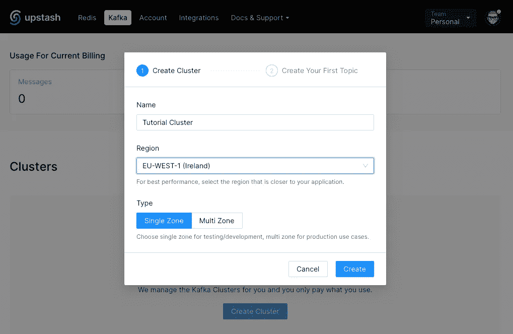
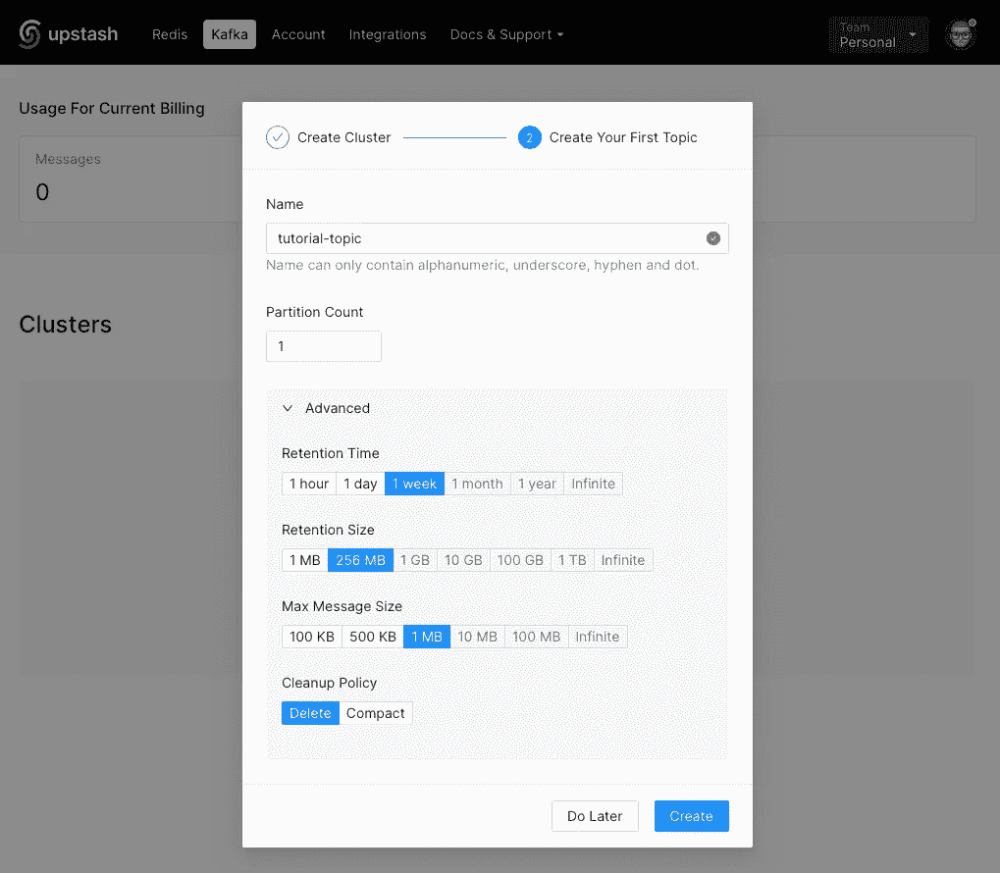
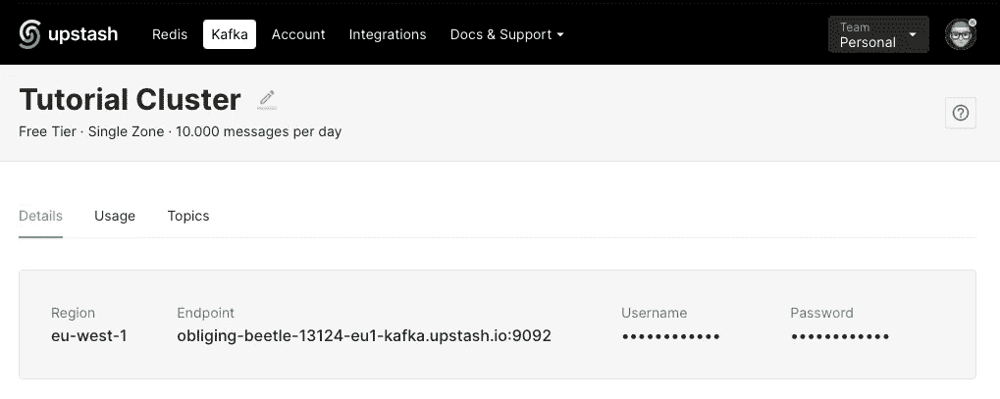
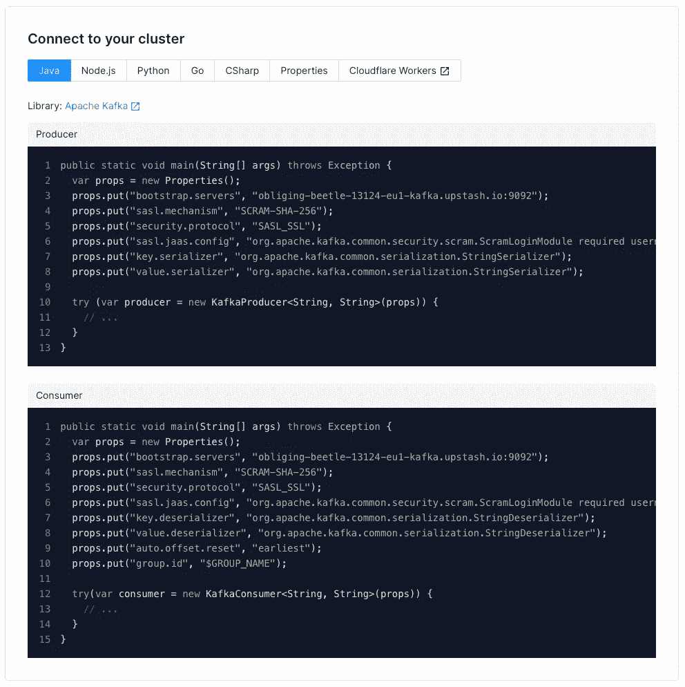
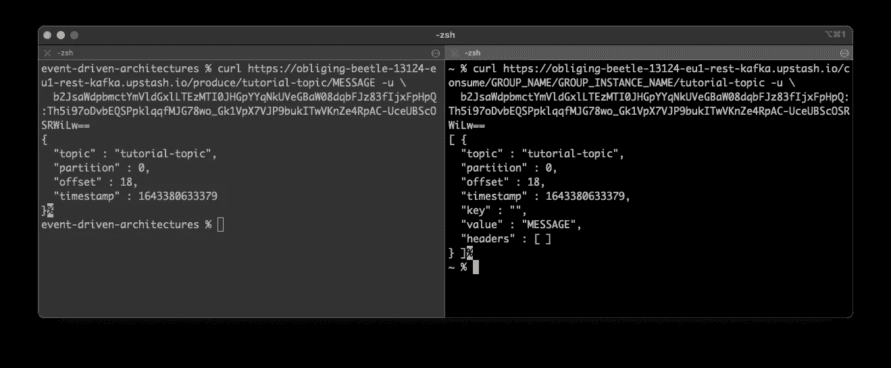

# 卡夫卡的第一步

> 原文：<https://itnext.io/first-steps-with-upstash-for-kafka-6d4d023da590?source=collection_archive---------3----------------------->

## 探索真正的无服务器事件基础设施

伯纳德·赫曼特在 [Unsplash](https://unsplash.com?utm_source=medium&utm_medium=referral) 上的照片

不可否认，新的苹果 M1 macbook 棒极了。我不认为自己是粉丝，但这些机器太棒了。让我重复一遍:太棒了。这些处理器在许多方面都非常出色。

当然，“但是”来了。并非一切都处于我可以从英特尔无缝转移到 ARM 的状态。

作为一个 Docker 的重度用户，我不得不吸取教训，现在需要考虑在我的本地 Docker 实例上运行 Kafka。

用手臂支撑在宇宙中搜索卡夫卡 Docker 图像让我两手空空。

嗯，只要看看 Github 上的那些问题，你就明白我在说什么了。

*   [ARM64 支持吗？](https://github.com/confluentinc/common-docker/issues/117#issuecomment-948226917)
*   [Bitnami 容器映像支持 ARM64 架构](https://github.com/bitnami/charts/issues/7305#issue-978245415)

也许在这篇文章发表的时候会有支持。无论如何，我现在已经停止寻找。如果有更新，请在评论中告诉我。高度赞赏！

是时候寻找其他解决方案了。

我从未真正尝试过基于云的 Kafka 解决方案，总是使用本地或内部解决方案，这与我正在处理的项目的性质有关。只是有几次我进入了“真正的”云。

我不喜欢大多数云提供商，因为我必须预先购买一定的配额。然后，当这个项目完成时，所有辛苦赚来的钱就放在那里，过一段时间就会被遗忘。

嗯，我的解决方案是[抢在](https://upstash.com/?utm_source=tobias1)前面。

## 使用 Upstash 的三个原因

我需要一个按需付费的解决方案，而不必摆弄硬件、虚拟机或 docker 容器之类的东西。

第二，不用的时候不应该花什么钱。是的，它应该能够将其缩放到 0，0 表示根本不需要支付任何费用。

第三，在不引起太多流量的情况下尝试一段时间不应该花费任何东西。非常适合任何兼职和教育项目。当然，当项目成长为一个有利可图的业务时，解决方案必须随之成长，比如提供专业支持、针对您需求的成本模型等等。

解决方案是[超越](https://upstash.com/?utm_source=tobias1)，为 Kafka 和 Redis 提供真正的无服务器服务。

检查他们的文件" [AWS MSK 和汇合。它们真的是无服务器的吗？](https://blog.upstash.com/aws-msk-confluent-serverless)“深入比较不同的云提供商及其产品，并比较它们的成本。

查看[计划和定价](https://upstash.com/#section-pricing?utm_source=tobias1)，了解如何通过使用不同的成本和使用模式启动和发展您的业务。

## 创建集群和主题

在 [Upstash](https://upstash.com/?utm_source=tobias1) 上创建一个不需要你透露任何信用卡数据的账户后，进入 Kafka 部分，点击“创建集群”。

输入集群的名称，并选择区域，以及它是单区域集群还是多区域集群。

创建集群

创建集群之后，我们需要创建第一个主题。

创造一个 topic.png

不要担心选择什么选项。使用默认设置，并在以后进行相应的更改。

完成后，我们都设置好了，如果可以使用或群集，就可以进行第一次测试。

overview.png 集群

## 测试集群

足够幸运的是，来自 [Upstash](https://upstash.com/?utm_source=tobias1) 的家伙会给你提供预先制作好的例子，你只需要复制粘贴就可以了。

将为您动态创建`bootstrap.servers`和`sasl.jass.config`的值。不要复制下面的内容，因为这个确切的配置属于我为本教程创建的集群，并且在我完成后已经被删除了。

连接

您不需要为快速“冒烟测试”编写任何代码。只需使用他们的 REST-API，例如使用`curl`或 Postman。

再次感谢 [Upstash](https://upstash.com/?utm_source=tobias1) 团队，已经提供了用于生成和消费示例消息的完整的`curl`命令。只需复制并粘贴到您的终端。

卷曲

所以，让我们试一试:

末端的

在左边，我发布了生产者的命令，在右边发布了消费者的命令。如你所见，我已经向我的`tutorial-topic`发布了一个事件，实际上这不是我的第一条消息，而是偏移量为 18 的消息。

## 结论

我使用真正的无服务器 Kafka 基础设施的小“旅行”是成功的。

我所有的要求都得到了满足，实现它们并没有让我付出任何代价。

现在，前往 [Upstash](https://upstash.com/?utm_source=tobias1) ，创建你的账户和你的第一个集群，开始你的项目，并将其发展成为一项业务。

我会在未来尝试更多的服务，并让你们保持更新。

感谢您的阅读！

*   如果你喜欢这个，请[在媒体](https://twissmueller.medium.com/)上跟随我
*   [给我买杯咖啡](https://www.buymeacoffee.com/twissmueller)让我继续前进
*   通过[在这里注册](https://twissmueller.medium.com/membership)来支持我和其他媒体作者

这篇文章包含附属链接，由 [Upstash](https://upstash.com/?utm_source=tobias1) 赞助。

 [## 通过我的推荐链接加入媒体

### 作为一个媒体会员，你的会员费的一部分会给你阅读的作家，你可以完全接触到每一个故事…

twissmueller.medium.com](https://twissmueller.medium.com/membership)