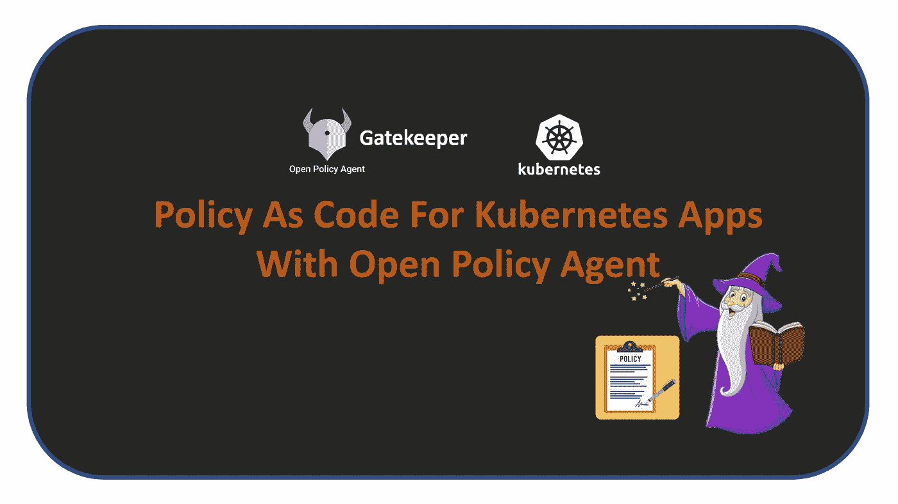
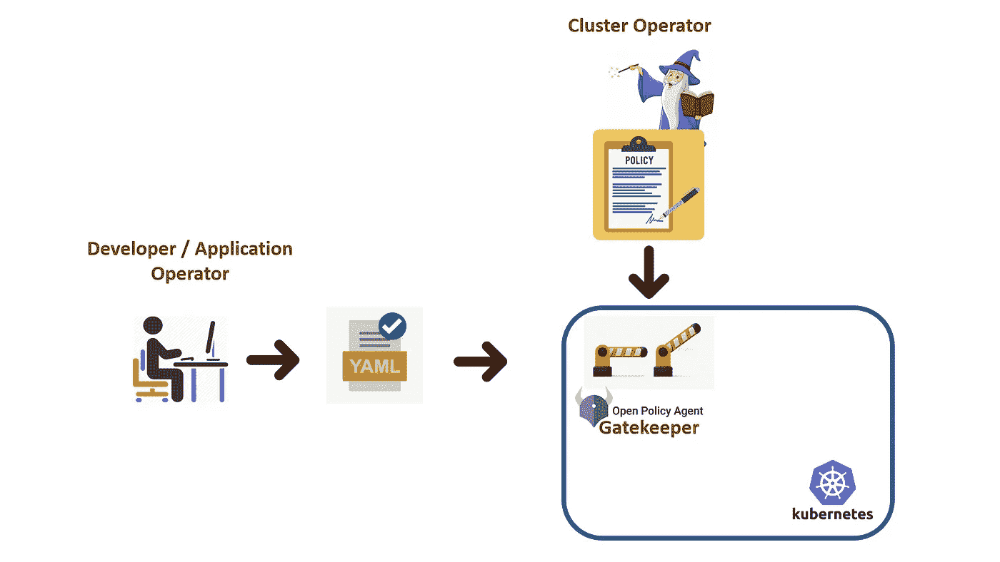
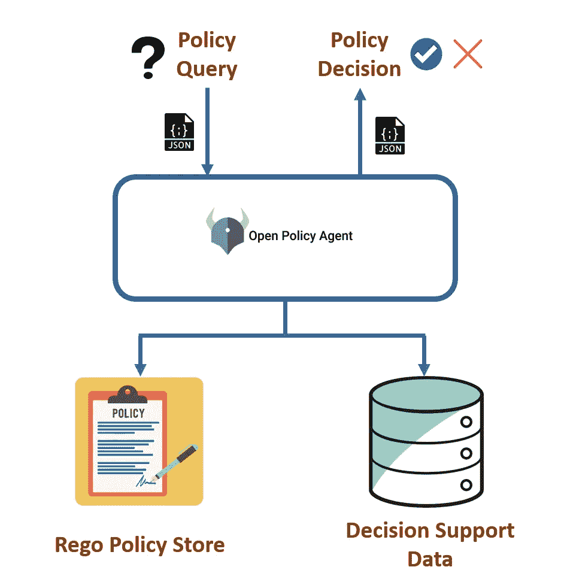
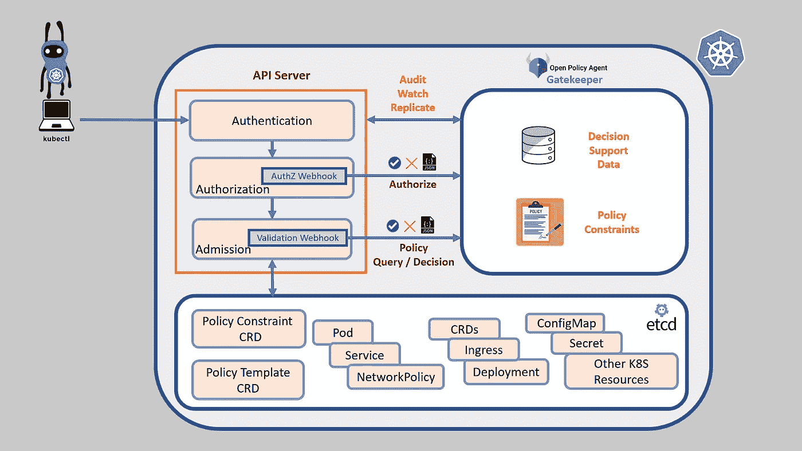
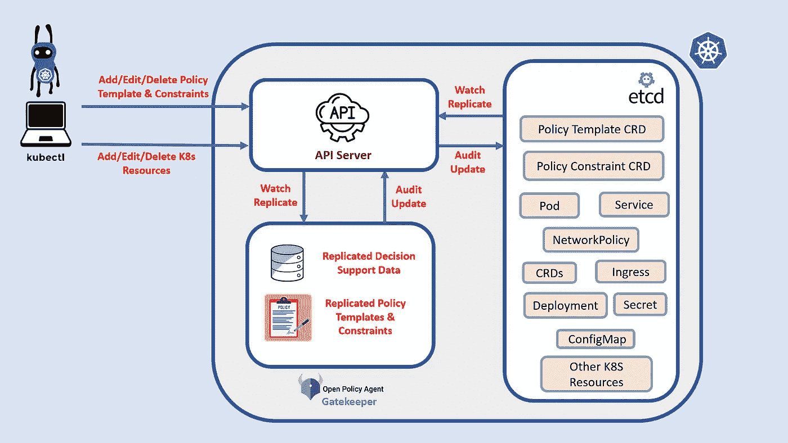

# Kubernetes 应用程序的适用性验证:政策即代码

> 原文：<https://itnext.io/fitness-validation-for-your-kubernetes-apps-policy-as-code-7fad698e7dec?source=collection_archive---------8----------------------->



## 实践编码之旅，实现“策略即代码”,并根据集群策略验证您的 Kubernetes 应用程序的适用性。



“策略作为代码”是一种想法，我们试图通过将策略作为代码来表达，使策略的生成和验证处于源代码控制之下。

## 为什么策略是代码？

我们管理和组织应用程序的策略随着不断变化的业务和技术环境而不断发展。为了应对增长机会、竞争、团队成熟度、技术中断、新的工程实践、法规遵从性和安全威胁，形势正在发生变化。

> 一般来说，当一个应用程序或基础设施被创建为一个全新的工作时，我们会很好地计划和实现策略。但是随着手动策略治理的时间推移，它会逐渐衰退。

这些策略是授权规则、网络策略、体系结构特征、最佳实践和操作问题的组合。这些策略由不同的利益相关者贡献和验证，如开发人员、操作人员、安全工程师、架构师和产品所有者。由许多利益相关者贡献和验证的多维策略使得保持生产生态系统与不断发展的策略同步变得非常困难

> 由于这种高速的变化和协作需求，策略继承了我们管理应用程序代码的许多需求。这引发了将策略作为代码进行管理的需求。

一旦我们开始将策略作为代码来管理，这将带来很多好处。下面列出了其中的一些。

*   易于协作
*   可共享和重复使用
*   可审计
*   可重复且可靠
*   还原和回滚
*   易于调试
*   自动化治理

本文集中讨论使用“开放策略代理”对部署在 Kubernetes 中的应用程序进行策略验证。如果你对政策代作代码感兴趣，可以看看《 [***掌舵还不够，还需要草创***](/helm-is-not-enough-you-also-need-kustomize-82bae896816e) 》一文。

**什么是“开放式保单代理”？**

开放策略代理(OPA)是一个通用的开源策略引擎，可以帮助在整个堆栈中实施策略。我们可以将 OPA 用于

*   在微服务 API 中实施授权
*   验证 Kubernetes YAML 的完整性
*   以基础设施为代码的策略验证(平台、交叉平面)
*   对 docker 应用访问控制
*   在 Linux 机器中应用访问控制

由于结构简单，OPA 能够适应不同的堆栈。OPA 公开了 JSON API，将策略查询作为输入，将策略决策作为响应。在 OPA 中，策略是用一种特定于领域的语言编写的，这种语言被称为减压阀。OPA 还有一个内存中的数据存储，用于保存决策所需的数据。

> 我们所要做的就是 1)编写减压阀策略，2)填充决策支持库，以及 3)开始进行策略查询。



OPA 可以与更多的生态系统集成，在这里 阅读关于这些集成的更多信息 [**。**](https://www.openpolicyagent.org/docs/latest/ecosystem/)

## 看门人:Kubernetes OPA 集成

> 看门人作为准入控制器 webhook 集成到 kubernetes 中。每当创建、更新或删除资源时，它们都会执行 rego 策略来验证和授权更改。

准入控制器在 ETCD 持久化之前，但在经过身份验证和授权之后，拦截所有对 Kubernetes API 服务器的请求。有两种类型的接纳控制器 1)确认接纳控制器 2)突变接纳控制器。虽然验证准入控制器可用于策略验证，但变异准入可用于策略生成。

> 网守目前只有验证准入控制器和审计实现。变异准入控制器计划在未来实施。

审计功能是一种查看违反策略的列表的方法，在没有网守的情况下(在创建策略约束之前或网守关闭时)创建的现有 Kubernetes 资源中。本文将重点介绍 Gatekeeper v3.0 版。需要注意的是，3.0 版的工作方式不同于旧版本。让我们来看看 gatekeeper 是如何融入 Kubernetes 架构的。



乍一看，这可能看起来很复杂。理解下面的几个概念会让你明白。

## **策略模板&策略约束 CRDs**

策略约束是一个客户资源定义(CRDs ),由集群操作者用来定义一组规则，在添加/删除/修改 Kubernetes 资源之前需要满足这些规则。如果你不知道什么是 CRD，它们是用你自己的定制对象来扩展 Kubernetes 的一种方式。当您需要 Kubernetes 以外的本地对象时，如 pod、部署、Secret、Ingress 等。我们选择 CRDs。在这里阅读更多关于 CRDs[](https://kubernetes.io/docs/concepts/extend-kubernetes/api-extension/custom-resources/)****。下面是一个策略约束的例子，我们声明性地指定我们应该在所有 k8s 命名空间资源上有一个名为“owner”的标签。****

```
***apiVersion**: constraints.gatekeeper.sh/v1beta1
**kind**: K8sRequiredLabels
**metadata**:
  **name**: ns-must-have-owner
**spec**:
  **match**:
    **kinds**:
      - **apiGroups**: [""]
        **kinds**: ["Namespace"]
  **parameters**:
    **labels**: ["owner"]*
```

> *策略约束不是一个独立的单元，它依赖于策略模板 CRD。策略模板定义了要为策略约束执行的减压阀规则和策略约束 CRD 的模式。*

*策略模板可以在整个组织和更广泛的生态系统中共享和重用。Gatekeeper 在 library 文件夹中有一组重复使用的策略模板。在此 处编写新的 [***策略模板之前，先寻找一个适合您需要的策略模板。一旦我们在集群中安装了模板 CRDs，集群操作者就可以开始添加与模板中定义的模式相匹配的约束。查看上面给定约束的策略模板。***](https://github.com/open-policy-agent/gatekeeper/tree/master/library)*

```
***apiVersion**: templates.gatekeeper.sh/v1beta1
**kind**: ConstraintTemplate
**metadata**:
  **name**: k8srequiredlabels
**spec**:
  **crd**:
    **spec**:
      **names**:
        **kind**: K8sRequiredLabels
      **validation**:
        **openAPIV3Schema**:
          **properties**:
            **labels**:
              **type**: array
              **items**: string
  **targets**:
    - **target**: admission.k8s.gatekeeper.sh
      **rego**: *|
        package k8srequiredlabels*

        deny[{**"msg": msg, "details": {"missing_labels":** missing}}] {
          provided := {label | input.review.object.metadata.labels[label]}
          required := {label | label := input.parameters.labels[_]}
          missing := required - provided
          count(missing) > 0
          msg := sprintf("you must provide labels: %v", [missing])
        }*
```

*这里解释了上述策略模板和策略约束 YAML 的一些重要组件。*

*   **" spec . crd . spec . names . kind "*策略模板 YAML 是定义名称的策略约束 CRD 的模式定义。*
*   **" spec . crd . spec . validation . open apiv 3 schema . properties "*策略模板 YAML 是策略约束 CRD 的输入参数模式。*
*   *在策略模板 YAML 中，标签是定义为策略约束 CRD 规范的唯一属性。在策略约束中，YAML 字符串数组“`["owner"]`”是“*规格参数标签*”的输入。*
*   *策略约束中的“*spec . match . kinds*”YAML 定义了应该对其应用策略约束的 Kubernetes 资源列表。*
*   *最后，策略模板 YAML 的“spec.target.rego”将保存实际的减压阀代码，这些代码将在我们运行策略约束时执行。*

## *减压阀的一些基本知识*

*学习 rego 本身就是一个很大的话题。在这个博客中，我们将学习一些工作所需的基础知识。*

*提示 1: 我们可以在 rego 部分定义许多规则。规则块的语法如下所示*

```
*rule_header[return_values]{
rule_body
}*
```

*在上面的例子中*

*   *拒绝—是规则标题*
*   *{"msg": msg，" details ":{ " missing _ labels ":missing } }-是返回值*
*   *“{}”中的所有内容都是规则体*

***提示 2:** 每当看到“`input.`”，都是指传递给 rego 块的输入参数。在这个例子中“`input.review.object.metadata.labels`”指的是被审查的来自即将到来的 YAML 的标签。“`input.review.object.`”引用传入的 YAML，“`metadata.labels`”通过遍历访问传入的 YAML 内部的标签对象。`input.parameters.`"在 rego 块中引用了我们在策略约束中定义的输入参数。*

***提示 3:** 每当我们提到`data.`，就意味着我们正在访问存储在 OPA 内存中的数据，以用于决策支持。为了能够以“`data.`”的形式访问一些数据，您应该首先在 OPA 中同步这些数据。为什么以及你将如何去做将会在博客的最后讨论。*

***提示 4:** 规则体中的所有语句都作为“与”逻辑运算执行。这意味着一旦其中一个表达式逻辑输出 false，执行就会中断，表明整个块失败。*

```
*expression-1 AND expression-2 AND ... AND expression-N*
```

*技巧 5: 我们应该将编写规则视为防御性编程。当执行中途返回“false”时，它将没有返回值，因此没有可用于拒绝资源添加的信息。*

```
*# When the count of missing labels is greater than zero the execution continues as the output is true
# When the count of missing labels is not greater than zero the execution breaks to return and admits the resource into the clustercount(missing) > 0*
```

***提示 6:** 当你在寻找“或”逻辑运算时我们应该使用多个规则块。在规则块之间应用“或”逻辑运算。这意味着当我们有多个规则块时，所有的规则都将被执行，直到其中一个规则块执行到最后返回一些值并且资源接纳失败。*

```
*rule_header1[return_values1]{
rule_body1
}
rule_header2[return_values2]{
rule_body2
}*
```

***技巧 7:** 有很多内置函数可以帮助我们编写快速规则块。上面代码中的“计数”就是一个例子。在 这里寻找你需要的 [***功能。你可以用下面的语法构建你自己的函数。***](https://www.openpolicyagent.org/docs/latest/policy-reference/#built-in-functions)*

```
*function_name(parameters) = return {
function_body
}*
```

*与其他编程语言一样，Rogo 还有更多功能(数组、导入、循环、字典、虚拟文档、正则表达式等)。如果你愿意深潜，这里详细预排的是[](https://www.openpolicyagent.org/docs/latest/#rego)*。**

## **观察和复制**

****

**有时，我们需要访问现有资源的详细信息来做出决策。这种情况的一个典型例子是具有唯一的入口端点。为此，我们应该能够从集群访问现有的入口资源。这在技术上可以使用同步资源来实现，同步资源可以选择性地观察数据并将数据从 ETCD 复制到 OPA 内存空间中。复制后，可以在策略 rego 中使用“`data.`”访问这些数据。下面的 YAML 中描述了复制对象、复制入口和 Pod 的示例。**

```
****apiVersion**: config.gatekeeper.sh/v1alpha1
**kind**: Config
**metadata**:
  **name**: config
  **namespace**: "gatekeeper-system"
**spec**:
  **sync**:
    **syncOnly**:
      - **group**: ""
        **version**: "networking.k8s.io/v1beta1"
        **kind**: "Ingress
      - **group**: ""
        **version**: "v1"
        **kind**: "Pod"**
```

## **审计**

**网关守护设备准入控制器是一个 webhook，当我们添加/编辑/删除资源时，它可能会关闭。这可能会导致非标准资源进入集群。此外，我们可能会遇到这样的情况:在应用约束之前，集群中就已经存在大量的非标准资源。我们需要一种机制来识别集群中的这些非标准资源，这就是看门人的审计功能。审计功能是对集群中现有资源的定期验证，并通过将它们作为违规附加到策略约束 CRD 的状态字段来引起我们的注意。**

```
****apiVersion**: constraints.gatekeeper.sh/v1beta1
**kind**: K8sRequiredLabels
**metadata**:
  **name**: ns-must-have-owner
**spec**:
  **match**:
    **kinds**:
      - **apiGroups**: [""]
        **kinds**: ["Namespace"]
  **parameters**:
    **labels**: ["owner"]
**status**:
  **auditTimestamp**: "2019-08-06T01:46:13Z"
  **byPod**:
  - **enforced**: **true**
    **id**: gatekeeper-controller-manager-0
  **violations**:
  - **enforcementAction**: deny
    **kind**: Namespace
    **message: 'you must provide labels**: {"owner"}'
    name: default**
```

## **结论**

**我们开始看到，作为代码的策略越来越受欢迎，它已经在 infoQ 2020 架构趋势的创新者象限中占据了一席之地。OPA 是 CNCF 认可的通用策略引擎，这使得学习 OPA 成为 DevOps 工程师的一项很好的技能🏄。**

**在即将发表的文章《✋.》中再见**