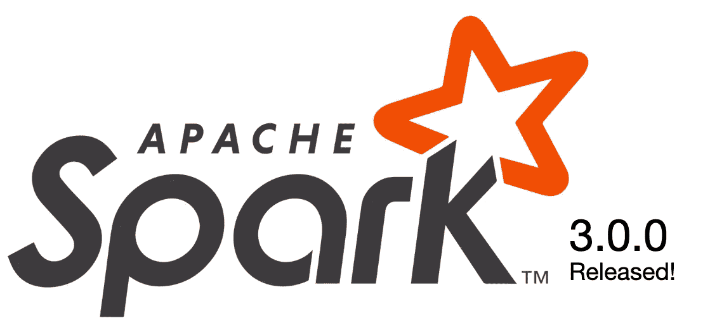

# Spark 3.0.0 版本的五大亮点

> 原文：<https://itnext.io/five-highlights-on-the-spark-3-0-release-ab8775804e4b?source=collection_archive---------1----------------------->

Spark 3.0.0 于昨天(18/Jun/2020)正式发布，它是世界上最流行的数据处理引擎( [*【弗林克】*](https://flink.apache.org/) *，你也很棒，但 Spark 更出名一点*)的重大变化(*)。*



首先，提醒一下，火花到底是什么？它是一个开源、容错、高速的内存数据处理引擎。它支持批处理和流处理以及一些很酷的分析。ML 部分在 Spark 2 中用得不多，但现在我们可能会在 Spark 3 中有新的变化！

除了 Databricks 服务和 Spark 运行的内部设置之外，这将影响许多工作负载。Cloudera 发行版、在 Spark 上构建产品的公司和每个公共云提供商(*他们都有 Spark 托管服务*)将对此做出反应，我急切地等待着看他们会构建什么！( [*Databricks 已经推出了 Spark 3.0！*](https://databricks.com/blog/2020/06/18/introducing-apache-spark-3-0-now-available-in-databricks-runtime-7-0.html) )。

回到几年前，Spark 2 带来了许多基本的新东西(*catalyst optimizer 是最值得注意的一个，在我看来*)真正将 Spark 推向了企业世界。与不同输入源的集成、Hive metastore 连接、结构化流等等将 Spark 变成了今天的样子:**在数据湖之上构建数据管道**和工作负载最常用的引擎。所以，我们开门见山吧，蒂亚戈？你认为惊天动地的发布中有哪些必不可少的东西？

# 1.SQL ANSI 和兼容性

如果说 Excel 统治世界，SQL 统治数据的黑社会。它很容易学习，很直观，你可以用它做很多事情(在*和* [*这个 Reddit 帖子*](https://www.reddit.com/r/programminghorror/comments/2wr19u/whats_the_worst_abuse_of_sql_youve_ever_seen/) )上看到一些不错的 SQL 滥用)。然而，我们总是不得不学习一些在不同系统中编写 SQL 的技巧和诀窍，因为它们有细微的区别。SQL ANSI 为它建立了一个标准，Spark 在这方面有些落后——我在过滤聚合表达式时总是出错，但现在已经解决了！

> 当然，我们还没有完全实现，因为 Spark 3.0 还没有完全实现 ANSI/SQL，但是你可以在这里查看这项工作的状态[。](https://issues.apache.org/jira/browse/SPARK-30374)

这是否意味着如果我升级我的 Spark 版本，我的旧 Spark-SQL 代码将停止工作？嗯，升级主要版本总是一个问题，但 ANSI SQL 部分可以切换为一个配置，以保留一些关键字，只需添加:

```
spark.sql.ansi.enabled = True
```

# 2.土著普罗米修斯

在运行生产工作负载时，对工作的可观察性不是一件好事，而是必须的。尽管我们可以从 Spark jobs 获得大量指标，但我认为几乎每个人都构建了一些定制的网关，将他们的指标转发到其他地方，以监控和警告您的作业。尤其是 JVM 内存和垃圾收集信息，对吧？:-)

如今监控和报警几乎是[普罗米修斯](https://prometheus.io/)的同义词。这个由 [CNCF](https://www.cncf.io/) 开发的令人惊叹的开源项目非常棒，有很多贡献者，进展迅速，并且易于建立。在我们参与的大多数 Spark 2.x 项目中，我们会构建一个 Prometheus exporter 来导出 Graphite 并对其进行清理，这样我们就可以获得度量信息，并为执行者提供警报。具体怎么做？

## 2.1 火花 2 普罗米修斯监控

㈠将数据导出到 Graphite。
我们将在容器中部署导出器，并通过适当的自动扩展与集群并行运行。用于本地运行的简单 docker-compose 文件及其配置文件如下所示(*配置文件是指标的正确标记，因此我们可以使用 Prometheus* 查询它们)。

(II)当运行您的 spark 应用程序时，您的`$SPARK_HOME/conf/`文件夹中必须有一个适当的`metrics.properties`文件，它从(I)指向作为接收器的石墨导出器。

如你所见，并不复杂，但很麻烦。特别是当你开始有数百个新的 Spark 应用程序时，有些人可能会忘记这一点，而你可能会意识到当应用程序没有运行几个小时时。当然，您可以将这些步骤添加到您的 CD 管道中，但是您可以想象这种自动化需要做多少工作。

## 火花 3.0 上的 2.1？简单多了…

除了通过`/applications/[app-id]/executors`上的 REST API 公开执行器指标，我们现在将有一个原生的[普罗米修斯端点](https://issues.apache.org/jira/browse/SPARK-29429)，在这里您只需要切换配置`spark.ui.prometheus.enabled`。

那个。是。它。一个开关… :-D

# 3.语言版本变化，Hadoop 和 Kubernetes

Spark 有 4 个 SDK:Python、Scala、Java 和 R (the。网一非官方)。Python 是最常用的，这就是为什么 Spark 3 特别关注 Pandas 集成、Python 上的 UDF 优化等等。而且，正如预期的那样，在如此重大的版本变化中，一些东西将被添加，而另一些则被弃用。这些就是变化:

*   Python 2 支持被否决了，我非常高兴！
*   早于 3.4 的 r 版本也不推荐使用。
*   Java 11 支持。
*   Hadoop 3 支持，移除 Hadoop 2.6 支持。
*   从现在开始 Scala 2.12 这与`DataStreamWritter.foreachBatch`产生了歧义，所以要小心。
*   Kubernetes 正在成为运行 Spark 应用程序的可靠方式。随着新的 shuffle 和 Kerberos 对 k8s 的支持，我们将开始看到企业这样做，而不用担心“成为第一”。

# 4.动态分区剪枝

这里看一下原票[这里](https://issues.apache.org/jira/browse/SPARK-11150)查一下上次 PR [。如果我能用两段话来解释，我会的，但是我不能。因此，我建议您参考我们去年在阿姆斯特丹举行的 Spark + AI 峰会上的精彩演示。向](https://github.com/apache/spark/pull/25600/files) [@BogdanGhit](https://twitter.com/bogdanghit?lang=en) 和 [Juliusz Sompolski](https://databricks.com/speaker/juliusz-sompolski) 致敬。

那么，为什么这很重要，很神奇呢？查询小维度的星型模式表不是很有执行性，我们必须在这样做之前改变数据结构。现在，嘭！现成的快速查询对于高级分析(也称为 TPC-DS 数据类型)至关重要。

# 5.自适应查询执行

Spark SQL 在最近几年越来越多地被使用，很多人致力于 SQL 查询优化器，所以我们有最好的查询执行计划。当您用自己选择的语言为 Spark 编写一个 SQL 查询时，Spark 会接受这个查询，并把它翻译成一种易于理解的形式(逻辑计划)。在这个阶段，它通过应用一组基于规则的转换(常量合并、过滤器下推、列修剪等)来优化逻辑计划。下一步是物理规划阶段，在这个阶段，它会生成一个可执行的计划(物理计划),告知如何在集群中分配计算。

基于这种理解，您可以想象为运行查询选择一个更好的计划是多么重要。这包括收集数据统计和基于成本的优化。比如我应该通过`sort merge`加入还是通过`broadcast hash`加入？如果我正在进行多路连接，连接的顺序是什么？如果您向优化器提供过时的统计信息，您将得到一个非最优的计划，并且执行查询的效果很差。因此，现在我们可以根据查询执行期间收集的统计数据来重新优化和调整查询计划！魔法，对吧？

如果你想了解这方面的基本变化，类似于动态修剪，我必须就此写一整篇文章。所以我可以告诉你在这里看一看原始的史诗[，在这里](https://issues.apache.org/jira/browse/SPARK-9850)看一看“动态重用子查询”PR [上的精彩](https://github.com/apache/spark/pull/25471/files) [@maryannxue](https://twitter.com/maryannxue) 代码，并在 Spark 峰会上通过 [Carson Wang](https://databricks.com/speaker/carson-wang) 的这个稍微老一点的会议(2018)。

# 结论

Spark 通过这一新版本继续改变数据世界。它留下了一个相关的信息，不管你喜不喜欢:

> Python、高级分析、数据仓库中的 SQL、数据流和深度学习是现在的焦点。

你想为 Spark 做贡献吗？复习一些公关？帮助文档？我们都需要你，所以看看问题页面[这里](https://issues.apache.org/jira/projects/SPARK/issues/SPARK-28367?filter=allopenissues)并投稿吧！