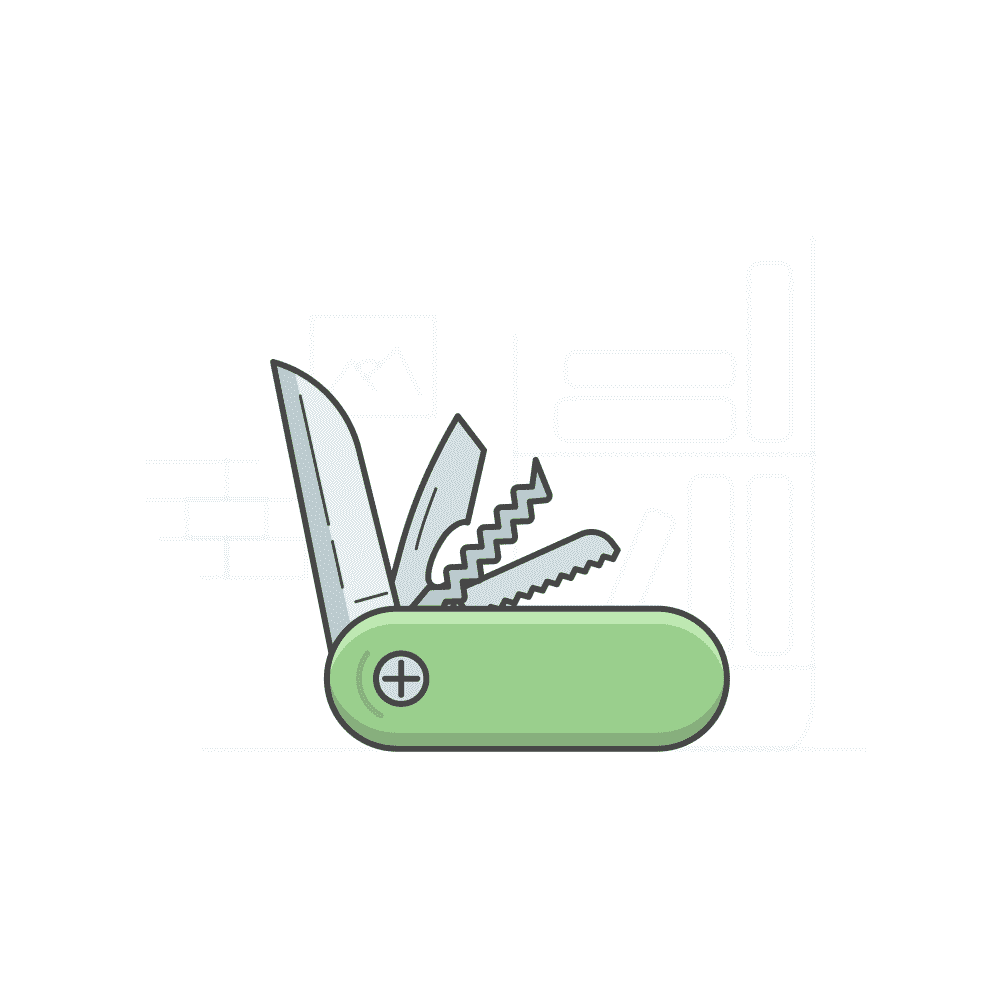

# 五个在任何项目中都有用的 React 挂钩。

> 原文：<https://itnext.io/five-react-hooks-useful-in-any-project-44c150f283f8?source=collection_archive---------0----------------------->

在这篇文章中，我将介绍五个简单的 React 挂钩，你会发现它们在任何项目中都很方便。不管应用程序的特性如何，这些钩子都是有用的。对于每个钩子，我将提供实现和客户机代码示例。

**使用模式状态**

出于各种原因，Web 应用程序广泛使用模态。当使用模态时，您很快就会意识到管理它们的状态是一项乏味且重复的任务。当你有重复和乏味的代码时，你应该花时间抽象它。这就是`useModalState`管理模态状态的作用。

许多库都提供了这个钩子的版本，其中一个库就是 Chakra UI。如果你想了解更多关于 Chakra UI 的知识，请点击这里查看我的博客文章。

钩子的实现非常简单，甚至微不足道。但是根据我的经验，使用它比每次都重写代码来管理模态的状态更有价值。

下面是一个使用钩子的客户端代码示例:

**使用确认对话框**

`useConfirmationDialog`是我经常使用的另一个模态相关的钩子。在执行敏感操作(如删除记录)时，要求用户确认是一种常见的做法。所以用钩子来抽象这个逻辑是有意义的。下面是一个`useConfirmationDialog`钩子的示例实现:

这里有一个客户端代码的例子:

这里需要注意的一点是，只要您的确认模式没有任何受控的输入元素，这个实现就可以很好地工作。如果你有受控输入，最好为你的模态创建一个单独的组件。这是因为您不希望每次用户输入内容时都重新呈现模态的内容，包括那些输入。

**使用同步**

在应用程序中正确处理异步操作比看起来要复杂得多。在任务运行时，您需要跟踪多个状态变量。您希望通过显示一个微调器来通知用户操作正在进行。此外，您需要处理错误，并在错误发生时提供有用的反馈。因此，在 React 项目中建立一个处理异步任务的框架是值得的。这就是你可能会发现`useAsync`有用的地方。下面是`useAsync`钩子的一个实现:

客户代码:

钩子不难自己写，这也是我经常做的。但是使用更成熟的库实现可能对您更有意义。这里有一个[很好的选择。](https://docs.react-async.com/getting-started/usage)

**使用跟踪错误**

表单验证是 React 应用程序的另一个部分，人们通常会觉得很乏味。也就是说，在 React 中有很多优秀的库可以帮助表单管理。一个很好的选择是[福米克](https://formik.org/)。然而，每个库都有一个学习曲线。这种学习曲线通常使得它不值得在较小的项目中使用。特别是如果你有其他人和你一起工作，而他们不熟悉这些库的话。

但这并不意味着我们不能对我们经常使用的一些代码进行简单的抽象。我喜欢抽象的一段代码就是错误验证。在提交给 API 之前检查表单并向用户显示验证结果是任何 web 应用程序的必备功能。下面是一个简单的`useTrackErrors`钩子的实现，可以帮助解决这个问题:

这是客户端实现:

**使用去抖**

去抖在任何应用中都有广泛的用途。最常见的用途是抑制昂贵的操作。例如，防止应用程序在用户每次按键时调用搜索 API，并让用户在调用它之前完成。挂钩使得节流这样昂贵的操作变得容易。下面是一个使用 [AwesomeDebounceLibrary](https://github.com/slorber/awesome-debounce-promise) 编写的简单实现:

这是客户端代码:

这个实现需要注意的一点是:您需要确保每次渲染时不会重新创建昂贵的函数。因为这将重置该函数的去抖版本，并清除其内部状态。有两种方法可以实现这一点:

1.  在功能组件之外声明昂贵的函数(如代码示例所示)。
2.  用 [useCallback](https://reactjs.org/docs/hooks-reference.html#usecallback) 钩子包装昂贵的函数。

这就是这篇文章的全部内容。有许多有用的钩子库值得一试，如果你感兴趣，这里有一个很好的[起点](https://github.com/rehooks/awesome-react-hooks)。虽然有许多有用的自定义挂钩，但这五个挂钩在任何 React 项目中都很方便。

*原载于 2021 年 2 月 21 日 https://isamatov.com***。**