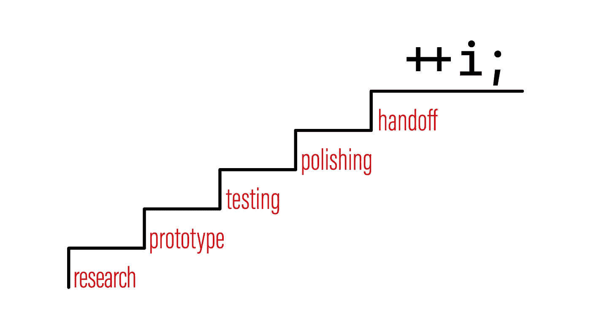

# 完善软件的五个步骤

> 原文：<https://itnext.io/five-steps-to-perfect-software-cfd4bd58a91b?source=collection_archive---------3----------------------->

年底到了，所以这是更新基础知识的最佳时机。本文将介绍完善软件的五个步骤，这五个步骤你绝对不能跳过。

为了澄清，我将放大到“单元级别”,因为你们大多数人将不负责高层架构决策或团队动态。

# 研究

我发现这是目前最常被跳过的阶段。我把这归咎于当前的招聘做法。虽然速度有绝对的价值，但朝错误的方向快速奔跑比原地不动更糟糕。

研究阶段是关于放慢速度，花一点时间思考问题。

*   你明白这个问题吗？它被很好地指定了吗？
*   您是否拥有解决此任务所需的所有资源(知识或工具)？
*   有没有内部资源可以帮你解决这个任务(人或者工具)？
*   有没有你可以利用的外部资源(人或工具)？
*   谁是利益相关者？他们还对这个任务感兴趣吗？他们的要求改变了吗？

研究阶段应该回答所有可能改变任务性质的公开问题或不确定性。如果在过程的后期被发现，这样的改变会迫使重复工作。

> 我的任务非常简单，我不需要做任何研究。我完全知道该做什么，怎么做！

如果这是你的情况，并且你喜欢你的工作，那么很好。请注意，你很容易被自动化取代。

> 简直是浪费时间！

研究不一定是一些长期的、复杂的活动。根据任务的大小，研究可以是与您的技术主管进行五分钟的聊天。

# 原型

一旦我们明白自己在做什么，就该想想怎么做了。主要目标是确定接口和数据结构，以便进入下一阶段。

专注于核心功能，暂时不考虑任何故障模式。简单性应该是这个阶段的主要焦点。保持最小化。

> 我从我们的建筑师那里得到所有的设计。

如果您不需要原型阶段，并且拥有开始编写测试所需的一切，那么您可以跳过这个阶段。

# 测试

准确地说，是测试/实现循环。我们现在已经确定了我们正在实现什么以及我们如何实现它(至少在接口层面上)。

如果我们现在迭代编写测试，并实现使测试通过的功能，我们保证我们最终得到最小可行的解决方案。

我不会深入讨论为什么以及如何编写单元测试，因为这本身就是一本书的内容。但是这里有一些快速提示:

*   使用 given-when-then 结构。
*   如果这个组件是有状态的，考虑状态图。每个转换都应该有一个相应的测试用例。
*   如果这个组件是无状态的，考虑边界条件。每个边界条件都应该有一个相应的测试用例。
*   可测试性是代码的一个属性，所以如果你努力编写测试用例，你可能需要调整你的设计。
*   以高分行覆盖率为目标。然而，不要忘记，有时不是缺少测试，而是实现出了问题(即死代码)。

> 写测试让我变慢了！

是的。当你在一个任务上工作时，写测试会减慢你的速度。然而，进行测试将加速这个项目的所有未来工作。人们高估了速度的降低，低估了从一个经过良好测试的代码库中获得的加速。

> 但是单元测试并不能保证我的代码是正确的！

他们没有。然而，这从来都不是目标。单元测试主要是文档，我指的是规范和假设的文档。随着项目的发展，旧的规范和假设会一直被违反，单元测试会告诉你什么时候会被违反。

此外，如果您关心代码的正确性，您将需要依赖于诸如资源安全检查器、模糊测试器、变异测试器等工具。这些工具中的大多数运行在单元测试之上。

# 修正

我们现在有了一个经过充分测试的实现。还能做什么呢？抛光的目的是确保当队友或我们后来捡起这段代码时，我们不会变成碎片。

如果您的团队已经建立了代码评审过程，这个阶段将映射到代码评审过程。如果你的团队没有，让别人快速阅读你的代码仍然是值得的。除此之外，您还可以依靠自动化的风格工具和检查器来指出代码中有问题的部分。

关于带碎片的代码的一些通用指针:

*   你的变量和函数的名字代表了它们的目的吗？
*   有没有什么深度嵌套的结构？
*   任何函数/类只能用包含“AND”/“OR”的句子来描述吗？

# 手递手传球

最后，是交接的时候了。没有进行适当的移交是一个常见的、具有潜在破坏性的错误。

然而，根据您的组织，这到底意味着什么会有很大的不同:

*   首先，关闭或更改相关任务的状态。
*   通知所有利益相关方。如果你的项目有定期发布，也要提到预期的发布时间。
*   最后，分享你在执行任务时学到的东西(有用的工具或库，容易犯的错误)。

# 感谢您的阅读

感谢您阅读这篇文章。你已经在遵循这五个步骤了吗？你觉得我漏了一步吗？让我知道！

我也在 YouTube 上发布视频。你有问题吗？在[推特](https://twitter.com/SimonToth83)或 [LinkedIn](https://www.linkedin.com/in/simontoth) 上联系我。