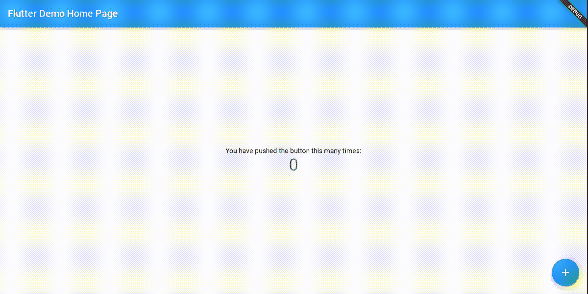
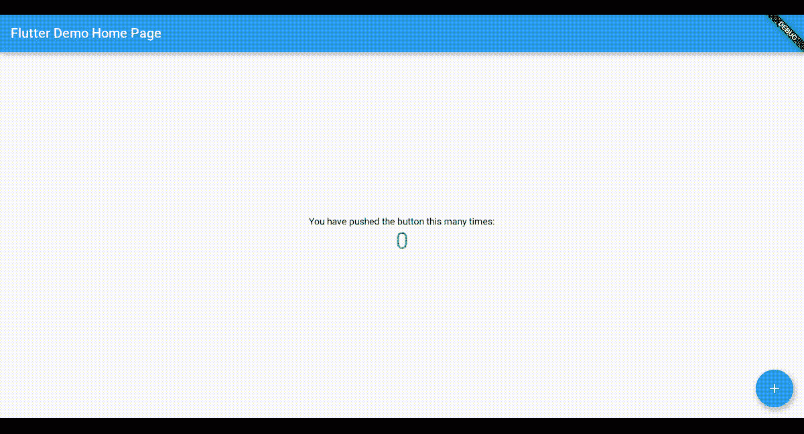

# 用加载旋转器固定颤振腹板加载时间

> 原文：<https://itnext.io/fix-flutter-web-loading-time-with-a-loading-spinner-c5dd36a29f5b?source=collection_archive---------1----------------------->

在 Flutter Web 中添加闪屏或加载微调器。


# 介绍

除了移动应用程序之外，Flutter 还引入了 web 支持，它可以生成使用标准 web 技术栈呈现的 web 内容:HTML、CSS 和 JavaScript。这样，您可以将用 Dart 编写的现有 Flutter 代码编译成一个 web 项目，该项目可以嵌入到浏览器中，并部署到任何 web 服务器上。

在写这篇文章的时候(2020 年 12 月)，许多标准的移动 Flutter 库已经增加了 web 支持，扩展了我们已经知道的移动应用的功能，现在是 web 应用。(它也有桌面应用，但这是一个完全不同的话题)

为了安装 Flutter web，正确安装的说明可以在他们的官方文档网站上找到。

## 重要的

在开发过程中，web 支持目前在测试版渠道中可用。这就是为什么在安装时，我们需要进行切换并启用 web 支持:

```
flutter channel beta
flutter upgrade
flutter config --enable-web
```

以下命令将在 web 服务器上运行我们的 web 项目:

```
flutter run -d web-server
```

# 有什么问题？

在运行某些视图之前，尤其是第一次构建 web 应用程序时，需要一段时间来加载所有内容:



加载不带闪屏的 Flutter web 项目

我们将使用 CSS 制作一个旋转器动画(可以替换为实际的闪屏),如下所示:



加载带有闪屏的 Flutter web 项目

# 怎么修

我们将在 **web/index.html** 中处理 Flutter web 生成的 HTML 文件。

首先，我们将用下面的代码替换 **<正文>** ，这里我们只添加了一个带有加载类的 Div，包含另一个 div wit ha Loader 类:

```
<body>
<div class="loading">
  <div class="loader"></div>
</div>
<script src="main.dart.js" type="application/javascript"></script>
</body>
```

然后我们在我们的<头>的底部添加一个 **<样式>** 标签:

```
<style>
    .loading {
      display: flex;
      justify-content: center;
      align-items: center;
      margin: 0;
      position: absolute;
      top: 50%;
      left: 50%;
      -ms-transform: translate(-50%, -50%);
      transform: translate(-50%, -50%);
    }

    .loader {
      border: 16px solid #f3f3f3;
      border-radius: 50%;
      border: 15px solid ;
      border-top: 16px solid blue;
      border-right: 16px solid white;
      border-bottom: 16px solid blue;
      border-left: 16px solid white;
      width: 120px;
      height: 120px;
      -webkit-animation: spin 2s linear infinite;
      animation: spin 2s linear infinite;
    }

    @-webkit-keyframes spin {
      0% {
        -webkit-transform: rotate(0deg);
      }
      100% {
        -webkit-transform: rotate(360deg);
      }
    }

    [@keyframes](http://twitter.com/keyframes) spin {
      0% {
        transform: rotate(0deg);
      }
      100% {
        transform: rotate(360deg);
      }
    }
  </style>
```

搞定了。当我们用 Run 命令执行我们的 Flutter web 应用程序时，我们将能够重新加载屏幕并看到我们的视图:

```
flutter run -d web-server
```

# 结论

这个视图将是移动闪屏的“网络等价物”。在 Flutter web 应用程序的情况下，特别是在闪屏不常见的 web 应用程序中，我们可以插入一个加载旋转器动画来代替闪屏，就像我们上面做的那样，以产生一种更自然的感觉。这个功能可以扩展到显示图像、执行复杂的动画和执行 JS 脚本。