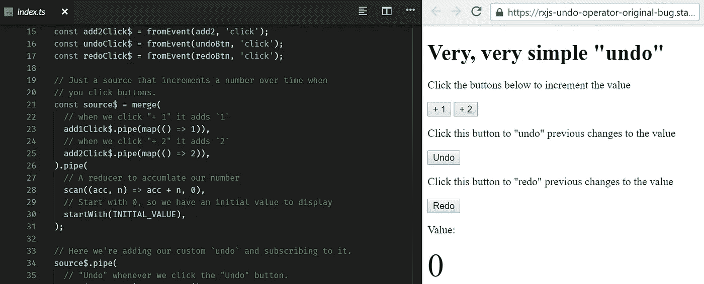

# RxJS Bugs 总有解决办法

> 原文：<https://itnext.io/fixing-ben-leshs-rxjs-bug-339d2aaafdb6?source=collection_archive---------3----------------------->

StackBlitz 上 [Ben Lesh 的](https://twitter.com/BenLesh) [原代码](https://stackblitz.com/edit/rxjs-undo-operator-original-bug)截图。

## 即使是我们中最优秀的人也会写 bug。这家伙是故意的。

*我将指出****Ben Lesh****的代码中的一个错误，这个错误最终只是语义上的(下面会有更多相关内容)。*

# 本的原始推文

本·莱什在推特上发布了一些他将在 ngconf 上做的演讲的代码:

他编写这段代码是为了提供一个简单的例子，在这个例子中，您可以用很少的代码在 DOM 中添加数字、撤销和重做:

我们的目标是解释 RxJS，并展示如何只用几个操作符就能做这么多。这也是为什么他没有选择使用 Angular 或 React 来呈现 DOM 元素。这将大大增加膨胀。

# 可怕的虫子

窃听器在哪里？按“+1”几次，你得到`2`。然后按“撤销”。您应该会看到您所期望的`1`，但是如果您再次按“+1”，它将显示`3`而不是`2`。

查看代码后，我发现了问题。他提供给`scan`的 reducer 继续累加值，而不考虑撤销和重做动作:

我有几种方法可以解决这个问题，但我想保持简单。

我们也把这个当成专业项目吧。我们是本的编辑。我们在他的代码中发现了一个 bug，我们得到报酬，以一种符合他最初要求的方式修复它。

从他的推文中，我们的要求是要有一个“非常非常简单的撤销操作符”，只用`merge`、`scan`、`filter`和`map`。

# 修复 Bug

这是我第一次尝试解决问题:

虽然这确实解决了问题，但我的解决方案对他的演讲来说还是太激烈了:

请记住，我们应该保持“非常非常简单”的指导方针，只有 4 个操作符。现在我们有两个`startWith`操作符和一个添加的`switchMap`。

你不需要解释`startWith`，除非你有两个。现在必须解释运算符的顺序，而在此之前，他可以不解释。

最重要的是，我将渲染模式分解成一个名为`render$`的`Subject`。现在我已经在混合中引入了主题。不是每个人都已经知道可观测量是如何工作的，现在他必须解释什么是可观测量，它与观察者有什么不同，以及它们的组合是怎样的一个`Subject`。

我们现在要干嘛？

# 又一次尝试

请记住，我们在这里得到假装的报酬，所以我们需要专业一点。

与其让我们的操作符变得复杂，不如让我们检查一下是否可以简单地改进`undo`操作符:

对我来说，这看起来不像是一个“非常非常简单的撤销操作”，但是考虑到它所做的事情，这已经是最简单的了。这意味着我们可能会增加一个“非常”。

它是用 TypeScript 编写的，它返回一个结合了撤销、重做和`source`可观察值的可观察值。`source`是包含运行小车后输出值的可观测值:`source$`。

还要注意，这个操作符返回一个带有`scan`的可观察的。哇，扫描异常！这意味着这个`undo`操作器也作为一个减速器。正因为如此，它包含了状态，我们可以用这个状态来耍一些花招。

我们可以这样做的唯一原因是，来自前面的`scan`的错误输出值将进入这个`scan`。从这里开始，我们可以绕过它。

我宁愿不使用这种方法，但是因为我们有一些严格的要求，而且因为我已经开始写这篇文章，所以值得一试。

在`undo`的`scan`操作符中，`state`是来自`source$`的所有值的数组。

每当一个新的值进来时，我们可以将差值存储在这个缩减器中，并每次减去它。

哈基。但是很管用！这很容易改变。

下面是`undo`的新代码:

我们给减速器加了一个`subtractor`。

当推到状态时，我们现在正在做`x - subtractor`。每当我们输入一个新值，我们总是会从之前的`scan`中减去不正确的数量。

每当撤销发生时，我们将未撤销值和新值的差添加到我们的`subtractor`中。

当重做发生时，我们仍然从当前值中减去未删除的值，但是然后我们从`subtractor`中删除该差值。

虽然这确实显示了一些 TypeScript 错误，但是代码可以编译。它修复了错误，符合我们的要求。

## 问题

这种解决方案的缺点是它很粗糙。它还将我们的`undo`操作符与代码另一部分中的一个 bug 联系起来。这意味着我们的`undo`操作符只能在这个特定的系统中使用。

这就是保持事情简单的问题。有时，您需要添加一些操作符来使 RxJS 更加强大和易于使用。

我永远不会推荐任何人使用第二个补丁，因为它会让你的代码变得过于挑剔。即使它解决了这个问题，也会产生许多其他问题。

# 对本来说什么最重要？

对于演讲来说，什么更重要？只使用 4 个操作符，拥有一个“非常非常简单的撤销操作符”，还是拥有无 bug 代码？

这是需要考虑的最重要的事情。

很有可能这不是一个错误。我猜本希望这样来保持代码简单。我们认为这是一个错误，因为我们对“撤销”和“重做”的工作方式有所期待。他知道这段代码将会出现在一次谈话中，所以他不会在点击`undo`后再次点击“添加”。简单。

这才是最重要的。找出对企业来说什么是重要的；而不是你认为对代码或你自己的议程最好的。不要做一个福音传道者，当他的代码不符合他的需求时，替他修改代码，除非你想像我一样找点乐子。:D

# redux-可观察的 FTW！

因为我认为 Redux-Observable 风格是干净代码的未来，所以我用那种风格完全重写了他的整个例子。这意味着没有他的原始代码，没有类型脚本，垂直编码风格，没有错误！

每个可观察值都在一个称为 epic 的函数中，该函数提供了一个`action$`可观察值。我们不必直接听其他可观测的，我们只需要听`action$`。

当`action$`更新时，我们所有的可观察对象都被激活，我们使用`ofType`来确定这个动作是否是我们想要处理的。如果有，就把它推进管道。

我没有将减速器放入其他减速器中，而是制作了一个减速器(本可以制作成两个)，这使得*大大降低了旧`undo`功能的复杂性。类似于我在原始代码中的第一个 bug 修复，我专门用一个单独的 observable 向 DOM 呈现新的输出值。*

你可以在这里摆弄它:

我的版本看起来和 Ben 写的很不一样，但是我没有改变观点，只是改变了背后的商业逻辑。我相信你们中的很多人以前都不得不像这样重构代码。

在我的很多项目中，我使用 Redux，根本不使用组件状态。正因为如此，我可以花时间在缩减器和史诗上，而不去管视图。这也意味着我可以将视图与核心业务逻辑完全分离。

我为什么要这么做？因为我可以编写相同的 Redux 逻辑，并在同一个应用程序中同时在 AngularJS 或 React 中使用它。这并不适合所有人，但在我的前两个团队中，这对我们很有效。

# 结论

最重要的是业务需求。虽然你可能有一些你认为事情应该如何运作的固有知识，但销售你产品的人是第一位的。

在这种情况下，本·莱什在一次演讲中销售这种产品(**编辑**:不是这个特定的运营商，只是一般的运营商)。我在写一篇关于如何修复别人 RxJS 代码中的 bug 的文章。他的要求和我的完全不同。

正因为如此，我相信本不会去修改代码。我敢打赌，他不会修复这个 bug，因为正如我前面所说，这可能不是他的 bug。

## 编辑

Ben Lesh 提供了关于`undo`操作员的说明:

他真的打算称它为`showPreviousValues`而不是`undo`。这就是我说的。

# 更多阅读

如果你喜欢你所读的，请查看我关于类似的令人大开眼界的主题的其他文章:

*   [Redux-Observable 可以解决你的状态问题](https://medium.com/@Sawtaytoes/redux-observable-can-solve-your-state-problems-15b23a9649d7)
*   [Redux-可观察无 Redux](/redux-observable-without-redux-ff4a2b5a4b39)
*   [CSP vs RxJS:你不知道的。](https://medium.freecodecamp.org/csp-vs-rxjs-what-you-dont-know-1542cd5dd100)
*   [回访:权威指南](/the-definitive-guide-to-callbacks-in-javascript-44a39c065292)
*   [承诺:权威指南](/promises-the-definitive-guide-6a49e0dbf3b7)