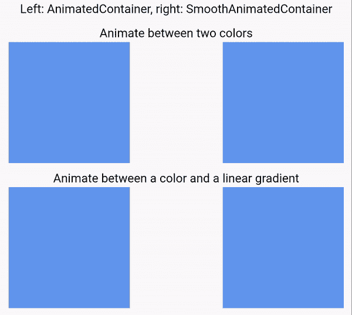
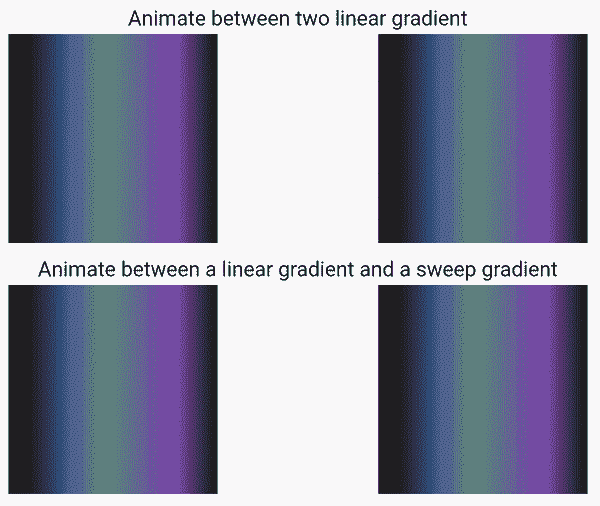
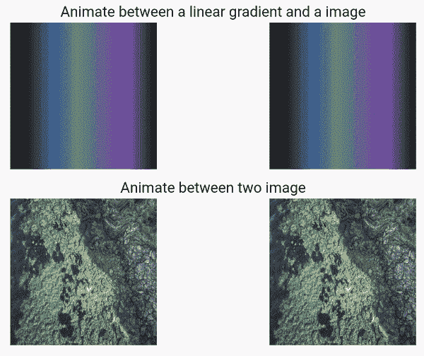

# 修复抖动中的盒子装饰背景动画

> 原文：<https://itnext.io/fixing-boxdecoration-background-animation-in-flutter-bb935653f884?source=collection_archive---------0----------------------->

Container 和 BoxDecoration 是广泛用于颤振开发的两个类。如果你想要的不仅仅是一个彩色的盒子，你可以这样写:

```
Widget container = Container(
decoration: BoxDecoration(color: color, gradient: gradient, image: image),
child: child,
);
```

BoxDecoration 中还有其他属性，如阴影和边框，但我将在本文中重点介绍背景动画。

你可以看到有三种类型的背景可以在 BoxDecoration 中设置:颜色、渐变和图像。它们是按照这个顺序从下往上画的。如果要在两个 BoxDecoration 之间制作动画，可以使用 DecorationTween 类:

```
intermediate = DecorationTween(begin: begin, end: end, t);
```

其中 t 表示动画的进度(介于 0 和 1 之间)。

您也可以只使用 AnimatedContainer 小部件，并向它提供您想要的当前 BoxDecoration，它会自动从上一个动画到当前动画:

```
Widget container = AnimatedContainer(
duration: duration,
curve: curbe,
decoration: decoration,
child: child
);
```

AnimatedContainer 的接口几乎与 Container 类相同，除了指定动画细节的两个附加参数 duration 和 curve。

所有这些听起来都很棒，使用起来也很简单。如果您只想在两种颜色或同一类型的两种渐变之间制作动画(Flutter 中有三种渐变)，您可以毫无问题地使用 AnimatedContainer 类。但是在其他场景下会给你一个怪异的白色中间背景。

下面是两个盒子装饰之间动画的实际实现:

```
static BoxDecoration? *lerp*(BoxDecoration? a, BoxDecoration? b, double t) {
  ...
  return BoxDecoration(
    color: Color.*lerp*(a.color, b.color, t),
    image: t < 0.5 ? a.image : b.image, // TODO(ianh): cross-fade the image
    border: BoxBorder.*lerp*(a.border, b.border, t),
    borderRadius: BorderRadiusGeometry.*lerp*(a.borderRadius, b.borderRadius, t),
    boxShadow: BoxShadow.*lerpList*(a.boxShadow, b.boxShadow, t),
    gradient: Gradient.*lerp*(a.gradient, b.gradient, t),
    shape: t < 0.5 ? a.shape : b.shape,
  );
}
```

你可以立即发现问题。对于两个图像背景之间的动画，当前的实现只是以 50%的进度将背景从第一个图像改变到第二个图像，而没有交叉渐变。我已经盯着这个 TODO 注释一年了，最后决定自己来做。对于较少使用的场景，比如在一种颜色和一种渐变之间制作动画，或者在两种不同类型的渐变之间制作动画，当前的实现也不能很好地工作。

这就是为什么我实现了 SmoothDecorationTween 和 SmoothAnimatedContainer 类。它们与内置的同类产品具有相同的界面。让我们来看一些对比:



左:AnimatedContainer，右:SmoothAnimatedContainer



左:AnimatedContainer，右:SmoothAnimatedContainer



左:AnimatedContainer，右:SmoothAnimatedContainer

我已经在 [pub.dev](https://pub.dev/packages/animated_box_decoration) 上发布了这个包。如果你的应用程序需要这样的功能，或者在 Flutter 中需要快乐编码，那就来看看吧！