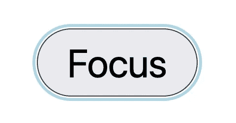
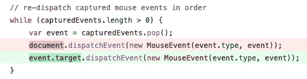
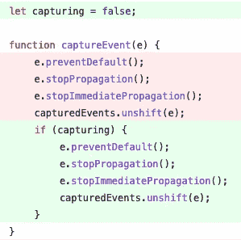
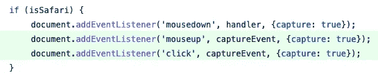
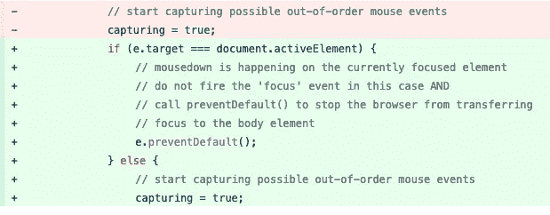
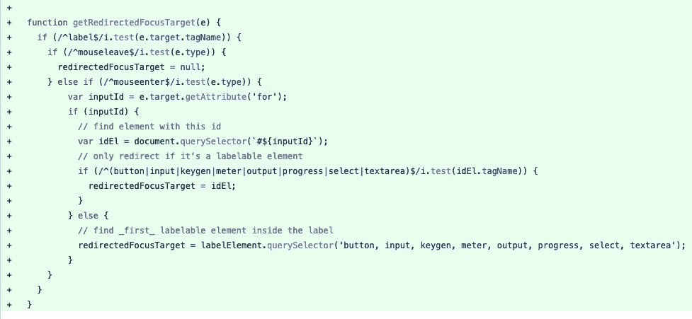
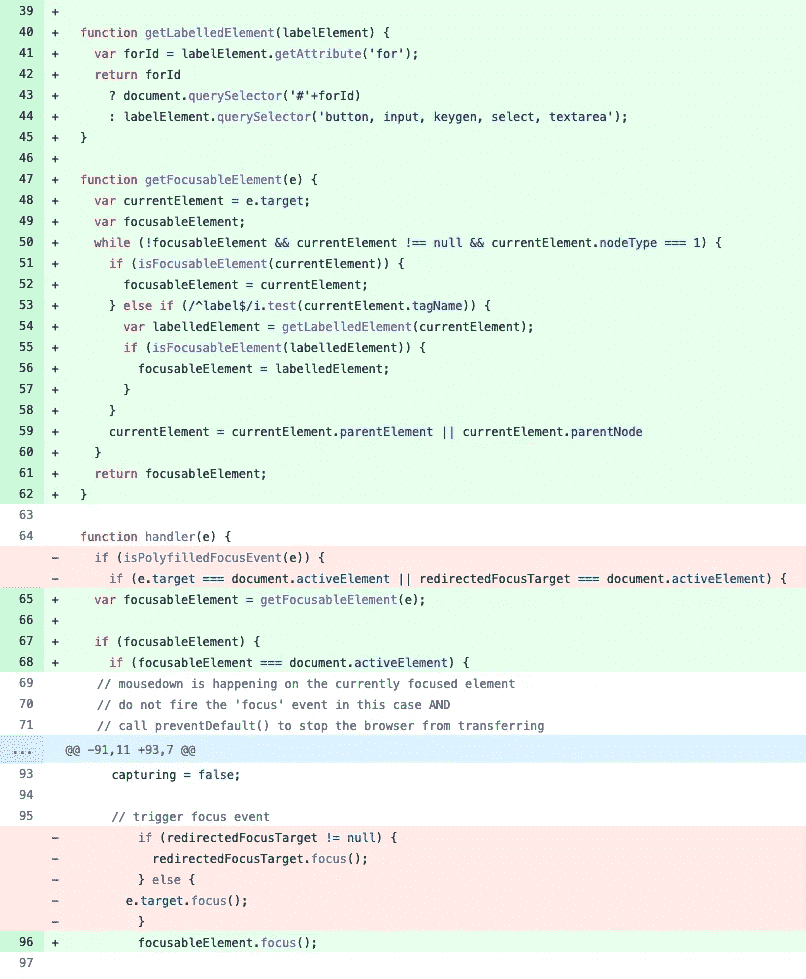

# 修复 Safari 的焦点

> 原文：<https://itnext.io/fixing-focus-for-safari-b5916fef1064?source=collection_archive---------0----------------------->

2008 年，苹果的 Safari 团队遇到了一个问题:web 开发人员注意到，当点击时，链接、按钮和几个输入元素与`:focus`选择器不匹配。类似地，点击这些元素也不会触发`focus`或`focusin`事件。开发人员尽职尽责地提交了针对 Webkit 的[bug](https://bugs.webkit.org/show_bug.cgi?id=22261)并等待帮助。

这种帮助从未到来。

原因是，macOS 在被点击时没有将焦点转移到操作系统和应用程序按钮上，利益相关者决定与操作系统保持一致，而不是与竞争对手的浏览器保持一致。这种讨论已经持续了 13 年，现在仍在继续，但苹果的团队态度坚决:按钮、链接和非文本输入不会成为焦点。

有益的是，团队同意一个变通方法是实现`:focus-visible`，CSS 选择器匹配等待输入的元素；它们被聚焦但没有被激活。单击一个按钮或链接既聚焦又激活它，但是进入它们将匹配这个仅聚焦选择器。这个[部分解决方案](https://bugs.webkit.org/show_bug.cgi?id=185859)确实会有所帮助，但它在 2021 年 4 月被搁置，在它被启动 3 年后，在它被提出 11 年后。

这一失败已经开始滚雪球。Safari 在 2017 年初推出了`:focus-within`，用这种新标准化的伪选择器击败了大多数竞争对手。但是当点击按钮、链接或非文本输入时，它不会匹配任何容器。事实上，如果用户关注一个文本输入(为其容器匹配`:focus-within`选择器),然后点击其中一个麻烦的元素，焦点就会完全离开容器。

> **编辑(8/29/2022)** Safari 在 15.4 版本中已经实现了`:focus-visible`。尽管如此，本文中描述的`:focus`的错误仍然存在。单击任何有问题的元素都不会触发焦点事件，也不会匹配`:focus`或`:focus-within`选择器。

很明显，苹果的 Webkit/Safari 团队不会解决这个问题。WICG 为`:focus-visible`提供了一个优秀的[聚合填充](https://github.com/WICG/focus-visible/blob/main/src/focus-visible.js)。也有一个好的[多孔填料](https://github.com/matteobad/focus-within-polyfill/blob/master/src/focus-within.js)可供`:focus-within`使用。但是我还没有为`:focus`找到一个聚合填充，所以我写了一个:

## 多填料分解

这个 polyfill 的核心是调度`focus`和`focusin`事件的`Element.focus()`方法调用(在上面要点的第 112 行)。一旦浏览器发现这些事件与一个元素相关联，这个元素就会匹配`:focus`选择器。

有几个事件我们可以监听，以便在元素被单击时调度那个`focus`事件:`mousedown`、`mouseup`和`click`。

> **事件说明**
> 
> 如果您不熟悉事件在浏览器中的工作方式，有两个阶段。**捕获**阶段从最顶层的元素`<html>`开始，并通过 DOM 向下到达被点击的元素。**冒泡**阶段在捕获阶段结束后开始，它从被点击的最下面的元素开始，向上(冒泡)到 HTML 元素。该路径中的任何节点都可以连接一个事件侦听器，当事件到达该节点时，该事件侦听器就会被触发。

这些事件侦听器中的任何一个都可以阻止事件继续，并为可能阻止它们触发的后续事件附加侦听器。这很重要。我们不希望其他事件侦听器阻止我们的侦听器触发。这意味着我们希望在捕获阶段附加到最早的事件`mousedown`。这是在上面要点的第 81 行完成的。

然而，`Element.focus()`同步触发，这意味着`focus`和`focusin`事件将在`blur`和`focusout`事件之前触发。事件的正确顺序是:

1.  **鼠标按下**【瞄准点击的元素】
2.  **模糊**【瞄准先前活动的元素】
3.  **聚焦**【瞄准先前活动的元素】
4.  **聚焦**【瞄准被点击的元素】
5.  **聚焦**【瞄准被点击的元素】
6.  **mouseup** 【瞄准被点击的元素】
7.  **点击**【针对被点击的元素】

我们可以使用一个零秒的`setTimeout`调用(上面要点中的第 56 行)在所有当前排队的事件之后将`Element.focus()`调用排队。这将我们的强制`focus`事件移到了`blur`和`focusout`事件之后，但这也将其移到了`mouseup`和`click`事件之后，这并不理想。

为了确保`mouseup`和`click`事件在我们的强制`focus`事件之后触发，我们需要捕获并重新发送它们。我们不想捕获每一个`mouseup`和`click`事件，所以我们只需要在我们要强制一个`focus`事件时添加监听器(第 41–42 行),并在我们完成时移除它们(第 58–59 行)。最后，我们需要重新调度这些事件，使用与它们原来相同的数据，比如鼠标位置(第 67 行)。

最后，我们只需要在 Safari 中完成所有这些工作(见第 80 行),并且只在不支持的元素被点击时。 [allyjs.io](http://allyjs.io) 的优秀人员提供了一个非常有用的[测试文档](https://allyjs.io/tests/focusable/test.html)，用于检查哪些元素得到了关注。在比较了在不同浏览器中单击这些元素的结果后，我发现以下元素需要此聚合填充:

1.  具有 href 属性的锚链接
2.  非禁用按钮
3.  非禁用文本区
4.  `button`、`reset`、`checkbox`、`radio`和`submit`类型的非禁用输入
5.  具有带数值的`tabindex`的非交互元素(按钮、a、输入、文本区、选择)
6.  音频元素
7.  具有`controls`属性的视频元素

功能`isPolyfilledFocusEvent`(第 22–36 行)检查这些情况。

我希望这有所帮助。

我希望 Safari 能在某个时候支持这种东西。

**编辑**(2022 年 15 月 1 日):polyfill 的实际生产使用暴露了两个错误。首先，重新调度的事件应该从事件目标调度，而不是从文档调度。没有从之前的`target`中触发的事件被剥夺了它们的`target`属性，并且不会触发默认行为，比如在链接点击时导航。

必须从事件的目标激发重新调度的事件，才能触发本机功能

第二，捕捉可能的无序`mouseup`和`click`事件需要不同的处理方式。通过动态添加侦听器，它们将在 polyfill 运行后添加的任何侦听器之后添加。这意味着其他侦听器将在事件被捕获之前首先触发，然后在事件被重新调度时再次触发。解决方案是立即为`mouseup`和`click`添加 polyfill 的监听器，并切换`capturing`标志的开和关，而不是附加和移除监听器。

使用标志开始和结束捕获事件

立即添加侦听器，而不是动态添加

**编辑** (21/1/2022):更多的生产使用揭示了另一个 bug。点击一个已经聚焦的元素应该*而不是*触发另一个聚焦(或 focusin)事件。但是，polyfill 在每次单击或按下受影响的元素时都会盲目地触发一个焦点事件。为了防止这种情况发生，我们在继续多填充焦点行为之前，检查事件目标元素是否与文档的活动元素相同。

不在每次点击时触发焦点的一个副作用是，如果 Safari 确定目标元素不可聚焦，它会将焦点返回到 body 元素。为了停止这种情况，我们在 mousedown 处理程序上调用`preventDefault()`。(我怎么知道这行得通呢？我没有。为了找出 Safari 何时以及如何将焦点转移到身体上，我们进行了一些反复试验。)

检查目标是否已经对焦，并防止 Safari 对焦身体

**编辑** (23/1/2022):点击标签元素应该将焦点重定向到标签元素。为了检测标签上发生的点击，我们有两种选择:(1)对于我们正在监听的每个`mousedown`事件，我们可以沿着 DOM 树一直爬到 body 元素，看看事件是否在标签中的元素上触发，或者(2)在`mousedown`事件之前检测指针何时在标签内。选项 1 可行，但代价很高，尤其是在大页面上。对于选项 2，我们必须找到如何在触发`mousedown`事件的之前检测用户是否在标签*内。*

事件`mouseenter`在`mousedown`事件之前触发(甚至在触摸设备上！)并且它为`mousedown`事件将要穿过的*每个元素*触发。这意味着每个元素都有一个作为其目标的`mouseenter`(和`mouseleave`)事件。(因为我们使用委托监听器，我们不能依赖`currentTarget`，因为它总是空的。)

我们添加了一个函数，当用户在一个 label 元素中时，该函数获取重定向的焦点目标，我们使用该元素来检测它是否已经有了焦点，如果没有，就聚焦在它上面。

对于标签元素上的鼠标进入和离开事件，找到关联的目标元素

**编辑** (17/2/2022):我们需要考虑接受子元素的可聚焦元素中可能嵌套的子元素，例如按钮、锚标签或带有`tabindex`属性的任意元素。因为我们正在遍历 DOM 寻找可聚焦的父元素，所以我们决定删除用于发现可聚焦的`label`元素的`mouseenter`和`mouseleave`监听器，并将这个用例合并到新策略中。我们还在对属性`tabindex`的检查中发现了一个错误:如果属性*没有被显式设置，HTMLElement 属性`tabIndex`会报告一个值`-1`。*解决方案是使用`.getAttribute('tabindex')`来确定该值是否已被显式设置。

获取可聚焦元素，即使它是 mousedown 目标元素的祖先或通过祖先中的标签连接