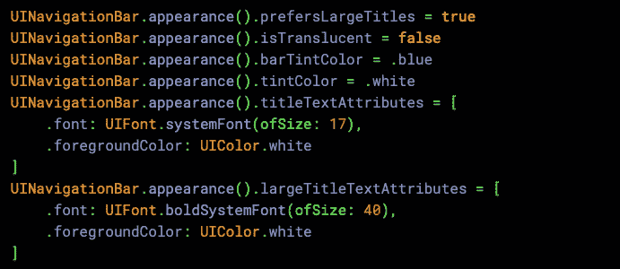
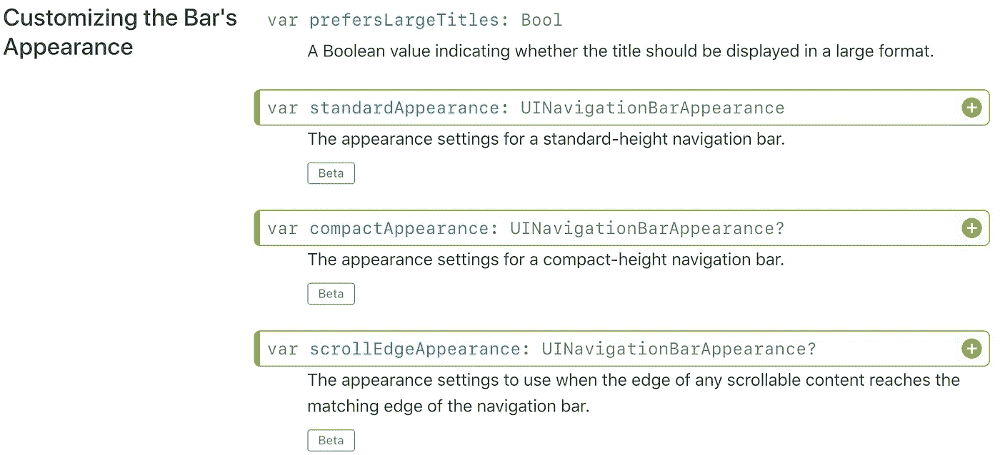
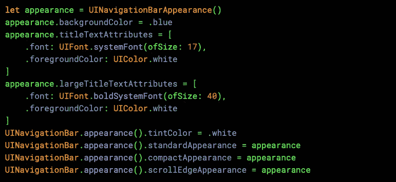
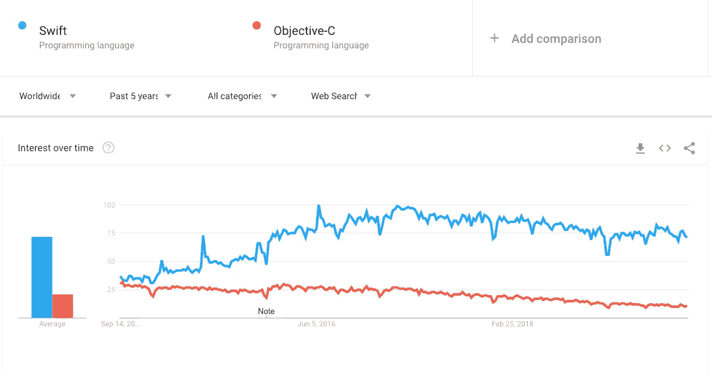
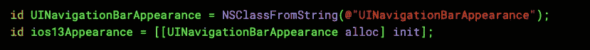
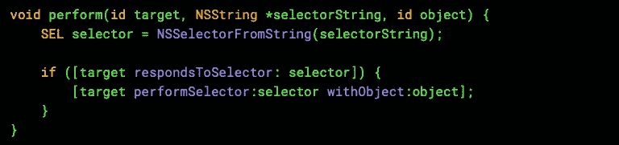
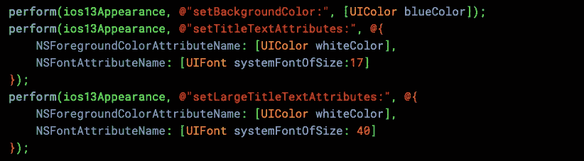
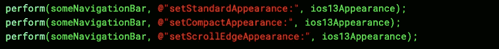

# 修复由未来 SDK 引起的问题

> 原文：<https://itnext.io/fixing-issues-caused-by-future-sdks-ae0896384abf?source=collection_archive---------7----------------------->

## 如果您需要修复由比您正在使用的 Xcode 版本更新的 iOS 版本引起的问题，该怎么办？

随着 iOS13 即将发布，我们发现了一些关键问题，这些问题只能通过使用只能通过 Xcode 11 获得的新 API 来解决。然而，我们的项目使用 Xcode 10——从 Xcode 11 构建会引入更多问题。当然，我们最终需要迁移到最新的 IDE，但是现在我们需要一个低风险的解决方案。

# 问题是

我们有一只`UINavigationBar`具有以下外观特征:

迅速发生的

这种定制的组合在 iOS12 和更早的版本上可以完美地工作，但在 iOS13 上，该栏的背景显示为白色(当从 Xcode 10 和 11 构建时)。**因此，在导航栏中看不到任何按钮或标题。**

我们必须使用一些新的 API 来定制导航栏，参见文档 diff:

[https://developer . apple . com/documentation/ui kit/uinavigationbar？变更=最新 _ 主要](https://developer.apple.com/documentation/uikit/uinavigationbar?changes=latest_major)

## 不想要的解决方案

修复这个问题的代码可以放在一个`if #available(iOS 13.0, *)`中，用 Xcode 11 编译:

迅速发生的

但是，由于我们被迫保留 Xcode 10 以降低风险，我们如何访问这些 API 呢？

# 教授 Xcode 未来的 iOS 版本

这是非常标准的，但我还是要简单地回顾一下。

通过从 Xcode 11 拷贝相关支持文件，您可以允许 Xcode 10 构建到您连接的 iOS13 设备。为此，请访问`Xcode11.app/Contents/Developer/Platforms/iPhoneOS.platform/DeviceSupport`目录。里面有一个叫做`13.0`的文件夹——你必须把它复制到你的`Xcode10.app`里面的同一个目录下。

如果你需要支持测试版，你可能需要复制旧 Xcode 中的文件夹，并将其命名为`13.1 (17A5831c)`

虽然这很不方便，但它确实允许您直接从旧版本的 Xcode 构建到运行新操作系统的设备上。

# 目标-C 是你的朋友

随着 Swift sky rocketing 的流行，Objective-C 不仅被遗忘，而且从未被教授过。有一些优秀的开发者在 Swift 推出后才开始做 iOS！

[谷歌趋势](https://trends.google.com/trends/explore?hl=en-US&tz=-600&date=today+5-y&q=%2Fm%2F010sd4y3,%2Fm%2F05q31&sni=3)

然而，它的权力目标-C 挥舞，将有助于我们今天的追求。

您知道吗，在 Objective-C 中，您可以在运行时动态实例化一个类，并向它发送消息。通过适当的检查来确保我们在 iOS13 下运行，我们可以使用`NSClassFromString`来访问我们之前发现的新的`UINavigationBarAppearance`，即使它只在未来的 Xcode 中可用！

目标-C，但也是 C

现在我们需要遵循上面的“不需要的解决方案”,并将其转化为 Objective-C。为了在`ios13Appearance`上设置属性，让我们定义一个函数来帮助我们:

C 函数，但目标是 C 内容

这需要一个对象`target`，一个函数`selectorString`和一个将成为函数`selectorString`参数的对象。然后我们可以创建一个选择器，检查目标是否响应它——如果是，那么用参数运行它。

这样，我们可以使用 setters 设置所需的属性:

同时也是客观的

不幸的是，我们不能将`UIAppearance`与我们创建的`UINavigationBarAppearance`实例一起使用。相反，我们需要在应用程序中创建的每个导航栏上运行这段代码:

C

# 抓住它的要点

我已经将这个特殊的案例包装在一个名字可怕的类中，这个类将在您的代码中突出出来，需要被移除。当然，你可能会遇到其他问题，你可以用同样的方法解决，所以请记住:虽然 Objective-C 被认为是旧的和笨重的，但在某些情况下，它可以为你提供比 Swift 更多的功能！