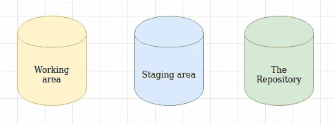
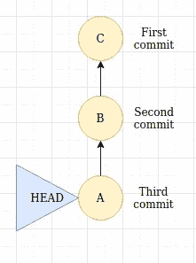
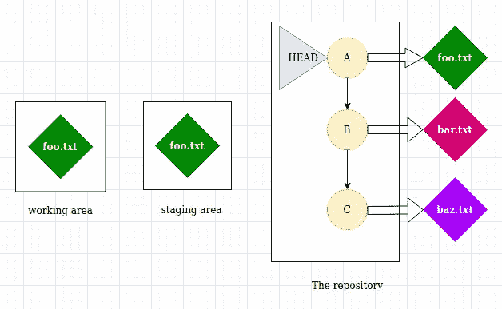
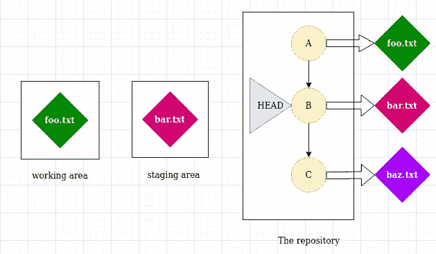
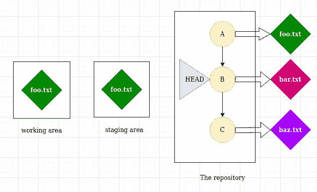
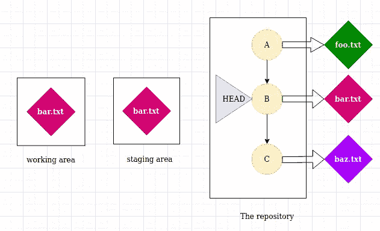
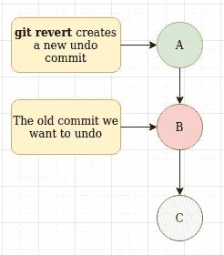

# 使用 git 重置和恢复修复错误

> 原文：<https://itnext.io/fixing-mistakes-using-git-reset-and-revert-3d68fab3176e?source=collection_archive---------6----------------------->


你听说过“万圣节穿衬衫说`git reset`”这句话吗？不，你没有，因为是我做的(但这是一个吓唬开发者的好主意，对吧！！！).理解 git reset 的概念很重要，因为所有其他命令，如 git revert、checkout 都基于相同的底层概念，在这之后，您就不必害怕使用它或从堆栈溢出中复制和粘贴它(嗯，您甚至也不需要这样做。)

## 先决条件

1.  分支、引用和提交是如何工作的，你可以从我之前关于[理解引用和分支](https://link.medium.com/9GwS0Ppgp5)的博客中看到。(更好的营销策略没错！！！)

2.你应该知道我们的代码所在的 3 个区域



git 的 3 个阶段

*   **工作区，也叫**这是我们的代码所在的区域，不在暂存区，或者我们可以说“不由 git 处理”，也叫`**untracked files**`
*   **暂存区，**是 git 知道在当前和下一次提交之间会发生什么变化的区域。

> `git add <file>`将我们的文件从工作区移动到暂存区
> 
> `git commit -m ""`将我们的文件从暂存区移动到存储库

*   这个区域包含 git 知道的文件，这意味着它包含了你提交的所有文件。

**重要提示:**一个“干净的”暂存区不是空的，可以把它看作是上一次提交的精确副本，就像游戏中的一个检查点，你在 ram 中加载一个检查点(或者一个合适但不同的内存区域，或者我们可以说是工作区)，然后从那里开始玩。

3.您应该知道如何隐式引用 git 提交:



一个例子

在这个例子中，如果`HEAD`指向提交“A”，那么，`HEAD~1`或者我们可以说`HEAD~`将是它的父提交，第一深度级别意味着“B”，而`HEAD~2`将是 c。因此，它在深度方向上引用父提交。

```
A~1 = A~ = B
A~2 = C
```

**什么是 Git 重置？**

git 复位有 3 种类型:混合、软和硬。默认情况下，git 会 `mixed`重置，如果你知道这三个的概念，**没人能阻止你修复错误**，因为它们都很重要。



克隆回购的初始阶段

假设我克隆了一个 repo，那么在初始阶段，最后一次提交的所有内容(其中`HEAD`指向)被复制到暂存和工作区，在这里，`foo.txt`是我们最后一次提交的内容，它被复制到这两个区域。

`git reset`会将您的`HEAD`指向一个特定的提交，并且根据给定的标志完成以下操作，**会将您当前所在的分支的引用与** `**HEAD**` **一起移动，导致您的提交历史和引用丢失，因为现在分支指向一些其他的提交。**

*   **混合标志**

```
git reset --mixed HEAD~
```

它将执行以下步骤:

1.  将`HEAD`的指针从“A”移动到“B”(它的父)，现在 A 将成为一个悬空提交，因为`master`分支引用更改为“B”。
2.  仅将“bar.txt”复制到临时区域(不是工作树)



混合标志仅更改中转区，不更改工作区

所以在`--mixed`标志中，你在工作树中的所有更改(未跟踪的文件)都不会被删除(真是松了一口气！！！).

*   **软旗**

```
git reset --soft HEAD~1
```



用软标志复位 git

这个大部分时间不用。

步骤:

1.  仅将`HEAD`的指针从“A”移动到“B”(连同当前分支参考)

正如您在上图中看到的，它不会更改工作区和暂存区中的文件。

*   **硬标志**

```
git reset --hard HEAD~
```



步骤:

1.  将`HEAD`连同“A”到“B”的分支一起移动。
2.  将“bar.txt”(提交“B”中的文件)复制到暂存区和工作区。

在这里，工作区中所有未跟踪的文件都会被覆盖，所以这是一个非常危险的操作，因为你的数据会丢失。

**用 ORIG_HEAD** 撤销复位

在意外重置的情况下，为了安全起见，git 将 HEAD 的前一个值保存在一个名为`ORIG_HEAD`的变量中，也就是说，它将指向丢失的悬空提交“A ”,以便将其检索回来

```
git reset ORIG_HEAD
```

因此，我们的区域将更新为:


原始期

但是记住`ORIG_HEAD`只指向提交的前一个值，所以如果你做`git reset HEAD~`两次，“A”将永久丢失，因为`ORIG_HEAD`指向“B”并且没有对“A”的引用。

## GIT 恢复—安全重置

它创建一个新的提交，引入与指定提交相反的更改，这是撤销您提交的更改的首选方式，因为`git reset`可能会弄乱您团队成员的提交历史，因为您的提交历史已被更改并与其他人共享，但`git revert`不会更改提交历史。举个例子，

```
git revert <commit B>
```



通过 git revert 撤消已提交的更改

感谢您的阅读，如果您有任何疑问，请在“写回复”部分提问，因为这也将帮助其他人清除您发现的相同疑问。