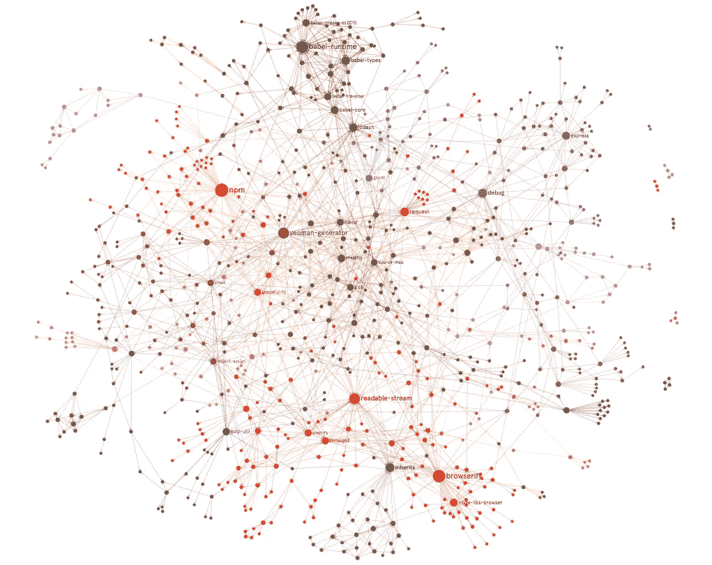
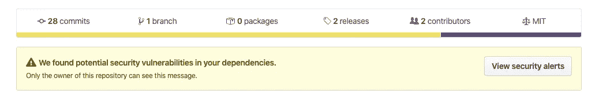
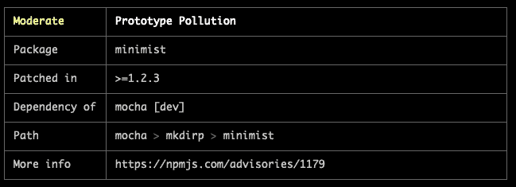
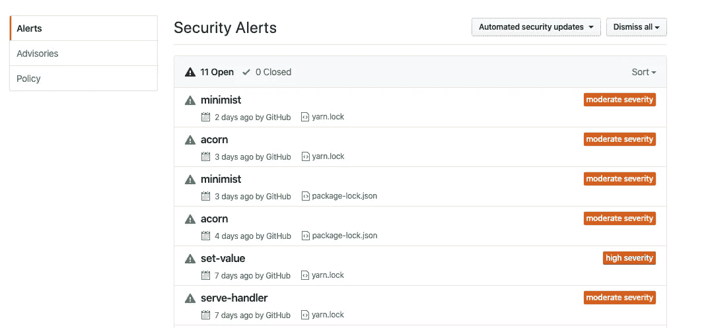
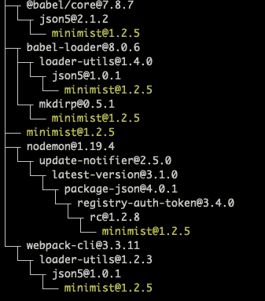

# 在不到 3 分钟的时间内修复 npm 依赖关系中的安全漏洞

> 原文：<https://itnext.io/fixing-security-vulnerabilities-in-npm-dependencies-in-less-than-3-mins-a53af735261d?source=collection_archive---------0----------------------->



[https://miro . medium . com/max/1021/1 * mrep 6y 0 l 1 b 7 ixt 5 mfe 3 fwa . png](https://miro.medium.com/max/1021/1*MrEp6Y0l1B7Ixt5mfE3fWA.png)

大家好。！！🥑

我已经有一段时间没有写博客了，现在因为我们大多数人都在家工作，过去通勤的时间现在节省了，我想为什么不利用这段时间写一写我最近修复安全漏洞的经历。

因此，如果你们中的任何人最近看到了类似下面这张图片的东西，却不知道如何修复它，那么这篇文章就是为你准备的。当我看到它的时候，我也没有头绪，但是通过一些研究，我可以解决这个问题。

# 🔬问题:



github 安全漏洞 bot 警报

所以这意味着你的**包中的一个依赖项。json** 有一些安全隐患，可能被攻击者利用，并可能给你、你的产品、你的产品的用户或你工作的公司带来问题。

比如:[https://snyk.io/vuln/npm:eslint:20180222](https://snyk.io/vuln/npm:eslint:20180222)

> 此漏洞可能导致了**正则表达式拒绝服务**

# 💡调查结果:

为了发现回购中的潜在漏洞，您可以

1.  `npm audit` —应该会显示如下图所示的输出:



npm 审核日志

2) Github 安全策略也可以通知您—如下图所示:



github 安全警报

今天当我开始工作时，我不得不处理这个错误，其中`acorn`和`minimist`被报告为安全漏洞。

# 🎉解决办法

这个问题的解决方法是分步骤的

📦**国家预防机制更新**

1.  这是你应该做的第一件事，也是最简单的一件事。

*   运行 npm 更新—[https://docs.npmjs.com/cli-commands/update.html](https://docs.npmjs.com/cli-commands/update.html)
*   删除您的 package-lock.json 文件，或者对于 yarn 用户，删除您的 yarn.lock 文件。在理想的情况下，这是可行的，但是可能会有一些不遵循 semver 的依赖项，并且也可能会被更新。
*   因此，这里更好的解决方案是只删除 package-lock.json(或 yarn.lock)文件中与易受攻击的包相对应的行。
*   再次运行 npm 安装

在理想的情况下，这应该已经将您的依赖项升级到了下一个 semver 版本，并且那些库可能已经修复了这些可传递依赖项的版本。

🔭**国家预防机制审计**

2.但是如果这没有解决您的问题，也就是说`minimist`没有解决我的问题，那么请遵循下面提到的步骤:

2.1)要修复任何依赖关系，您需要首先知道哪个 npm 包依赖于它。

```
npm audit
```

这将告诉你哪些包是易受攻击的。


这告诉我,`mkdirp`需要`minimist`,而`mocha`也需要它

快速浏览 package-lock.json 可以获得关于受影响版本的更多信息。

> 在我的情况下，mocha(7 . 1 . 0)-> mkdirp(0 . 5 . 1)-> minimit(0 . 0 . 8)-脆弱的版本。

🔑**分辨率键**

3)最后的解决方案是:

3.1)首先 npm 安装非易受攻击的版本，在我的例子中是`1.2.5`

```
npm install minimist --save-dev
```

`yarn`和`npm`用户

3.2)在 package.json 文件中添加一个`resolutions`键

对于用户来说，我们还需要一个步骤来让 resolutions 键起作用。

3.3)使用`npm-force-resolutions`([https://www.npmjs.com/package/npm-force-resolutions](https://www.npmjs.com/package/npm-force-resolutions))

3.4)运行后

```
npm install
```

就是这样。这解决了无法使用 npm 更新或通过卸载并重新安装新的依赖关系来更新的依赖关系问题。

检查依赖关系是否正常工作

```
npm ls minimist
```

这应该会给你一个输出如下图



# ⚠️ **免责声明**

> 如果一些软件包只与旧版本兼容，那么这种变化可能会破坏你的应用程序。因此，在解析到特定版本时要小心，并在发布此更改之前测试您的应用程序。

👯如果你觉得这篇文章有帮助，请给它一个掌声！

更多更新可以在 twitter [@VivekNayyar09](https://twitter.com/VivekNayyar09) 关注我。我在 [Qoala App](https://www.qoala.app/id) 工作

另外，请不要忘记保持社交距离，以防止病毒传播，并定期洗手。注意安全，呆在家里。

# 关于 Qoala

# 阿修兰西

保险公司和城市保险公司的首要任务是:

a.让城市的所有居民，无论是农民还是城市的所有居民，都能享受到他们从未享受过的生活；阿陶

b.为增加或减少贫困的人提供一个有价值的和/或有价值的福利。

美国保险公司正在寻找一种新的保险:

a.risiko。

b. Pertanggungan ulang risiko.

c. Pemasaran dan distribusi produk asuransi atau produk asuransi syariah.

d. Konsultasi dan keperantaraan asuransi, asuransi syariah, reasuransi, atau reasuransi syariah, atau

e. Penilai kerugian asuransi atau asuransi syariah.

Usaha perasuransian dilaksanakan oleh:

1\. Perusahaan Asuransi:

​a. Perusahaan Asuransi Umum, adalah perusahaan yang memberikan jasa pertanggungan risiko yang memberikan penggantian karena kerugian, kerusakan, biaya yang timbul, kehilangan keuntungan, atau tanggung jawab hukum kepada pihak ketiga yang mungkin diderita tertanggung atau pemegang polis karena terjadinya suatu peristiwa yang tidak pasti.

b. Perusahaan Asuransi Jiwa, adalah perusahaan yang memberikan jasa dalam penanggulangan risiko yang memberikan pembayaran kepada pemegang polis, tertanggung, atau pihak lain yang berhak dalam hal tertanggung meninggal dunia atau tetap hidup, atau pembayaran lain kepada pemegang polis, tertanggung, atau pihak lain yang berhak pada waktu tertentu yang diatur dalam perjanjian, yang besarnya telah ditetapkan dan/atau didasarkan pada hasil pengelolaan dana.

c. Perusahaan Reasuransi, adalah perusahaan yang memberikan jasa dalam pertanggungan ulang terhadap risiko yang dihadapi oleh Perusahaan Asuransi Kerugian, Perusahaan Asuransi Jiwa, Perusahaan Penjaminan, atau Perusahaan Reasuransi lainnya.

2\. Penunjang Usaha Asuransi:

a. Perusahaan Pialang Asuransi, adalah perusahaan yang memberikan jasa keperantaraan dalam penutupan asuransi atau asuransi syariah dan penanganan penyelesaian ganti rugi asuransi dengan bertindak untuk kepentingan tertanggung.

b. Perusahaan Pialang Reasuransi, adalah perusahaan yang memberikan jasa keperantaraan dalam penempatan reasuransi dan penanganan penyelesaian ganti rugi reasuransi dengan bertindak untuk kepentingan perusahaan asuransi, perusahaan penjaminan, perusahaan reasuransi.

c. Perusahaan Penilai Kerugian Asuransi, adalah perusahaan yang memberikan jasa penilaian terhadap klaim dan/atau jasa konsultasi atas obyek asuransi yang dipertanggungkan.